# Sandbox provider leaderboard

Run [`34804682438`](https://github.com/starslingdev/hpc-sandbox-benchmarks/actions/runs/34804682438) · commit [`eea984ce6fb9ceb82e59eb2afe1589e731516c46`](https://github.com/starslingdev/hpc-sandbox-benchmarks/commit/eea984ce6fb9ceb82e59eb2afe1589e731516c46) ·
dataset [`data/dataset/runs/34804682438.json`](data/dataset/runs/34804682438.json) · generated 2026-09-14T05:26:28.695Z

**Partial results — incomplete experiment.** 544 of 648 planned cells complete; 104 incomplete; 0 excluded.
Only verified measurements are ranked. Missing trials and failed cells remain in the dataset's frozen coverage; provider coverage is uneven and these results do not establish a complete comparison.

Comparison cohort: `sha256:fd00ae2be0a3dee6ef608d3c9c1c10ffbc43d40863828496a9ae0e60601a9071`. Compare scores only with the same workload and eligible metric cohort.

Requested target for every provider: **4 vCPU · 8 GiB RAM · 40 GB disk**. This run contains **554 metric records**
backed by **4552 retained trial observations**, across **48 metrics** and
**12 providers**; every emitted, catalogued metric has a ranked table below
(median across sandboxes), grouped by dimension with its headline first — some behind a disclosure triangle, none omitted.
Generated from the published Run dataset — do not edit by hand. Methodology:
[`docs/methodology.md`](docs/methodology.md).

**How to read:** value = median across sandboxes (one machine, one vote) · interval = cluster bootstrap,
labelled 95% but ≈77% actual coverage at 3 sandboxes (see methodology) · rows share a rank only
when statistically indistinguishable or tied on the median (see details below) · a coverage gap means unmeasured, never a score of zero.
CPU/RAM comparability uses observed vCPU and RAM (±10% RAM); disk is a workload-capacity gate
surfaced through coverage gaps, not part of the compute-match verdict.

**Document order:** the real-world developer workflows lead, because what a developer or a CI job
actually waits on is what this benchmark exists to measure. The synthetic microbenchmarks (`cpu`, `disk`, `memory`, `network`, `system`)
load one hardware axis in isolation — a real question, but a different one — so each is collapsed by
default; expand a section to read its tables.

**The `realworld` section is drawn, not tabulated.** One stacked chart per repo, each bar a
whole pipeline on one environment and each segment a task. Its per-task rankings — the medians,
intervals and trial counts every bar is built from — are still here, one triangle down: the charts
are what the section is FOR, and the tables are how you check them.

**Every synthetic metric is charted too.** Each dimension shows its headline metric's ranked bar
chart above the triangle, and every other metric's chart sits beside its table inside. Bars are
the same medians the tables print, best first, with the 95% interval as a whisker; each chart
scales to its own largest value, so lengths compare within a chart and never across two.

## Providers in this run

Each provider's isolation technology — the **declared** technology is authoritative; **detected**
is a best-effort in-sandbox probe that cannot separate every isolation type (a container and a
microVM can both read `kvm`; gVisor and a microVM can both read `unknown`), shown only as a
cross-check.

| Provider | Isolation (declared) | Detected |
| --- | --- | --- |
| Blaxel | microVM | vm |
| Daytona (VM) | microVM (Linux VM) | vm |
| E2B | Firecracker microVM | vm |
| Microsandbox Cloud | libkrun microVM (cloud) | vm |
| Modal (gVisor) | gVisor container | gvisor |
| Modal (VM) | microVM (VM runtime) | vm |
| Namespace | microVM (dedicated instance) | vm |
| Novita | microVM | vm |
| run.cloud | Firecracker microVM | vm |
| Runloop | microVM | vm |
| tama | container (shared kernel) | unknown |
| Vercel Sandbox | Firecracker microVM | vm |

_Not present in this run: Daytona (container) — registered providers that reported no data (not dispatched, or every cell was lost before reporting anything)._

> **Comparability warning:** tama's observed compute did not match the requested CPU/RAM target; its observed allocation was **64 vCPU · 1512 GiB RAM · 48.9 GB disk**. Its measured ranks are not like-for-like with compute-matched providers.

## realworld

What a developer or a CI job actually waits on: each bar is one environment's whole pipeline
for that repo, segmented by task in execution order. Each chart scales to its own slowest pipeline, so compare bar lengths within a chart and the printed totals across charts.

<strong>Per-task rankings</strong> · 21 tasks, with medians, intervals and trial counts

### Mastra: cold install _(headline)_

Seconds · lower is better

_Daytona (VM) and Namespace share the top on this metric (lower is better)._

| Rank | Provider | Mastra: cold install (Seconds) | 95% bootstrap interval | Sandboxes | Trials | Note |
| ---: | --- | ---: | ---: | ---: | ---: | --- |
| 1 | Daytona (VM) | 36.28 | 36.06 – 37.78 | 12 | 12 | — |
| 1 | Namespace | 39.46 | 34.33 – 42.15 | 12 | 12 | tied |
| 3 | Novita | 42.42 | 41.09 – 44.31 | 12 | 12 | — |
| 3 | Blaxel | 43.39 | 38.47 – 49.68 | 12 | 12 | tied |
| 3 | Microsandbox Cloud | 43.97 | 42.04 – 47.54 | 12 | 12 | tied |
| 3 | run.cloud | 49.55 | 40.9 – 70.02 | 12 | 12 | tied |
| 3 | Modal (VM) | 50.43 | 49.64 – 51.29 | 12 | 12 | tied |
| 8 | tama | 59.76 | 57.16 – 64.77 | 12 | 12 | — |
| 8 | E2B | 62.38 | 57.3 – 65.62 | 12 | 12 | tied |
| 10 | Vercel Sandbox | 69.34 | 62.5 – 78.18 | 12 | 12 | — |
| 11 | Modal (gVisor) | 100.9 | 94.12 – 107.4 | 12 | 12 | — |
| 11 | Runloop | 104.2 | 97.6 – 138.4 | 12 | 12 | tied |

### Better-Auth: build

Seconds · lower is better

_Daytona (VM) leads · Microsandbox Cloud is ~1.2× higher (lower is better)._

| Rank | Provider | Better-Auth: build (Seconds) | 95% bootstrap interval | Sandboxes | Trials | Note |
| ---: | --- | ---: | ---: | ---: | ---: | --- |
| 1 | Daytona (VM) | 51.78 | 51.25 – 55.53 | 12 | 12 | — |
| 2 | Microsandbox Cloud | 60.83 | 59.69 – 62.91 | 12 | 12 | — |
| 2 | Namespace | 61.2 | 59.5 – 62.19 | 12 | 12 | tied |
| 4 | Novita | 66.3 | 65.57 – 67.17 | 12 | 12 | — |
| 4 | run.cloud | 66.73 | 60.69 – 107.5 | 12 | 12 | tied |
| 4 | tama | 69.44 | 69.42 – 69.47 | 2 | 2 | tied |
| 7 | Modal (VM) | 71.7 | 70.38 – 74.04 | 12 | 12 | — |
| 8 | E2B | 91.59 | 83.68 – 95.7 | 12 | 12 | — |
| 9 | Blaxel | 96.81 | 93.17 – 97.16 | 12 | 12 | — |
| 10 | Vercel Sandbox | 101.8 | 99.54 – 129.9 | 12 | 12 | — |
| 11 | Modal (gVisor) | 139.4 | 135.2 – 145 | 12 | 12 | — |
| 12 | Runloop | 219.6 | 194.3 – 222.3 | 12 | 12 | — |

### Better-Auth: cold install

Seconds · lower is better

_Namespace leads · Daytona (VM) is ~1.1× higher (lower is better)._

| Rank | Provider | Better-Auth: cold install (Seconds) | 95% bootstrap interval | Sandboxes | Trials | Note |
| ---: | --- | ---: | ---: | ---: | ---: | --- |
| 1 | Namespace | 10.39 | 9.95 – 11.3 | 12 | 12 | — |
| 2 | Daytona (VM) | 11.88 | 11.5 – 12.27 | 12 | 12 | — |
| 3 | Blaxel | 12.85 | 12.17 – 13.87 | 12 | 12 | — |
| 3 | Microsandbox Cloud | 13.07 | 12.96 – 13.39 | 12 | 12 | tied |
| 3 | run.cloud | 13.73 | 11.54 – 21.2 | 12 | 12 | tied |
| 3 | Novita | 13.92 | 13.52 – 14.07 | 12 | 12 | tied |
| 7 | tama | 17.9 | 17.89 – 17.91 | 2 | 2 | — |
| 7 | E2B | 18.73 | 17.66 – 19.05 | 12 | 12 | tied |
| 9 | Modal (VM) | 18.94 | 18.88 – 19.89 | 12 | 12 | — |
| 10 | Vercel Sandbox | 21.3 | 20.25 – 26.78 | 12 | 12 | — |
| 11 | Modal (gVisor) | 37.26 | 34.31 – 40.32 | 12 | 12 | — |
| 11 | Runloop | 40.01 | 34.83 – 42.85 | 12 | 12 | tied |

### Better-Auth: git clone

Seconds · lower is better

_Namespace leads · Modal (VM) is ~1.3× higher (lower is better)._

| Rank | Provider | Better-Auth: git clone (Seconds) | 95% bootstrap interval | Sandboxes | Trials | Note |
| ---: | --- | ---: | ---: | ---: | ---: | --- |
| 1 | Namespace | 0.6365 | 0.6045 – 0.648 | 12 | 12 | — |
| 2 | Modal (VM) | 0.856 | 0.8315 – 1.206 | 12 | 12 | — |
| 2 | Blaxel | 0.92 | 0.7905 – 6.692 | 12 | 12 | tied |
| 2 | Vercel Sandbox | 0.9745 | 0.944 – 1.05 | 12 | 12 | tied |
| 5 | Microsandbox Cloud | 1.11 | 1.067 – 1.147 | 12 | 12 | — |
| 6 | E2B | 1.481 | 1.445 – 1.688 | 12 | 12 | — |
| 6 | Daytona (VM) | 1.498 | 1.337 – 1.567 | 12 | 12 | tied |
| 6 | tama | 1.554 | 1.144 – 1.963 | 2 | 2 | tied |
| 6 | run.cloud | 2.008 | 1.661 – 2.135 | 12 | 12 | tied |
| 6 | Novita | 2.081 | 1.844 – 2.183 | 12 | 12 | tied |
| 11 | Modal (gVisor) | 2.428 | 2.397 – 2.907 | 12 | 12 | — |
| 12 | Runloop | 3.251 | 2.742 – 3.715 | 12 | 12 | — |

### Better-Auth: lint (Biome)

Seconds · lower is better

_Daytona (VM) and Namespace share the top on this metric (lower is better)._

| Rank | Provider | Better-Auth: lint (Biome) (Seconds) | 95% bootstrap interval | Sandboxes | Trials | Note |
| ---: | --- | ---: | ---: | ---: | ---: | --- |
| 1 | Daytona (VM) | 2.781 | 2.76 – 2.869 | 12 | 12 | — |
| 1 | Namespace | 2.849 | 2.746 – 2.913 | 12 | 12 | tied |
| 3 | Microsandbox Cloud | 3.083 | 3.031 – 3.207 | 12 | 12 | — |
| 3 | Novita | 3.179 | 3.122 – 3.227 | 12 | 12 | tied |
| 3 | run.cloud | 3.291 | 3.063 – 5.029 | 12 | 12 | tied |
| 3 | Modal (VM) | 3.904 | 3.808 – 3.944 | 12 | 12 | tied |
| 7 | Vercel Sandbox | 4.575 | 4.431 – 5.896 | 12 | 12 | — |
| 7 | Blaxel | 4.611 | 4.377 – 4.881 | 12 | 12 | tied |
| 7 | E2B | 4.77 | 4.287 – 4.836 | 12 | 12 | tied |
| 7 | tama | 5.629 | 4.093 – 7.165 | 2 | 2 | tied |
| 7 | Runloop | 10.25 | 8.433 – 10.37 | 12 | 12 | tied |
| 7 | Modal (gVisor) | 10.37 | 9.753 – 11.14 | 12 | 12 | tied |

### Better-Auth: lint deps (Knip)

Seconds · lower is better

_Daytona (VM), Namespace and Microsandbox Cloud share the top on this metric (lower is better)._

| Rank | Provider | Better-Auth: lint deps (Knip) (Seconds) | 95% bootstrap interval | Sandboxes | Trials | Note |
| ---: | --- | ---: | ---: | ---: | ---: | --- |
| 1 | Daytona (VM) | 9.324 | 9.267 – 9.455 | 12 | 12 | — |
| 1 | Namespace | 9.624 | 9.328 – 9.895 | 12 | 12 | tied |
| 1 | Microsandbox Cloud | 9.75 | 9.48 – 10.27 | 12 | 12 | tied |
| 4 | run.cloud | 10.98 | 10.21 – 21.03 | 12 | 12 | — |
| 4 | Novita | 11 | 10.74 – 11.12 | 12 | 12 | tied |
| 6 | Modal (VM) | 13.31 | 13.12 – 13.55 | 12 | 12 | — |
| 7 | Blaxel | 14.15 | 13.3 – 14.95 | 12 | 12 | — |
| 7 | tama | 15.48 | 14.23 – 16.73 | 2 | 2 | tied |
| 7 | Vercel Sandbox | 16.47 | 15.86 – 21.37 | 12 | 12 | tied |
| 7 | E2B | 16.96 | 16.28 – 17.95 | 12 | 12 | tied |
| 11 | Runloop | 29.41 | 26.77 – 29.64 | 12 | 12 | — |
| 11 | Modal (gVisor) | 30.04 | 29.42 – 30.83 | 12 | 12 | tied |

### Better-Auth: lint format

Seconds · lower is better

_Namespace and Daytona (VM) share the top on this metric (lower is better)._

| Rank | Provider | Better-Auth: lint format (Seconds) | 95% bootstrap interval | Sandboxes | Trials | Note |
| ---: | --- | ---: | ---: | ---: | ---: | --- |
| 1 | Namespace | 2.444 | 2.366 – 2.548 | 12 | 12 | — |
| 1 | Daytona (VM) | 2.519 | 2.472 – 2.554 | 12 | 12 | tied |
| 3 | Microsandbox Cloud | 2.693 | 2.644 – 2.796 | 12 | 12 | — |
| 4 | Novita | 2.958 | 2.88 – 3.05 | 12 | 12 | — |
| 4 | run.cloud | 3.029 | 2.881 – 5.703 | 12 | 12 | tied |
| 4 | Modal (VM) | 3.555 | 3.523 – 3.656 | 12 | 12 | tied |
| 7 | Blaxel | 4.273 | 4.053 – 4.456 | 12 | 12 | — |
| 7 | E2B | 4.344 | 3.853 – 4.941 | 12 | 12 | tied |
| 7 | tama | 4.346 | 4.286 – 4.407 | 2 | 2 | tied |
| 10 | Vercel Sandbox | 4.831 | 4.699 – 6.252 | 12 | 12 | — |
| 11 | Modal (gVisor) | 6.917 | 6.651 – 7.215 | 12 | 12 | — |
| 12 | Runloop | 8.216 | 7.608 – 8.713 | 12 | 12 | — |

### Better-Auth: lint packages

Seconds · lower is better

_Daytona (VM) and Namespace share the top on this metric (lower is better)._

| Rank | Provider | Better-Auth: lint packages (Seconds) | 95% bootstrap interval | Sandboxes | Trials | Note |
| ---: | --- | ---: | ---: | ---: | ---: | --- |
| 1 | Daytona (VM) | 2.335 | 2.303 – 2.433 | 12 | 12 | — |
| 1 | Namespace | 2.386 | 2.263 – 2.577 | 12 | 12 | tied |
| 3 | Microsandbox Cloud | 2.588 | 2.518 – 2.71 | 12 | 12 | — |
| 3 | Novita | 2.596 | 2.566 – 2.641 | 12 | 12 | tied |
| 3 | run.cloud | 2.763 | 2.553 – 4.263 | 12 | 12 | tied |
| 3 | Modal (VM) | 3.222 | 3.19 – 3.294 | 12 | 12 | tied |
| 7 | tama | 3.579 | 3.422 – 3.736 | 2 | 2 | — |
| 7 | Blaxel | 3.742 | 3.591 – 3.951 | 12 | 12 | tied |
| 7 | E2B | 3.95 | 3.664 – 4.087 | 12 | 12 | tied |
| 7 | Vercel Sandbox | 3.959 | 3.867 – 4.966 | 12 | 12 | tied |
| 11 | Modal (gVisor) | 9.491 | 9.045 – 10.29 | 12 | 12 | — |
| 11 | Runloop | 9.974 | 9.14 – 10.17 | 12 | 12 | tied |

### Better-Auth: lint spell

Seconds · lower is better

_Daytona (VM) and Namespace share the top on this metric (lower is better)._

| Rank | Provider | Better-Auth: lint spell (Seconds) | 95% bootstrap interval | Sandboxes | Trials | Note |
| ---: | --- | ---: | ---: | ---: | ---: | --- |
| 1 | Daytona (VM) | 6.344 | 6.103 – 6.395 | 12 | 12 | — |
| 1 | Namespace | 6.44 | 5.918 – 6.677 | 12 | 12 | tied |
| 3 | Microsandbox Cloud | 6.752 | 6.492 – 6.963 | 12 | 12 | — |
| 4 | Novita | 7.543 | 7.354 – 7.673 | 12 | 12 | — |
| 4 | run.cloud | 7.896 | 6.993 – 14.22 | 12 | 12 | tied |
| 4 | Modal (VM) | 8.946 | 8.814 – 9.373 | 12 | 12 | tied |
| 7 | tama | 10.51 | 10.34 – 10.68 | 2 | 2 | — |
| 7 | Blaxel | 11.51 | 9.753 – 12.71 | 12 | 12 | tied |
| 7 | E2B | 12.15 | 10.82 – 12.24 | 12 | 12 | tied |
| 10 | Vercel Sandbox | 12.84 | 12.43 – 15.66 | 12 | 12 | — |
| 11 | Modal (gVisor) | 16.43 | 15.7 – 17.24 | 12 | 12 | — |
| 12 | Runloop | 22.34 | 20.5 – 23.14 | 12 | 12 | — |

### Better-Auth: lint types

Seconds · lower is better

_Daytona (VM) leads · Microsandbox Cloud is ~1.3× higher (lower is better)._

| Rank | Provider | Better-Auth: lint types (Seconds) | 95% bootstrap interval | Sandboxes | Trials | Note |
| ---: | --- | ---: | ---: | ---: | ---: | --- |
| 1 | Daytona (VM) | 24.36 | 23.28 – 25.81 | 12 | 12 | — |
| 2 | Microsandbox Cloud | 31.23 | 30.5 – 31.68 | 12 | 12 | — |
| 2 | Namespace | 31.27 | 30.67 – 34.6 | 12 | 12 | tied |
| 2 | Novita | 31.51 | 30.34 – 32.43 | 12 | 12 | tied |
| 2 | tama | 31.86 | 31.26 – 32.46 | 2 | 2 | tied |
| 2 | run.cloud | 34.61 | 32.95 – 51.67 | 12 | 12 | tied |
| 2 | Modal (VM) | 34.64 | 34.17 – 36.55 | 12 | 12 | tied |
| 8 | E2B | 46.06 | 41.81 – 47.41 | 12 | 12 | — |
| 9 | Blaxel | 49.79 | 47.87 – 50.9 | 12 | 12 | — |
| 9 | Vercel Sandbox | 50.77 | 48.68 – 63.8 | 12 | 12 | tied |
| 11 | Modal (gVisor) | 105.6 | 103.2 – 110 | 12 | 12 | — |
| 11 | Runloop | 120.9 | 101.4 – 125.5 | 12 | 12 | tied |

### Better-Auth: typecheck

Seconds · lower is better

_Daytona (VM) leads · Microsandbox Cloud is ~1.1× higher (lower is better)._

| Rank | Provider | Better-Auth: typecheck (Seconds) | 95% bootstrap interval | Sandboxes | Trials | Note |
| ---: | --- | ---: | ---: | ---: | ---: | --- |
| 1 | Daytona (VM) | 36.64 | 35.15 – 38.29 | 12 | 12 | — |
| 2 | Microsandbox Cloud | 39.92 | 39.68 – 43.51 | 12 | 12 | — |
| 2 | Namespace | 41.36 | 41.01 – 43.11 | 12 | 12 | tied |
| 4 | Novita | 43.81 | 43.22 – 45.57 | 12 | 12 | — |
| 4 | run.cloud | 47.73 | 42.61 – 78.88 | 12 | 12 | tied |
| 4 | Modal (VM) | 50.11 | 49.23 – 52.91 | 12 | 12 | tied |
| 4 | tama | 52 | 50.54 – 53.45 | 2 | 2 | tied |
| 8 | Blaxel | 58.35 | 56.78 – 60.43 | 12 | 12 | — |
| 8 | E2B | 64.94 | 57.69 – 66.4 | 12 | 12 | tied |
| 10 | Vercel Sandbox | 76.81 | 72.93 – 97.38 | 12 | 12 | — |
| 10 | Modal (gVisor) | 83.35 | 81.42 – 89.06 | 12 | 12 | tied |
| 12 | Runloop | 131 | 127 – 135.5 | 12 | 12 | — |

### Mastra: build:core

Seconds · lower is better

_Daytona (VM) and Namespace share the top on this metric (lower is better)._

| Rank | Provider | Mastra: build:core (Seconds) | 95% bootstrap interval | Sandboxes | Trials | Note |
| ---: | --- | ---: | ---: | ---: | ---: | --- |
| 1 | Daytona (VM) | 66.23 | 65.23 – 67.68 | 12 | 12 | — |
| 1 | Namespace | 69.26 | 61.49 – 70.54 | 12 | 12 | tied |
| 3 | Novita | 76.85 | 75.56 – 77.37 | 12 | 12 | — |
| 3 | Blaxel | 81.33 | 74.27 – 87.55 | 12 | 12 | tied |
| 3 | Microsandbox Cloud | 89.72 | 73.76 – 94.94 | 12 | 12 | tied |
| 3 | Modal (VM) | 91.71 | 90.78 – 92.2 | 12 | 12 | tied |
| 3 | run.cloud | 92.45 | 73.1 – 138.7 | 12 | 12 | tied |
| 3 | tama | 104.6 | 94.96 – 106.4 | 12 | 12 | tied |
| 3 | E2B | 111.8 | 100.1 – 124.6 | 12 | 12 | tied |
| 10 | Vercel Sandbox | 132.2 | 125.8 – 157.6 | 12 | 12 | — |
| 11 | Modal (gVisor) | 173.4 | 169.7 – 179.7 | 12 | 12 | — |
| 12 | Runloop | 190.4 | 180.1 – 225.1 | 12 | 12 | — |

### Mastra: git clone

Seconds · lower is better

_Microsandbox Cloud, Daytona (VM), Modal (VM), Blaxel, Namespace, tama, Vercel Sandbox, Novita, run.cloud and E2B share the top on this metric (lower is better)._

| Rank | Provider | Mastra: git clone (Seconds) | 95% bootstrap interval | Sandboxes | Trials | Note |
| ---: | --- | ---: | ---: | ---: | ---: | --- |
| 1 | Microsandbox Cloud | 2.111 | 2.081 – 2.239 | 12 | 12 | — |
| 1 | Daytona (VM) | 2.21 | 1.946 – 2.341 | 12 | 12 | tied |
| 1 | Modal (VM) | 2.338 | 2.146 – 3.899 | 12 | 12 | tied |
| 1 | Blaxel | 2.351 | 1.702 – 5.677 | 12 | 12 | tied |
| 1 | Namespace | 2.449 | 1.712 – 3.393 | 12 | 12 | tied |
| 1 | tama | 2.575 | 2.375 – 3.399 | 12 | 12 | tied |
| 1 | Vercel Sandbox | 3.025 | 2.591 – 3.296 | 12 | 12 | tied |
| 1 | Novita | 3.444 | 2.73 – 3.702 | 12 | 12 | tied |
| 1 | run.cloud | 3.657 | 3.248 – 4.42 | 12 | 12 | tied |
| 1 | E2B | 3.833 | 3.171 – 4.103 | 12 | 12 | tied |
| 11 | Modal (gVisor) | 6.305 | 5.849 – 7.002 | 12 | 12 | — |
| 12 | Runloop | 8.838 | 7.455 – 10.94 | 12 | 12 | — |

### Mastra: lint:format

Seconds · lower is better

_Daytona (VM) and Namespace share the top on this metric (lower is better)._

| Rank | Provider | Mastra: lint:format (Seconds) | 95% bootstrap interval | Sandboxes | Trials | Note |
| ---: | --- | ---: | ---: | ---: | ---: | --- |
| 1 | Daytona (VM) | 84.49 | 82.85 – 85.71 | 12 | 12 | — |
| 1 | Namespace | 85.88 | 83.01 – 88.39 | 12 | 12 | tied |
| 3 | Novita | 98.91 | 98.31 – 99.48 | 12 | 12 | — |
| 4 | tama | 115.3 | 112.9 – 119.2 | 12 | 12 | — |
| 4 | Modal (VM) | 115.5 | 113.9 – 116.4 | 12 | 12 | tied |
| 4 | Blaxel | 118.3 | 91.63 – 146.8 | 12 | 12 | tied |
| 4 | run.cloud | 120.9 | 89.04 – 184.9 | 12 | 12 | tied |
| 4 | E2B | 137.5 | 117.5 – 156.4 | 12 | 12 | tied |
| 4 | Microsandbox Cloud | 143.8 | 91.37 – 145.6 | 12 | 12 | tied |
| 10 | Vercel Sandbox | 170.8 | 158.5 – 199 | 12 | 12 | — |
| 11 | Modal (gVisor) | 206.3 | 196.7 – 212.8 | 12 | 12 | — |
| 12 | Runloop | 235.8 | 222.3 – 317.8 | 12 | 12 | — |

### Mastra: test:core

Seconds · lower is better

_Namespace leads on median (lower is better); see notes for how ranks are decided._

| Rank | Provider | Mastra: test:core (Seconds) | 95% bootstrap interval | Sandboxes | Trials | Note |
| ---: | --- | ---: | ---: | ---: | ---: | --- |
| 1 | Namespace | 877.8 | 860.7 – 883 | 11 | 11 | — |
| 2 | Daytona (VM) | 901 | 897.3 – 926.6 | 12 | 12 | — |
| 2 | run.cloud | 926 | 919.9 – 945.1 | 6 | 6 | tied |
| 4 | Blaxel | 942.8 | 938.1 – 959.8 | 12 | 12 | — |
| 5 | Novita | 1004 | 994.2 – 1012 | 12 | 12 | — |
| 5 | Microsandbox Cloud | 1072 | 945.2 – 1085 | 11 | 11 | tied |
| 7 | Modal (VM) | 1101 | 1098 – 1110 | 12 | 12 | — |
| 8 | tama | 1125 | 1113 – 1133 | 12 | 12 | — |
| 9 | E2B | 1157 | 1148 – 1167 | 2 | 2 | — |

### OpenClaw: cold install

Seconds · lower is better

_Namespace leads · Daytona (VM) is ~1.3× higher (lower is better)._

| Rank | Provider | OpenClaw: cold install (Seconds) | 95% bootstrap interval | Sandboxes | Trials | Note |
| ---: | --- | ---: | ---: | ---: | ---: | --- |
| 1 | Namespace | 9.731 | 9.53 – 10.51 | 12 | 12 | — |
| 2 | Daytona (VM) | 12.84 | 12.58 – 13.16 | 12 | 12 | — |
| 2 | Blaxel | 13.56 | 10.98 – 14.31 | 12 | 12 | tied |
| 4 | run.cloud | 14.29 | — | 1 | 1 | — |
| 5 | Novita | 15.01 | 14.67 – 15.3 | 12 | 12 | — |
| 6 | Microsandbox Cloud | 16.74 | 15.04 – 17.84 | 12 | 12 | — |
| 7 | Vercel Sandbox | 18.7 | 18.25 – 24.46 | 12 | 12 | — |
| 7 | E2B | 18.83 | 17.73 – 19.94 | 12 | 12 | tied |
| 7 | Modal (VM) | 20.14 | 17.1 – 20.97 | 12 | 12 | tied |
| 10 | Modal (gVisor) | 28.82 | 27.03 – 30.66 | 10 | 10 | — |
| 10 | Runloop | 35.05 | 26.19 – 36.72 | 12 | 12 | tied |

### OpenClaw: git clone

Seconds · lower is better

_Namespace and Blaxel share the top on this metric (lower is better)._

| Rank | Provider | OpenClaw: git clone (Seconds) | 95% bootstrap interval | Sandboxes | Trials | Note |
| ---: | --- | ---: | ---: | ---: | ---: | --- |
| 1 | Namespace | 2.45 | 2.437 – 2.599 | 12 | 12 | — |
| 1 | Blaxel | 2.587 | 2.486 – 2.704 | 12 | 12 | tied |
| 3 | Daytona (VM) | 3.167 | 2.91 – 4.04 | 12 | 12 | — |
| 3 | Modal (VM) | 3.421 | 3.258 – 3.463 | 12 | 12 | tied |
| 3 | Microsandbox Cloud | 3.589 | 3.24 – 3.696 | 12 | 12 | tied |
| 6 | Novita | 4.467 | 4.4 – 4.763 | 12 | 12 | — |
| 6 | Vercel Sandbox | 4.518 | 3.785 – 6.754 | 12 | 12 | tied |
| 6 | E2B | 4.665 | 4.212 – 5.098 | 12 | 12 | tied |
| 9 | run.cloud | 4.915 | — | 1 | 1 | — |
| 10 | Runloop | 9.168 | 7.787 – 12.49 | 12 | 12 | — |
| 10 | Modal (gVisor) | 10.35 | 9.966 – 10.78 | 10 | 10 | tied |

### OpenClaw: lint (all extensions)

Seconds · lower is better

_Namespace leads · run.cloud is ~1.2× higher (lower is better)._

| Rank | Provider | OpenClaw: lint (all extensions) (Seconds) | 95% bootstrap interval | Sandboxes | Trials | Note |
| ---: | --- | ---: | ---: | ---: | ---: | --- |
| 1 | Namespace | 125.1 | 118.7 – 129.7 | 12 | 12 | — |
| 2 | run.cloud | 145.2 | — | 1 | 1 | — |
| 3 | Daytona (VM) | 145.3 | 143.3 – 147.5 | 12 | 12 | — |
| 4 | Blaxel | 164.2 | 150.8 – 169.4 | 12 | 12 | — |
| 4 | Microsandbox Cloud | 167.6 | 153.2 – 177.4 | 12 | 12 | tied |
| 6 | Novita | 174.3 | 171.9 – 178.2 | 12 | 12 | — |
| 7 | Modal (VM) | 186.6 | 184.4 – 188.6 | 12 | 12 | — |
| 8 | Vercel Sandbox | 241 | 236.5 – 324.2 | 12 | 12 | — |
| 8 | E2B | 267.1 | 236.5 – 292.5 | 12 | 12 | tied |
| 10 | Modal (gVisor) | 365.6 | 309.2 – 382.7 | 10 | 10 | — |
| 10 | Runloop | 416.5 | 355.7 – 421.3 | 12 | 12 | tied |

### OpenClaw: lint (Oxlint)

Seconds · lower is better

_Namespace leads · run.cloud is ~1.2× higher (lower is better)._

| Rank | Provider | OpenClaw: lint (Oxlint) (Seconds) | 95% bootstrap interval | Sandboxes | Trials | Note |
| ---: | --- | ---: | ---: | ---: | ---: | --- |
| 1 | Namespace | 232.5 | 228.1 – 243.9 | 12 | 12 | — |
| 2 | run.cloud | 276.1 | — | 1 | 1 | — |
| 3 | Daytona (VM) | 281.2 | 278.6 – 284.5 | 12 | 12 | — |
| 4 | Microsandbox Cloud | 314.4 | 293.6 – 329.4 | 12 | 12 | — |
| 4 | Blaxel | 324.4 | 295.8 – 332.7 | 12 | 12 | tied |
| 6 | Novita | 339.7 | 336.9 – 347 | 12 | 12 | — |
| 7 | Modal (VM) | 351.5 | 348.9 – 357.1 | 12 | 12 | — |
| 8 | Vercel Sandbox | 436.6 | 422.5 – 567.4 | 12 | 12 | — |
| 8 | E2B | 529 | 475.5 – 591.6 | 12 | 12 | tied |
| 10 | Modal (gVisor) | 658.4 | 562.4 – 765.3 | 10 | 10 | — |
| 10 | Runloop | 766 | 621.5 – 784.4 | 12 | 12 | tied |

### OpenClaw: typecheck (test tree)

Seconds · lower is better

_Namespace and Daytona (VM) share the top on this metric (lower is better)._

| Rank | Provider | OpenClaw: typecheck (test tree) (Seconds) | 95% bootstrap interval | Sandboxes | Trials | Note |
| ---: | --- | ---: | ---: | ---: | ---: | --- |
| 1 | Namespace | 89.69 | 84.41 – 93.13 | 12 | 12 | — |
| 1 | Daytona (VM) | 92.08 | 88.83 – 94.66 | 12 | 12 | tied |
| 3 | run.cloud | 104.9 | — | 1 | 1 | — |
| 4 | Novita | 112.5 | 110.1 – 114.5 | 12 | 12 | — |
| 4 | Microsandbox Cloud | 118.6 | 105 – 121 | 12 | 12 | tied |
| 4 | Modal (VM) | 120.3 | 118.7 – 122.5 | 12 | 12 | tied |
| 7 | E2B | 161.2 | 142.6 – 180.9 | 12 | 12 | — |
| 7 | Vercel Sandbox | 171.2 | 162.5 – 206.8 | 12 | 12 | tied |
| 9 | Modal (gVisor) | 264.4 | 232.2 – 305.8 | 10 | 10 | — |
| 9 | Runloop | 275.4 | 220.3 – 278.9 | 12 | 12 | tied |

### OpenClaw: typecheck (tsgo)

Seconds · lower is better

_Namespace and Daytona (VM) share the top on this metric (lower is better)._

| Rank | Provider | OpenClaw: typecheck (tsgo) (Seconds) | 95% bootstrap interval | Sandboxes | Trials | Note |
| ---: | --- | ---: | ---: | ---: | ---: | --- |
| 1 | Namespace | 15.05 | 14.48 – 15.42 | 12 | 12 | — |
| 1 | Daytona (VM) | 15.69 | 15.12 – 16.27 | 12 | 12 | tied |
| 3 | run.cloud | 16.45 | — | 1 | 1 | — |
| 4 | Blaxel | 17.95 | 17.56 – 18.36 | 9 | 9 | — |
| 4 | Microsandbox Cloud | 20 | 17.09 – 20.61 | 12 | 12 | tied |
| 4 | Novita | 20.59 | 19.55 – 21.44 | 12 | 12 | tied |
| 4 | Modal (VM) | 20.88 | 20.69 – 21.63 | 12 | 12 | tied |
| 8 | Vercel Sandbox | 27.88 | 26.77 – 38.46 | 12 | 12 | — |
| 8 | E2B | 33.59 | 27.97 – 35.47 | 12 | 12 | tied |
| 10 | Runloop | 42.49 | 40.79 – 43.12 | 12 | 12 | — |
| 10 | Modal (gVisor) | 45.43 | 32.75 – 65.99 | 10 | 10 | tied |

## cpu

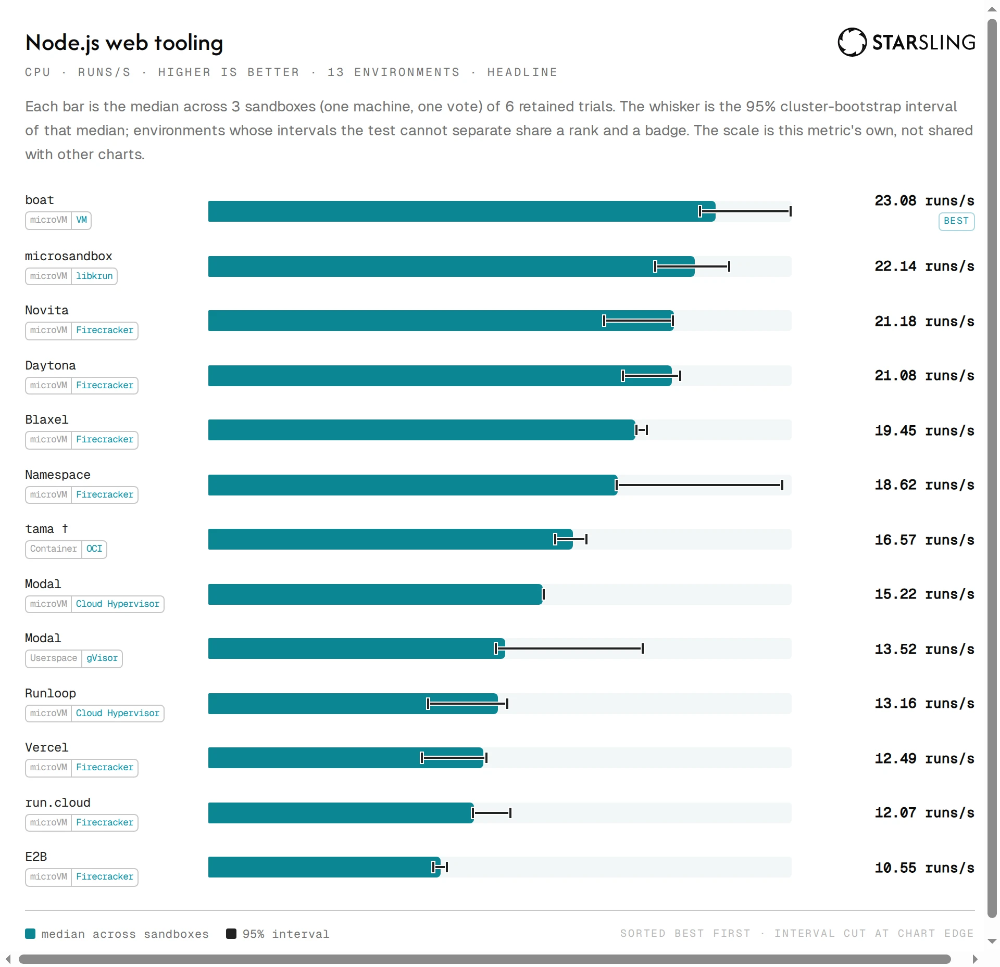

<strong>1 synthetic metric</strong> · headline: Node.js web tooling

### Node.js web tooling _(headline)_

runs/s · higher is better

_Namespace leads on median (higher is better); see notes for how ranks are decided._

| Rank | Provider | Node.js web tooling (runs/s) | 95% bootstrap interval | Sandboxes | Trials | Note |
| ---: | --- | ---: | ---: | ---: | ---: | --- |
| 1 | Namespace | 24.27 | 23.64 – 28.95 | 3 | 6 | — |
| 2 | Microsandbox Cloud | 23.55 | 22.16 – 23.57 | 3 | 6 | too few sandboxes |
| 3 | Daytona (VM) | 20.96 | 20.5 – 22.04 | 3 | 6 | too few sandboxes |
| 4 | Novita | 20.88 | 18.19 – 20.97 | 3 | 6 | too few sandboxes |
| 5 | Blaxel | 20.23 | 20.2 – 21.54 | 3 | 6 | too few sandboxes |
| 6 | run.cloud | 18.21 | 12.84 – 22.27 | 3 | 6 | too few sandboxes |
| 7 | tama | 16.78 | 14.89 – 17.16 | 3 | 6 | too few sandboxes |
| 8 | Modal (VM) | 15.43 | 14.09 – 16.02 | 3 | 6 | too few sandboxes |
| 9 | E2B | 14.92 | 13.59 – 16.29 | 3 | 6 | too few sandboxes |
| 10 | Vercel Sandbox | 12.37 | 9.85 – 12.5 | 3 | 6 | too few sandboxes |
| 11 | Modal (gVisor) | 8.73 | 8.56 – 9.195 | 3 | 6 | too few sandboxes |
| 12 | Runloop | 8.105 | 7.065 – 9.025 | 3 | 6 | too few sandboxes |

## disk

<strong>9 synthetic metrics</strong>

### fio rand read 4KB, buffered (IOPS)

IOPS · higher is better

_Namespace leads · ~1.2× Blaxel on median (higher is better)._

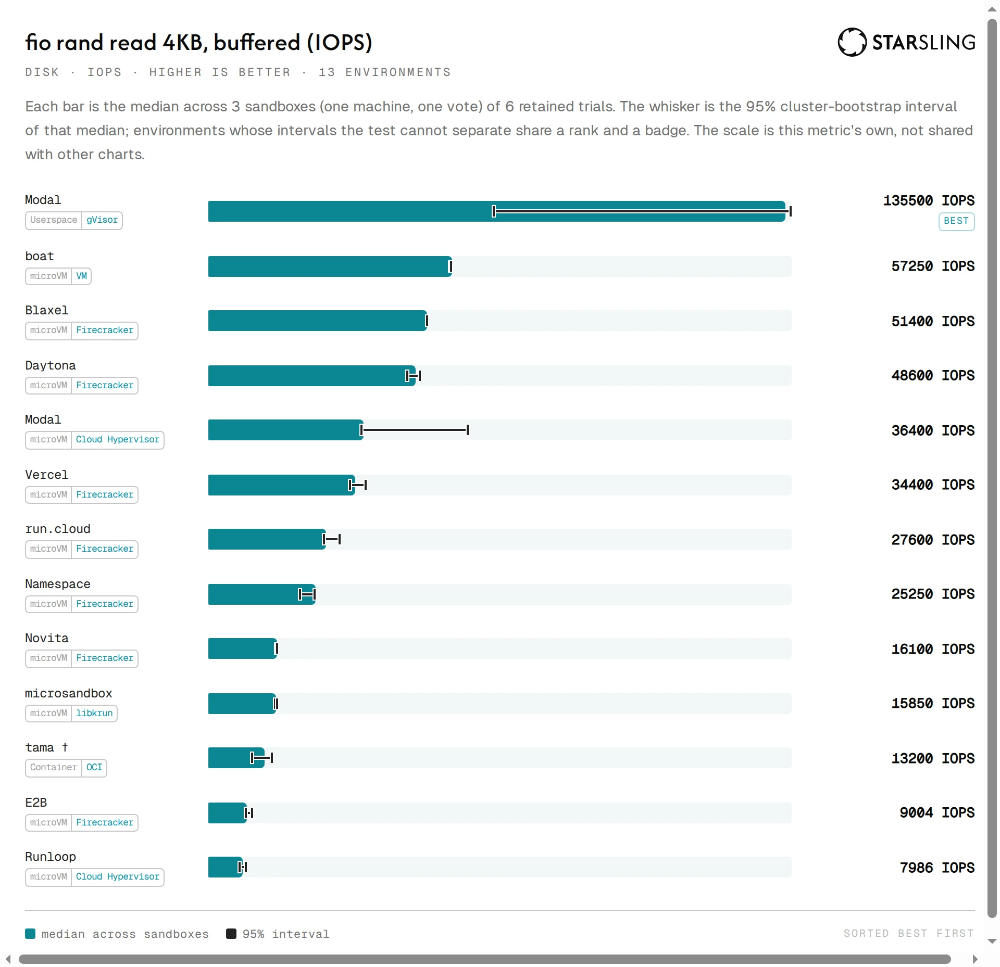

| Rank | Provider | fio rand read 4KB, buffered (IOPS) (IOPS) | 95% bootstrap interval | Sandboxes | Trials | Note |
| ---: | --- | ---: | ---: | ---: | ---: | --- |
| 1 | Namespace | 66200 | 66200 – 69800 | 3 | 6 | — |
| 2 | Blaxel | 54400 | 51400 – 58700 | 3 | 6 | too few sandboxes |
| 3 | Daytona (VM) | 47250 | 40200 – 49600 | 3 | 6 | too few sandboxes |
| 4 | Vercel Sandbox | 33700 | 33250 – 36300 | 3 | 6 | too few sandboxes |
| 5 | Modal (gVisor) | 32750 | 32700 – 36200 | 3 | 6 | too few sandboxes |
| 6 | Modal (VM) | 31150 | 30550 – 31200 | 3 | 6 | too few sandboxes |
| 7 | run.cloud | 30850 | 13950 – 32200 | 3 | 6 | too few sandboxes |
| 8 | Microsandbox Cloud | 16650 | 16450 – 24250 | 3 | 6 | too few sandboxes |
| 9 | Novita | 16250 | 16100 – 16500 | 3 | 6 | too few sandboxes |
| 10 | E2B | 11600 | 9434 – 12800 | 3 | 6 | too few sandboxes |
| 11 | Runloop | 6606 | 6450 – 6606 | 3 | 6 | too few sandboxes |
| 12 | tama | 2158 | 2113 – 7643 | 3 | 6 | too few sandboxes |

### fio rand read 4KB, buffered (MB/s)

MB/s · higher is better

_Namespace leads · ~1.2× Blaxel on median (higher is better)._

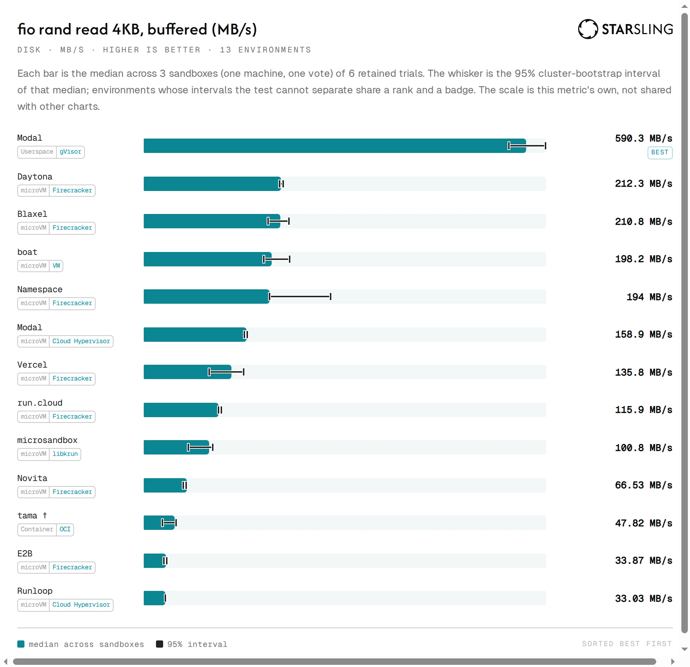

| Rank | Provider | fio rand read 4KB, buffered (MB/s) (MB/s) | 95% bootstrap interval | Sandboxes | Trials | Note |
| ---: | --- | ---: | ---: | ---: | ---: | --- |
| 1 | Namespace | 271.6 | 271.1 – 285.7 | 3 | 6 | — |
| 2 | Blaxel | 222.8 | 210.8 – 240.6 | 3 | 6 | too few sandboxes |
| 3 | Daytona (VM) | 193.5 | 165.2 – 203.4 | 3 | 6 | too few sandboxes |
| 4 | Vercel Sandbox | 138.4 | 135.8 – 148.9 | 3 | 6 | too few sandboxes |
| 5 | Modal (gVisor) | 134.2 | 133.7 – 148.4 | 3 | 6 | too few sandboxes |
| 6 | Modal (VM) | 127.4 | 125.3 – 127.9 | 3 | 6 | too few sandboxes |
| 7 | run.cloud | 126.4 | 57.2 – 132.1 | 3 | 6 | too few sandboxes |
| 8 | Microsandbox Cloud | 68.11 | 67.53 – 99.41 | 3 | 6 | too few sandboxes |
| 9 | Novita | 66.48 | 65.9 – 67.63 | 3 | 6 | too few sandboxes |
| 10 | E2B | 47.5 | 38.64 – 52.43 | 3 | 6 | too few sandboxes |
| 11 | Runloop | 27.05 | 26.42 – 27.05 | 3 | 6 | too few sandboxes |
| 12 | tama | 8.843 | 8.659 – 31.35 | 3 | 6 | too few sandboxes |

### fio rand write 4KB, buffered (IOPS)

IOPS · higher is better

_Blaxel leads · ~1.2× Novita on median (higher is better)._

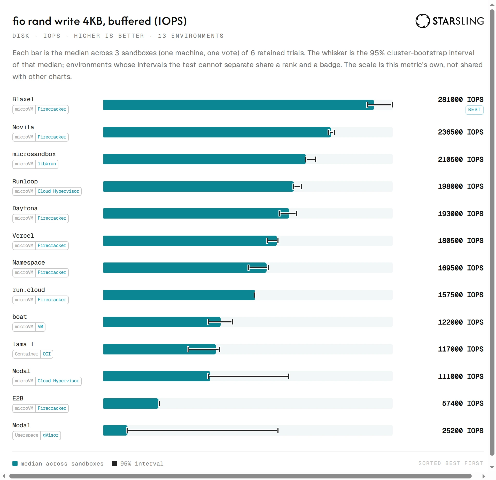

| Rank | Provider | fio rand write 4KB, buffered (IOPS) (IOPS) | 95% bootstrap interval | Sandboxes | Trials | Note |
| ---: | --- | ---: | ---: | ---: | ---: | --- |
| 1 | Blaxel | 302500 | 294000 – 316000 | 3 | 6 | — |
| 2 | Novita | 246000 | 244000 – 249500 | 3 | 6 | too few sandboxes |
| 3 | Microsandbox Cloud | 210000 | 208500 – 211500 | 3 | 6 | too few sandboxes |
| 4 | Daytona (VM) | 199500 | 166500 – 200000 | 3 | 6 | too few sandboxes |
| 5 | Namespace | 167500 | 161000 – 172000 | 3 | 6 | too few sandboxes |
| 6 | Vercel Sandbox | 153000 | 149000 – 167000 | 3 | 6 | too few sandboxes |
| 7 | run.cloud | 145500 | 67900 – 160500 | 3 | 6 | too few sandboxes |
| 8 | Runloop | 133000 | 130000 – 133500 | 3 | 6 | too few sandboxes |
| 9 | Modal (VM) | 116000 | 111500 – 116500 | 3 | 6 | too few sandboxes |
| 10 | E2B | 59950 | 56850 – 60100 | 3 | 6 | too few sandboxes |
| 11 | tama | 52100 | 23800 – 198500 | 3 | 6 | too few sandboxes |
| 12 | Modal (gVisor) | 25500 | 25000 – 25950 | 3 | 6 | too few sandboxes |

### fio rand write 4KB, buffered (MB/s)

MB/s · higher is better

_Blaxel leads · ~1.2× Novita on median (higher is better)._

| Rank | Provider | fio rand write 4KB, buffered (MB/s) (MB/s) | 95% bootstrap interval | Sandboxes | Trials | Note |
| ---: | --- | ---: | ---: | ---: | ---: | --- |
| 1 | Blaxel | 1238 | 1204 – 1293 | 3 | 6 | — |
| 2 | Novita | 1008 | 998.8 – 1022 | 3 | 6 | too few sandboxes |
| 3 | Microsandbox Cloud | 860.9 | 853 – 866.1 | 3 | 6 | too few sandboxes |
| 4 | Daytona (VM) | 817.9 | 682.1 – 820.5 | 3 | 6 | too few sandboxes |
| 5 | Namespace | 686.3 | 659 – 704.1 | 3 | 6 | too few sandboxes |
| 6 | Vercel Sandbox | 626 | 610.3 – 683.7 | 3 | 6 | too few sandboxes |
| 7 | run.cloud | 596.1 | 278.4 – 658.5 | 3 | 6 | too few sandboxes |
| 8 | Runloop | 544.7 | 532.7 – 546.8 | 3 | 6 | too few sandboxes |
| 9 | Modal (VM) | 475.5 | 456.7 – 478.7 | 3 | 6 | too few sandboxes |
| 10 | E2B | 245.9 | 232.8 – 246.4 | 3 | 6 | too few sandboxes |
| 11 | tama | 212.9 | 97.57 – 813.7 | 3 | 6 | too few sandboxes |
| 12 | Modal (gVisor) | 104.5 | 102.4 – 106.4 | 3 | 6 | too few sandboxes |

### fio seq read 1MB, buffered (IOPS)

IOPS · higher is better

_Modal (gVisor) leads · ~2.0× Daytona (VM) on median (higher is better)._

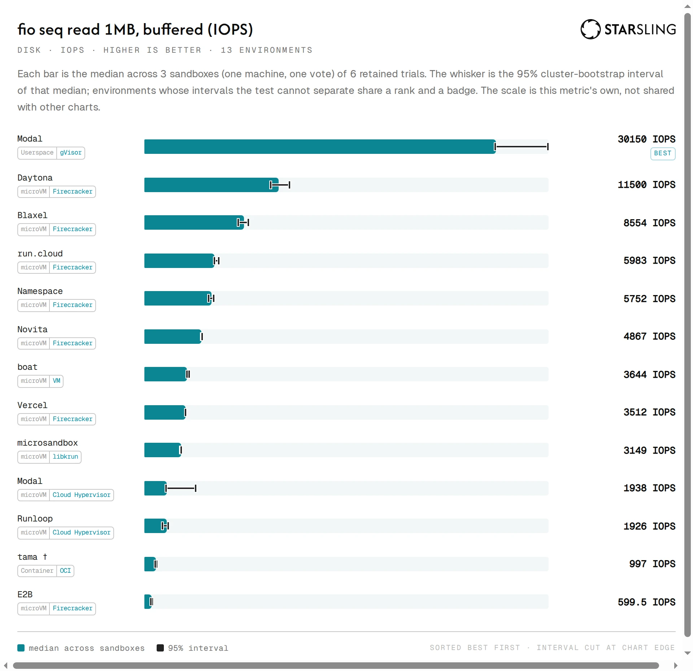

| Rank | Provider | fio seq read 1MB, buffered (IOPS) (IOPS) | 95% bootstrap interval | Sandboxes | Trials | Note |
| ---: | --- | ---: | ---: | ---: | ---: | --- |
| 1 | Modal (gVisor) | 22250 | 18500 – 22750 | 3 | 6 | — |
| 2 | Daytona (VM) | 11300 | 10750 – 12550 | 3 | 6 | too few sandboxes |
| 3 | Blaxel | 7148 | 7004 – 10050 | 3 | 6 | too few sandboxes |
| 4 | Namespace | 6301 | 2037 – 6985 | 3 | 6 | too few sandboxes |
| 5 | run.cloud | 5528 | 2663 – 5950 | 3 | 6 | too few sandboxes |
| 6 | Novita | 4515 | 4512 – 4943 | 3 | 6 | too few sandboxes |
| 7 | Vercel Sandbox | 3785 | 2919 – 4054 | 3 | 6 | too few sandboxes |
| 8 | Microsandbox Cloud | 3026 | 2886 – 3177 | 3 | 6 | too few sandboxes |
| 9 | Modal (VM) | 1467 | 1423 – 1518 | 3 | 6 | too few sandboxes |
| 10 | Runloop | 985 | 972 – 1004 | 3 | 6 | too few sandboxes |
| 11 | tama | 748 | 696 – 791.5 | 3 | 6 | too few sandboxes |
| 12 | E2B | 599.5 | 599.5 – 599.5 | 3 | 6 | too few sandboxes |

### fio seq read 1MB, buffered (MB/s)

MB/s · higher is better

_Modal (gVisor) leads · ~2.0× Daytona (VM) on median (higher is better)._

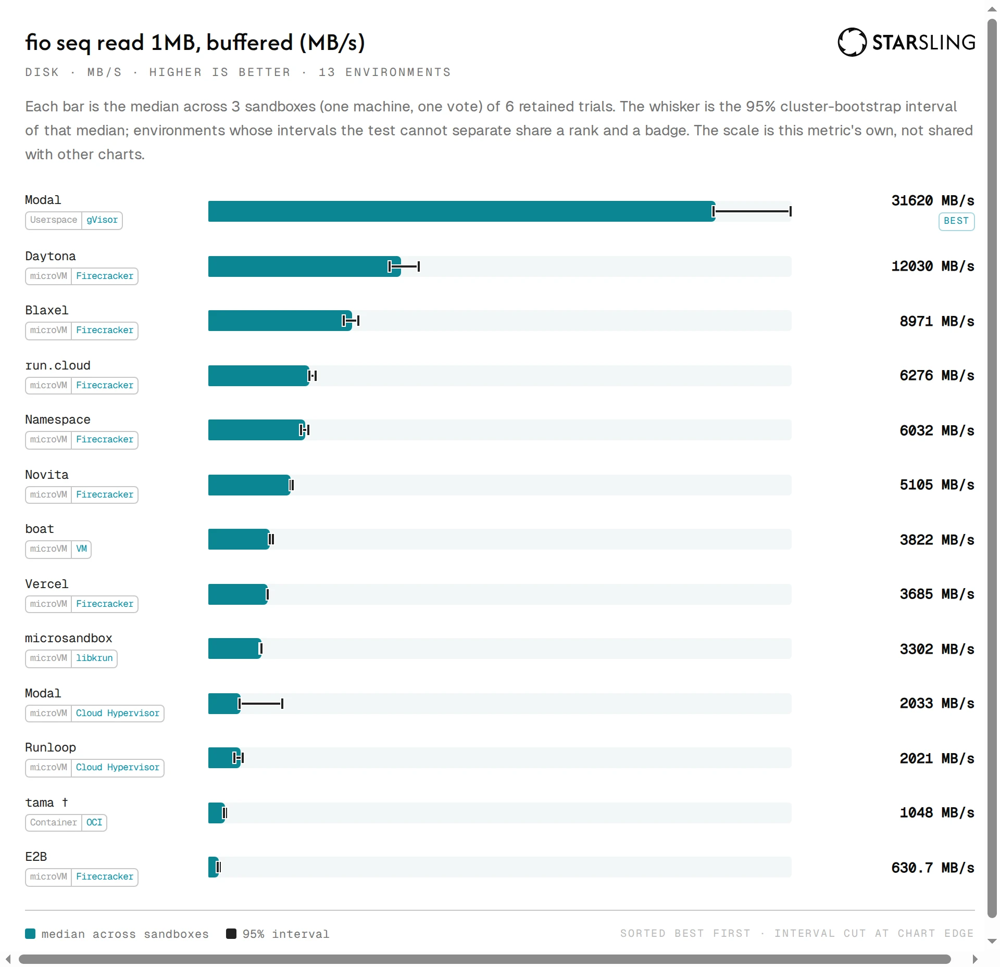

| Rank | Provider | fio seq read 1MB, buffered (MB/s) (MB/s) | 95% bootstrap interval | Sandboxes | Trials | Note |
| ---: | --- | ---: | ---: | ---: | ---: | --- |
| 1 | Modal (gVisor) | 23350 | 19380 – 23840 | 3 | 6 | — |
| 2 | Daytona (VM) | 11860 | 11220 – 13150 | 3 | 6 | too few sandboxes |
| 3 | Blaxel | 7496 | 7346 – 10520 | 3 | 6 | too few sandboxes |
| 4 | Namespace | 6609 | 2138 – 7325 | 3 | 6 | too few sandboxes |
| 5 | run.cloud | 5798 | 2793 – 6240 | 3 | 6 | too few sandboxes |
| 6 | Novita | 4736 | 4732 – 5185 | 3 | 6 | too few sandboxes |
| 7 | Vercel Sandbox | 3970 | 3061 – 4252 | 3 | 6 | too few sandboxes |
| 8 | Microsandbox Cloud | 3174 | 3027 – 3332 | 3 | 6 | too few sandboxes |
| 9 | Modal (VM) | 1540 | 1493 – 1592 | 3 | 6 | too few sandboxes |
| 10 | Runloop | 1035 | 1021 – 1054 | 3 | 6 | too few sandboxes |
| 11 | tama | 786.4 | 731.4 – 831 | 3 | 6 | too few sandboxes |
| 12 | E2B | 630.2 | 629.7 – 630.7 | 3 | 6 | too few sandboxes |

### fio seq write 1MB, buffered (IOPS)

IOPS · higher is better

_Daytona (VM) leads · ~1.2× Namespace on median (higher is better)._

| Rank | Provider | fio seq write 1MB, buffered (IOPS) (IOPS) | 95% bootstrap interval | Sandboxes | Trials | Note |
| ---: | --- | ---: | ---: | ---: | ---: | --- |
| 1 | Daytona (VM) | 4990 | 4884 – 5429 | 3 | 6 | — |
| 2 | Namespace | 4233 | 4153 – 4264 | 3 | 6 | too few sandboxes |
| 3 | Vercel Sandbox | 3266 | 3048 – 3291 | 3 | 6 | too few sandboxes |
| 4 | Blaxel | 3210 | 3159 – 3387 | 3 | 6 | too few sandboxes |
| 5 | Modal (gVisor) | 2970 | 2334 – 3331 | 3 | 6 | too few sandboxes |
| 6 | run.cloud | 2427 | 1430 – 3820 | 3 | 6 | too few sandboxes |
| 7 | Novita | 2277 | 2274 – 2395 | 3 | 6 | too few sandboxes |
| 8 | Microsandbox Cloud | 1677 | 1449 – 1800 | 3 | 6 | too few sandboxes |
| 9 | Modal (VM) | 1342 | 1299 – 1448 | 3 | 6 | too few sandboxes |
| 10 | Runloop | 1008 | 918.5 – 1045 | 3 | 6 | too few sandboxes |
| 11 | E2B | 593 | 592 – 605 | 3 | 6 | too few sandboxes |
| 12 | tama | 551 | 528.5 – 823 | 3 | 6 | too few sandboxes |

### fio seq write 1MB, buffered (MB/s)

MB/s · higher is better

_Daytona (VM) leads · ~1.2× Namespace on median (higher is better)._

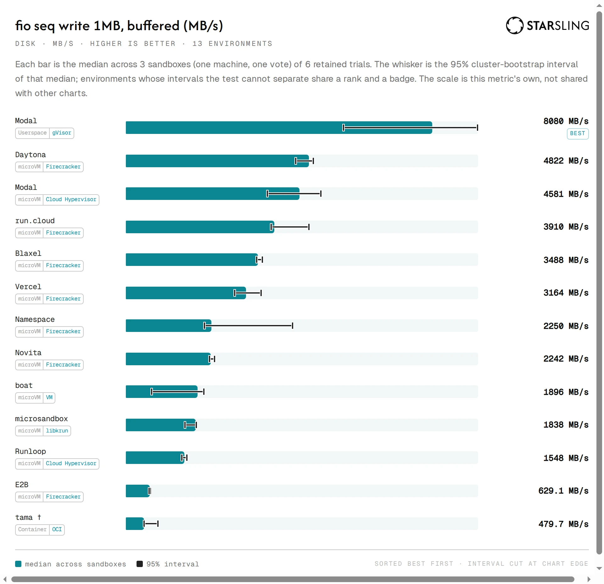

| Rank | Provider | fio seq write 1MB, buffered (MB/s) (MB/s) | 95% bootstrap interval | Sandboxes | Trials | Note |
| ---: | --- | ---: | ---: | ---: | ---: | --- |
| 1 | Daytona (VM) | 5233 | 5123 – 5693 | 3 | 6 | — |
| 2 | Namespace | 4440 | 4357 – 4473 | 3 | 6 | too few sandboxes |
| 3 | Vercel Sandbox | 3426 | 3198 – 3452 | 3 | 6 | too few sandboxes |
| 4 | Blaxel | 3368 | 3314 – 3553 | 3 | 6 | too few sandboxes |
| 5 | Modal (gVisor) | 3115 | 2448 – 3494 | 3 | 6 | too few sandboxes |
| 6 | run.cloud | 2546 | 1501 – 4006 | 3 | 6 | too few sandboxes |
| 7 | Novita | 2390 | 2386 – 2513 | 3 | 6 | too few sandboxes |
| 8 | Microsandbox Cloud | 1760 | 1520 – 1889 | 3 | 6 | too few sandboxes |
| 9 | Modal (VM) | 1408 | 1364 – 1519 | 3 | 6 | too few sandboxes |
| 10 | Runloop | 1058 | 965.2 – 1097 | 3 | 6 | too few sandboxes |
| 11 | E2B | 623.9 | 622.3 – 636 | 3 | 6 | too few sandboxes |
| 12 | tama | 579.9 | 555.2 – 864.6 | 3 | 6 | too few sandboxes |

### Hardlink throughput

bogo ops/s · higher is better

_Daytona (VM) leads · ~1.3× Blaxel on median (higher is better)._

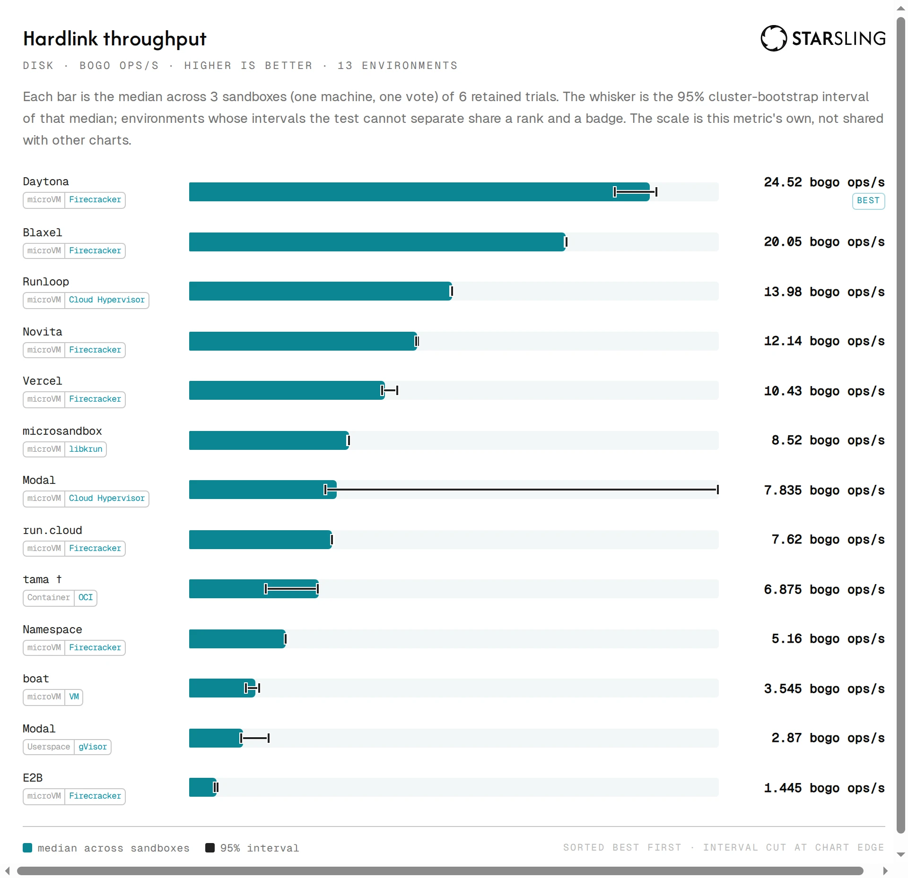

| Rank | Provider | Hardlink throughput (bogo ops/s) | 95% bootstrap interval | Sandboxes | Trials | Note |
| ---: | --- | ---: | ---: | ---: | ---: | --- |
| 1 | Daytona (VM) | 25.34 | 25.23 – 25.98 | 3 | 6 | — |
| 2 | Blaxel | 20.26 | 20.21 – 20.33 | 3 | 6 | too few sandboxes |
| 3 | Runloop | 14.41 | 14.36 – 14.49 | 3 | 6 | too few sandboxes |
| 4 | Novita | 11.79 | 11.71 – 12.03 | 3 | 6 | too few sandboxes |
| 5 | Vercel Sandbox | 10.89 | 10.79 – 11.07 | 3 | 6 | too few sandboxes |
| 6 | Microsandbox Cloud | 8.205 | 8.195 – 8.25 | 3 | 6 | too few sandboxes |
| 7 | Modal (VM) | 8.06 | 8.05 – 8.105 | 3 | 6 | too few sandboxes |
| 8 | run.cloud | 5.805 | 4.97 – 7.59 | 3 | 6 | too few sandboxes |
| 9 | Namespace | 5.145 | 5.14 – 5.26 | 3 | 6 | too few sandboxes |
| 10 | tama | 4.99 | 4.92 – 8.035 | 3 | 6 | too few sandboxes |
| 11 | Modal (gVisor) | 2.985 | 2.9 – 3.065 | 3 | 6 | too few sandboxes |
| 12 | E2B | 1.66 | 1.415 – 1.815 | 3 | 6 | too few sandboxes |

## memory

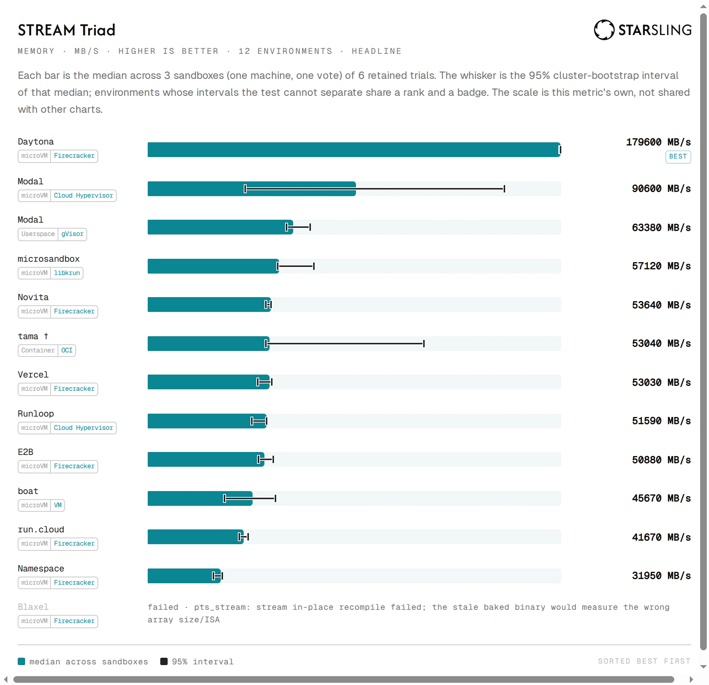

<strong>4 synthetic metrics</strong> · headline: STREAM Triad

### STREAM Triad _(headline)_

MB/s · higher is better

_Daytona (VM) leads · ~1.2× tama on median (higher is better)._

| Rank | Provider | STREAM Triad (MB/s) | 95% bootstrap interval | Sandboxes | Trials | Note |
| ---: | --- | ---: | ---: | ---: | ---: | --- |
| 1 | Daytona (VM) | 178100 | 170700 – 179700 | 3 | 6 | — |
| 2 | tama | 149400 | 140350 – 182500 | 3 | 6 | too few sandboxes |
| 3 | Blaxel | 86850 | 80310 – 98190 | 3 | 6 | too few sandboxes |
| 4 | Modal (VM) | 77400 | 68710 – 78880 | 3 | 6 | too few sandboxes |
| 5 | Modal (gVisor) | 70700 | 68550 – 84820 | 3 | 6 | too few sandboxes |
| 6 | Microsandbox Cloud | 56810 | 56730 – 56860 | 3 | 6 | too few sandboxes |
| 7 | Novita | 53930 | 52360 – 53940 | 3 | 6 | too few sandboxes |
| 8 | Vercel Sandbox | 52530 | 50940 – 53520 | 3 | 6 | too few sandboxes |
| 9 | E2B | 51830 | 50570 – 52860 | 3 | 6 | too few sandboxes |
| 10 | run.cloud | 34110 | 33990 – 80530 | 3 | 6 | too few sandboxes |
| 11 | Runloop | 29890 | 24560 – 44030 | 3 | 6 | too few sandboxes |
| 12 | Namespace | 27530 | 21810 – 31560 | 3 | 6 | too few sandboxes |

### STREAM Add

MB/s · higher is better

_Daytona (VM) leads · ~1.7× tama on median (higher is better)._

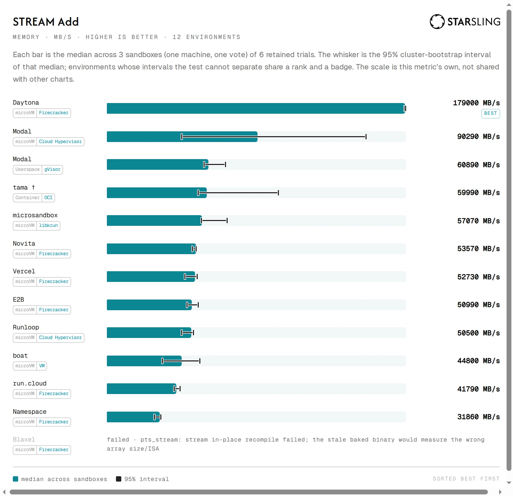

| Rank | Provider | STREAM Add (MB/s) | 95% bootstrap interval | Sandboxes | Trials | Note |
| ---: | --- | ---: | ---: | ---: | ---: | --- |
| 1 | Daytona (VM) | 177700 | 171400 – 179400 | 3 | 6 | — |
| 2 | tama | 101700 | 83870 – 185200 | 3 | 6 | too few sandboxes |
| 3 | Blaxel | 85910 | 80780 – 98100 | 3 | 6 | too few sandboxes |
| 4 | Modal (VM) | 77179 | 68300 – 78400 | 3 | 6 | too few sandboxes |
| 5 | Modal (gVisor) | 69050 | 67690 – 84830 | 3 | 6 | too few sandboxes |
| 6 | Microsandbox Cloud | 56720 | 56710 – 56850 | 3 | 6 | too few sandboxes |
| 7 | Novita | 53860 | 52270 – 53890 | 3 | 6 | too few sandboxes |
| 8 | Vercel Sandbox | 52290 | 50840 – 53010 | 3 | 6 | too few sandboxes |
| 9 | E2B | 51510 | 51030 – 51910 | 3 | 6 | too few sandboxes |
| 10 | run.cloud | 34060 | 33970 – 77040 | 3 | 6 | too few sandboxes |
| 11 | Runloop | 32750 | 29150 – 39160 | 3 | 6 | too few sandboxes |
| 12 | Namespace | 27150 | 21710 – 31310 | 3 | 6 | too few sandboxes |

### STREAM Copy

MB/s · higher is better

_Daytona (VM) leads · ~1.4× tama on median (higher is better)._

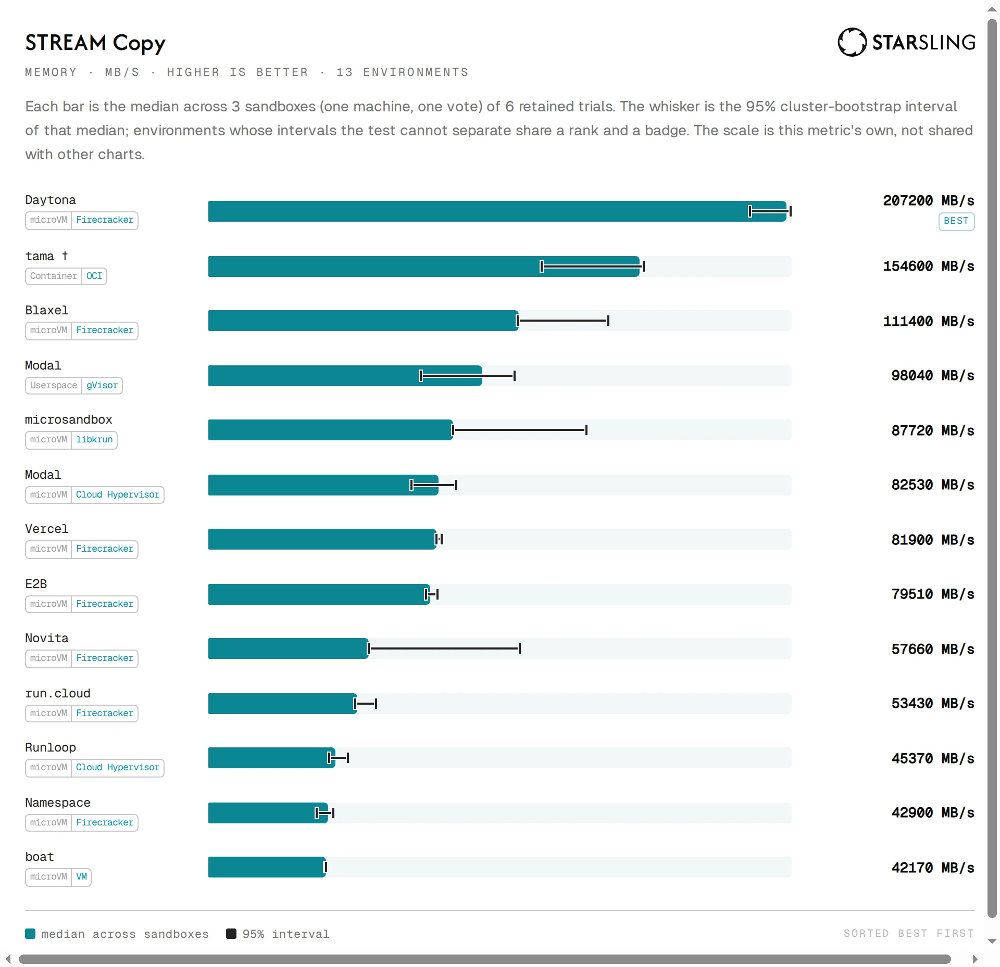

| Rank | Provider | STREAM Copy (MB/s) | 95% bootstrap interval | Sandboxes | Trials | Note |
| ---: | --- | ---: | ---: | ---: | ---: | --- |
| 1 | Daytona (VM) | 203400 | 191900 – 211600 | 3 | 6 | — |
| 2 | tama | 145500 | 132387 – 164000 | 3 | 6 | too few sandboxes |
| 3 | Modal (gVisor) | 97760 | 90990 – 112000 | 3 | 6 | too few sandboxes |
| 4 | Blaxel | 95020 | 90290 – 102700 | 3 | 6 | too few sandboxes |
| 5 | Modal (VM) | 94990 | 78520 – 95200 | 3 | 6 | too few sandboxes |
| 6 | Microsandbox Cloud | 87240 | 87230 – 87720 | 3 | 6 | too few sandboxes |
| 7 | Vercel Sandbox | 81410 | 78460 – 84080 | 3 | 6 | too few sandboxes |
| 8 | E2B | 69650 | 67260 – 71100 | 3 | 6 | too few sandboxes |
| 9 | Novita | 58290 | 57470 – 58410 | 3 | 6 | too few sandboxes |
| 10 | run.cloud | 46060 | 46010 – 75510 | 3 | 6 | too few sandboxes |
| 11 | Namespace | 37780 | 33070 – 42950 | 3 | 6 | too few sandboxes |
| 12 | Runloop | 35650 | 30130 – 36520 | 3 | 6 | too few sandboxes |

### STREAM Scale

MB/s · higher is better

_Daytona (VM) leads · ~1.6× tama on median (higher is better)._

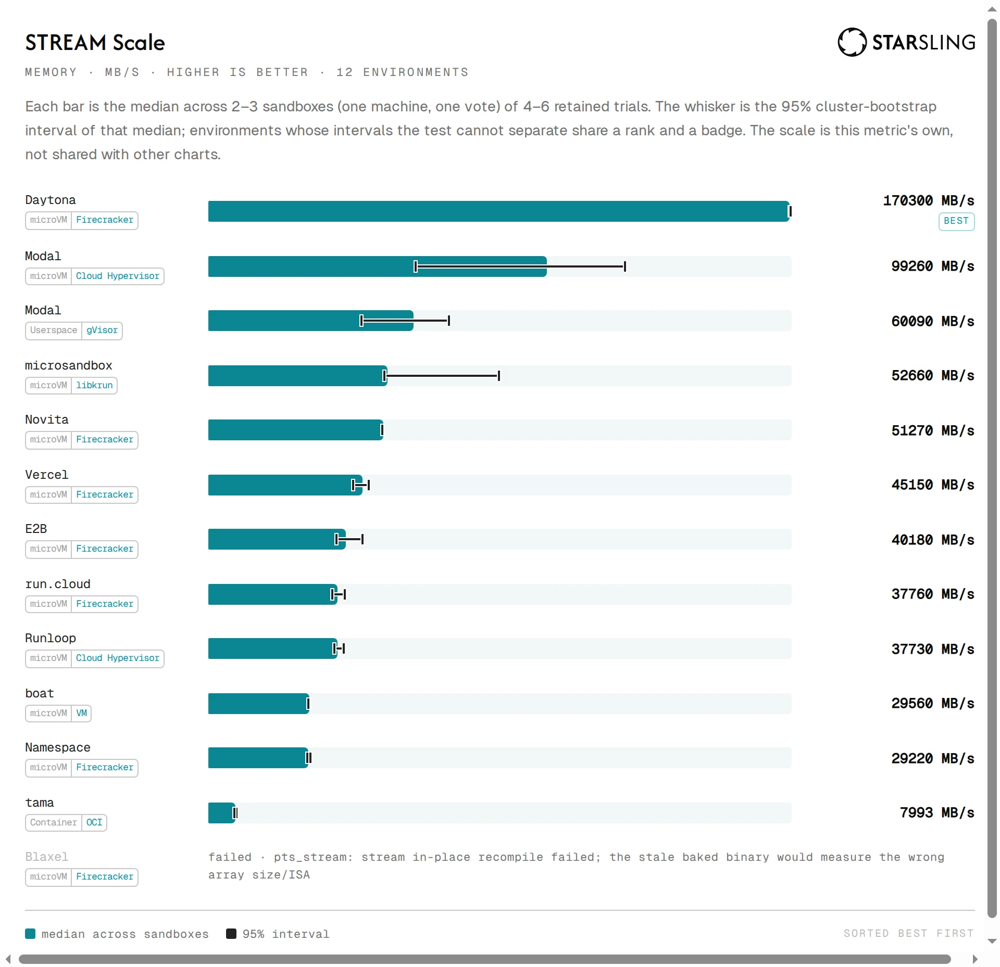

| Rank | Provider | STREAM Scale (MB/s) | 95% bootstrap interval | Sandboxes | Trials | Note |
| ---: | --- | ---: | ---: | ---: | ---: | --- |
| 1 | Daytona (VM) | 169400 | 162500 – 171000 | 3 | 6 | — |
| 2 | tama | 108600 | 105100 – 120600 | 3 | 6 | too few sandboxes |
| 3 | Blaxel | 80760 | 73970 – 92100 | 3 | 6 | too few sandboxes |
| 4 | Modal (VM) | 73410 | 64180 – 73940 | 3 | 6 | too few sandboxes |
| 5 | Modal (gVisor) | 59470 | 56580 – 78281 | 3 | 6 | too few sandboxes |
| 6 | Microsandbox Cloud | 52630 | 52510 – 52680 | 3 | 6 | too few sandboxes |
| 7 | Novita | 51360 | 49860 – 51640 | 3 | 6 | too few sandboxes |
| 8 | E2B | 44870 | 43990 – 45330 | 3 | 6 | too few sandboxes |
| 9 | Vercel Sandbox | 44270 | 42950 – 46790 | 3 | 6 | too few sandboxes |
| 10 | run.cloud | 31070 | 30850 – 85520 | 3 | 6 | too few sandboxes |
| 11 | Namespace | 25470 | 19520 – 28750 | 3 | 6 | too few sandboxes |
| 12 | Runloop | 25350 | 23480 – 37350 | 3 | 6 | too few sandboxes |

## network

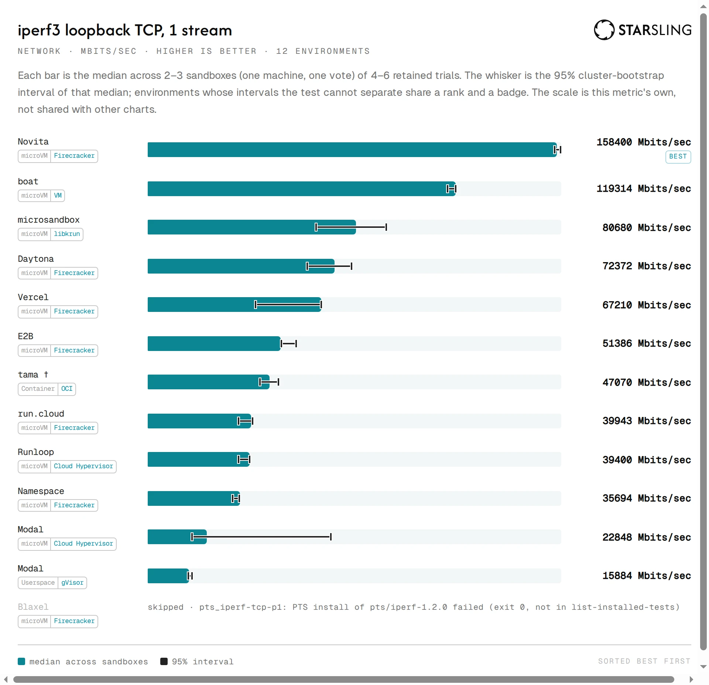

<strong>5 synthetic metrics</strong> · headline: iperf3 loopback TCP, 1 stream

### iperf3 loopback TCP, 1 stream _(headline)_

Mbits/sec · higher is better

_Novita leads · ~1.1× Blaxel on median (higher is better)._

| Rank | Provider | iperf3 loopback TCP, 1 stream (Mbits/sec) | 95% bootstrap interval | Sandboxes | Trials | Note |
| ---: | --- | ---: | ---: | ---: | ---: | --- |
| 1 | Novita | 150900 | 147857 – 153700 | 3 | 6 | — |
| 2 | Blaxel | 142925 | 85750 – 167279 | 3 | 6 | too few sandboxes |
| 3 | Microsandbox Cloud | 87530 | 75860 – 93531 | 3 | 6 | too few sandboxes |
| 4 | Daytona (VM) | 77743 | 69480 – 79670 | 3 | 6 | too few sandboxes |
| 5 | Namespace | 71721 | 65140 – 76030 | 3 | 6 | too few sandboxes |
| 6 | Vercel Sandbox | 65825 | 64260 – 66020 | 3 | 6 | too few sandboxes |
| 7 | run.cloud | 60540 | 26735 – 61900 | 3 | 6 | too few sandboxes |
| 8 | E2B | 52990 | 51595 – 66043 | 3 | 6 | too few sandboxes |
| 9 | Runloop | 41750 | 34450 – 42420 | 3 | 6 | too few sandboxes |
| 10 | Modal (VM) | 20011 | 16330 – 30380 | 3 | 6 | too few sandboxes |
| 11 | Modal (gVisor) | 14496 | 14220 – 14510 | 3 | 6 | too few sandboxes |

### iperf3 loopback TCP, 10 streams

Mbits/sec · higher is better

_Novita leads · ~1.4× Blaxel on median (higher is better)._

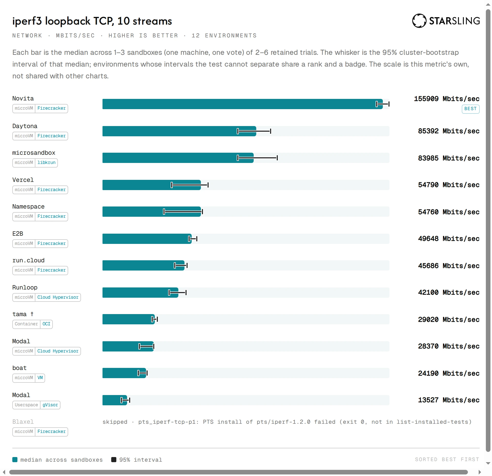

| Rank | Provider | iperf3 loopback TCP, 10 streams (Mbits/sec) | 95% bootstrap interval | Sandboxes | Trials | Note |
| ---: | --- | ---: | ---: | ---: | ---: | --- |
| 1 | Novita | 157020 | 139488 – 161400 | 3 | 6 | — |
| 2 | Blaxel | 110165 | 82970 – 134200 | 3 | 6 | too few sandboxes |
| 3 | Microsandbox Cloud | 88803 | 84224 – 101567 | 3 | 6 | too few sandboxes |
| 4 | Daytona (VM) | 87950 | 86920 – 93500 | 3 | 6 | too few sandboxes |
| 5 | run.cloud | 74440 | 14880 – 77708 | 3 | 6 | too few sandboxes |
| 6 | Namespace | 59750 | 39870 – 68712 | 3 | 6 | too few sandboxes |
| 7 | E2B | 56660 | 43930 – 58572 | 3 | 6 | too few sandboxes |
| 8 | Vercel Sandbox | 51266 | 50878 – 51743 | 3 | 6 | too few sandboxes |
| 9 | Runloop | 31679 | 28740 – 43226 | 3 | 6 | too few sandboxes |
| 10 | Modal (VM) | 15310 | 13798 – 24320 | 3 | 6 | too few sandboxes |
| 11 | Modal (gVisor) | 12481 | 11510 – 13428 | 3 | 6 | too few sandboxes |

### iperf3 loopback UDP, 10G objective

Mbits/sec · higher is better

_Modal (VM) leads on median (higher is better); see notes for how ranks are decided._

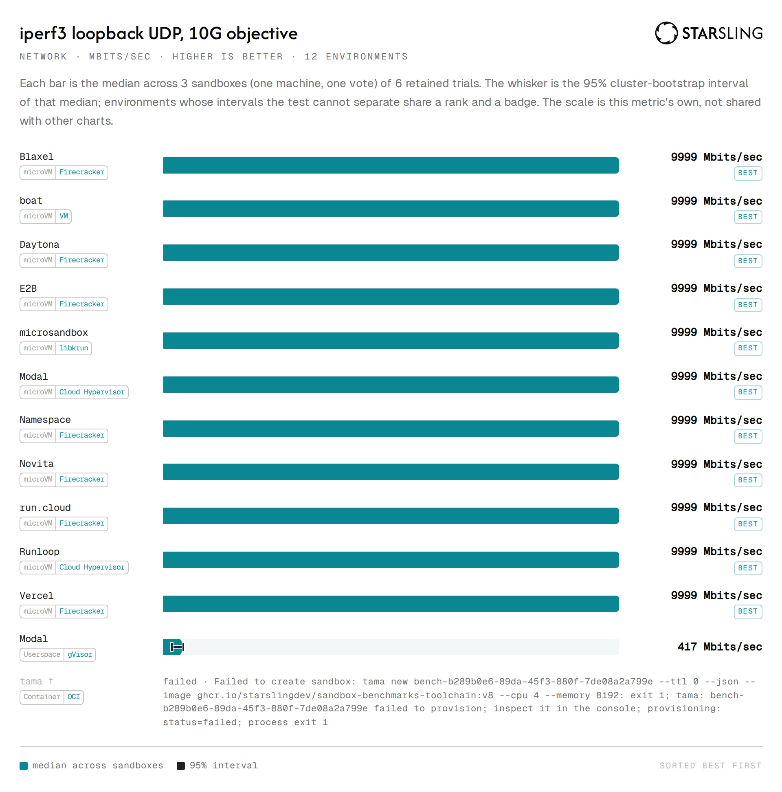

| Rank | Provider | iperf3 loopback UDP, 10G objective (Mbits/sec) | 95% bootstrap interval | Sandboxes | Trials | Note |
| ---: | --- | ---: | ---: | ---: | ---: | --- |
| 1 | Modal (VM) | 10000 | 9999 – 10000 | 3 | 6 | — |
| 2 | Blaxel | 9999 | 9999 – 9999 | 3 | 6 | too few sandboxes |
| 2 | Daytona (VM) | 9999 | 9999 – 9999 | 3 | 6 | too few sandboxes, equal medians |
| 2 | E2B | 9999 | 9999 – 9999 | 3 | 6 | too few sandboxes, equal medians |
| 2 | Microsandbox Cloud | 9999 | 9999 – 9999 | 3 | 6 | too few sandboxes, equal medians |
| 2 | Namespace | 9999 | 9999 – 9999 | 3 | 6 | too few sandboxes, equal medians |
| 2 | Novita | 9999 | 9999 – 9999 | 3 | 6 | too few sandboxes, equal medians |
| 2 | run.cloud | 9999 | 9971 – 9999 | 3 | 6 | too few sandboxes, equal medians |
| 2 | Runloop | 9999 | 9999 – 9999 | 3 | 6 | too few sandboxes, equal medians |
| 2 | Vercel Sandbox | 9999 | 9999 – 9999 | 3 | 6 | too few sandboxes, equal medians |
| 11 | Modal (gVisor) | 163 | 152.5 – 178 | 3 | 6 | too few sandboxes |

### iperf3 WAN download

Mbits/sec · higher is better

_Vercel Sandbox leads · ~1.3× Modal (gVisor) on median (higher is better)._

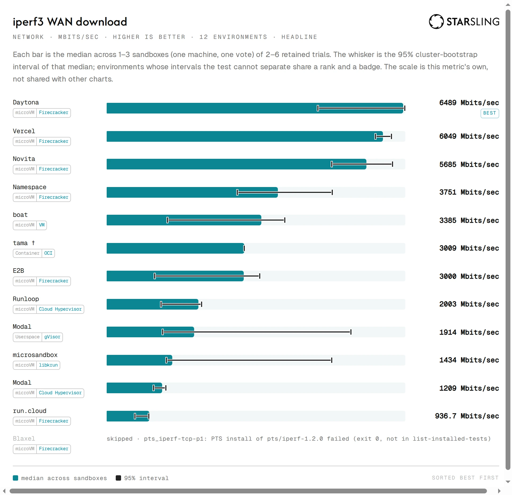

| Rank | Provider | iperf3 WAN download (Mbits/sec) | 95% bootstrap interval | Sandboxes | Trials | Note |
| ---: | --- | ---: | ---: | ---: | ---: | --- |
| 1 | Vercel Sandbox | 9569 | 6640 – 10240 | 3 | 6 | — |
| 2 | Modal (gVisor) | 7262 | 1470 – 7798 | 3 | 6 | too few sandboxes |
| 3 | Namespace | 4747 | 3629 – 6239 | 3 | 6 | too few sandboxes |
| 4 | Daytona (VM) | 4218 | 787.5 – 6316 | 3 | 6 | too few sandboxes |
| 5 | Novita | 4128 | 2842 – 4198 | 3 | 6 | too few sandboxes |
| 6 | E2B | 2990 | 2987 – 3930 | 3 | 6 | too few sandboxes |
| 7 | Blaxel | 1615 | 1568 – 1842 | 3 | 6 | too few sandboxes |
| 8 | Microsandbox Cloud | 1377 | 1042 – 2124 | 3 | 6 | too few sandboxes |
| 9 | Modal (VM) | 1376 | 1301 – 1379 | 3 | 6 | too few sandboxes |
| 10 | run.cloud | 1327 | 1046 – 2551 | 3 | 6 | too few sandboxes |
| 11 | Runloop | 1292 | 892.4 – 2112 | 3 | 6 | too few sandboxes |

### iperf3 WAN upload

Mbits/sec · higher is better

_Modal (VM) leads · ~1.3× Daytona (VM) on median (higher is better)._

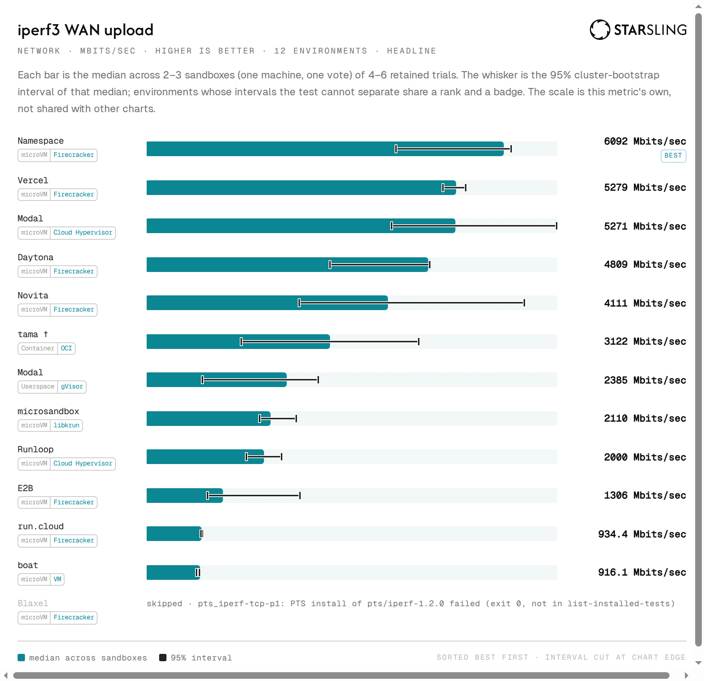

| Rank | Provider | iperf3 WAN upload (Mbits/sec) | 95% bootstrap interval | Sandboxes | Trials | Note |
| ---: | --- | ---: | ---: | ---: | ---: | --- |
| 1 | Modal (VM) | 5771 | 4516 – 6231 | 3 | 6 | — |
| 2 | Daytona (VM) | 4505 | 2892 – 4526 | 3 | 6 | too few sandboxes |
| 3 | Microsandbox Cloud | 3242 | 1880 – 3282 | 3 | 6 | too few sandboxes |
| 4 | E2B | 3196 | 1952 – 3227 | 3 | 6 | too few sandboxes |
| 5 | Novita | 2943 | 987.8 – 3286 | 3 | 6 | too few sandboxes |
| 6 | Namespace | 2857 | 2124 – 3366 | 3 | 6 | too few sandboxes |
| 7 | Blaxel | 2282 | 2169 – 2435 | 3 | 6 | too few sandboxes |
| 8 | run.cloud | 982.7 | 961.3 – 1190 | 3 | 6 | too few sandboxes |
| 9 | Runloop | 891.5 | 868.7 – 1095 | 3 | 6 | too few sandboxes |
| 10 | Modal (gVisor) | 192.2 | 55.63 – 2726 | 3 | 6 | too few sandboxes |
| 11 | Vercel Sandbox | 45.21 | 43.7 – 4208 | 3 | 6 | too few sandboxes |

## system

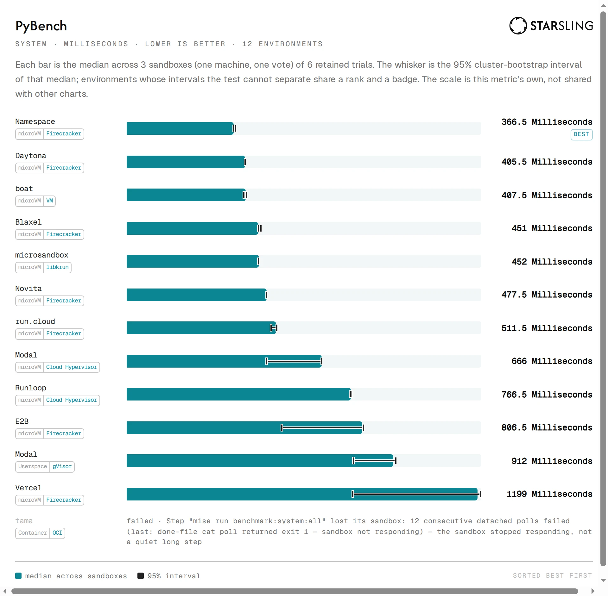

<strong>7 synthetic metrics</strong> · headline: PyBench

### PyBench _(headline)_

Milliseconds · lower is better

_Namespace leads · Daytona (VM) is ~1.1× higher (lower is better)._

| Rank | Provider | PyBench (Milliseconds) | 95% bootstrap interval | Sandboxes | Trials | Note |
| ---: | --- | ---: | ---: | ---: | ---: | --- |
| 1 | Namespace | 358 | 356.5 – 364 | 3 | 6 | — |
| 2 | Daytona (VM) | 404 | 402.5 – 416 | 3 | 6 | too few sandboxes |
| 3 | Microsandbox Cloud | 450.5 | 450 – 452.5 | 3 | 6 | too few sandboxes |
| 4 | Blaxel | 479.5 | 477.5 – 485.5 | 3 | 6 | too few sandboxes |
| 5 | Novita | 482.5 | 478 – 486.5 | 3 | 6 | too few sandboxes |
| 6 | tama | 508 | 505.5 – 508 | 3 | 6 | too few sandboxes |
| 7 | E2B | 632.5 | 520 – 650.5 | 3 | 6 | too few sandboxes |
| 8 | Modal (VM) | 669 | 664.5 – 669.5 | 3 | 6 | too few sandboxes |
| 9 | Vercel Sandbox | 765.5 | 762 – 773.5 | 3 | 6 | too few sandboxes |
| 10 | run.cloud | 789 | 482 – 801.5 | 3 | 6 | too few sandboxes |
| 11 | Modal (gVisor) | 900 | 775 – 901.5 | 3 | 6 | too few sandboxes |
| 12 | Runloop | 1216 | 1214 – 1220 | 3 | 6 | too few sandboxes |

### Git common operations

Seconds · lower is better

_Namespace leads on median (lower is better); see notes for how ranks are decided._

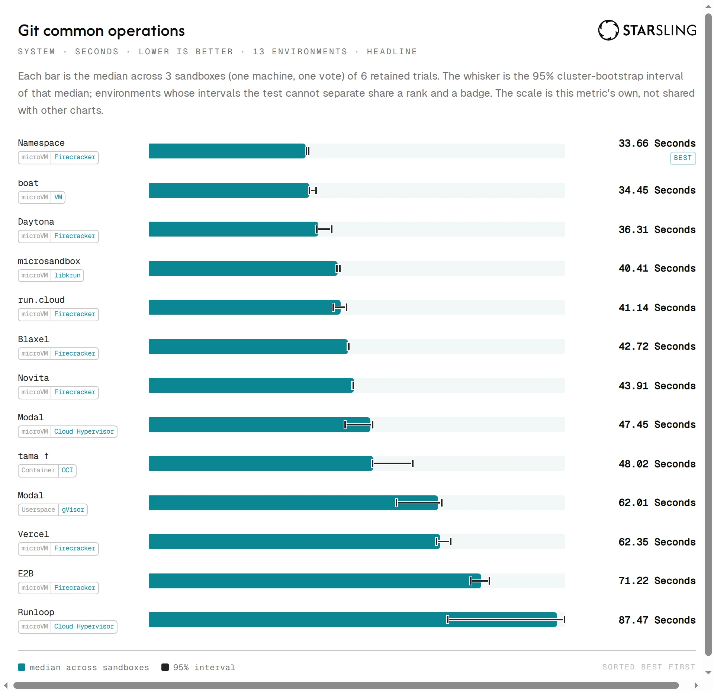

| Rank | Provider | Git common operations (Seconds) | 95% bootstrap interval | Sandboxes | Trials | Note |
| ---: | --- | ---: | ---: | ---: | ---: | --- |
| 1 | Namespace | 35.22 | 31.21 – 35.86 | 3 | 6 | — |
| 2 | Daytona (VM) | 35.84 | 35.58 – 36.03 | 3 | 6 | too few sandboxes |
| 3 | Microsandbox Cloud | 40.32 | 40.12 – 41.06 | 3 | 6 | too few sandboxes |
| 4 | Blaxel | 41.8 | 41.67 – 41.94 | 3 | 6 | too few sandboxes |
| 5 | Novita | 44 | 43.82 – 45.02 | 3 | 6 | too few sandboxes |
| 6 | Modal (VM) | 47.49 | 46.84 – 47.68 | 3 | 6 | too few sandboxes |
| 7 | run.cloud | 50.44 | 36.95 – 59.31 | 3 | 6 | too few sandboxes |
| 8 | tama | 54.07 | 53.8 – 54.29 | 3 | 6 | too few sandboxes |
| 9 | E2B | 61.65 | 54.54 – 65.19 | 3 | 6 | too few sandboxes |
| 10 | Vercel Sandbox | 62.2 | 61.49 – 63.42 | 3 | 6 | too few sandboxes |
| 11 | Modal (gVisor) | 78.88 | 62.63 – 81.23 | 3 | 6 | too few sandboxes |
| 12 | Runloop | 91.71 | 90.71 – 92.3 | 3 | 6 | too few sandboxes |

### pgbench RO (s100, 50c)

TPS · higher is better

_Blaxel leads on median (higher is better); see notes for how ranks are decided._

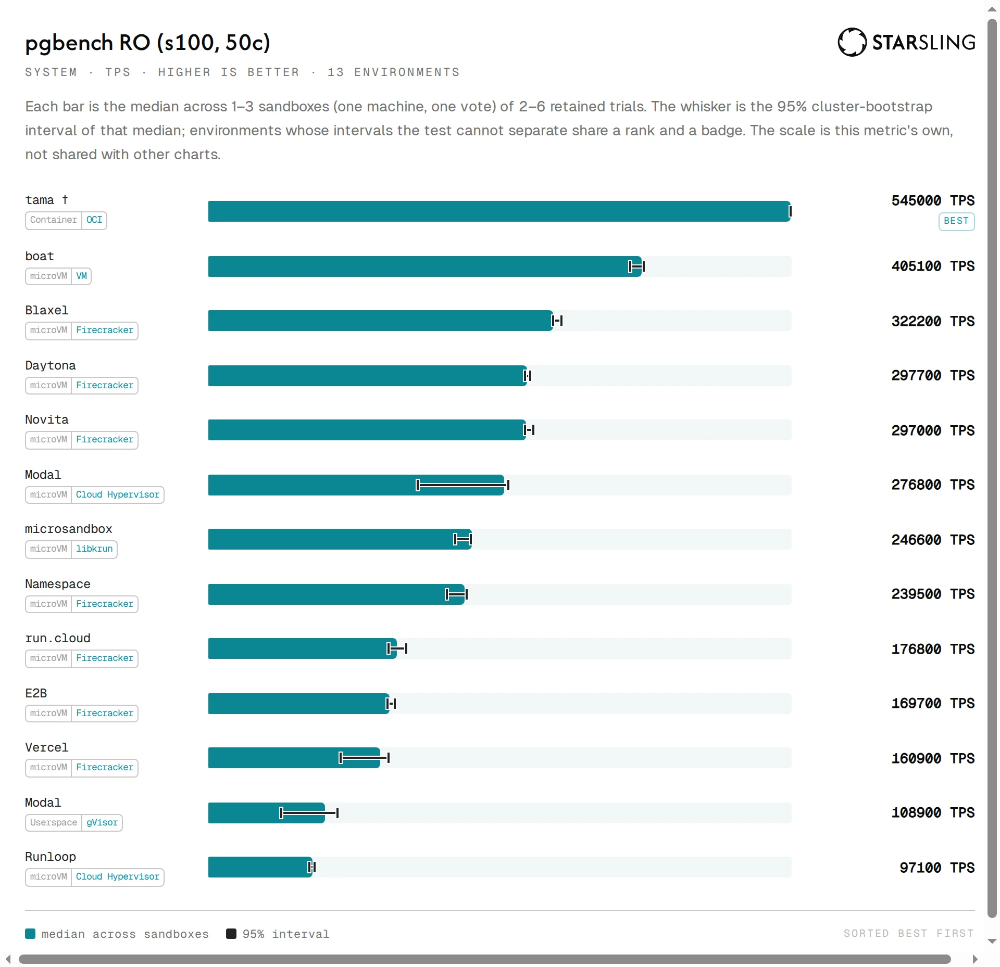

| Rank | Provider | pgbench RO (s100, 50c) (TPS) | 95% bootstrap interval | Sandboxes | Trials | Note |
| ---: | --- | ---: | ---: | ---: | ---: | --- |
| 1 | Blaxel | 323500 | 320700 – 332800 | 3 | 6 | — |
| 2 | tama | 311800 | 306700 – 484900 | 3 | 6 | too few sandboxes |
| 3 | Novita | 307100 | 302700 – 312500 | 3 | 6 | too few sandboxes |
| 4 | Daytona (VM) | 300700 | 295300 – 305500 | 3 | 6 | too few sandboxes |
| 5 | E2B | 248500 | 161600 – 257100 | 3 | 6 | too few sandboxes |
| 6 | Microsandbox Cloud | 230800 | 227800 – 243400 | 3 | 6 | too few sandboxes |
| 7 | Namespace | 229300 | 219000 – 241100 | 3 | 6 | too few sandboxes |
| 8 | Modal (VM) | 196900 | 195900 – 199200 | 3 | 6 | too few sandboxes |
| 9 | Vercel Sandbox | 161500 | 113400 – 166600 | 3 | 6 | too few sandboxes |
| 10 | run.cloud | 143000 | 142900 – 230500 | 3 | 6 | too few sandboxes |
| 11 | Runloop | 78420 | 77780 – 80000 | 3 | 6 | too few sandboxes |
| 12 | Modal (gVisor) | 13770 | 12830 – 14010 | 3 | 6 | too few sandboxes |

### pgbench RO latency (s100, 50c)

ms · lower is better

_Blaxel leads on median (lower is better); see notes for how ranks are decided._

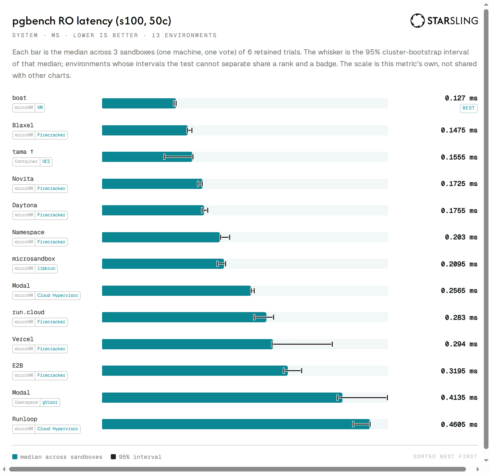

| Rank | Provider | pgbench RO latency (s100, 50c) (ms) | 95% bootstrap interval | Sandboxes | Trials | Note |
| ---: | --- | ---: | ---: | ---: | ---: | --- |
| 1 | Blaxel | 0.1545 | 0.1505 – 0.1565 | 3 | 6 | — |
| 2 | tama | 0.1615 | 0.1035 – 0.1645 | 3 | 6 | too few sandboxes |
| 3 | Novita | 0.163 | 0.16 – 0.1655 | 3 | 6 | too few sandboxes |
| 4 | Daytona (VM) | 0.1665 | 0.1635 – 0.1695 | 3 | 6 | too few sandboxes |
| 5 | E2B | 0.202 | 0.195 – 0.3095 | 3 | 6 | too few sandboxes |
| 6 | Microsandbox Cloud | 0.2165 | 0.2055 – 0.2195 | 3 | 6 | too few sandboxes |
| 7 | Namespace | 0.218 | 0.2075 – 0.2285 | 3 | 6 | too few sandboxes |
| 8 | Modal (VM) | 0.254 | 0.251 – 0.255 | 3 | 6 | too few sandboxes |
| 9 | Vercel Sandbox | 0.3095 | 0.3005 – 0.442 | 3 | 6 | too few sandboxes |
| 10 | run.cloud | 0.3495 | 0.217 – 0.35 | 3 | 6 | too few sandboxes |
| 11 | Runloop | 0.6525 | 0.6425 – 0.657 | 3 | 6 | too few sandboxes |
| 12 | Modal (gVisor) | 3.631 | 3.57 – 3.897 | 3 | 6 | too few sandboxes |

### pgbench RW (s100, 50c)

TPS · higher is better

_Novita leads · ~1.1× Namespace on median (higher is better)._

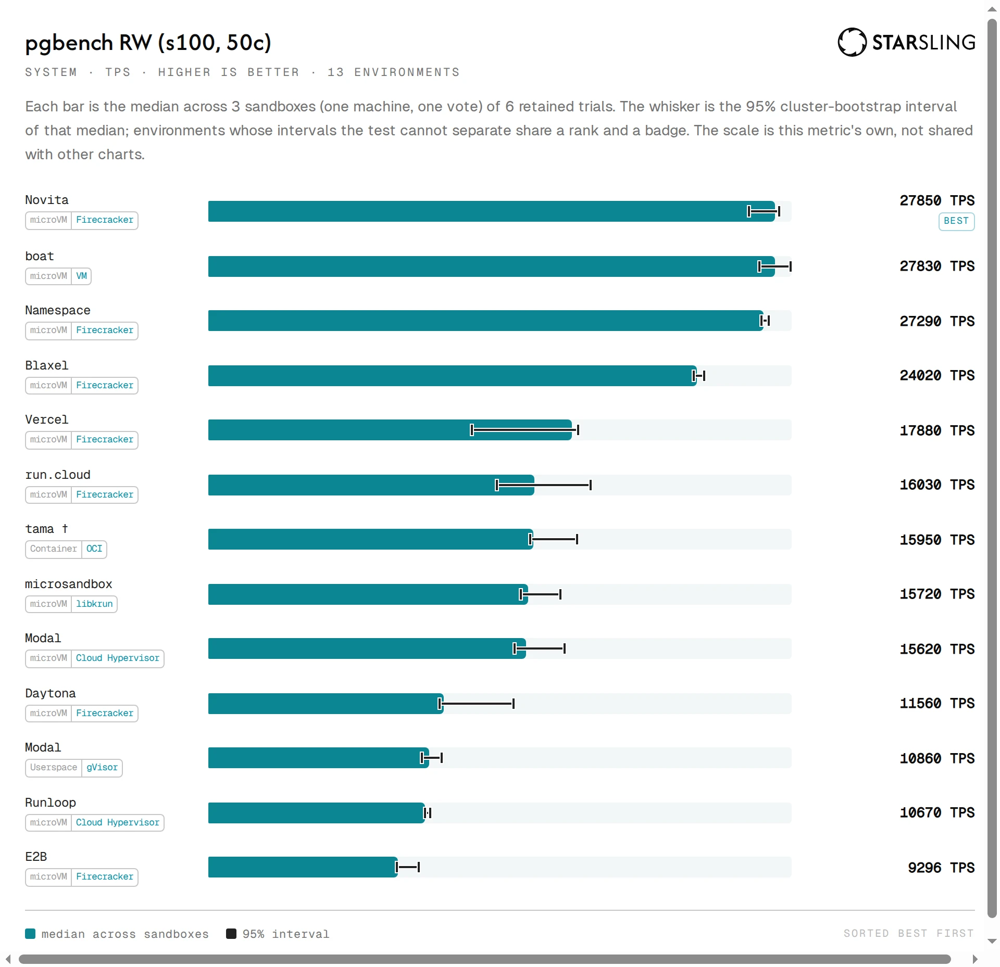

| Rank | Provider | pgbench RW (s100, 50c) (TPS) | 95% bootstrap interval | Sandboxes | Trials | Note |
| ---: | --- | ---: | ---: | ---: | ---: | --- |
| 1 | Novita | 28320 | 28000 – 29860 | 3 | 6 | — |
| 2 | Namespace | 25820 | 25500 – 27810 | 3 | 6 | too few sandboxes |
| 3 | Blaxel | 24270 | 24170 – 25480 | 3 | 6 | too few sandboxes |
| 4 | tama | 18180 | 17690 – 23570 | 3 | 6 | too few sandboxes |
| 5 | Vercel Sandbox | 16460 | 11490 – 17020 | 3 | 6 | too few sandboxes |
| 6 | Daytona (VM) | 16070 | 16040 – 16150 | 3 | 6 | too few sandboxes |
| 7 | Microsandbox Cloud | 15470 | 14250 – 16760 | 3 | 6 | too few sandboxes |
| 8 | Modal (VM) | 13400 | 12770 – 14150 | 3 | 6 | too few sandboxes |
| 9 | E2B | 12800 | 10100 – 13430 | 3 | 6 | too few sandboxes |
| 10 | run.cloud | 11130 | 10890 – 19620 | 3 | 6 | too few sandboxes |
| 11 | Runloop | 7845 | 7772 – 8076 | 3 | 6 | too few sandboxes |
| 12 | Modal (gVisor) | 2029 | 1958 – 2075 | 3 | 6 | too few sandboxes |

### pgbench RW latency (s100, 50c)

ms · lower is better

_Novita leads · Namespace is ~1.1× higher (lower is better)._

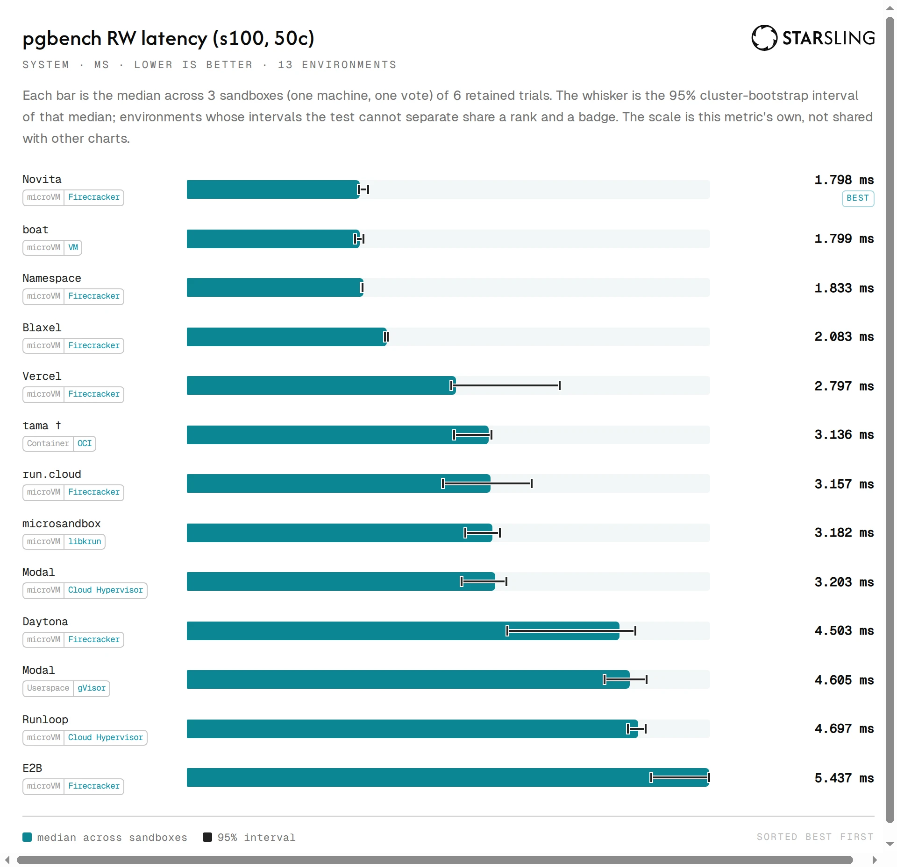

| Rank | Provider | pgbench RW latency (s100, 50c) (ms) | 95% bootstrap interval | Sandboxes | Trials | Note |
| ---: | --- | ---: | ---: | ---: | ---: | --- |
| 1 | Novita | 1.766 | 1.675 – 1.786 | 3 | 6 | — |
| 2 | Namespace | 1.937 | 1.798 – 1.964 | 3 | 6 | too few sandboxes |
| 3 | Blaxel | 2.061 | 1.964 – 2.069 | 3 | 6 | too few sandboxes |
| 4 | tama | 2.755 | 2.125 – 2.832 | 3 | 6 | too few sandboxes |
| 5 | Vercel Sandbox | 3.038 | 2.939 – 4.382 | 3 | 6 | too few sandboxes |
| 6 | Daytona (VM) | 3.114 | 3.095 – 3.122 | 3 | 6 | too few sandboxes |
| 7 | Microsandbox Cloud | 3.234 | 2.987 – 3.515 | 3 | 6 | too few sandboxes |
| 8 | Modal (VM) | 3.735 | 3.534 – 3.917 | 3 | 6 | too few sandboxes |
| 9 | E2B | 3.906 | 3.723 – 4.973 | 3 | 6 | too few sandboxes |
| 10 | run.cloud | 4.493 | 2.55 – 4.591 | 3 | 6 | too few sandboxes |
| 11 | Runloop | 6.493 | 6.226 – 6.534 | 3 | 6 | too few sandboxes |
| 12 | Modal (gVisor) | 24.65 | 24.09 – 25.54 | 3 | 6 | too few sandboxes |

### SQLite Speedtest

Seconds · lower is better

_Daytona (VM) leads · Blaxel is ~1.2× higher (lower is better)._

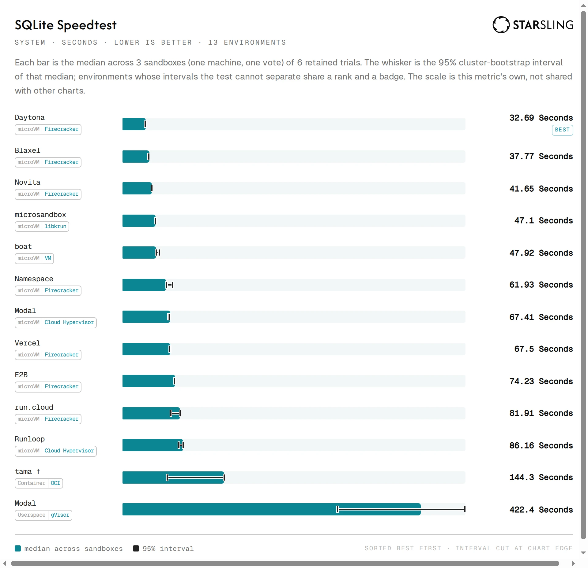

| Rank | Provider | SQLite Speedtest (Seconds) | 95% bootstrap interval | Sandboxes | Trials | Note |
| ---: | --- | ---: | ---: | ---: | ---: | --- |
| 1 | Daytona (VM) | 31.05 | 30.89 – 32.85 | 3 | 6 | — |
| 2 | Blaxel | 37.01 | 36.89 – 37.2 | 3 | 6 | too few sandboxes |
| 3 | Novita | 40.98 | 39.11 – 42.04 | 3 | 6 | too few sandboxes |
| 4 | Microsandbox Cloud | 47.77 | 46.57 – 47.79 | 3 | 6 | too few sandboxes |
| 5 | Namespace | 61.21 | 46.89 – 84.56 | 3 | 6 | too few sandboxes |
| 6 | E2B | 61.63 | 56.6 – 66.62 | 3 | 6 | too few sandboxes |
| 7 | Modal (VM) | 64.32 | 62.66 – 64.73 | 3 | 6 | too few sandboxes |
| 8 | run.cloud | 66.43 | 61.51 – 81.65 | 3 | 6 | too few sandboxes |
| 9 | Vercel Sandbox | 69.43 | 67.98 – 69.48 | 3 | 6 | too few sandboxes |
| 10 | Runloop | 108.7 | 108.2 – 111.6 | 3 | 6 | too few sandboxes |
| 11 | tama | 138 | 60.85 – 139.4 | 3 | 6 | too few sandboxes |
| 12 | Modal (gVisor) | 415 | 172.7 – 417.9 | 3 | 6 | too few sandboxes |

## economics

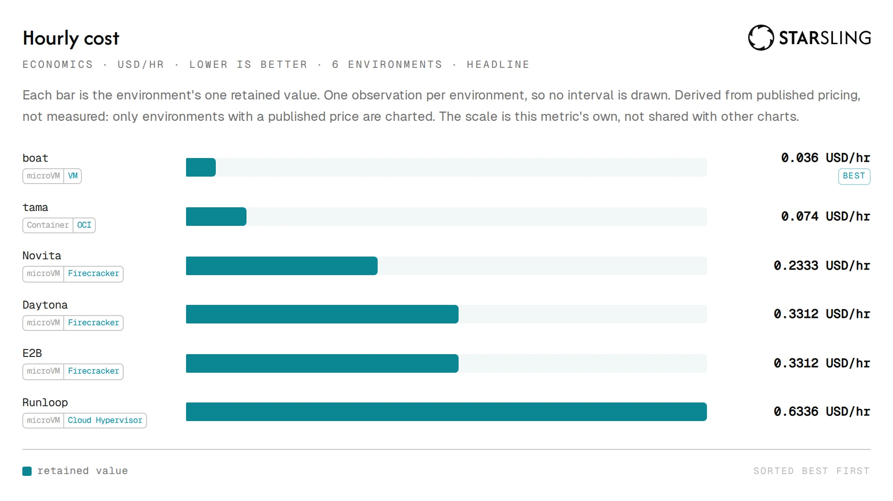

### Hourly cost _(headline)_

USD/hr · lower is better

_tama is cheapest · Novita is ~3.2× higher (lower is better)._

| Rank | Provider | Hourly cost (USD/hr) | 95% bootstrap interval | Sandboxes | Trials | Note |
| ---: | --- | ---: | ---: | ---: | ---: | --- |
| 1 | tama | 0.074 | — | 1 | 1 | — |
| 2 | Novita | 0.2333 | — | 1 | 1 | — |
| 3 | Daytona (VM) | 0.3312 | — | 1 | 1 | — |
| 3 | E2B | 0.3312 | — | 1 | 1 | equal values |
| 5 | Runloop | 0.6336 | — | 1 | 1 | — |

## Coverage gaps

61 uncovered results across 9 providers (Blaxel 4, E2B 2, Microsandbox Cloud 2, Modal (gVisor) 5, Namespace 2, run.cloud 14, Runloop 2, tama 28, Vercel Sandbox 2). A gap is a missing result — the provider **failing to cover** that workload — never a tie or a zero.

Full coverage table

| Provider | Benchmark | Outcome | Detail |
| --- | --- | --- | --- |
| Blaxel | realworld-openclaw | **failed** | PTS ran but every trial failed for 2 of 6 declared metrics: realworld_openclaw_task_test_types (realworld-openclaw/pts_realworld-openclaw.xml), realworld_openclaw_task_typecheck (realworld-openclaw/pts_realworld-openclaw.xml) — attempted, no value recorded |
| Blaxel | realworld-openclaw | **failed** | Partial publication withheld unverified measurements: realworld_openclaw_task_typecheck, realworld_openclaw_task_test_types |
| Blaxel | realworld-openclaw | **failed** | PTS ran but every trial failed for 1 of 6 declared metrics: realworld_openclaw_task_test_types (realworld-openclaw/pts_realworld-openclaw.xml) — attempted, no value recorded |
| Blaxel | realworld-openclaw | **failed** | Partial publication withheld unverified measurements: realworld_openclaw_task_test_types |
| E2B | realworld-mastra | **failed** | PTS ran but every trial failed for 1 of 5 declared metrics: realworld_mastra_task_test_core (realworld-mastra/pts_realworld-mastra.xml) — attempted, no value recorded |
| E2B | realworld-mastra | **failed** | Partial publication withheld unverified measurements: realworld_mastra_task_test_core |
| Microsandbox Cloud | realworld-mastra | **failed** | PTS ran but every trial failed for 1 of 5 declared metrics: realworld_mastra_task_test_core (realworld-mastra/pts_realworld-mastra.xml) — attempted, no value recorded |
| Microsandbox Cloud | realworld-mastra | **failed** | Partial publication withheld unverified measurements: realworld_mastra_task_test_core |
| Modal (gVisor) | realworld-mastra | **failed** | PTS ran but every trial failed for 1 of 5 declared metrics: realworld_mastra_task_test_core (realworld-mastra/pts_realworld-mastra.xml) — attempted, no value recorded |
| Modal (gVisor) | realworld-mastra | **failed** | Partial publication withheld unverified measurements: realworld_mastra_task_test_core |
| Modal (gVisor) | realworld-openclaw | **failed** | computesdk background launch failed: Channel has been shut down |
| Modal (gVisor) | realworld-openclaw | **failed** | Partial publication withheld unverified measurements: realworld_openclaw_task_git_clone, realworld_openclaw_task_cold_install, realworld_openclaw_task_lint_oxlint, realworld_openclaw_task_lint_extensions_all, realworld_openclaw_task_typecheck, realworld_openclaw_task_test_types |
| Modal (gVisor) | realworld-openclaw | **failed** | computesdk exec failed: Channel has been shut down |
| Namespace | realworld-mastra | **failed** | PTS ran but every trial failed for 1 of 5 declared metrics: realworld_mastra_task_test_core (realworld-mastra/pts_realworld-mastra.xml) — attempted, no value recorded |
| Namespace | realworld-mastra | **failed** | Partial publication withheld unverified measurements: realworld_mastra_task_test_core |
| run.cloud | realworld-mastra | **failed** | PTS ran but every trial failed for 1 of 5 declared metrics: realworld_mastra_task_test_core (realworld-mastra/pts_realworld-mastra.xml) — attempted, no value recorded |
| run.cloud | realworld-mastra | **failed** | Partial publication withheld unverified measurements: realworld_mastra_task_test_core |
| run.cloud | realworld-openclaw | **failed** | Failed to create sandbox: vendor concurrent sandbox limit refused create for runcloud while admission declared 26 sandboxes and this batch freezes maxConcurrency=26; reconcile BENCH_ACCOUNT_CAPACITY before retrying: run.cloud API 429: concurrent sandbox resource limit reached (concurrent sandbox resource limit reached) |
| run.cloud | realworld-openclaw | **failed** | Partial publication withheld unverified measurements: realworld_openclaw_task_git_clone, realworld_openclaw_task_cold_install, realworld_openclaw_task_lint_oxlint, realworld_openclaw_task_lint_extensions_all, realworld_openclaw_task_typecheck, realworld_openclaw_task_test_types |
| run.cloud | realworld-openclaw | **failed** | runcloud-realworld-openclaw-r10: vendor concurrent sandbox limit refused create for runcloud while admission declared 26 sandboxes and this batch freezes maxConcurrency=26; reconcile BENCH_ACCOUNT_CAPACITY before retrying: run.cloud API 429: concurrent sandbox resource limit reached (concurrent sandbox resource limit reached) |
| run.cloud | realworld-openclaw | **failed** | runcloud-realworld-openclaw-r11: vendor concurrent sandbox limit refused create for runcloud while admission declared 26 sandboxes and this batch freezes maxConcurrency=26; reconcile BENCH_ACCOUNT_CAPACITY before retrying: run.cloud API 429: concurrent sandbox resource limit reached (concurrent sandbox resource limit reached) |
| run.cloud | realworld-openclaw | **failed** | runcloud-realworld-openclaw-r2: vendor concurrent sandbox limit refused create for runcloud while admission declared 26 sandboxes and this batch freezes maxConcurrency=26; reconcile BENCH_ACCOUNT_CAPACITY before retrying: run.cloud API 429: concurrent sandbox resource limit reached (concurrent sandbox resource limit reached) |
| run.cloud | realworld-openclaw | **failed** | runcloud-realworld-openclaw-r3: vendor concurrent sandbox limit refused create for runcloud while admission declared 26 sandboxes and this batch freezes maxConcurrency=26; reconcile BENCH_ACCOUNT_CAPACITY before retrying: run.cloud API 429: concurrent sandbox resource limit reached (concurrent sandbox resource limit reached) |
| run.cloud | realworld-openclaw | **failed** | runcloud-realworld-openclaw-r4: vendor concurrent sandbox limit refused create for runcloud while admission declared 26 sandboxes and this batch freezes maxConcurrency=26; reconcile BENCH_ACCOUNT_CAPACITY before retrying: run.cloud API 429: concurrent sandbox resource limit reached (concurrent sandbox resource limit reached) |
| run.cloud | realworld-openclaw | **failed** | runcloud-realworld-openclaw-r5: vendor concurrent sandbox limit refused create for runcloud while admission declared 26 sandboxes and this batch freezes maxConcurrency=26; reconcile BENCH_ACCOUNT_CAPACITY before retrying: run.cloud API 429: concurrent sandbox resource limit reached (concurrent sandbox resource limit reached) |
| run.cloud | realworld-openclaw | **failed** | runcloud-realworld-openclaw-r6: vendor concurrent sandbox limit refused create for runcloud while admission declared 26 sandboxes and this batch freezes maxConcurrency=26; reconcile BENCH_ACCOUNT_CAPACITY before retrying: run.cloud API 429: concurrent sandbox resource limit reached (concurrent sandbox resource limit reached) |
| run.cloud | realworld-openclaw | **failed** | runcloud-realworld-openclaw-r7: vendor concurrent sandbox limit refused create for runcloud while admission declared 26 sandboxes and this batch freezes maxConcurrency=26; reconcile BENCH_ACCOUNT_CAPACITY before retrying: run.cloud API 429: concurrent sandbox resource limit reached (concurrent sandbox resource limit reached) |
| run.cloud | realworld-openclaw | **failed** | runcloud-realworld-openclaw-r8: vendor concurrent sandbox limit refused create for runcloud while admission declared 26 sandboxes and this batch freezes maxConcurrency=26; reconcile BENCH_ACCOUNT_CAPACITY before retrying: run.cloud API 429: concurrent sandbox resource limit reached (concurrent sandbox resource limit reached) |
| run.cloud | realworld-openclaw | **failed** | runcloud-realworld-openclaw-r9: vendor concurrent sandbox limit refused create for runcloud while admission declared 26 sandboxes and this batch freezes maxConcurrency=26; reconcile BENCH_ACCOUNT_CAPACITY before retrying: run.cloud API 429: concurrent sandbox resource limit reached (concurrent sandbox resource limit reached) |
| Runloop | realworld-mastra | **failed** | PTS ran but every trial failed for 1 of 5 declared metrics: realworld_mastra_task_test_core (realworld-mastra/pts_realworld-mastra.xml) — attempted, no value recorded |
| Runloop | realworld-mastra | **failed** | Partial publication withheld unverified measurements: realworld_mastra_task_test_core |
| tama | network | **failed** | Failed to create sandbox: tama new bench-2c8326a5-5307-4d80-852e-9d1795d57673 --ttl 0 --json --image ghcr.io/starslingdev/sandbox-benchmarks-toolchain:v8 --cpu 4 --memory 8192: exit 1; tama: bench-2c8326a5-5307-4d80-852e-9d1795d57673 failed to provision; inspect it in the console; provisioning: status=failed; process exit 1 |
| tama | network | **failed** | Partial publication withheld unverified measurements: iperf_server_address_localhost_server_port_5201_duration_10_seconds_test_tcp_parallel_1, iperf_server_address_localhost_server_port_5201_duration_10_seconds_test_tcp_parallel_10, iperf_server_address_localhost_server_port_5201_duration_10_seconds_test_udp_10000mbit_objective_parallel_1, iperf_wan_direction_download, iperf_wan_direction_upload |
| tama | network | **failed** | Failed to create sandbox: tama new bench-c48779e3-a3bc-4027-9b33-57243b3c942f --ttl 0 --json --image ghcr.io/starslingdev/sandbox-benchmarks-toolchain:v8 --cpu 4 --memory 8192: exit 1; tama: bench-c48779e3-a3bc-4027-9b33-57243b3c942f failed to provision; inspect it in the console; provisioning: status=failed; process exit 1 |
| tama | network | **failed** | Failed to create sandbox: tama new bench-1ffcdba9-78ce-4503-aa98-8a5163f71e16 --ttl 0 --json --image ghcr.io/starslingdev/sandbox-benchmarks-toolchain:v8 --cpu 4 --memory 8192: exit 1; tama: bench-1ffcdba9-78ce-4503-aa98-8a5163f71e16 failed to provision; inspect it in the console; provisioning: status=failed; process exit 1 |
| tama | realworld-better-auth | **failed** | Failed to create sandbox: tama new bench-6d813156-3ab5-4c76-be83-ce97e7d30374 --ttl 0 --json --image ghcr.io/starslingdev/sandbox-benchmarks-toolchain:v8 --cpu 4 --memory 8192: exit 1; tama: bench-6d813156-3ab5-4c76-be83-ce97e7d30374 failed to provision; inspect it in the console; provisioning: status=failed; process exit 1 |
| tama | realworld-better-auth | **failed** | Partial publication withheld unverified measurements: realworld_better_auth_task_git_clone, realworld_better_auth_task_cold_install, realworld_better_auth_task_lint_biome, realworld_better_auth_task_lint_deps_knip, realworld_better_auth_task_lint_format, realworld_better_auth_task_lint_spell, realworld_better_auth_task_lint_types, realworld_better_auth_task_lint_packages, realworld_better_auth_task_typecheck, realworld_better_auth_task_build |
| tama | realworld-better-auth | **failed** | Failed to create sandbox: tama new bench-44bebe87-c40e-4136-9393-72feca1a33d0 --ttl 0 --json --image ghcr.io/starslingdev/sandbox-benchmarks-toolchain:v8 --cpu 4 --memory 8192: exit 1; tama: bench-44bebe87-c40e-4136-9393-72feca1a33d0 failed to provision; inspect it in the console; provisioning: status=failed; process exit 1 |
| tama | realworld-better-auth | **failed** | Failed to create sandbox: tama new bench-c8be1ac8-6fca-4ee7-8f4e-923b75608324 --ttl 0 --json --image ghcr.io/starslingdev/sandbox-benchmarks-toolchain:v8 --cpu 4 --memory 8192: exit 1; tama: bench-c8be1ac8-6fca-4ee7-8f4e-923b75608324 failed to provision; inspect it in the console; provisioning: status=failed; process exit 1 |
| tama | realworld-better-auth | **failed** | Failed to create sandbox: tama new bench-5bba65e0-a8fe-4a6b-848d-46d3ef0ccf28 --ttl 0 --json --image ghcr.io/starslingdev/sandbox-benchmarks-toolchain:v8 --cpu 4 --memory 8192: exit 1; tama: bench-5bba65e0-a8fe-4a6b-848d-46d3ef0ccf28 failed to provision; inspect it in the console; provisioning: status=failed; process exit 1 |
| tama | realworld-better-auth | **failed** | Failed to create sandbox: tama new bench-950b75c8-1519-4b19-ab3b-667b147aa3ab --ttl 0 --json --image ghcr.io/starslingdev/sandbox-benchmarks-toolchain:v8 --cpu 4 --memory 8192: exit 1; tama: bench-950b75c8-1519-4b19-ab3b-667b147aa3ab failed to provision; inspect it in the console; provisioning: status=failed; process exit 1 |
| tama | realworld-better-auth | **failed** | Failed to create sandbox: tama new bench-21680df1-15d5-4d41-84ec-0e85fb299379 --ttl 0 --json --image ghcr.io/starslingdev/sandbox-benchmarks-toolchain:v8 --cpu 4 --memory 8192: exit 1; tama: bench-21680df1-15d5-4d41-84ec-0e85fb299379 failed to provision; inspect it in the console; provisioning: status=failed; process exit 1 |
| tama | realworld-better-auth | **failed** | Failed to create sandbox: tama new bench-c741d821-20ec-40ee-a2e4-d2045e1a65d8 --ttl 0 --json --image ghcr.io/starslingdev/sandbox-benchmarks-toolchain:v8 --cpu 4 --memory 8192: exit 1; tama: bench-c741d821-20ec-40ee-a2e4-d2045e1a65d8 failed to provision; inspect it in the console; provisioning: status=failed; process exit 1 |
| tama | realworld-better-auth | **failed** | Failed to create sandbox: tama new bench-bb7e1ba4-f824-4684-b87b-65ea0adce92e --ttl 0 --json --image ghcr.io/starslingdev/sandbox-benchmarks-toolchain:v8 --cpu 4 --memory 8192: exit 1; tama: bench-bb7e1ba4-f824-4684-b87b-65ea0adce92e failed to provision; inspect it in the console; provisioning: status=failed; process exit 1 |
| tama | realworld-better-auth | **failed** | Failed to create sandbox: tama new bench-b939e5fb-6b1d-4198-84eb-b91bdcca1398 --ttl 0 --json --image ghcr.io/starslingdev/sandbox-benchmarks-toolchain:v8 --cpu 4 --memory 8192: exit 1; tama: bench-b939e5fb-6b1d-4198-84eb-b91bdcca1398 failed to provision; inspect it in the console; provisioning: status=failed; process exit 1 |
| tama | realworld-better-auth | **failed** | Failed to create sandbox: tama new bench-9e17ce2d-2256-44b3-9e6f-ccf071384d64 --ttl 0 --json --image ghcr.io/starslingdev/sandbox-benchmarks-toolchain:v8 --cpu 4 --memory 8192: exit 1; tama: bench-9e17ce2d-2256-44b3-9e6f-ccf071384d64 failed to provision; inspect it in the console; provisioning: status=failed; process exit 1 |
| tama | realworld-openclaw | **failed** | Failed to create sandbox: tama new bench-e004a474-4a0f-4859-aef7-f73fd8a592bd --ttl 0 --json --image ghcr.io/starslingdev/sandbox-benchmarks-toolchain:v8 --cpu 4 --memory 8192: exit 1; tama: bench-e004a474-4a0f-4859-aef7-f73fd8a592bd failed to provision; inspect it in the console; provisioning: status=failed; process exit 1 |
| tama | realworld-openclaw | **failed** | Partial publication withheld unverified measurements: realworld_openclaw_task_git_clone, realworld_openclaw_task_cold_install, realworld_openclaw_task_lint_oxlint, realworld_openclaw_task_lint_extensions_all, realworld_openclaw_task_typecheck, realworld_openclaw_task_test_types |
| tama | realworld-openclaw | **failed** | Failed to create sandbox: tama new bench-1a306104-95b3-46f3-b19b-6b6527544dc2 --ttl 0 --json --image ghcr.io/starslingdev/sandbox-benchmarks-toolchain:v8 --cpu 4 --memory 8192: exit 1; tama: bench-1a306104-95b3-46f3-b19b-6b6527544dc2 failed to provision; inspect it in the console; provisioning: status=failed; process exit 1 |
| tama | realworld-openclaw | **failed** | Failed to create sandbox: tama new bench-fd924751-6cbf-4d89-b104-e467ef0c4cfa --ttl 0 --json --image ghcr.io/starslingdev/sandbox-benchmarks-toolchain:v8 --cpu 4 --memory 8192: exit 1; tama: bench-fd924751-6cbf-4d89-b104-e467ef0c4cfa failed to provision; inspect it in the console; provisioning: status=failed; process exit 1 |
| tama | realworld-openclaw | **failed** | Failed to create sandbox: tama new bench-9cb75851-83ff-41de-a816-8c2343b7923e --ttl 0 --json --image ghcr.io/starslingdev/sandbox-benchmarks-toolchain:v8 --cpu 4 --memory 8192: exit 1; tama: bench-9cb75851-83ff-41de-a816-8c2343b7923e failed to provision; inspect it in the console; provisioning: status=failed; process exit 1 |
| tama | realworld-openclaw | **failed** | Failed to create sandbox: tama new bench-cd3cf11e-56e2-40b2-bf4b-3ba885d4084f --ttl 0 --json --image ghcr.io/starslingdev/sandbox-benchmarks-toolchain:v8 --cpu 4 --memory 8192: exit 1; tama: bench-cd3cf11e-56e2-40b2-bf4b-3ba885d4084f failed to provision; inspect it in the console; provisioning: status=failed; process exit 1 |
| tama | realworld-openclaw | **failed** | Failed to create sandbox: tama new bench-2c77892f-e51c-494f-957d-b3dca4ef42ad --ttl 0 --json --image ghcr.io/starslingdev/sandbox-benchmarks-toolchain:v8 --cpu 4 --memory 8192: exit 1; tama: bench-2c77892f-e51c-494f-957d-b3dca4ef42ad failed to provision; inspect it in the console; provisioning: status=failed; process exit 1 |
| tama | realworld-openclaw | **failed** | Failed to create sandbox: tama new bench-ed96a73d-71f7-45f4-85bb-c08f095e9bb2 --ttl 0 --json --image ghcr.io/starslingdev/sandbox-benchmarks-toolchain:v8 --cpu 4 --memory 8192: exit 1; tama: bench-ed96a73d-71f7-45f4-85bb-c08f095e9bb2 failed to provision; inspect it in the console; provisioning: status=failed; process exit 1 |
| tama | realworld-openclaw | **failed** | Failed to create sandbox: tama new bench-46336728-f7f1-47b9-ba9e-7c80d143c80e --ttl 0 --json --image ghcr.io/starslingdev/sandbox-benchmarks-toolchain:v8 --cpu 4 --memory 8192: exit 1; tama: bench-46336728-f7f1-47b9-ba9e-7c80d143c80e failed to provision; inspect it in the console; provisioning: status=failed; process exit 1 |
| tama | realworld-openclaw | **failed** | Failed to create sandbox: tama new bench-e4b1f4d9-347c-48fe-9888-6844638c3540 --ttl 0 --json --image ghcr.io/starslingdev/sandbox-benchmarks-toolchain:v8 --cpu 4 --memory 8192: exit 1; tama: bench-e4b1f4d9-347c-48fe-9888-6844638c3540 failed to provision; inspect it in the console; provisioning: status=failed; process exit 1 |
| tama | realworld-openclaw | **failed** | Failed to create sandbox: tama new bench-5b89ccb9-39c6-406b-a8c2-629ee3597f04 --ttl 0 --json --image ghcr.io/starslingdev/sandbox-benchmarks-toolchain:v8 --cpu 4 --memory 8192: exit 1; tama: bench-5b89ccb9-39c6-406b-a8c2-629ee3597f04 failed to provision; inspect it in the console; provisioning: status=failed; process exit 1 |
| tama | realworld-openclaw | **failed** | Failed to create sandbox: tama new bench-af5b31fa-85ff-4fdb-9f15-b17417be9a1e --ttl 0 --json --image ghcr.io/starslingdev/sandbox-benchmarks-toolchain:v8 --cpu 4 --memory 8192: exit 1; tama: bench-af5b31fa-85ff-4fdb-9f15-b17417be9a1e failed to provision; inspect it in the console; provisioning: status=failed; process exit 1 |
| tama | realworld-openclaw | **failed** | Failed to create sandbox: tama new bench-0c152bd2-f5a0-446c-afdf-3df47502627e --ttl 0 --json --image ghcr.io/starslingdev/sandbox-benchmarks-toolchain:v8 --cpu 4 --memory 8192: exit 1; tama: bench-0c152bd2-f5a0-446c-afdf-3df47502627e failed to provision; inspect it in the console; provisioning: status=failed; process exit 1 |
| Vercel Sandbox | realworld-mastra | **failed** | PTS ran but every trial failed for 1 of 5 declared metrics: realworld_mastra_task_test_core (realworld-mastra/pts_realworld-mastra.xml) — attempted, no value recorded |
| Vercel Sandbox | realworld-mastra | **failed** | Partial publication withheld unverified measurements: realworld_mastra_task_test_core |

**failed** — the benchmark was attempted and broke: it threw, timed out, or died with the sandbox.
Unlike a skip, this is a reliability fact about the provider, not a decision made on its behalf.

How rankings are decided

The value is the median of the PER-SANDBOX medians — one machine, one vote — not the median of all
trials pooled together. Pooling would weight each machine by how many trials it ran, and the harness
chooses that count adaptively by watching the variance, so the noisiest machine would carry the most
weight in the published number. The median, not the mean, because a single stalled pass drags a mean
far more than it moves a median.

The interval is a cluster bootstrap of that same statistic (10,000 resamples, seeded from the Run id
so the table is reproducible byte-for-byte): whole sandboxes are resampled with replacement, keeping
each machine's trials intact.

**The interval is labelled 95%, and at these sandbox counts it does not achieve 95%.** Coverage is a
property of how many machines were measured, not of the estimator: simulated at ≈77% for 3 sandboxes,
≈92% at 6, and ≈95% at 20. No percentile bootstrap reaches nominal coverage at 3 clusters. Read a
3-sandbox interval as a resampling envelope over three machines, **not** as a calibrated frequentist
confidence interval. Within-sandbox trials may also be dependent on host scheduling.

Rows are separated only when Mann-Whitney U (two-sided, α = 0.05, enumerated exactly
over the permutation null rather than approximated) finds evidence of stochastic ordering — at these
sample sizes the normal approximation can report a p the exact test cannot actually produce. Where
replicate sandboxes exist that test runs on the PER-SANDBOX MEDIANS, so whole machines are the
exchangeable unit; testing pooled trials instead would treat repeated measurements of one machine as
independent evidence about the provider. KS is reported separately for distribution *shape* and does
not drive the ranking.

**A Note cell always says why a rank is shared, and the reasons are not interchangeable.**
`tied` — the test could have separated those providers and did not, so a faster median earned
inside the noise is not a faster provider. This is the only note that claims two providers are
statistically indistinguishable.
`equal medians` / `equal values` — arithmetic, not a finding: the ranking sorts on the value,
and two identical values have no order between them. It says nothing about the distributions.

Each metric is measured on several independent sandboxes (the **Sandboxes** column), and within each
sandbox the benchmark runs several trials (**Trials**). Trials capture within-machine noise —
neighbours, host contention, virtualization; sandboxes capture the machine-to-machine variation a
user actually experiences when they start a new environment. The ranking and its interval both treat
the SANDBOX as the unit, so more trials on the same machine never make a row look better-evidenced.
Under adaptive trial counts a large **Trials** figure is in fact a sign the machines were unstable
(the harness kept re-running), not that the estimate is precise.

At the sandbox counts this suite produces, a non-significant result means *not enough evidence to
separate*, never *the providers are equal*.

`too few sandboxes` is the extreme of that: the deciding test's best attainable p already exceeds α,
so it could not have separated the rows at any effect size, however far apart their values are.
The floor is a property of the design — here 3 v 3 sandboxes floors at p ≈ 0.10; 3 v 3 sandboxes floors at p ≈ 0.40; 3 v 3 sandboxes floors at p ≈ 1.0.
At three sandboxes a side the floor is 2/C(6,3) = 0.1, which is above α, so **no** three-sandbox
comparison in this table can ever be declared separated. That is a fact about the replicate count,
not about the providers. One shape can appear more than once above with different floors: ties
among a provider's per-sandbox medians raise the floor further (to 1.0 when every median in the
comparison is equal), so the count alone does not determine it.
Such rows are ranked on their observed medians and are **not** claimed to be tied — read the gap
between the values, and treat the p-value as unable to settle them either way. Where such a row
nevertheless shares the rank above it, the note reads `equal medians`: the two values are simply
identical, which is the ranking having nothing to order them by — never a finding that the
providers are alike.

### Pairwise tests (vs. row above)

`p vs. above` is the SANDBOX-LEVEL test that decides the rank wherever replicate sandboxes exist —
Mann-Whitney U on each provider's per-sandbox medians, whole machines as the exchangeable unit.
(Only where a provider ran in a single sandbox does it fall back to Mann-Whitney on pooled trials,
which treats repeated measurements of one machine as independent and is anti-conservative.)
`p (KS)` is Kolmogorov-Smirnov on distribution
*shape* — it does not drive the ranking. A tied Mann-Whitney beside a small KS often means the
same typical speed with different behaviour (e.g. bimodal stalls).
These are unadjusted, exploratory per-comparison p-values; no family-wise or false-discovery-rate
correction is applied across providers or metrics.

| Dimension | Metric | Provider | p vs. above | p (KS) |
| --- | --- | --- | ---: | ---: |
| realworld | Mastra: cold install | Daytona (VM) | — | — |
| realworld | Mastra: cold install | Namespace | 0.10 (tied) | 0.066 |
| realworld | Mastra: cold install | Novita | 0.012 | 0.019 |
| realworld | Mastra: cold install | Blaxel | 1.0 (tied) | 0.066 |
| realworld | Mastra: cold install | Microsandbox Cloud | 0.80 (tied) | 0.066 |
| realworld | Mastra: cold install | run.cloud | 0.32 (tied) | 0.066 |
| realworld | Mastra: cold install | Modal (VM) | 0.84 (tied) | 0.066 |
| realworld | Mastra: cold install | tama | 0.0045 | <0.001 |
| realworld | Mastra: cold install | E2B | 0.59 (tied) | 0.43 |
| realworld | Mastra: cold install | Vercel Sandbox | 0.014 | 0.019 |
| realworld | Mastra: cold install | Modal (gVisor) | <0.001 | <0.001 |
| realworld | Mastra: cold install | Runloop | 0.13 (tied) | 0.19 |
| realworld | Better-Auth: build | Daytona (VM) | — | — |
| realworld | Better-Auth: build | Microsandbox Cloud | <0.001 | <0.001 |
| realworld | Better-Auth: build | Namespace | 0.66 (tied) | 0.79 |
| realworld | Better-Auth: build | Novita | <0.001 | <0.001 |
| realworld | Better-Auth: build | run.cloud | 0.84 (tied) | 0.19 |
| realworld | Better-Auth: build | tama | 0.79 (tied) | 0.42 |
| realworld | Better-Auth: build | Modal (VM) | 0.044 | 0.043 |
| realworld | Better-Auth: build | E2B | <0.001 | <0.001 |
| realworld | Better-Auth: build | Blaxel | 0.039 | 0.066 |
| realworld | Better-Auth: build | Vercel Sandbox | <0.001 | <0.001 |
| realworld | Better-Auth: build | Modal (gVisor) | 0.0056 | <0.001 |
| realworld | Better-Auth: build | Runloop | <0.001 | <0.001 |
| realworld | Better-Auth: cold install | Namespace | — | — |
| realworld | Better-Auth: cold install | Daytona (VM) | 0.0011 | <0.001 |
| realworld | Better-Auth: cold install | Blaxel | 0.014 | 0.066 |
| realworld | Better-Auth: cold install | Microsandbox Cloud | 0.67 (tied) | 0.066 |
| realworld | Better-Auth: cold install | run.cloud | 0.63 (tied) | 0.066 |
| realworld | Better-Auth: cold install | Novita | 0.98 (tied) | 0.066 |
| realworld | Better-Auth: cold install | tama | 0.022 | 0.021 |
| realworld | Better-Auth: cold install | E2B | 0.55 (tied) | 0.26 |
| realworld | Better-Auth: cold install | Modal (VM) | 0.024 | 0.019 |
| realworld | Better-Auth: cold install | Vercel Sandbox | <0.001 | 0.0046 |
| realworld | Better-Auth: cold install | Modal (gVisor) | <0.001 | <0.001 |
| realworld | Better-Auth: cold install | Runloop | 0.38 (tied) | 0.43 |
| realworld | Better-Auth: git clone | Namespace | — | — |
| realworld | Better-Auth: git clone | Modal (VM) | <0.001 | <0.001 |
| realworld | Better-Auth: git clone | Blaxel | 0.76 (tied) | 0.43 |
| realworld | Better-Auth: git clone | Vercel Sandbox | 0.56 (tied) | 0.066 |
| realworld | Better-Auth: git clone | Microsandbox Cloud | <0.001 | <0.001 |
| realworld | Better-Auth: git clone | E2B | <0.001 | <0.001 |
| realworld | Better-Auth: git clone | Daytona (VM) | 0.44 (tied) | 0.43 |
| realworld | Better-Auth: git clone | tama | 0.92 (tied) | 0.62 |
| realworld | Better-Auth: git clone | run.cloud | 0.26 (tied) | 0.42 |
| realworld | Better-Auth: git clone | Novita | 0.22 (tied) | 0.19 |
| realworld | Better-Auth: git clone | Modal (gVisor) | <0.001 | <0.001 |
| realworld | Better-Auth: git clone | Runloop | 0.024 | 0.019 |
| realworld | Better-Auth: lint (Biome) | Daytona (VM) | — | — |
| realworld | Better-Auth: lint (Biome) | Namespace | 0.58 (tied) | 0.43 |
| realworld | Better-Auth: lint (Biome) | Microsandbox Cloud | <0.001 | <0.001 |
| realworld | Better-Auth: lint (Biome) | Novita | 0.16 (tied) | 0.19 |
| realworld | Better-Auth: lint (Biome) | run.cloud | 0.24 (tied) | 0.066 |
| realworld | Better-Auth: lint (Biome) | Modal (VM) | 0.51 (tied) | 0.019 |
| realworld | Better-Auth: lint (Biome) | Vercel Sandbox | <0.001 | <0.001 |
| realworld | Better-Auth: lint (Biome) | Blaxel | 0.59 (tied) | 0.43 |
| realworld | Better-Auth: lint (Biome) | E2B | 0.68 (tied) | 0.43 |
| realworld | Better-Auth: lint (Biome) | tama | 0.79 (tied) | 0.62 |
| realworld | Better-Auth: lint (Biome) | Runloop | 0.088 (tied) | 0.083 |
| realworld | Better-Auth: lint (Biome) | Modal (gVisor) | 0.20 (tied) | 0.19 |
| realworld | Better-Auth: lint deps (Knip) | Daytona (VM) | — | — |
| realworld | Better-Auth: lint deps (Knip) | Namespace | 0.089 (tied) | 0.066 |
| realworld | Better-Auth: lint deps (Knip) | Microsandbox Cloud | 0.32 (tied) | 0.43 |
| realworld | Better-Auth: lint deps (Knip) | run.cloud | 0.0036 | 0.019 |
| realworld | Better-Auth: lint deps (Knip) | Novita | 0.80 (tied) | 0.19 |
| realworld | Better-Auth: lint deps (Knip) | Modal (VM) | <0.001 | <0.001 |
| realworld | Better-Auth: lint deps (Knip) | Blaxel | 0.033 | 0.066 |
| realworld | Better-Auth: lint deps (Knip) | tama | 0.35 (tied) | 0.62 |
| realworld | Better-Auth: lint deps (Knip) | Vercel Sandbox | 0.55 (tied) | 0.62 |
| realworld | Better-Auth: lint deps (Knip) | E2B | 0.93 (tied) | 0.43 |
| realworld | Better-Auth: lint deps (Knip) | Runloop | <0.001 | <0.001 |
| realworld | Better-Auth: lint deps (Knip) | Modal (gVisor) | 0.052 (tied) | 0.19 |
| realworld | Better-Auth: lint format | Namespace | — | — |
| realworld | Better-Auth: lint format | Daytona (VM) | 0.21 (tied) | 0.19 |
| realworld | Better-Auth: lint format | Microsandbox Cloud | <0.001 | <0.001 |
| realworld | Better-Auth: lint format | Novita | <0.001 | <0.001 |
| realworld | Better-Auth: lint format | run.cloud | 0.27 (tied) | 0.19 |
| realworld | Better-Auth: lint format | Modal (VM) | 0.51 (tied) | 0.019 |
| realworld | Better-Auth: lint format | Blaxel | <0.001 | <0.001 |
| realworld | Better-Auth: lint format | E2B | 0.55 (tied) | 0.19 |
| realworld | Better-Auth: lint format | tama | 1.0 (tied) | 0.62 |
| realworld | Better-Auth: lint format | Vercel Sandbox | 0.044 | 0.043 |
| realworld | Better-Auth: lint format | Modal (gVisor) | <0.001 | <0.001 |
| realworld | Better-Auth: lint format | Runloop | <0.001 | <0.001 |
| realworld | Better-Auth: lint packages | Daytona (VM) | — | — |
| realworld | Better-Auth: lint packages | Namespace | 0.63 (tied) | 0.79 |
| realworld | Better-Auth: lint packages | Microsandbox Cloud | 0.014 | 0.0046 |
| realworld | Better-Auth: lint packages | Novita | 0.89 (tied) | 0.19 |
| realworld | Better-Auth: lint packages | run.cloud | 0.11 (tied) | 0.066 |
| realworld | Better-Auth: lint packages | Modal (VM) | 0.51 (tied) | 0.019 |
| realworld | Better-Auth: lint packages | tama | 0.044 | 0.043 |
| realworld | Better-Auth: lint packages | Blaxel | 0.35 (tied) | 0.62 |
| realworld | Better-Auth: lint packages | E2B | 0.20 (tied) | 0.43 |
| realworld | Better-Auth: lint packages | Vercel Sandbox | 0.42 (tied) | 0.43 |
| realworld | Better-Auth: lint packages | Modal (gVisor) | <0.001 | <0.001 |
| realworld | Better-Auth: lint packages | Runloop | 0.76 (tied) | 0.43 |
| realworld | Better-Auth: lint spell | Daytona (VM) | — | — |
| realworld | Better-Auth: lint spell | Namespace | 0.45 (tied) | 0.19 |
| realworld | Better-Auth: lint spell | Microsandbox Cloud | 0.024 | 0.019 |
| realworld | Better-Auth: lint spell | Novita | <0.001 | <0.001 |
| realworld | Better-Auth: lint spell | run.cloud | 0.59 (tied) | 0.066 |
| realworld | Better-Auth: lint spell | Modal (VM) | 0.51 (tied) | 0.019 |
| realworld | Better-Auth: lint spell | tama | 0.022 | 0.021 |
| realworld | Better-Auth: lint spell | Blaxel | 0.66 (tied) | 0.42 |
| realworld | Better-Auth: lint spell | E2B | 0.98 (tied) | 0.43 |
| realworld | Better-Auth: lint spell | Vercel Sandbox | 0.0011 | <0.001 |
| realworld | Better-Auth: lint spell | Modal (gVisor) | 0.010 | 0.0046 |
| realworld | Better-Auth: lint spell | Runloop | <0.001 | <0.001 |
| realworld | Better-Auth: lint types | Daytona (VM) | — | — |
| realworld | Better-Auth: lint types | Microsandbox Cloud | <0.001 | <0.001 |
| realworld | Better-Auth: lint types | Namespace | 0.59 (tied) | 0.43 |
| realworld | Better-Auth: lint types | Novita | 0.59 (tied) | 0.43 |
| realworld | Better-Auth: lint types | tama | 0.79 (tied) | 0.82 |
| realworld | Better-Auth: lint types | run.cloud | 0.088 (tied) | 0.083 |
| realworld | Better-Auth: lint types | Modal (VM) | 0.98 (tied) | 0.19 |
| realworld | Better-Auth: lint types | E2B | <0.001 | <0.001 |
| realworld | Better-Auth: lint types | Blaxel | 0.0011 | 0.0046 |
| realworld | Better-Auth: lint types | Vercel Sandbox | 0.13 (tied) | 0.19 |
| realworld | Better-Auth: lint types | Modal (gVisor) | <0.001 | <0.001 |
| realworld | Better-Auth: lint types | Runloop | 0.052 (tied) | 0.0046 |
| realworld | Better-Auth: typecheck | Daytona (VM) | — | — |
| realworld | Better-Auth: typecheck | Microsandbox Cloud | <0.001 | <0.001 |
| realworld | Better-Auth: typecheck | Namespace | 0.41 (tied) | 0.19 |
| realworld | Better-Auth: typecheck | Novita | 0.017 | 0.0046 |
| realworld | Better-Auth: typecheck | run.cloud | 0.16 (tied) | 0.019 |
| realworld | Better-Auth: typecheck | Modal (VM) | 0.51 (tied) | 0.019 |
| realworld | Better-Auth: typecheck | tama | 0.35 (tied) | 0.15 |
| realworld | Better-Auth: typecheck | Blaxel | 0.022 | 0.021 |
| realworld | Better-Auth: typecheck | E2B | 0.060 (tied) | 0.0046 |
| realworld | Better-Auth: typecheck | Vercel Sandbox | <0.001 | <0.001 |
| realworld | Better-Auth: typecheck | Modal (gVisor) | 0.18 (tied) | 0.0046 |
| realworld | Better-Auth: typecheck | Runloop | <0.001 | <0.001 |
| realworld | Mastra: build:core | Daytona (VM) | — | — |
| realworld | Mastra: build:core | Namespace | 0.67 (tied) | 0.066 |
| realworld | Mastra: build:core | Novita | <0.001 | <0.001 |
| realworld | Mastra: build:core | Blaxel | 0.76 (tied) | 0.066 |
| realworld | Mastra: build:core | Microsandbox Cloud | 0.24 (tied) | 0.066 |
| realworld | Mastra: build:core | Modal (VM) | 0.48 (tied) | 0.066 |
| realworld | Mastra: build:core | run.cloud | 1.0 (tied) | 0.066 |
| realworld | Mastra: build:core | tama | 0.84 (tied) | 0.066 |
| realworld | Mastra: build:core | E2B | 0.068 (tied) | 0.066 |
| realworld | Mastra: build:core | Vercel Sandbox | <0.001 | 0.0046 |
| realworld | Mastra: build:core | Modal (gVisor) | <0.001 | <0.001 |
| realworld | Mastra: build:core | Runloop | <0.001 | 0.0046 |
| realworld | Mastra: git clone | Microsandbox Cloud | — | — |
| realworld | Mastra: git clone | Daytona (VM) | 0.97 (tied) | 0.19 |
| realworld | Mastra: git clone | Modal (VM) | 0.12 (tied) | 0.19 |
| realworld | Mastra: git clone | Blaxel | 0.47 (tied) | 0.19 |
| realworld | Mastra: git clone | Namespace | 0.80 (tied) | 0.79 |
| realworld | Mastra: git clone | tama | 0.44 (tied) | 0.19 |
| realworld | Mastra: git clone | Vercel Sandbox | 0.27 (tied) | 0.066 |
| realworld | Mastra: git clone | Novita | 0.13 (tied) | 0.19 |
| realworld | Mastra: git clone | run.cloud | 0.11 (tied) | 0.19 |
| realworld | Mastra: git clone | E2B | 1.0 (tied) | 0.99 |
| realworld | Mastra: git clone | Modal (gVisor) | <0.001 | <0.001 |
| realworld | Mastra: git clone | Runloop | 0.010 | 0.0046 |
| realworld | Mastra: lint:format | Daytona (VM) | — | — |
| realworld | Mastra: lint:format | Namespace | 0.55 (tied) | 0.43 |
| realworld | Mastra: lint:format | Novita | <0.001 | <0.001 |
| realworld | Mastra: lint:format | tama | <0.001 | <0.001 |
| realworld | Mastra: lint:format | Modal (VM) | 0.71 (tied) | 0.19 |
| realworld | Mastra: lint:format | Blaxel | 1.0 (tied) | 0.066 |
| realworld | Mastra: lint:format | run.cloud | 0.98 (tied) | 0.43 |
| realworld | Mastra: lint:format | E2B | 0.55 (tied) | 0.066 |
| realworld | Mastra: lint:format | Microsandbox Cloud | 0.38 (tied) | 0.19 |
| realworld | Mastra: lint:format | Vercel Sandbox | <0.001 | <0.001 |
| realworld | Mastra: lint:format | Modal (gVisor) | 0.0068 | 0.0046 |
| realworld | Mastra: lint:format | Runloop | <0.001 | <0.001 |
| realworld | Mastra: test:core | Namespace | — | — |
| realworld | Mastra: test:core | Daytona (VM) | <0.001 | <0.001 |
| realworld | Mastra: test:core | run.cloud | 0.12 (tied) | 0.030 |
| realworld | Mastra: test:core | Blaxel | 0.024 | 0.080 |
| realworld | Mastra: test:core | Novita | <0.001 | <0.001 |
| realworld | Mastra: test:core | Microsandbox Cloud | 0.29 (tied) | 0.0098 |
| realworld | Mastra: test:core | Modal (VM) | <0.001 | <0.001 |
| realworld | Mastra: test:core | tama | 0.033 | 0.0046 |
| realworld | Mastra: test:core | E2B | 0.022 | 0.021 |
| realworld | OpenClaw: cold install | Namespace | — | — |
| realworld | OpenClaw: cold install | Daytona (VM) | <0.001 | <0.001 |
| realworld | OpenClaw: cold install | Blaxel | 0.71 (tied) | 0.19 |
| realworld | OpenClaw: cold install | run.cloud | — | — |
| realworld | OpenClaw: cold install | Novita | — | — |
| realworld | OpenClaw: cold install | Microsandbox Cloud | 0.039 | 0.019 |
| realworld | OpenClaw: cold install | Vercel Sandbox | <0.001 | <0.001 |
| realworld | OpenClaw: cold install | E2B | 0.48 (tied) | 0.43 |
| realworld | OpenClaw: cold install | Modal (VM) | 0.55 (tied) | 0.43 |
| realworld | OpenClaw: cold install | Modal (gVisor) | <0.001 | <0.001 |
| realworld | OpenClaw: cold install | Runloop | 0.31 (tied) | 0.028 |
| realworld | OpenClaw: git clone | Namespace | — | — |
| realworld | OpenClaw: git clone | Blaxel | 0.32 (tied) | 0.19 |
| realworld | OpenClaw: git clone | Daytona (VM) | 0.0036 | <0.001 |
| realworld | OpenClaw: git clone | Modal (VM) | 0.27 (tied) | 0.019 |
| realworld | OpenClaw: git clone | Microsandbox Cloud | 0.32 (tied) | 0.066 |
| realworld | OpenClaw: git clone | Novita | <0.001 | <0.001 |
| realworld | OpenClaw: git clone | Vercel Sandbox | 0.93 (tied) | 0.43 |
| realworld | OpenClaw: git clone | E2B | 0.76 (tied) | 0.43 |
| realworld | OpenClaw: git clone | run.cloud | — | — |
| realworld | OpenClaw: git clone | Runloop | — | — |
| realworld | OpenClaw: git clone | Modal (gVisor) | 0.20 (tied) | 0.028 |
| realworld | OpenClaw: lint (all extensions) | Namespace | — | — |
| realworld | OpenClaw: lint (all extensions) | run.cloud | — | — |
| realworld | OpenClaw: lint (all extensions) | Daytona (VM) | — | — |
| realworld | OpenClaw: lint (all extensions) | Blaxel | <0.001 | <0.001 |
| realworld | OpenClaw: lint (all extensions) | Microsandbox Cloud | 0.55 (tied) | 0.43 |
| realworld | OpenClaw: lint (all extensions) | Novita | 0.045 | 0.0046 |
| realworld | OpenClaw: lint (all extensions) | Modal (VM) | <0.001 | <0.001 |
| realworld | OpenClaw: lint (all extensions) | Vercel Sandbox | <0.001 | <0.001 |
| realworld | OpenClaw: lint (all extensions) | E2B | 0.98 (tied) | 0.43 |
| realworld | OpenClaw: lint (all extensions) | Modal (gVisor) | <0.001 | <0.001 |
| realworld | OpenClaw: lint (all extensions) | Runloop | 0.093 (tied) | 0.11 |
| realworld | OpenClaw: lint (Oxlint) | Namespace | — | — |
| realworld | OpenClaw: lint (Oxlint) | run.cloud | — | — |
| realworld | OpenClaw: lint (Oxlint) | Daytona (VM) | — | — |
| realworld | OpenClaw: lint (Oxlint) | Microsandbox Cloud | <0.001 | <0.001 |
| realworld | OpenClaw: lint (Oxlint) | Blaxel | 0.59 (tied) | 0.43 |
| realworld | OpenClaw: lint (Oxlint) | Novita | <0.001 | <0.001 |
| realworld | OpenClaw: lint (Oxlint) | Modal (VM) | 0.017 | 0.0046 |
| realworld | OpenClaw: lint (Oxlint) | Vercel Sandbox | <0.001 | <0.001 |
| realworld | OpenClaw: lint (Oxlint) | E2B | 0.10 (tied) | 0.019 |
| realworld | OpenClaw: lint (Oxlint) | Modal (gVisor) | 0.014 | 0.017 |
| realworld | OpenClaw: lint (Oxlint) | Runloop | 0.14 (tied) | 0.27 |
| realworld | OpenClaw: typecheck (test tree) | Namespace | — | — |
| realworld | OpenClaw: typecheck (test tree) | Daytona (VM) | 0.18 (tied) | 0.19 |
| realworld | OpenClaw: typecheck (test tree) | run.cloud | — | — |
| realworld | OpenClaw: typecheck (test tree) | Novita | — | — |
| realworld | OpenClaw: typecheck (test tree) | Microsandbox Cloud | 0.38 (tied) | 0.019 |
| realworld | OpenClaw: typecheck (test tree) | Modal (VM) | 0.20 (tied) | 0.19 |
| realworld | OpenClaw: typecheck (test tree) | E2B | <0.001 | <0.001 |
| realworld | OpenClaw: typecheck (test tree) | Vercel Sandbox | 0.16 (tied) | 0.43 |
| realworld | OpenClaw: typecheck (test tree) | Modal (gVisor) | 0.0011 | <0.001 |
| realworld | OpenClaw: typecheck (test tree) | Runloop | 0.58 (tied) | 0.56 |
| realworld | OpenClaw: typecheck (tsgo) | Namespace | — | — |
| realworld | OpenClaw: typecheck (tsgo) | Daytona (VM) | 0.078 (tied) | 0.19 |
| realworld | OpenClaw: typecheck (tsgo) | run.cloud | — | — |
| realworld | OpenClaw: typecheck (tsgo) | Blaxel | — | — |
| realworld | OpenClaw: typecheck (tsgo) | Microsandbox Cloud | 0.22 (tied) | 0.051 |
| realworld | OpenClaw: typecheck (tsgo) | Novita | 0.24 (tied) | 0.43 |
| realworld | OpenClaw: typecheck (tsgo) | Modal (VM) | 0.48 (tied) | 0.19 |
| realworld | OpenClaw: typecheck (tsgo) | Vercel Sandbox | <0.001 | <0.001 |
| realworld | OpenClaw: typecheck (tsgo) | E2B | 0.55 (tied) | 0.19 |
| realworld | OpenClaw: typecheck (tsgo) | Runloop | <0.001 | <0.001 |
| realworld | OpenClaw: typecheck (tsgo) | Modal (gVisor) | 1.0 (tied) | 0.087 |
| cpu | Node.js web tooling | Namespace | — | — |
| cpu | Node.js web tooling | Microsandbox Cloud | 0.10 (too few sandboxes) | 0.077 |
| cpu | Node.js web tooling | Daytona (VM) | 0.10 (too few sandboxes) | 0.012 |
| cpu | Node.js web tooling | Novita | 0.70 (too few sandboxes) | 0.077 |
| cpu | Node.js web tooling | Blaxel | 1.0 (too few sandboxes) | 0.81 |
| cpu | Node.js web tooling | run.cloud | 0.70 (too few sandboxes) | 0.32 |
| cpu | Node.js web tooling | tama | 0.70 (too few sandboxes) | 0.32 |
| cpu | Node.js web tooling | Modal (VM) | 0.40 (too few sandboxes) | 0.81 |
| cpu | Node.js web tooling | E2B | 1.0 (too few sandboxes) | 0.32 |
| cpu | Node.js web tooling | Vercel Sandbox | 0.10 (too few sandboxes) | 0.0013 |
| cpu | Node.js web tooling | Modal (gVisor) | 0.10 (too few sandboxes) | 0.0013 |
| cpu | Node.js web tooling | Runloop | 0.40 (too few sandboxes) | 0.077 |
| disk | fio rand read 4KB, buffered (IOPS) | Namespace | — | — |
| disk | fio rand read 4KB, buffered (IOPS) | Blaxel | 0.10 (too few sandboxes) | 0.012 |
| disk | fio rand read 4KB, buffered (IOPS) | Daytona (VM) | 0.10 (too few sandboxes) | 0.0013 |
| disk | fio rand read 4KB, buffered (IOPS) | Vercel Sandbox | 0.10 (too few sandboxes) | 0.0013 |
| disk | fio rand read 4KB, buffered (IOPS) | Modal (gVisor) | 0.40 (too few sandboxes) | 0.32 |
| disk | fio rand read 4KB, buffered (IOPS) | Modal (VM) | 0.10 (too few sandboxes) | 0.012 |
| disk | fio rand read 4KB, buffered (IOPS) | run.cloud | 1.0 (too few sandboxes) | 0.81 |
| disk | fio rand read 4KB, buffered (IOPS) | Microsandbox Cloud | 0.70 (too few sandboxes) | 0.077 |
| disk | fio rand read 4KB, buffered (IOPS) | Novita | 0.20 (too few sandboxes) | 0.077 |
| disk | fio rand read 4KB, buffered (IOPS) | E2B | 0.10 (too few sandboxes) | 0.0013 |
| disk | fio rand read 4KB, buffered (IOPS) | Runloop | 0.10 (too few sandboxes) | 0.0013 |
| disk | fio rand read 4KB, buffered (IOPS) | tama | 0.60 (too few sandboxes) | 0.077 |
| disk | fio rand read 4KB, buffered (MB/s) | Namespace | — | — |
| disk | fio rand read 4KB, buffered (MB/s) | Blaxel | 0.10 (too few sandboxes) | 0.012 |
| disk | fio rand read 4KB, buffered (MB/s) | Daytona (VM) | 0.10 (too few sandboxes) | 0.0013 |
| disk | fio rand read 4KB, buffered (MB/s) | Vercel Sandbox | 0.10 (too few sandboxes) | 0.0013 |
| disk | fio rand read 4KB, buffered (MB/s) | Modal (gVisor) | 0.40 (too few sandboxes) | 0.32 |
| disk | fio rand read 4KB, buffered (MB/s) | Modal (VM) | 0.10 (too few sandboxes) | 0.012 |
| disk | fio rand read 4KB, buffered (MB/s) | run.cloud | 1.0 (too few sandboxes) | 0.81 |
| disk | fio rand read 4KB, buffered (MB/s) | Microsandbox Cloud | 0.70 (too few sandboxes) | 0.077 |
| disk | fio rand read 4KB, buffered (MB/s) | Novita | 0.20 (too few sandboxes) | 0.077 |
| disk | fio rand read 4KB, buffered (MB/s) | E2B | 0.10 (too few sandboxes) | 0.0013 |
| disk | fio rand read 4KB, buffered (MB/s) | Runloop | 0.10 (too few sandboxes) | 0.0013 |
| disk | fio rand read 4KB, buffered (MB/s) | tama | 0.60 (too few sandboxes) | 0.077 |
| disk | fio rand write 4KB, buffered (IOPS) | Blaxel | — | — |
| disk | fio rand write 4KB, buffered (IOPS) | Novita | 0.10 (too few sandboxes) | 0.0013 |
| disk | fio rand write 4KB, buffered (IOPS) | Microsandbox Cloud | 0.10 (too few sandboxes) | 0.0013 |
| disk | fio rand write 4KB, buffered (IOPS) | Daytona (VM) | 0.10 (too few sandboxes) | 0.0013 |
| disk | fio rand write 4KB, buffered (IOPS) | Namespace | 0.40 (too few sandboxes) | 0.012 |
| disk | fio rand write 4KB, buffered (IOPS) | Vercel Sandbox | 0.20 (too few sandboxes) | 0.077 |
| disk | fio rand write 4KB, buffered (IOPS) | run.cloud | 0.40 (too few sandboxes) | 0.32 |
| disk | fio rand write 4KB, buffered (IOPS) | Runloop | 0.70 (too few sandboxes) | 0.077 |
| disk | fio rand write 4KB, buffered (IOPS) | Modal (VM) | 0.10 (too few sandboxes) | 0.0013 |
| disk | fio rand write 4KB, buffered (IOPS) | E2B | 0.10 (too few sandboxes) | 0.0013 |
| disk | fio rand write 4KB, buffered (IOPS) | tama | 0.70 (too few sandboxes) | 0.077 |
| disk | fio rand write 4KB, buffered (IOPS) | Modal (gVisor) | 0.70 (too few sandboxes) | 0.077 |
| disk | fio rand write 4KB, buffered (MB/s) | Blaxel | — | — |
| disk | fio rand write 4KB, buffered (MB/s) | Novita | 0.10 (too few sandboxes) | 0.0013 |
| disk | fio rand write 4KB, buffered (MB/s) | Microsandbox Cloud | 0.10 (too few sandboxes) | 0.0013 |
| disk | fio rand write 4KB, buffered (MB/s) | Daytona (VM) | 0.10 (too few sandboxes) | 0.0013 |
| disk | fio rand write 4KB, buffered (MB/s) | Namespace | 0.40 (too few sandboxes) | 0.012 |
| disk | fio rand write 4KB, buffered (MB/s) | Vercel Sandbox | 0.20 (too few sandboxes) | 0.077 |
| disk | fio rand write 4KB, buffered (MB/s) | run.cloud | 0.40 (too few sandboxes) | 0.32 |
| disk | fio rand write 4KB, buffered (MB/s) | Runloop | 0.70 (too few sandboxes) | 0.077 |
| disk | fio rand write 4KB, buffered (MB/s) | Modal (VM) | 0.10 (too few sandboxes) | 0.0013 |
| disk | fio rand write 4KB, buffered (MB/s) | E2B | 0.10 (too few sandboxes) | 0.0013 |
| disk | fio rand write 4KB, buffered (MB/s) | tama | 0.70 (too few sandboxes) | 0.077 |
| disk | fio rand write 4KB, buffered (MB/s) | Modal (gVisor) | 0.70 (too few sandboxes) | 0.077 |
| disk | fio seq read 1MB, buffered (IOPS) | Modal (gVisor) | — | — |
| disk | fio seq read 1MB, buffered (IOPS) | Daytona (VM) | 0.10 (too few sandboxes) | 0.0013 |
| disk | fio seq read 1MB, buffered (IOPS) | Blaxel | 0.10 (too few sandboxes) | 0.012 |
| disk | fio seq read 1MB, buffered (IOPS) | Namespace | 0.10 (too few sandboxes) | 0.077 |
| disk | fio seq read 1MB, buffered (IOPS) | run.cloud | 0.70 (too few sandboxes) | 0.32 |
| disk | fio seq read 1MB, buffered (IOPS) | Novita | 0.70 (too few sandboxes) | 0.077 |
| disk | fio seq read 1MB, buffered (IOPS) | Vercel Sandbox | 0.10 (too few sandboxes) | 0.012 |
| disk | fio seq read 1MB, buffered (IOPS) | Microsandbox Cloud | 0.40 (too few sandboxes) | 0.32 |
| disk | fio seq read 1MB, buffered (IOPS) | Modal (VM) | 0.10 (too few sandboxes) | 0.0013 |
| disk | fio seq read 1MB, buffered (IOPS) | Runloop | 0.10 (too few sandboxes) | 0.0013 |
| disk | fio seq read 1MB, buffered (IOPS) | tama | 0.10 (too few sandboxes) | 0.0013 |
| disk | fio seq read 1MB, buffered (IOPS) | E2B | 0.10 (too few sandboxes) | 0.0013 |
| disk | fio seq read 1MB, buffered (MB/s) | Modal (gVisor) | — | — |
| disk | fio seq read 1MB, buffered (MB/s) | Daytona (VM) | 0.10 (too few sandboxes) | 0.0013 |
| disk | fio seq read 1MB, buffered (MB/s) | Blaxel | 0.10 (too few sandboxes) | 0.012 |
| disk | fio seq read 1MB, buffered (MB/s) | Namespace | 0.10 (too few sandboxes) | 0.077 |
| disk | fio seq read 1MB, buffered (MB/s) | run.cloud | 0.70 (too few sandboxes) | 0.32 |
| disk | fio seq read 1MB, buffered (MB/s) | Novita | 0.70 (too few sandboxes) | 0.077 |
| disk | fio seq read 1MB, buffered (MB/s) | Vercel Sandbox | 0.10 (too few sandboxes) | 0.012 |
| disk | fio seq read 1MB, buffered (MB/s) | Microsandbox Cloud | 0.40 (too few sandboxes) | 0.32 |
| disk | fio seq read 1MB, buffered (MB/s) | Modal (VM) | 0.10 (too few sandboxes) | 0.0013 |
| disk | fio seq read 1MB, buffered (MB/s) | Runloop | 0.10 (too few sandboxes) | 0.0013 |
| disk | fio seq read 1MB, buffered (MB/s) | tama | 0.10 (too few sandboxes) | 0.0013 |
| disk | fio seq read 1MB, buffered (MB/s) | E2B | 0.10 (too few sandboxes) | 0.0013 |
| disk | fio seq write 1MB, buffered (IOPS) | Daytona (VM) | — | — |
| disk | fio seq write 1MB, buffered (IOPS) | Namespace | 0.10 (too few sandboxes) | 0.0013 |
| disk | fio seq write 1MB, buffered (IOPS) | Vercel Sandbox | 0.10 (too few sandboxes) | 0.0013 |
| disk | fio seq write 1MB, buffered (IOPS) | Blaxel | 1.0 (too few sandboxes) | 0.81 |
| disk | fio seq write 1MB, buffered (IOPS) | Modal (gVisor) | 0.40 (too few sandboxes) | 0.012 |
| disk | fio seq write 1MB, buffered (IOPS) | run.cloud | 1.0 (too few sandboxes) | 0.32 |
| disk | fio seq write 1MB, buffered (IOPS) | Novita | 0.70 (too few sandboxes) | 0.32 |
| disk | fio seq write 1MB, buffered (IOPS) | Microsandbox Cloud | 0.10 (too few sandboxes) | 0.0013 |
| disk | fio seq write 1MB, buffered (IOPS) | Modal (VM) | 0.10 (too few sandboxes) | 0.012 |
| disk | fio seq write 1MB, buffered (IOPS) | Runloop | 0.10 (too few sandboxes) | 0.0013 |
| disk | fio seq write 1MB, buffered (IOPS) | E2B | 0.10 (too few sandboxes) | 0.0013 |
| disk | fio seq write 1MB, buffered (IOPS) | tama | 0.70 (too few sandboxes) | 0.077 |
| disk | fio seq write 1MB, buffered (MB/s) | Daytona (VM) | — | — |
| disk | fio seq write 1MB, buffered (MB/s) | Namespace | 0.10 (too few sandboxes) | 0.0013 |
| disk | fio seq write 1MB, buffered (MB/s) | Vercel Sandbox | 0.10 (too few sandboxes) | 0.0013 |
| disk | fio seq write 1MB, buffered (MB/s) | Blaxel | 1.0 (too few sandboxes) | 0.81 |
| disk | fio seq write 1MB, buffered (MB/s) | Modal (gVisor) | 0.40 (too few sandboxes) | 0.012 |
| disk | fio seq write 1MB, buffered (MB/s) | run.cloud | 1.0 (too few sandboxes) | 0.32 |
| disk | fio seq write 1MB, buffered (MB/s) | Novita | 0.70 (too few sandboxes) | 0.32 |
| disk | fio seq write 1MB, buffered (MB/s) | Microsandbox Cloud | 0.10 (too few sandboxes) | 0.0013 |
| disk | fio seq write 1MB, buffered (MB/s) | Modal (VM) | 0.10 (too few sandboxes) | 0.012 |
| disk | fio seq write 1MB, buffered (MB/s) | Runloop | 0.10 (too few sandboxes) | 0.0013 |
| disk | fio seq write 1MB, buffered (MB/s) | E2B | 0.10 (too few sandboxes) | 0.0013 |
| disk | fio seq write 1MB, buffered (MB/s) | tama | 0.70 (too few sandboxes) | 0.077 |
| disk | Hardlink throughput | Daytona (VM) | — | — |
| disk | Hardlink throughput | Blaxel | 0.10 (too few sandboxes) | 0.0013 |
| disk | Hardlink throughput | Runloop | 0.10 (too few sandboxes) | 0.0013 |
| disk | Hardlink throughput | Novita | 0.10 (too few sandboxes) | 0.0013 |
| disk | Hardlink throughput | Vercel Sandbox | 0.10 (too few sandboxes) | 0.0013 |
| disk | Hardlink throughput | Microsandbox Cloud | 0.10 (too few sandboxes) | 0.0013 |
| disk | Hardlink throughput | Modal (VM) | 0.10 (too few sandboxes) | 0.0013 |
| disk | Hardlink throughput | run.cloud | 0.10 (too few sandboxes) | 0.0013 |
| disk | Hardlink throughput | Namespace | 0.70 (too few sandboxes) | 0.077 |
| disk | Hardlink throughput | tama | 0.70 (too few sandboxes) | 0.077 |
| disk | Hardlink throughput | Modal (gVisor) | 0.10 (too few sandboxes) | 0.0013 |
| disk | Hardlink throughput | E2B | 0.10 (too few sandboxes) | 0.0013 |
| memory | STREAM Triad | Daytona (VM) | — | — |
| memory | STREAM Triad | tama | 0.70 (too few sandboxes) | 0.077 |
| memory | STREAM Triad | Blaxel | 0.10 (too few sandboxes) | 0.0013 |
| memory | STREAM Triad | Modal (VM) | 0.10 (too few sandboxes) | 0.077 |
| memory | STREAM Triad | Modal (gVisor) | 1.0 (too few sandboxes) | 0.81 |
| memory | STREAM Triad | Microsandbox Cloud | 0.10 (too few sandboxes) | 0.0013 |
| memory | STREAM Triad | Novita | 0.10 (too few sandboxes) | 0.0013 |
| memory | STREAM Triad | Vercel Sandbox | 0.40 (too few sandboxes) | 0.077 |
| memory | STREAM Triad | E2B | 0.70 (too few sandboxes) | 0.81 |
| memory | STREAM Triad | run.cloud | 0.70 (too few sandboxes) | 0.077 |
| memory | STREAM Triad | Runloop | 0.40 (too few sandboxes) | 0.077 |
| memory | STREAM Triad | Namespace | 0.70 (too few sandboxes) | 0.81 |
| memory | STREAM Add | Daytona (VM) | — | — |
| memory | STREAM Add | tama | 0.70 (too few sandboxes) | 0.012 |
| memory | STREAM Add | Blaxel | 0.40 (too few sandboxes) | 0.077 |
| memory | STREAM Add | Modal (VM) | 0.10 (too few sandboxes) | 0.077 |
| memory | STREAM Add | Modal (gVisor) | 1.0 (too few sandboxes) | 0.81 |
| memory | STREAM Add | Microsandbox Cloud | 0.10 (too few sandboxes) | 0.0013 |
| memory | STREAM Add | Novita | 0.10 (too few sandboxes) | 0.0013 |
| memory | STREAM Add | Vercel Sandbox | 0.40 (too few sandboxes) | 0.012 |
| memory | STREAM Add | E2B | 0.70 (too few sandboxes) | 0.32 |
| memory | STREAM Add | run.cloud | 0.70 (too few sandboxes) | 0.077 |
| memory | STREAM Add | Runloop | 0.40 (too few sandboxes) | 0.32 |
| memory | STREAM Add | Namespace | 0.20 (too few sandboxes) | 0.32 |
| memory | STREAM Copy | Daytona (VM) | — | — |
| memory | STREAM Copy | tama | 0.10 (too few sandboxes) | 0.0013 |
| memory | STREAM Copy | Modal (gVisor) | 0.10 (too few sandboxes) | 0.0013 |
| memory | STREAM Copy | Blaxel | 0.70 (too few sandboxes) | 0.81 |
| memory | STREAM Copy | Modal (VM) | 0.70 (too few sandboxes) | 0.077 |
| memory | STREAM Copy | Microsandbox Cloud | 0.70 (too few sandboxes) | 0.077 |
| memory | STREAM Copy | Vercel Sandbox | 0.10 (too few sandboxes) | 0.0013 |
| memory | STREAM Copy | E2B | 0.10 (too few sandboxes) | 0.0013 |
| memory | STREAM Copy | Novita | 0.10 (too few sandboxes) | 0.0013 |
| memory | STREAM Copy | run.cloud | 0.70 (too few sandboxes) | 0.077 |
| memory | STREAM Copy | Namespace | 0.10 (too few sandboxes) | 0.0013 |
| memory | STREAM Copy | Runloop | 0.40 (too few sandboxes) | 0.32 |
| memory | STREAM Scale | Daytona (VM) | — | — |
| memory | STREAM Scale | tama | 0.10 (too few sandboxes) | 0.0013 |
| memory | STREAM Scale | Blaxel | 0.10 (too few sandboxes) | 0.0013 |
| memory | STREAM Scale | Modal (VM) | 0.10 (too few sandboxes) | 0.077 |
| memory | STREAM Scale | Modal (gVisor) | 0.70 (too few sandboxes) | 0.077 |
| memory | STREAM Scale | Microsandbox Cloud | 0.10 (too few sandboxes) | 0.0013 |
| memory | STREAM Scale | Novita | 0.10 (too few sandboxes) | 0.0013 |
| memory | STREAM Scale | E2B | 0.10 (too few sandboxes) | 0.0013 |
| memory | STREAM Scale | Vercel Sandbox | 1.0 (too few sandboxes) | 0.81 |
| memory | STREAM Scale | run.cloud | 0.70 (too few sandboxes) | 0.077 |
| memory | STREAM Scale | Namespace | 0.10 (too few sandboxes) | 0.0013 |
| memory | STREAM Scale | Runloop | 1.0 (too few sandboxes) | 0.81 |
| network | iperf3 loopback TCP, 1 stream | Novita | — | — |
| network | iperf3 loopback TCP, 1 stream | Blaxel | 0.70 (too few sandboxes) | 0.077 |
| network | iperf3 loopback TCP, 1 stream | Microsandbox Cloud | 0.40 (too few sandboxes) | 0.012 |
| network | iperf3 loopback TCP, 1 stream | Daytona (VM) | 0.40 (too few sandboxes) | 0.077 |
| network | iperf3 loopback TCP, 1 stream | Namespace | 0.40 (too few sandboxes) | 0.077 |
| network | iperf3 loopback TCP, 1 stream | Vercel Sandbox | 0.40 (too few sandboxes) | 0.077 |
| network | iperf3 loopback TCP, 1 stream | run.cloud | 0.10 (too few sandboxes) | 0.0013 |
| network | iperf3 loopback TCP, 1 stream | E2B | 1.0 (too few sandboxes) | 0.81 |
| network | iperf3 loopback TCP, 1 stream | Runloop | 0.10 (too few sandboxes) | 0.0013 |
| network | iperf3 loopback TCP, 1 stream | Modal (VM) | 0.10 (too few sandboxes) | 0.012 |
| network | iperf3 loopback TCP, 1 stream | Modal (gVisor) | 0.10 (too few sandboxes) | 0.012 |
| network | iperf3 loopback TCP, 10 streams | Novita | — | — |
| network | iperf3 loopback TCP, 10 streams | Blaxel | 0.10 (too few sandboxes) | 0.077 |
| network | iperf3 loopback TCP, 10 streams | Microsandbox Cloud | 0.70 (too few sandboxes) | 0.32 |
| network | iperf3 loopback TCP, 10 streams | Daytona (VM) | 1.0 (too few sandboxes) | 0.32 |
| network | iperf3 loopback TCP, 10 streams | run.cloud | 0.10 (too few sandboxes) | 0.012 |
| network | iperf3 loopback TCP, 10 streams | Namespace | 0.70 (too few sandboxes) | 0.077 |
| network | iperf3 loopback TCP, 10 streams | E2B | 0.70 (too few sandboxes) | 0.32 |
| network | iperf3 loopback TCP, 10 streams | Vercel Sandbox | 0.70 (too few sandboxes) | 0.32 |
| network | iperf3 loopback TCP, 10 streams | Runloop | 0.10 (too few sandboxes) | 0.0013 |
| network | iperf3 loopback TCP, 10 streams | Modal (VM) | 0.10 (too few sandboxes) | 0.012 |
| network | iperf3 loopback TCP, 10 streams | Modal (gVisor) | 0.10 (too few sandboxes) | 0.012 |
| network | iperf3 loopback UDP, 10G objective | Modal (VM) | — | — |
| network | iperf3 loopback UDP, 10G objective | Blaxel | 0.40 (too few sandboxes) | 0.077 |
| network | iperf3 loopback UDP, 10G objective | Daytona (VM) | 1.0 (too few sandboxes, equal medians) | 1.0 |
| network | iperf3 loopback UDP, 10G objective | E2B | 1.0 (too few sandboxes, equal medians) | 1.0 |
| network | iperf3 loopback UDP, 10G objective | Microsandbox Cloud | 1.0 (too few sandboxes, equal medians) | 1.0 |
| network | iperf3 loopback UDP, 10G objective | Namespace | 1.0 (too few sandboxes, equal medians) | 1.0 |
| network | iperf3 loopback UDP, 10G objective | Novita | 1.0 (too few sandboxes, equal medians) | 1.0 |
| network | iperf3 loopback UDP, 10G objective | run.cloud | 1.0 (too few sandboxes, equal medians) | 0.81 |
| network | iperf3 loopback UDP, 10G objective | Runloop | 1.0 (too few sandboxes, equal medians) | 0.81 |
| network | iperf3 loopback UDP, 10G objective | Vercel Sandbox | 1.0 (too few sandboxes, equal medians) | 1.0 |
| network | iperf3 loopback UDP, 10G objective | Modal (gVisor) | 0.10 (too few sandboxes) | 0.0013 |
| network | iperf3 WAN download | Vercel Sandbox | — | — |
| network | iperf3 WAN download | Modal (gVisor) | 0.40 (too few sandboxes) | 0.077 |
| network | iperf3 WAN download | Namespace | 0.70 (too few sandboxes) | 0.32 |
| network | iperf3 WAN download | Daytona (VM) | 1.0 (too few sandboxes) | 0.81 |
| network | iperf3 WAN download | Novita | 0.70 (too few sandboxes) | 0.32 |
| network | iperf3 WAN download | E2B | 0.70 (too few sandboxes) | 0.077 |
| network | iperf3 WAN download | Blaxel | 0.10 (too few sandboxes) | 0.0013 |
| network | iperf3 WAN download | Microsandbox Cloud | 0.70 (too few sandboxes) | 0.32 |
| network | iperf3 WAN download | Modal (VM) | 1.0 (too few sandboxes) | 0.32 |
| network | iperf3 WAN download | run.cloud | 1.0 (too few sandboxes) | 0.32 |
| network | iperf3 WAN download | Runloop | 0.70 (too few sandboxes) | 0.81 |
| network | iperf3 WAN upload | Modal (VM) | — | — |
| network | iperf3 WAN upload | Daytona (VM) | 0.20 (too few sandboxes) | 0.077 |
| network | iperf3 WAN upload | Microsandbox Cloud | 0.40 (too few sandboxes) | 0.012 |
| network | iperf3 WAN upload | E2B | 0.70 (too few sandboxes) | 0.81 |
| network | iperf3 WAN upload | Novita | 1.0 (too few sandboxes) | 0.81 |
| network | iperf3 WAN upload | Namespace | 1.0 (too few sandboxes) | 0.32 |
| network | iperf3 WAN upload | Blaxel | 0.70 (too few sandboxes) | 0.077 |
| network | iperf3 WAN upload | run.cloud | 0.10 (too few sandboxes) | 0.0013 |
| network | iperf3 WAN upload | Runloop | 0.40 (too few sandboxes) | 0.32 |
| network | iperf3 WAN upload | Modal (gVisor) | 0.70 (too few sandboxes) | 0.012 |
| network | iperf3 WAN upload | Vercel Sandbox | 0.70 (too few sandboxes) | 0.077 |
| system | PyBench | Namespace | — | — |
| system | PyBench | Daytona (VM) | 0.10 (too few sandboxes) | 0.0013 |
| system | PyBench | Microsandbox Cloud | 0.10 (too few sandboxes) | 0.0013 |
| system | PyBench | Blaxel | 0.10 (too few sandboxes) | 0.0013 |
| system | PyBench | Novita | 0.70 (too few sandboxes) | 0.81 |
| system | PyBench | tama | 0.10 (too few sandboxes) | 0.0013 |
| system | PyBench | E2B | 0.10 (too few sandboxes) | 0.0013 |
| system | PyBench | Modal (VM) | 0.10 (too few sandboxes) | 0.0013 |
| system | PyBench | Vercel Sandbox | 0.10 (too few sandboxes) | 0.0013 |
| system | PyBench | run.cloud | 0.70 (too few sandboxes) | 0.077 |
| system | PyBench | Modal (gVisor) | 0.40 (too few sandboxes) | 0.077 |
| system | PyBench | Runloop | 0.10 (too few sandboxes) | 0.0013 |
| system | Git common operations | Namespace | — | — |
| system | Git common operations | Daytona (VM) | 0.40 (too few sandboxes) | 0.32 |
| system | Git common operations | Microsandbox Cloud | 0.10 (too few sandboxes) | 0.0013 |
| system | Git common operations | Blaxel | 0.10 (too few sandboxes) | 0.0013 |
| system | Git common operations | Novita | 0.10 (too few sandboxes) | 0.0013 |
| system | Git common operations | Modal (VM) | 0.10 (too few sandboxes) | 0.0013 |
| system | Git common operations | run.cloud | 0.70 (too few sandboxes) | 0.077 |
| system | Git common operations | tama | 0.70 (too few sandboxes) | 0.077 |
| system | Git common operations | E2B | 0.10 (too few sandboxes) | 0.012 |
| system | Git common operations | Vercel Sandbox | 1.0 (too few sandboxes) | 0.81 |
| system | Git common operations | Modal (gVisor) | 0.20 (too few sandboxes) | 0.077 |
| system | Git common operations | Runloop | 0.10 (too few sandboxes) | 0.0013 |
| system | pgbench RO (s100, 50c) | Blaxel | — | — |
| system | pgbench RO (s100, 50c) | tama | 0.70 (too few sandboxes) | 0.81 |
| system | pgbench RO (s100, 50c) | Novita | 0.70 (too few sandboxes) | 0.077 |
| system | pgbench RO (s100, 50c) | Daytona (VM) | 0.20 (too few sandboxes) | 0.077 |
| system | pgbench RO (s100, 50c) | E2B | 0.10 (too few sandboxes) | 0.0013 |
| system | pgbench RO (s100, 50c) | Microsandbox Cloud | 0.70 (too few sandboxes) | 0.32 |
| system | pgbench RO (s100, 50c) | Namespace | 0.70 (too few sandboxes) | 0.81 |
| system | pgbench RO (s100, 50c) | Modal (VM) | 0.10 (too few sandboxes) | 0.0013 |
| system | pgbench RO (s100, 50c) | Vercel Sandbox | 0.10 (too few sandboxes) | 0.0013 |
| system | pgbench RO (s100, 50c) | run.cloud | 1.0 (too few sandboxes) | 0.81 |
| system | pgbench RO (s100, 50c) | Runloop | 0.10 (too few sandboxes) | 0.0013 |
| system | pgbench RO (s100, 50c) | Modal (gVisor) | 0.10 (too few sandboxes) | 0.0013 |
| system | pgbench RO latency (s100, 50c) | Blaxel | — | — |
| system | pgbench RO latency (s100, 50c) | tama | 0.70 (too few sandboxes) | 0.81 |
| system | pgbench RO latency (s100, 50c) | Novita | 0.70 (too few sandboxes) | 0.077 |
| system | pgbench RO latency (s100, 50c) | Daytona (VM) | 0.20 (too few sandboxes) | 0.32 |
| system | pgbench RO latency (s100, 50c) | E2B | 0.10 (too few sandboxes) | 0.0013 |
| system | pgbench RO latency (s100, 50c) | Microsandbox Cloud | 0.70 (too few sandboxes) | 0.32 |
| system | pgbench RO latency (s100, 50c) | Namespace | 0.70 (too few sandboxes) | 0.81 |
| system | pgbench RO latency (s100, 50c) | Modal (VM) | 0.10 (too few sandboxes) | 0.0013 |
| system | pgbench RO latency (s100, 50c) | Vercel Sandbox | 0.10 (too few sandboxes) | 0.0013 |
| system | pgbench RO latency (s100, 50c) | run.cloud | 1.0 (too few sandboxes) | 0.81 |
| system | pgbench RO latency (s100, 50c) | Runloop | 0.10 (too few sandboxes) | 0.0013 |
| system | pgbench RO latency (s100, 50c) | Modal (gVisor) | 0.10 (too few sandboxes) | 0.0013 |
| system | pgbench RW (s100, 50c) | Novita | — | — |
| system | pgbench RW (s100, 50c) | Namespace | 0.10 (too few sandboxes) | 0.012 |
| system | pgbench RW (s100, 50c) | Blaxel | 0.10 (too few sandboxes) | 0.077 |
| system | pgbench RW (s100, 50c) | tama | 0.10 (too few sandboxes) | 0.012 |
| system | pgbench RW (s100, 50c) | Vercel Sandbox | 0.10 (too few sandboxes) | 0.012 |
| system | pgbench RW (s100, 50c) | Daytona (VM) | 0.70 (too few sandboxes) | 0.32 |
| system | pgbench RW (s100, 50c) | Microsandbox Cloud | 0.70 (too few sandboxes) | 0.32 |
| system | pgbench RW (s100, 50c) | Modal (VM) | 0.10 (too few sandboxes) | 0.012 |
| system | pgbench RW (s100, 50c) | E2B | 0.70 (too few sandboxes) | 0.32 |
| system | pgbench RW (s100, 50c) | run.cloud | 1.0 (too few sandboxes) | 0.81 |
| system | pgbench RW (s100, 50c) | Runloop | 0.10 (too few sandboxes) | 0.0013 |
| system | pgbench RW (s100, 50c) | Modal (gVisor) | 0.10 (too few sandboxes) | 0.0013 |
| system | pgbench RW latency (s100, 50c) | Novita | — | — |
| system | pgbench RW latency (s100, 50c) | Namespace | 0.10 (too few sandboxes) | 0.012 |
| system | pgbench RW latency (s100, 50c) | Blaxel | 0.10 (too few sandboxes) | 0.077 |
| system | pgbench RW latency (s100, 50c) | tama | 0.10 (too few sandboxes) | 0.012 |
| system | pgbench RW latency (s100, 50c) | Vercel Sandbox | 0.10 (too few sandboxes) | 0.012 |
| system | pgbench RW latency (s100, 50c) | Daytona (VM) | 0.70 (too few sandboxes) | 0.32 |
| system | pgbench RW latency (s100, 50c) | Microsandbox Cloud | 0.70 (too few sandboxes) | 0.32 |
| system | pgbench RW latency (s100, 50c) | Modal (VM) | 0.10 (too few sandboxes) | 0.012 |
| system | pgbench RW latency (s100, 50c) | E2B | 0.70 (too few sandboxes) | 0.32 |
| system | pgbench RW latency (s100, 50c) | run.cloud | 1.0 (too few sandboxes) | 0.81 |
| system | pgbench RW latency (s100, 50c) | Runloop | 0.10 (too few sandboxes) | 0.0013 |
| system | pgbench RW latency (s100, 50c) | Modal (gVisor) | 0.10 (too few sandboxes) | 0.0013 |
| system | SQLite Speedtest | Daytona (VM) | — | — |
| system | SQLite Speedtest | Blaxel | 0.10 (too few sandboxes) | 0.0013 |
| system | SQLite Speedtest | Novita | 0.10 (too few sandboxes) | 0.0013 |
| system | SQLite Speedtest | Microsandbox Cloud | 0.10 (too few sandboxes) | 0.0013 |
| system | SQLite Speedtest | Namespace | 0.40 (too few sandboxes) | 0.077 |
| system | SQLite Speedtest | E2B | 1.0 (too few sandboxes) | 0.81 |
| system | SQLite Speedtest | Modal (VM) | 0.70 (too few sandboxes) | 0.32 |
| system | SQLite Speedtest | run.cloud | 0.70 (too few sandboxes) | 0.077 |
| system | SQLite Speedtest | Vercel Sandbox | 0.70 (too few sandboxes) | 0.077 |
| system | SQLite Speedtest | Runloop | 0.10 (too few sandboxes) | 0.0013 |
| system | SQLite Speedtest | tama | 0.70 (too few sandboxes) | 0.077 |
| system | SQLite Speedtest | Modal (gVisor) | 0.10 (too few sandboxes) | 0.0013 |
| economics | Hourly cost | tama | — | — |
| economics | Hourly cost | Novita | — | — |
| economics | Hourly cost | Daytona (VM) | — | — |
| economics | Hourly cost | E2B | — (equal values) | — |
| economics | Hourly cost | Runloop | — | — |

