# Sandbox provider leaderboard

Run [`43793708054`](https://github.com/starslingdev/hpc-sandbox-benchmarks/actions/runs/43793708054) · commit [`606c3e9eb4d3f83ac5f9d15ed2b04f80b8878467`](https://github.com/starslingdev/hpc-sandbox-benchmarks/commit/606c3e9eb4d3f83ac5f9d15ed2b04f80b8878467) ·
dataset [`data/dataset/runs/43793708054.json`](data/dataset/runs/43793708054.json) · generated 2026-11-16T06:10:18.290Z

**Partial results — incomplete experiment.** 693 of 1064 planned cells complete; 371 incomplete; 0 excluded.
Only verified measurements are ranked. Missing trials and failed cells remain in the dataset's frozen coverage; provider coverage is uneven and these results do not establish a complete comparison.

Comparison cohort: `sha256:3602fff8dff2b3839dfc0dee28672600821c558f6a30936df7820eaf8caac1ea`. Compare scores only with the same workload and eligible metric cohort.

Requested target for every provider: **4 vCPU · 8 GiB RAM · 40 GB disk**. This run contains **841 metric records**
backed by **18233 retained trial observations**, across **65 metrics** and
**15 providers**; every emitted, catalogued metric has a ranked table below
(median across sandboxes), grouped by dimension with its headline first — some behind a disclosure triangle, none omitted.
Generated from the published Run dataset — do not edit by hand. Methodology:
[`docs/methodology.md`](docs/methodology.md).

**How to read:** value = median across sandboxes (one machine, one vote) · interval = cluster bootstrap,
labelled 95% but ≈77% actual coverage at 3 sandboxes (see methodology) · rows share a rank only
when statistically indistinguishable or tied on the median (see details below) · a coverage gap means unmeasured, never a score of zero.
CPU/RAM comparability uses observed vCPU and RAM (±10% RAM); disk is a workload-capacity gate
surfaced through coverage gaps, not part of the compute-match verdict.

**Document order:** the real-world developer workflows lead, because what a developer or a CI job
actually waits on is what this benchmark exists to measure. The synthetic microbenchmarks (`cpu`, `disk`, `memory`, `network`, `system`)
load one hardware axis in isolation — a real question, but a different one — so each is collapsed by
default; expand a section to read its tables.

**The `realworld` section is drawn, not tabulated.** One stacked chart per repo, each bar a
whole pipeline on one environment and each segment a task. Its per-task rankings — the medians,
intervals and trial counts every bar is built from — are still here, one triangle down: the charts
are what the section is FOR, and the tables are how you check them.

**Every synthetic metric is charted too.** Each dimension shows its headline metrics as ranked bar
charts above the triangle, and every other metric's chart sits beside its table inside. Bars are
the same medians the tables print, best first, with the 95% interval as a whisker; each chart
scales to its own largest value, so lengths compare within a chart and never across two.

## Providers in this run

Each provider's isolation technology — the **declared** technology is authoritative. **Detected**
uses the in-sandbox system probe's runtime, boundary class, and confidence when available,
with the setup probe as a fallback. Older runs may have a coarse setup result. A VM may sit
beneath a container; `kvm` alone cannot identify the sandbox's innermost boundary.
Detection is a cross-check, not a guarantee
of provider architecture.

| Provider | Isolation (declared) | Detected |
| --- | --- | --- |
| Baseten Sandboxes | Baseten sandbox runtime (undocumented) | firecracker (microVM, confirmed) |
| Blaxel | microVM | firecracker (microVM, confirmed) |
| boat | KVM virtual machine | qemu-kvm (vm, confirmed) |
| Brezel | Firecracker microVM | — |
| CreateOS | Firecracker microVM | firecracker (microVM, confirmed) |
| Daytona (container) | container (Sysbox/OCI) | docker-runc (container, likely) |
| Daytona (VM) | microVM (Linux VM) | firecracker (microVM, confirmed) |
| DigitalOcean MicroVMs | Firecracker microVM (one container image per VM) | containerd-runc (container, confirmed) on firecracker |
| E2B | Firecracker microVM | firecracker (microVM, confirmed) |
| Freestyle | KVM virtual machine | — |
| Microsandbox Cloud | libkrun microVM (cloud) | libkrun (microVM, strong) |
| Modal (gVisor) | gVisor container | gvisor (user-kernel, confirmed) |
| Modal (VM) | microVM (VM runtime) | cloud-hypervisor (microVM, confirmed) |
| Namespace | microVM (dedicated instance) | oci-container (container, likely) on firecracker |
| Novita | microVM | firecracker (microVM, confirmed) |
| run.cloud | Firecracker microVM | — |
| tama | container (shared kernel) | — |
| Tangle Sandbox | Deployment-dependent (Docker observed during qualification) | docker-runc (container, strong) |
| Vercel Sandbox | Firecracker microVM | firecracker (microVM, confirmed) |

> **Comparability warning:** Daytona (VM)'s observed compute did not match the requested CPU/RAM target; its observed allocation was **8 vCPU · 7.77 GiB RAM · 250.9 GB disk**. Its measured ranks are not like-for-like with compute-matched providers.

> **Comparability warning:** DigitalOcean MicroVMs's observed compute did not match the requested CPU/RAM target; its observed allocation was **8 vCPU · 15.64 GiB RAM · 310.4 GB disk**. Its measured ranks are not like-for-like with compute-matched providers.

> **Comparability warning:** Modal (gVisor)'s observed compute did not match the requested CPU/RAM target; its observed allocation was **20 vCPU · 8 GiB RAM · 512 GB disk**. Its measured ranks are not like-for-like with compute-matched providers.

> **Comparability warning:** Modal (VM)'s observed compute did not match the requested CPU/RAM target; its observed allocation was **20 vCPU · 7.76 GiB RAM · 504 GB disk**. Its measured ranks are not like-for-like with compute-matched providers.

## realworld

What a developer or a CI job actually waits on: each bar is one environment's whole pipeline
for that repo, segmented by task in execution order. Each chart scales to its own slowest pipeline, so compare bar lengths within a chart and the printed totals across charts.

<strong>Per-task rankings</strong> · 21 tasks, with medians, intervals and trial counts

### Mastra: cold install _(headline)_

Seconds · lower is better

_Daytona (VM) leads · Modal (VM) is ~1.2× higher (lower is better)._

| Rank | Provider | Mastra: cold install (Seconds) | 95% bootstrap interval | Sandboxes | Trials | Note |
| ---: | --- | ---: | ---: | ---: | ---: | --- |
| 1 | Daytona (VM) | 33.14 | 32.75 – 33.58 | 12 | 12 | — |
| 2 | Modal (VM) | 39.24 | 37.99 – 39.99 | 11 | 11 | — |
| 2 | Namespace | 45.01 | 37.51 – 47.86 | 12 | 12 | tied |
| 2 | Modal (gVisor) | 45.16 | 44.73 – 45.62 | 12 | 12 | tied |
| 5 | Blaxel | 48.14 | 47.13 – 49.81 | 12 | 12 | — |
| 5 | DigitalOcean MicroVMs | 48.88 | 47.84 – 51.76 | 12 | 12 | tied |
| 5 | Novita | 49.71 | 46.57 – 50.79 | 12 | 12 | tied |
| 8 | Microsandbox Cloud | 56.44 | 53.86 – 58.75 | 12 | 12 | — |
| 8 | Vercel Sandbox | 58.41 | 55.51 – 82.71 | 12 | 12 | tied |
| 8 | CreateOS | 63.13 | 54.07 – 70.08 | 12 | 12 | tied |
| 8 | boat | 65.09 | 59.48 – 79.56 | 12 | 12 | tied |
| 8 | E2B | 72.54 | 62.82 – 79.18 | 12 | 12 | tied |

### Better-Auth: build

Seconds · lower is better

_Modal (VM) leads · Daytona (VM) is ~1.1× higher (lower is better)._

| Rank | Provider | Better-Auth: build (Seconds) | 95% bootstrap interval | Sandboxes | Trials | Note |
| ---: | --- | ---: | ---: | ---: | ---: | --- |
| 1 | Modal (VM) | 35.49 | 35.24 – 36.65 | 12 | 12 | — |
| 2 | Daytona (VM) | 40.57 | 40.38 – 40.79 | 12 | 12 | — |
| 3 | Modal (gVisor) | 43.85 | 42.63 – 44.86 | 12 | 12 | — |
| 4 | DigitalOcean MicroVMs | 53.84 | 53.41 – 56.27 | 12 | 12 | — |
| 4 | boat | 61.15 | 54.48 – 69.28 | 12 | 12 | tied |
| 4 | Namespace | 61.85 | 56.69 – 71.59 | 12 | 12 | tied |
| 4 | CreateOS | 68.39 | 65.36 – 80.76 | 12 | 12 | tied |
| 4 | Novita | 69.29 | 66.04 – 72.85 | 12 | 12 | tied |
| 9 | Blaxel | 72.44 | 71.37 – 73.94 | 12 | 12 | — |
| 10 | Microsandbox Cloud | 82.3 | 76.75 – 86.81 | 12 | 12 | — |
| 11 | Vercel Sandbox | 92.81 | 88.88 – 136.9 | 12 | 12 | — |
| 11 | E2B | 104.9 | 84 – 108.9 | 12 | 12 | tied |

### Better-Auth: cold install

Seconds · lower is better

_Daytona (VM) leads · Namespace is ~1.5× higher (lower is better)._

| Rank | Provider | Better-Auth: cold install (Seconds) | 95% bootstrap interval | Sandboxes | Trials | Note |
| ---: | --- | ---: | ---: | ---: | ---: | --- |
| 1 | Daytona (VM) | 7.835 | 7.78 – 8.143 | 12 | 12 | — |
| 2 | Namespace | 11.63 | 10.48 – 13.45 | 12 | 12 | — |
| 2 | Modal (VM) | 12.62 | 12.45 – 12.75 | 12 | 12 | tied |
| 4 | Novita | 14.19 | 14.02 – 14.29 | 12 | 12 | — |
| 5 | DigitalOcean MicroVMs | 15.25 | 14.84 – 15.9 | 12 | 12 | — |
| 5 | Microsandbox Cloud | 15.61 | 15.36 – 16.27 | 12 | 12 | tied |
| 5 | boat | 17.16 | 15.14 – 19.64 | 12 | 12 | tied |
| 5 | Blaxel | 17.21 | 16.53 – 17.71 | 12 | 12 | tied |
| 9 | Vercel Sandbox | 19.16 | 18.03 – 26.57 | 12 | 12 | — |
| 9 | Modal (gVisor) | 19.77 | 19.49 – 20.99 | 12 | 12 | tied |
| 11 | E2B | 25.65 | 24.21 – 30.5 | 12 | 12 | — |
| 11 | CreateOS | 29.96 | 25.53 – 33.98 | 12 | 12 | tied |

### Better-Auth: git clone

Seconds · lower is better

_Modal (VM), Daytona (VM), Namespace and Blaxel share the top on this metric (lower is better)._

| Rank | Provider | Better-Auth: git clone (Seconds) | 95% bootstrap interval | Sandboxes | Trials | Note |
| ---: | --- | ---: | ---: | ---: | ---: | --- |
| 1 | Modal (VM) | 0.6035 | 0.566 – 1.131 | 12 | 12 | — |
| 1 | Daytona (VM) | 0.611 | 0.5855 – 0.8755 | 12 | 12 | tied |
| 1 | Namespace | 0.611 | 0.568 – 0.7325 | 12 | 12 | tied |
| 1 | Blaxel | 0.704 | 0.674 – 0.7255 | 12 | 12 | tied |
| 5 | Modal (gVisor) | 0.7615 | 0.7265 – 1.209 | 12 | 12 | — |
| 5 | Vercel Sandbox | 0.8735 | 0.831 – 1.071 | 12 | 12 | tied |
| 7 | Microsandbox Cloud | 1.078 | 1.067 – 1.103 | 12 | 12 | — |
| 8 | DigitalOcean MicroVMs | 1.446 | 1.259 – 1.542 | 12 | 12 | — |
| 9 | E2B | 1.76 | 1.548 – 2.046 | 12 | 12 | — |
| 9 | Novita | 1.83 | 1.671 – 2.027 | 12 | 12 | tied |
| 9 | boat | 1.882 | 1.724 – 2.55 | 12 | 12 | tied |
| 9 | CreateOS | 1.919 | 1.218 – 3.718 | 12 | 12 | tied |

### Better-Auth: lint (Biome)

Seconds · lower is better

_Modal (VM) leads · Daytona (VM) is ~1.3× higher (lower is better)._

| Rank | Provider | Better-Auth: lint (Biome) (Seconds) | 95% bootstrap interval | Sandboxes | Trials | Note |
| ---: | --- | ---: | ---: | ---: | ---: | --- |
| 1 | Modal (VM) | 1.345 | 1.317 – 1.391 | 12 | 12 | — |
| 2 | Daytona (VM) | 1.806 | 1.793 – 1.815 | 12 | 12 | — |
| 3 | DigitalOcean MicroVMs | 2.059 | 2.032 – 2.07 | 12 | 12 | — |
| 4 | boat | 2.731 | 2.556 – 3.252 | 12 | 12 | — |
| 4 | Namespace | 3.083 | 2.727 – 3.248 | 12 | 12 | tied |
| 4 | Novita | 3.239 | 3.165 – 3.336 | 12 | 12 | tied |
| 4 | CreateOS | 3.497 | 3.258 – 4.194 | 12 | 12 | tied |
| 4 | Blaxel | 3.627 | 3.562 – 3.802 | 12 | 12 | tied |
| 9 | Microsandbox Cloud | 3.853 | 3.705 – 4.165 | 12 | 12 | — |
| 10 | Vercel Sandbox | 4.518 | 4.422 – 6.344 | 12 | 12 | — |
| 10 | E2B | 4.944 | 4.47 – 5.17 | 12 | 12 | tied |
| 12 | Modal (gVisor) | 6.053 | 5.934 – 6.271 | 12 | 12 | — |

### Better-Auth: lint deps (Knip)

Seconds · lower is better

_Daytona (VM) leads on median (lower is better); see notes for how ranks are decided._

| Rank | Provider | Better-Auth: lint deps (Knip) (Seconds) | 95% bootstrap interval | Sandboxes | Trials | Note |
| ---: | --- | ---: | ---: | ---: | ---: | --- |
| 1 | Daytona (VM) | 9.793 | 9.64 – 9.86 | 12 | 12 | — |
| 2 | Modal (VM) | 9.948 | 9.765 – 10.04 | 12 | 12 | — |
| 2 | boat | 10.05 | 8.277 – 11.5 | 12 | 12 | tied |
| 2 | Namespace | 11.06 | 10.48 – 12.85 | 12 | 12 | tied |
| 2 | Novita | 11.46 | 11.05 – 12.09 | 12 | 12 | tied |
| 2 | Blaxel | 11.51 | 11.37 – 11.62 | 12 | 12 | tied |
| 2 | DigitalOcean MicroVMs | 11.53 | 11.41 – 11.7 | 12 | 12 | tied |
| 8 | Microsandbox Cloud | 12.78 | 11.77 – 14.27 | 12 | 12 | — |
| 8 | Modal (gVisor) | 12.84 | 12.69 – 13.1 | 12 | 12 | tied |
| 8 | CreateOS | 13.03 | 12.14 – 15.47 | 12 | 12 | tied |
| 11 | Vercel Sandbox | 16.04 | 14.97 – 21.27 | 12 | 12 | — |
| 11 | E2B | 19.66 | 15.96 – 20.34 | 12 | 12 | tied |

### Better-Auth: lint format

Seconds · lower is better

_Daytona (VM), boat, Namespace and Modal (VM) share the top on this metric (lower is better)._

| Rank | Provider | Better-Auth: lint format (Seconds) | 95% bootstrap interval | Sandboxes | Trials | Note |
| ---: | --- | ---: | ---: | ---: | ---: | --- |
| 1 | Daytona (VM) | 2.515 | 2.48 – 2.57 | 12 | 12 | — |
| 1 | boat | 2.659 | 2.167 – 3.07 | 12 | 12 | tied |
| 1 | Namespace | 2.676 | 2.544 – 2.963 | 12 | 12 | tied |
| 1 | Modal (VM) | 2.686 | 2.604 – 2.702 | 12 | 12 | tied |
| 5 | DigitalOcean MicroVMs | 2.735 | 2.679 – 2.763 | 12 | 12 | — |
| 6 | Modal (gVisor) | 2.917 | 2.898 – 2.995 | 12 | 12 | — |
| 6 | CreateOS | 3.002 | 2.835 – 3.433 | 12 | 12 | tied |
| 6 | Novita | 3.005 | 2.946 – 3.107 | 12 | 12 | tied |
| 6 | Blaxel | 3.013 | 2.967 – 3.163 | 12 | 12 | tied |
| 10 | Microsandbox Cloud | 3.474 | 3.339 – 4.106 | 12 | 12 | — |
| 11 | Vercel Sandbox | 4.918 | 4.443 – 6.292 | 12 | 12 | — |
| 11 | E2B | 5.392 | 4.348 – 5.877 | 12 | 12 | tied |

### Better-Auth: lint packages

Seconds · lower is better

_Modal (VM) leads on median (lower is better); see notes for how ranks are decided._

| Rank | Provider | Better-Auth: lint packages (Seconds) | 95% bootstrap interval | Sandboxes | Trials | Note |
| ---: | --- | ---: | ---: | ---: | ---: | --- |
| 1 | Modal (VM) | 1.587 | 1.55 – 1.603 | 12 | 12 | — |
| 2 | DigitalOcean MicroVMs | 1.643 | 1.599 – 1.702 | 12 | 12 | — |
| 3 | Daytona (VM) | 1.726 | 1.7 – 1.74 | 12 | 12 | — |
| 4 | Modal (gVisor) | 2.142 | 2.097 – 2.218 | 12 | 12 | — |
| 5 | Namespace | 2.516 | 2.407 – 2.721 | 12 | 12 | — |
| 5 | boat | 2.55 | 2.092 – 2.869 | 12 | 12 | tied |
| 5 | Novita | 2.708 | 2.646 – 2.777 | 12 | 12 | tied |
| 5 | CreateOS | 2.77 | 2.43 – 3.423 | 12 | 12 | tied |
| 5 | Blaxel | 3.128 | 3.037 – 3.204 | 12 | 12 | tied |
| 5 | Microsandbox Cloud | 3.506 | 3.087 – 3.672 | 12 | 12 | tied |
| 11 | Vercel Sandbox | 3.837 | 3.782 – 5.478 | 12 | 12 | — |
| 11 | E2B | 4.265 | 3.76 – 4.579 | 12 | 12 | tied |

### Better-Auth: lint spell

Seconds · lower is better

_Modal (VM) leads on median (lower is better); see notes for how ranks are decided._

| Rank | Provider | Better-Auth: lint spell (Seconds) | 95% bootstrap interval | Sandboxes | Trials | Note |
| ---: | --- | ---: | ---: | ---: | ---: | --- |
| 1 | Modal (VM) | 6.396 | 6.352 – 6.479 | 12 | 12 | — |
| 2 | Daytona (VM) | 6.482 | 6.431 – 6.547 | 12 | 12 | — |
| 3 | Namespace | 6.674 | 6.512 – 7.818 | 12 | 12 | — |
| 3 | DigitalOcean MicroVMs | 6.973 | 6.923 – 6.994 | 12 | 12 | tied |
| 3 | boat | 7.142 | 5.973 – 8.588 | 12 | 12 | tied |
| 3 | CreateOS | 7.285 | 7.011 – 11.07 | 12 | 12 | tied |
| 3 | Modal (gVisor) | 7.569 | 7.534 – 7.721 | 12 | 12 | tied |
| 3 | Novita | 7.826 | 7.532 – 8.055 | 12 | 12 | tied |
| 9 | Microsandbox Cloud | 9.145 | 8.211 – 10.39 | 12 | 12 | — |
| 9 | Blaxel | 9.21 | 8.854 – 9.379 | 12 | 12 | tied |
| 11 | Vercel Sandbox | 12.02 | 11.09 – 17.28 | 12 | 12 | — |
| 11 | E2B | 13.83 | 12 – 15.66 | 12 | 12 | tied |

### Better-Auth: lint types

Seconds · lower is better

_Modal (VM) leads · Daytona (VM) is ~1.4× higher (lower is better)._

| Rank | Provider | Better-Auth: lint types (Seconds) | 95% bootstrap interval | Sandboxes | Trials | Note |
| ---: | --- | ---: | ---: | ---: | ---: | --- |
| 1 | Modal (VM) | 10.14 | 9.924 – 10.43 | 12 | 12 | — |
| 2 | Daytona (VM) | 13.86 | 13.65 – 14.18 | 12 | 12 | — |
| 3 | DigitalOcean MicroVMs | 15.92 | 15.3 – 17.23 | 12 | 12 | — |
| 4 | Modal (gVisor) | 22.36 | 21.7 – 22.93 | 12 | 12 | — |
| 5 | boat | 31.45 | 27.21 – 37.31 | 12 | 12 | — |
| 5 | Namespace | 33.53 | 32.64 – 36.25 | 12 | 12 | tied |
| 5 | Novita | 33.8 | 33.51 – 34.63 | 12 | 12 | tied |
| 8 | Blaxel | 36.01 | 35.6 – 36.89 | 12 | 12 | — |
| 9 | Microsandbox Cloud | 42.5 | 38.03 – 45.48 | 12 | 12 | — |
| 9 | CreateOS | 42.72 | 37.11 – 53.09 | 12 | 12 | tied |
| 11 | Vercel Sandbox | 47.12 | 44.34 – 64.71 | 12 | 12 | — |
| 11 | E2B | 51.94 | 43.41 – 56.8 | 12 | 12 | tied |

### Better-Auth: typecheck

Seconds · lower is better

_Modal (VM) leads on median (lower is better); see notes for how ranks are decided._

| Rank | Provider | Better-Auth: typecheck (Seconds) | 95% bootstrap interval | Sandboxes | Trials | Note |
| ---: | --- | ---: | ---: | ---: | ---: | --- |
| 1 | Modal (VM) | 35.55 | 34.29 – 35.87 | 12 | 12 | — |
| 2 | Daytona (VM) | 36.42 | 36.01 – 36.7 | 12 | 12 | — |
| 3 | DigitalOcean MicroVMs | 37.78 | 37.15 – 38.66 | 12 | 12 | — |
| 4 | Modal (gVisor) | 39.74 | 39.16 – 44.16 | 12 | 12 | — |
| 4 | Namespace | 40.02 | 37.47 – 46.5 | 12 | 12 | tied |
| 4 | boat | 43.34 | 34.93 – 48.55 | 12 | 12 | tied |
| 4 | Novita | 46.02 | 43.09 – 48.62 | 12 | 12 | tied |
| 4 | CreateOS | 50.52 | 45.86 – 51.27 | 12 | 12 | tied |
| 4 | Blaxel | 51.7 | 49.16 – 52.89 | 12 | 12 | tied |
| 4 | Microsandbox Cloud | 52.13 | 50.66 – 55.33 | 12 | 12 | tied |
| 11 | Vercel Sandbox | 68.83 | 66.7 – 104.3 | 12 | 12 | — |
| 11 | E2B | 74.91 | 60.22 – 85.65 | 12 | 12 | tied |

### Mastra: build:core

Seconds · lower is better

_Modal (VM) leads on median (lower is better); see notes for how ranks are decided._

| Rank | Provider | Mastra: build:core (Seconds) | 95% bootstrap interval | Sandboxes | Trials | Note |
| ---: | --- | ---: | ---: | ---: | ---: | --- |
| 1 | Modal (VM) | 58.98 | 58.48 – 59.67 | 11 | 11 | — |
| 2 | Daytona (VM) | 61.05 | 60.91 – 61.33 | 12 | 12 | — |
| 3 | Modal (gVisor) | 70.05 | 68.27 – 75.53 | 12 | 12 | — |
| 3 | DigitalOcean MicroVMs | 70.81 | 69.71 – 73.6 | 12 | 12 | tied |
| 3 | Namespace | 73.35 | 69.91 – 74.97 | 12 | 12 | tied |
| 6 | Novita | 80.97 | 78.51 – 82.68 | 12 | 12 | — |
| 6 | CreateOS | 83.2 | 69.71 – 86.35 | 12 | 12 | tied |
| 6 | boat | 84.87 | 78.5 – 88 | 12 | 12 | tied |
| 6 | Blaxel | 86.33 | 84.96 – 88.72 | 12 | 12 | tied |
| 10 | Microsandbox Cloud | 93.07 | 87.79 – 101.1 | 12 | 12 | — |
| 11 | Vercel Sandbox | 123.4 | 111.4 – 168.9 | 12 | 12 | — |
| 11 | E2B | 129.5 | 110.5 – 137.8 | 12 | 12 | tied |

### Mastra: git clone

Seconds · lower is better

_Modal (VM) and Namespace share the top on this metric (lower is better)._

| Rank | Provider | Mastra: git clone (Seconds) | 95% bootstrap interval | Sandboxes | Trials | Note |
| ---: | --- | ---: | ---: | ---: | ---: | --- |
| 1 | Modal (VM) | 1.663 | 1.637 – 1.697 | 11 | 11 | — |
| 1 | Namespace | 1.668 | 1.575 – 1.72 | 12 | 12 | tied |
| 3 | Daytona (VM) | 1.761 | 1.753 – 1.785 | 12 | 12 | — |
| 4 | Blaxel | 1.986 | 1.954 – 2.026 | 12 | 12 | — |
| 5 | Modal (gVisor) | 2.155 | 2.118 – 2.224 | 12 | 12 | — |
| 6 | Vercel Sandbox | 2.375 | 2.305 – 3.154 | 12 | 12 | — |
| 6 | Microsandbox Cloud | 2.406 | 2.362 – 2.51 | 12 | 12 | tied |
| 8 | Novita | 3.35 | 2.818 – 3.519 | 12 | 12 | — |
| 8 | boat | 3.52 | 3.056 – 4.746 | 12 | 12 | tied |
| 8 | E2B | 3.919 | 3.389 – 6.072 | 12 | 12 | tied |
| 8 | DigitalOcean MicroVMs | 4.412 | 3.498 – 4.504 | 12 | 12 | tied |
| 12 | CreateOS | 11.5 | 5.553 – 23.84 | 12 | 12 | — |

### Mastra: lint:format

Seconds · lower is better

_Daytona (VM) leads on median (lower is better); see notes for how ranks are decided._

| Rank | Provider | Mastra: lint:format (Seconds) | 95% bootstrap interval | Sandboxes | Trials | Note |
| ---: | --- | ---: | ---: | ---: | ---: | --- |
| 1 | Daytona (VM) | 84.3 | 84.07 – 85.13 | 12 | 12 | — |
| 2 | Modal (VM) | 85.96 | 84.95 – 87.19 | 11 | 11 | — |
| 3 | DigitalOcean MicroVMs | 87.91 | 86.46 – 90.8 | 12 | 12 | — |
| 4 | CreateOS | 95.18 | 93.06 – 109 | 12 | 12 | — |
| 4 | Modal (gVisor) | 98.73 | 96.64 – 102 | 12 | 12 | tied |
| 4 | boat | 99.88 | 94.07 – 111.3 | 12 | 12 | tied |
| 4 | Namespace | 99.97 | 91.09 – 112.9 | 12 | 12 | tied |
| 4 | Novita | 101.9 | 99.17 – 105.6 | 12 | 12 | tied |
| 9 | Blaxel | 106.9 | 104.4 – 110.9 | 12 | 12 | — |
| 10 | Microsandbox Cloud | 123.6 | 114.1 – 129.2 | 12 | 12 | — |
| 11 | Vercel Sandbox | 157.2 | 148.9 – 222.4 | 12 | 12 | — |
| 11 | E2B | 163.5 | 134.9 – 180.9 | 12 | 12 | tied |

### Mastra: test:core

Seconds · lower is better

_CreateOS leads on median (lower is better); see notes for how ranks are decided._

| Rank | Provider | Mastra: test:core (Seconds) | 95% bootstrap interval | Sandboxes | Trials | Note |
| ---: | --- | ---: | ---: | ---: | ---: | --- |
| 1 | CreateOS | 897.4 | 884.9 – 900.3 | 12 | 12 | — |
| 2 | Daytona (VM) | 907 | 904.5 – 908.7 | 12 | 12 | — |
| 3 | Modal (VM) | 918.9 | 910 – 930.2 | 11 | 11 | — |
| 4 | DigitalOcean MicroVMs | 952.9 | 948.3 – 968.6 | 12 | 12 | — |
| 4 | Namespace | 953.1 | 927.2 – 1055 | 12 | 12 | tied |
| 4 | Novita | 1019 | 1014 – 1032 | 12 | 12 | tied |
| 4 | boat | 1042 | 966.4 – 1181 | 12 | 12 | tied |
| 4 | Modal (gVisor) | 1068 | 1055 – 1084 | 11 | 11 | tied |
| 4 | Microsandbox Cloud | 1075 | 1019 – 1120 | 12 | 12 | tied |
| 4 | Blaxel | 1114 | 1084 – 1125 | 11 | 11 | tied |
| 11 | Vercel Sandbox | 1353 | 1292 – 1801 | 12 | 12 | — |
| 11 | E2B | 1439 | 1297 – 1580 | 12 | 12 | tied |

### OpenClaw: cold install

Seconds · lower is better

_Daytona (VM) leads · Modal (VM) is ~1.5× higher (lower is better)._

| Rank | Provider | OpenClaw: cold install (Seconds) | 95% bootstrap interval | Sandboxes | Trials | Note |
| ---: | --- | ---: | ---: | ---: | ---: | --- |
| 1 | Daytona (VM) | 7.423 | 7.285 – 7.723 | 12 | 12 | — |
| 2 | Modal (VM) | 11.45 | 11.11 – 11.98 | 12 | 12 | — |
| 2 | Namespace | 11.66 | 10.29 – 12.71 | 12 | 12 | tied |
| 4 | Modal (gVisor) | 14.62 | 14.29 – 15.13 | 12 | 12 | — |
| 5 | Blaxel | 15.64 | 15.32 – 16.5 | 12 | 12 | — |
| 5 | Novita | 16.35 | 15.51 – 16.67 | 11 | 11 | tied |
| 5 | Vercel Sandbox | 16.44 | 16.24 – 19.58 | 12 | 12 | tied |
| 5 | Microsandbox Cloud | 18.07 | 17.72 – 19.04 | 3 | 3 | tied |
| 5 | boat | 20.07 | 17.32 – 26.07 | 12 | 12 | tied |
| 5 | CreateOS | 22.49 | 20.59 – 27.83 | 6 | 6 | tied |
| 5 | E2B | 24.8 | 22.73 – 30.36 | 12 | 12 | tied |
| 5 | DigitalOcean MicroVMs | 29.84 | 27.96 – 31.57 | 12 | 12 | tied |

### OpenClaw: git clone

Seconds · lower is better

_Daytona (VM), Modal (VM), Blaxel, Microsandbox Cloud, Vercel Sandbox and Modal (gVisor) share the top on this metric (lower is better)._

| Rank | Provider | OpenClaw: git clone (Seconds) | 95% bootstrap interval | Sandboxes | Trials | Note |
| ---: | --- | ---: | ---: | ---: | ---: | --- |
| 1 | Daytona (VM) | 2.777 | 2.761 – 2.813 | 12 | 12 | — |
| 1 | Modal (VM) | 2.878 | 2.705 – 3.723 | 12 | 12 | tied |
| 1 | Blaxel | 3.107 | 2.918 – 4.465 | 12 | 12 | tied |
| 1 | Microsandbox Cloud | 3.667 | 3.645 – 8.997 | 3 | 3 | tied |
| 1 | Vercel Sandbox | 3.671 | 3.473 – 4.096 | 12 | 12 | tied |
| 1 | Modal (gVisor) | 3.702 | 3.66 – 3.763 | 12 | 12 | tied |
| 7 | Novita | 4.311 | 3.958 – 5.161 | 11 | 11 | — |
| 7 | Namespace | 6.824 | 3.1 – 7.328 | 12 | 12 | tied |
| 7 | boat | 6.918 | 4.946 – 10.25 | 12 | 12 | tied |
| 7 | E2B | 7.294 | 6.272 – 9.238 | 12 | 12 | tied |
| 7 | DigitalOcean MicroVMs | 8.904 | 8.689 – 9.018 | 12 | 12 | tied |
| 12 | CreateOS | 11.79 | 8.281 – 23.65 | 6 | 6 | — |

### OpenClaw: lint (all extensions)

Seconds · lower is better

_Daytona (VM) leads · Modal (VM) is ~1.3× higher (lower is better)._

| Rank | Provider | OpenClaw: lint (all extensions) (Seconds) | 95% bootstrap interval | Sandboxes | Trials | Note |
| ---: | --- | ---: | ---: | ---: | ---: | --- |
| 1 | Daytona (VM) | 106.2 | 105.3 – 107.2 | 12 | 12 | — |
| 2 | Modal (VM) | 134.7 | 132.2 – 150.6 | 12 | 12 | — |
| 2 | Modal (gVisor) | 138.3 | 130.9 – 145.9 | 12 | 12 | tied |
| 2 | boat | 144.2 | 133.2 – 176.1 | 12 | 12 | tied |
| 2 | Microsandbox Cloud | 154.4 | 152.4 – 189.5 | 3 | 3 | tied |
| 2 | CreateOS | 161.8 | 148.9 – 173 | 6 | 6 | tied |
| 2 | Namespace | 167.9 | 157 – 190 | 12 | 12 | tied |
| 2 | Blaxel | 181.3 | 176.9 – 186.4 | 12 | 12 | tied |
| 2 | Novita | 188 | 184.6 – 189.9 | 11 | 11 | tied |
| 10 | DigitalOcean MicroVMs | 211 | 200.3 – 218.9 | 12 | 12 | — |
| 11 | Vercel Sandbox | 222.9 | 214.5 – 266 | 12 | 12 | — |
| 12 | E2B | 312.1 | 256.8 – 344.4 | 12 | 12 | — |

### OpenClaw: lint (Oxlint)

Seconds · lower is better

_Daytona (VM) leads · Modal (gVisor) is ~1.3× higher (lower is better)._

| Rank | Provider | OpenClaw: lint (Oxlint) (Seconds) | 95% bootstrap interval | Sandboxes | Trials | Note |
| ---: | --- | ---: | ---: | ---: | ---: | --- |
| 1 | Daytona (VM) | 182.4 | 178 – 184 | 12 | 12 | — |
| 2 | Modal (gVisor) | 239 | 231 – 243.7 | 12 | 12 | — |
| 2 | Modal (VM) | 244.5 | 239.6 – 259.4 | 12 | 12 | tied |
| 4 | boat | 293.6 | 252.6 – 344.2 | 12 | 12 | — |
| 4 | Microsandbox Cloud | 305.7 | 303.9 – 344.8 | 3 | 3 | tied |
| 4 | CreateOS | 322 | 293.6 – 337.4 | 6 | 6 | tied |
| 7 | Blaxel | 350 | 339.4 – 360.5 | 12 | 12 | — |
| 7 | Namespace | 355.8 | 329.3 – 388.7 | 12 | 12 | tied |
| 7 | Novita | 364.6 | 362.4 – 368.3 | 11 | 11 | tied |
| 7 | DigitalOcean MicroVMs | 368.5 | 357.6 – 395.3 | 12 | 12 | tied |
| 11 | Vercel Sandbox | 416 | 398.8 – 482.8 | 12 | 12 | — |
| 12 | E2B | 596 | 500.2 – 642.6 | 12 | 12 | — |

### OpenClaw: typecheck (test tree)

Seconds · lower is better

_Daytona (VM), boat, Microsandbox Cloud and CreateOS share the top on this metric (lower is better)._

| Rank | Provider | OpenClaw: typecheck (test tree) (Seconds) | 95% bootstrap interval | Sandboxes | Trials | Note |
| ---: | --- | ---: | ---: | ---: | ---: | --- |
| 1 | Daytona (VM) | 96.01 | 95.03 – 98.19 | 12 | 12 | — |
| 1 | boat | 106.7 | 93.86 – 131.6 | 12 | 12 | tied |
| 1 | Microsandbox Cloud | 108.7 | 104.9 – 110.2 | 3 | 3 | tied |
| 1 | CreateOS | 112.8 | 105.4 – 115.7 | 6 | 6 | tied |
| 5 | Novita | 121.5 | 119.7 – 123 | 11 | 11 | — |
| 5 | Namespace | 122.3 | 115.5 – 136.4 | 12 | 12 | tied |
| 5 | Blaxel | 122.8 | 119.6 – 125.3 | 12 | 12 | tied |
| 8 | Vercel Sandbox | 142.9 | 138.9 – 177 | 12 | 12 | — |
| 8 | Modal (gVisor) | 147.2 | 145.5 – 148.8 | 12 | 12 | tied |
| 10 | DigitalOcean MicroVMs | 164.2 | 160 – 165.9 | 12 | 12 | — |
| 10 | Modal (VM) | 165.9 | 159.7 – 181.3 | 12 | 12 | tied |
| 10 | E2B | 183.3 | 147.2 – 216.5 | 12 | 12 | tied |

### OpenClaw: typecheck (tsgo)

Seconds · lower is better

_Daytona (VM) leads · Modal (gVisor) is ~1.1× higher (lower is better)._

| Rank | Provider | OpenClaw: typecheck (tsgo) (Seconds) | 95% bootstrap interval | Sandboxes | Trials | Note |
| ---: | --- | ---: | ---: | ---: | ---: | --- |
| 1 | Daytona (VM) | 10.91 | 10.89 – 11.01 | 12 | 12 | — |
| 2 | Modal (gVisor) | 12.05 | 11.93 – 12.28 | 12 | 12 | — |
| 2 | Modal (VM) | 12.71 | 11.86 – 13.16 | 12 | 12 | tied |
| 4 | Microsandbox Cloud | 17.06 | 16.52 – 20.33 | 3 | 3 | — |
| 4 | boat | 17.24 | 14.95 – 19.43 | 12 | 12 | tied |
| 4 | CreateOS | 19.85 | 17.96 – 21.16 | 6 | 6 | tied |
| 4 | Namespace | 20.48 | 19.47 – 21.4 | 12 | 12 | tied |
| 4 | Blaxel | 21.04 | 20.36 – 21.64 | 12 | 12 | tied |
| 4 | Novita | 21.35 | 21.11 – 22.42 | 11 | 11 | tied |
| 4 | DigitalOcean MicroVMs | 22.29 | 21.07 – 22.87 | 12 | 12 | tied |
| 11 | Vercel Sandbox | 25.39 | 24.81 – 30.89 | 12 | 12 | — |
| 12 | E2B | 37.25 | 31.23 – 42.83 | 12 | 12 | — |

## cpu

<strong>1 synthetic metric</strong> · headline: Node.js web tooling

### Node.js web tooling _(headline)_

runs/s · higher is better

_Modal (VM), DigitalOcean MicroVMs and Daytona (VM) share the top on this metric (higher is better)._

| Rank | Provider | Node.js web tooling (runs/s) | 95% bootstrap interval | Sandboxes | Trials | Note |
| ---: | --- | ---: | ---: | ---: | ---: | --- |
| 1 | Modal (VM) | 21.82 | 19.38 – 21.99 | 5 | 10 | — |
| 1 | DigitalOcean MicroVMs | 21.48 | 21.34 – 21.9 | 5 | 10 | tied |
| 1 | Daytona (VM) | 21.35 | 20.94 – 21.59 | 5 | 10 | tied |
| 4 | Baseten Sandboxes | 20.56 | 19.7 – 20.73 | 4 | 8 | — |
| 4 | Modal (gVisor) | 20 | 15.55 – 20.49 | 5 | 10 | tied |
| 4 | CreateOS | 19.91 | 19.75 – 23.8 | 5 | 10 | tied |
| 7 | Novita | 18.86 | 18.4 – 19.04 | 5 | 10 | — |
| 7 | Blaxel | 18.77 | 17.8 – 19.95 | 5 | 10 | tied |
| 7 | Microsandbox Cloud | 17.53 | 13.61 – 18.68 | 5 | 10 | tied |
| 7 | Daytona (container) | 16.34 | 15.58 – 18.25 | 5 | 10 | tied |
| 7 | boat | 16.25 | 10.35 – 20.19 | 5 | 10 | tied |
| 7 | Namespace | 15.55 | 14.8 – 18.75 | 5 | 10 | tied |
| 13 | Vercel Sandbox | 9.035 | 7.62 – 12.5 | 5 | 10 | — |
| 13 | E2B | 8.88 | 8.05 – 10.69 | 5 | 10 | tied |
| 13 | Tangle Sandbox | 6.69 | 6.645 – 11.85 | 5 | 10 | tied |

## disk

<strong>9 synthetic metrics</strong> · headline: fio rand write 4KB, O_DIRECT (MB/s)

### fio rand write 4KB, O_DIRECT (MB/s) _(headline)_

MB/s · higher is better

_boat leads · ~1.1× Modal (VM) on median (higher is better)._

| Rank | Provider | fio rand write 4KB, O_DIRECT (MB/s) (MB/s) | 95% bootstrap interval | Sandboxes | Trials | Note |
| ---: | --- | ---: | ---: | ---: | ---: | --- |
| 1 | boat | 1328 | 1114 – 1442 | 3 | 6 | — |
| 2 | Modal (VM) | 1264 | 1034 – 1603 | 3 | 6 | too few sandboxes |
| 3 | Tangle Sandbox | 1233 | 1212 – 1240 | 3 | 6 | too few sandboxes |
| 4 | Vercel Sandbox | 1201 | 988.8 – 1326 | 3 | 6 | too few sandboxes |
| 5 | Daytona (VM) | 905.4 | 898.6 – 909.1 | 3 | 6 | too few sandboxes |
| 6 | Blaxel | 881.9 | 777.5 – 883.4 | 3 | 6 | too few sandboxes |
| 7 | Modal (gVisor) | 767 | 753.9 – 780.1 | 2 | 4 | too few sandboxes |
| 8 | Namespace | 547.4 | 443 – 615 | 3 | 6 | too few sandboxes |
| 9 | DigitalOcean MicroVMs | 427.3 | 302 – 486 | 3 | 6 | too few sandboxes |
| 10 | CreateOS | 337.6 | 336.6 – 346 | 3 | 6 | too few sandboxes |
| 11 | Novita | 325.1 | 319.3 – 325.6 | 3 | 6 | too few sandboxes |
| 12 | Microsandbox Cloud | 249 | 226 – 464 | 3 | 6 | too few sandboxes |
| 13 | Daytona (container) | 234.9 | 227 – 236.5 | 3 | 6 | too few sandboxes |
| 14 | E2B | 190.3 | 172 – 240.6 | 3 | 6 | too few sandboxes |

### fio rand read 4KB, O_DIRECT (IOPS)

IOPS · higher is better

_boat leads on median (higher is better); see notes for how ranks are decided._

| Rank | Provider | fio rand read 4KB, O_DIRECT (IOPS) (IOPS) | 95% bootstrap interval | Sandboxes | Trials | Note |
| ---: | --- | ---: | ---: | ---: | ---: | --- |
| 1 | boat | 348000 | 314500 – 362500 | 3 | 6 | — |
| 2 | Modal (VM) | 341000 | 306500 – 379000 | 3 | 6 | too few sandboxes |
| 3 | Tangle Sandbox | 315000 | 314500 – 316000 | 3 | 6 | too few sandboxes |
| 4 | Vercel Sandbox | 260500 | 185500 – 272500 | 3 | 6 | too few sandboxes |
| 5 | Blaxel | 228500 | 213000 – 245000 | 3 | 6 | too few sandboxes |
| 6 | Daytona (VM) | 204000 | 197500 – 207500 | 3 | 6 | too few sandboxes |
| 7 | Microsandbox Cloud | 169000 | 103600 – 175000 | 3 | 6 | too few sandboxes |
| 8 | Modal (gVisor) | 163250 | 162500 – 164000 | 2 | 4 | too few sandboxes |
| 9 | Namespace | 122500 | 113000 – 123000 | 3 | 6 | too few sandboxes |
| 10 | Daytona (container) | 116000 | 113000 – 118500 | 3 | 6 | too few sandboxes |
| 11 | DigitalOcean MicroVMs | 82950 | 70750 – 126600 | 3 | 6 | too few sandboxes |
| 12 | Novita | 72750 | 70850 – 73550 | 3 | 6 | too few sandboxes |
| 13 | CreateOS | 51300 | 51200 – 51400 | 3 | 6 | too few sandboxes |
| 14 | E2B | 46100 | 43350 – 60100 | 3 | 6 | too few sandboxes |

### fio rand read 4KB, O_DIRECT (MB/s)

MB/s · higher is better

_boat leads on median (higher is better); see notes for how ranks are decided._

| Rank | Provider | fio rand read 4KB, O_DIRECT (MB/s) (MB/s) | 95% bootstrap interval | Sandboxes | Trials | Note |
| ---: | --- | ---: | ---: | ---: | ---: | --- |
| 1 | boat | 1425 | 1289 – 1483 | 3 | 6 | — |
| 2 | Modal (VM) | 1397 | 1256 – 1552 | 3 | 6 | too few sandboxes |
| 3 | Tangle Sandbox | 1290 | 1287 – 1294 | 3 | 6 | too few sandboxes |
| 4 | Vercel Sandbox | 1067 | 759.2 – 1118 | 3 | 6 | too few sandboxes |
| 5 | Blaxel | 937.4 | 871.4 – 1002 | 3 | 6 | too few sandboxes |
| 6 | Daytona (VM) | 834.1 | 807.9 – 849.9 | 3 | 6 | too few sandboxes |
| 7 | Microsandbox Cloud | 691.5 | 424.1 – 717.8 | 3 | 6 | too few sandboxes |
| 8 | Modal (gVisor) | 667.7 | 665.3 – 670 | 2 | 4 | too few sandboxes |
| 9 | Namespace | 502.3 | 462.9 – 504.9 | 3 | 6 | too few sandboxes |
| 10 | Daytona (container) | 475.5 | 464.5 – 485 | 3 | 6 | too few sandboxes |
| 11 | DigitalOcean MicroVMs | 339.7 | 289.9 – 518 | 3 | 6 | too few sandboxes |
| 12 | Novita | 297.8 | 290.5 – 301.5 | 3 | 6 | too few sandboxes |
| 13 | CreateOS | 210.2 | 209.7 – 210.8 | 3 | 6 | too few sandboxes |
| 14 | E2B | 188.7 | 177.7 – 245.9 | 3 | 6 | too few sandboxes |

### fio rand write 4KB, O_DIRECT (IOPS)

IOPS · higher is better

_boat leads · ~1.1× Modal (VM) on median (higher is better)._

| Rank | Provider | fio rand write 4KB, O_DIRECT (IOPS) (IOPS) | 95% bootstrap interval | Sandboxes | Trials | Note |
| ---: | --- | ---: | ---: | ---: | ---: | --- |
| 1 | boat | 324500 | 272000 – 352000 | 3 | 6 | — |
| 2 | Modal (VM) | 308500 | 252500 – 391000 | 3 | 6 | too few sandboxes |
| 3 | Tangle Sandbox | 301000 | 296000 – 303000 | 3 | 6 | too few sandboxes |
| 4 | Vercel Sandbox | 293500 | 241500 – 324000 | 3 | 6 | too few sandboxes |
| 5 | Daytona (VM) | 221000 | 219500 – 222000 | 3 | 6 | too few sandboxes |
| 6 | Blaxel | 215500 | 190000 – 215500 | 3 | 6 | too few sandboxes |
| 7 | Modal (gVisor) | 187250 | 184000 – 190500 | 2 | 4 | too few sandboxes |
| 8 | Namespace | 133500 | 108000 – 150000 | 3 | 6 | too few sandboxes |
| 9 | DigitalOcean MicroVMs | 104500 | 73700 – 118500 | 3 | 6 | too few sandboxes |
| 10 | CreateOS | 82500 | 82250 – 84500 | 3 | 6 | too few sandboxes |
| 11 | Novita | 79350 | 77950 – 79400 | 3 | 6 | too few sandboxes |
| 12 | Microsandbox Cloud | 60850 | 55050 – 113500 | 3 | 6 | too few sandboxes |
| 13 | Daytona (container) | 57300 | 55500 – 57750 | 3 | 6 | too few sandboxes |
| 14 | E2B | 46400 | 42050 – 58800 | 3 | 6 | too few sandboxes |

### fio seq read 1MB, O_DIRECT (IOPS)

IOPS · higher is better

_Modal (gVisor) leads · ~4.3× Daytona (VM) on median (higher is better)._

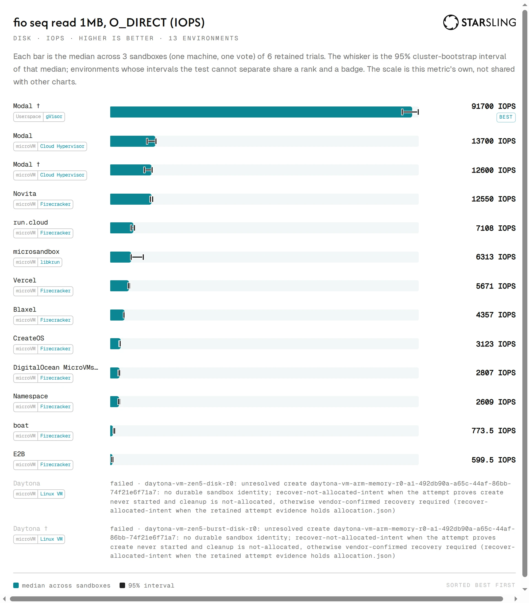

| Rank | Provider | fio seq read 1MB, O_DIRECT (IOPS) (IOPS) | 95% bootstrap interval | Sandboxes | Trials | Note |
| ---: | --- | ---: | ---: | ---: | ---: | --- |
| 1 | Modal (gVisor) | 87375 | 68750 – 106000 | 2 | 4 | — |
| 2 | Daytona (VM) | 20350 | 18600 – 20750 | 3 | 6 | too few sandboxes |
| 3 | Modal (VM) | 15350 | 10750 – 16700 | 3 | 6 | too few sandboxes |
| 4 | Novita | 10360 | 9934 – 11400 | 3 | 6 | too few sandboxes |
| 5 | Daytona (container) | 8852 | 8654 – 9146 | 3 | 6 | too few sandboxes |
| 6 | Microsandbox Cloud | 8402 | 8148 – 20900 | 3 | 6 | too few sandboxes |
| 7 | boat | 8388 | 6091 – 9008 | 3 | 6 | too few sandboxes |
| 8 | Vercel Sandbox | 4737 | 3944 – 5116 | 3 | 6 | too few sandboxes |
| 9 | Blaxel | 4049 | 3974 – 4664 | 3 | 6 | too few sandboxes |
| 10 | Tangle Sandbox | 3905 | 3850 – 3981 | 3 | 6 | too few sandboxes |
| 11 | CreateOS | 2715 | 2595 – 2823 | 3 | 6 | too few sandboxes |
| 12 | DigitalOcean MicroVMs | 2295 | 2187 – 2404 | 3 | 6 | too few sandboxes |
| 13 | Namespace | 2237 | 2134 – 2341 | 3 | 6 | too few sandboxes |
| 14 | E2B | 599.5 | 599 – 599.5 | 3 | 6 | too few sandboxes |

### fio seq read 1MB, O_DIRECT (MB/s)

MB/s · higher is better

_Modal (gVisor) leads · ~4.3× Daytona (VM) on median (higher is better)._

| Rank | Provider | fio seq read 1MB, O_DIRECT (MB/s) (MB/s) | 95% bootstrap interval | Sandboxes | Trials | Note |
| ---: | --- | ---: | ---: | ---: | ---: | --- |
| 1 | Modal (gVisor) | 91590 | 72050 – 111100 | 2 | 4 | — |
| 2 | Daytona (VM) | 21370 | 19430 – 21740 | 3 | 6 | too few sandboxes |
| 3 | Modal (VM) | 16050 | 11270 – 17560 | 3 | 6 | too few sandboxes |
| 4 | Novita | 10850 | 10420 – 12030 | 3 | 6 | too few sandboxes |
| 5 | Daytona (container) | 9283 | 9076 – 9591 | 3 | 6 | too few sandboxes |
| 6 | Microsandbox Cloud | 8812 | 8545 – 21900 | 3 | 6 | too few sandboxes |
| 7 | boat | 8796 | 6389 – 9447 | 3 | 6 | too few sandboxes |
| 8 | Vercel Sandbox | 4969 | 4137 – 5366 | 3 | 6 | too few sandboxes |
| 9 | Blaxel | 4247 | 4169 – 4892 | 3 | 6 | too few sandboxes |
| 10 | Tangle Sandbox | 4096 | 4038 – 4176 | 3 | 6 | too few sandboxes |
| 11 | CreateOS | 2848 | 2723 – 2961 | 3 | 6 | too few sandboxes |
| 12 | DigitalOcean MicroVMs | 2409 | 2295 – 2522 | 3 | 6 | too few sandboxes |
| 13 | Namespace | 2347 | 2239 – 2455 | 3 | 6 | too few sandboxes |
| 14 | E2B | 630.2 | 630.2 – 630.2 | 3 | 6 | too few sandboxes |

### fio seq write 1MB, O_DIRECT (IOPS)

IOPS · higher is better

_Daytona (VM) leads · ~1.8× Modal (VM) on median (higher is better)._

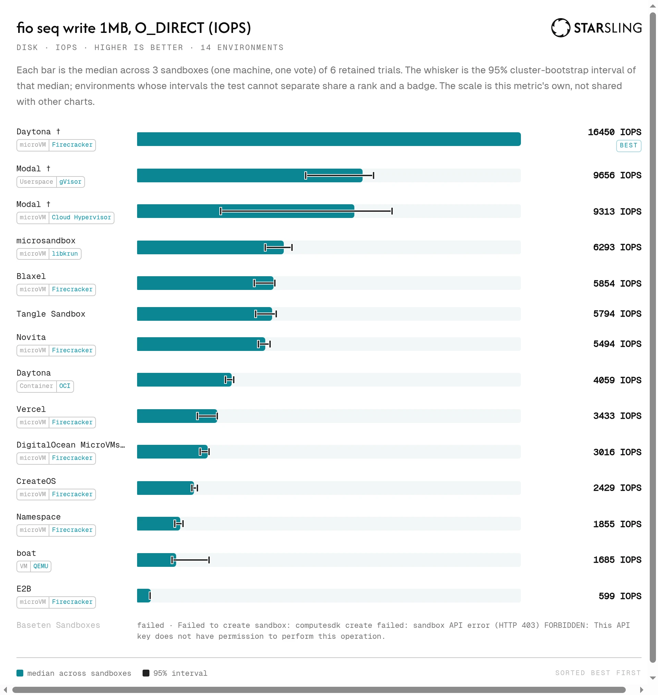

| Rank | Provider | fio seq write 1MB, O_DIRECT (IOPS) (IOPS) | 95% bootstrap interval | Sandboxes | Trials | Note |
| ---: | --- | ---: | ---: | ---: | ---: | --- |
| 1 | Daytona (VM) | 16400 | 14650 – 16950 | 3 | 6 | — |
| 2 | Modal (VM) | 8999 | 8955 – 12400 | 3 | 6 | too few sandboxes |
| 3 | Modal (gVisor) | 8433 | 7224 – 9643 | 2 | 4 | too few sandboxes |
| 4 | Microsandbox Cloud | 6385 | 5592 – 15350 | 3 | 6 | too few sandboxes |
| 5 | Novita | 6107 | 5536 – 6119 | 3 | 6 | too few sandboxes |
| 6 | Daytona (container) | 4310 | 4303 – 4570 | 3 | 6 | too few sandboxes |
| 7 | Vercel Sandbox | 4141 | 2909 – 4353 | 3 | 6 | too few sandboxes |
| 8 | Blaxel | 4103 | 3442 – 4243 | 3 | 6 | too few sandboxes |
| 9 | Tangle Sandbox | 3808 | 3744 – 3833 | 3 | 6 | too few sandboxes |
| 10 | DigitalOcean MicroVMs | 2570 | 2248 – 2743 | 3 | 6 | too few sandboxes |
| 11 | CreateOS | 2274 | 2267 – 2698 | 3 | 6 | too few sandboxes |
| 12 | Namespace | 1770 | 1324 – 1781 | 3 | 6 | too few sandboxes |
| 13 | boat | 1279 | 1185 – 1677 | 3 | 6 | too few sandboxes |
| 14 | E2B | 568 | 544 – 599.5 | 3 | 6 | too few sandboxes |

### fio seq write 1MB, O_DIRECT (MB/s)

MB/s · higher is better

_Daytona (VM) leads · ~1.8× Modal (VM) on median (higher is better)._

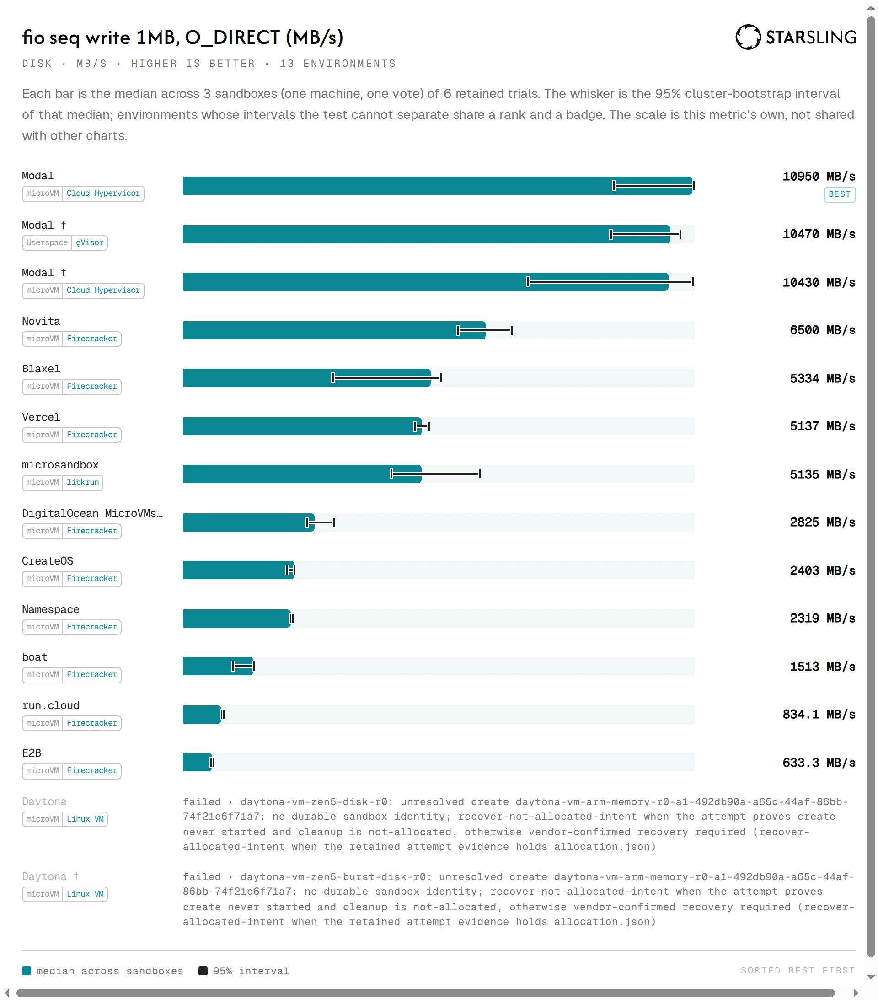

| Rank | Provider | fio seq write 1MB, O_DIRECT (MB/s) (MB/s) | 95% bootstrap interval | Sandboxes | Trials | Note |
| ---: | --- | ---: | ---: | ---: | ---: | --- |
| 1 | Daytona (VM) | 17180 | 15300 – 17770 | 3 | 6 | — |
| 2 | Modal (VM) | 9437 | 9392 – 13050 | 3 | 6 | too few sandboxes |
| 3 | Modal (gVisor) | 8845 | 7576 – 10110 | 2 | 4 | too few sandboxes |
| 4 | Microsandbox Cloud | 6697 | 5865 – 16050 | 3 | 6 | too few sandboxes |
| 5 | Novita | 6405 | 5806 – 6418 | 3 | 6 | too few sandboxes |
| 6 | Daytona (container) | 4520 | 4514 – 4794 | 3 | 6 | too few sandboxes |
| 7 | Vercel Sandbox | 4344 | 3051 – 4565 | 3 | 6 | too few sandboxes |
| 8 | Blaxel | 4304 | 3611 – 4451 | 3 | 6 | too few sandboxes |
| 9 | Tangle Sandbox | 3995 | 3927 – 4021 | 3 | 6 | too few sandboxes |
| 10 | DigitalOcean MicroVMs | 2695 | 2358 – 2878 | 3 | 6 | too few sandboxes |
| 11 | CreateOS | 2386 | 2379 – 2830 | 3 | 6 | too few sandboxes |
| 12 | Namespace | 1858 | 1389 – 1869 | 3 | 6 | too few sandboxes |
| 13 | boat | 1343 | 1244 – 1760 | 3 | 6 | too few sandboxes |
| 14 | E2B | 597.2 | 572 – 630.7 | 3 | 6 | too few sandboxes |

### Hardlink throughput

bogo ops/s · higher is better

_Modal (VM) leads · ~1.4× CreateOS on median (higher is better)._

| Rank | Provider | Hardlink throughput (bogo ops/s) | 95% bootstrap interval | Sandboxes | Trials | Note |
| ---: | --- | ---: | ---: | ---: | ---: | --- |
| 1 | Modal (VM) | 25.38 | 25.07 – 26.57 | 3 | 6 | — |
| 2 | CreateOS | 18.31 | 17.96 – 18.49 | 3 | 6 | too few sandboxes |
| 3 | Daytona (VM) | 17.01 | 16.88 – 17.16 | 3 | 6 | too few sandboxes |
| 4 | Blaxel | 16.95 | 16.94 – 16.98 | 3 | 6 | too few sandboxes |
| 5 | Novita | 12.04 | 11.91 – 12.23 | 3 | 6 | too few sandboxes |
| 6 | Namespace | 11.92 | 7.345 – 15.11 | 3 | 6 | too few sandboxes |
| 7 | Vercel Sandbox | 10.97 | 8.31 – 11.61 | 3 | 6 | too few sandboxes |
| 8 | boat | 9.975 | 6.775 – 10.26 | 3 | 6 | too few sandboxes |
| 9 | DigitalOcean MicroVMs | 9.495 | 9.42 – 9.525 | 3 | 6 | too few sandboxes |
| 10 | Microsandbox Cloud | 8.375 | 8.335 – 8.425 | 3 | 6 | too few sandboxes |
| 11 | Tangle Sandbox | 5.205 | 5.14 – 5.22 | 3 | 6 | too few sandboxes |
| 12 | Modal (gVisor) | 4.52 | 4.51 – 4.53 | 2 | 4 | too few sandboxes |
| 13 | Daytona (container) | 1.82 | 1.76 – 1.94 | 3 | 6 | too few sandboxes |
| 14 | E2B | 1.245 | 1.015 – 1.83 | 3 | 6 | too few sandboxes |

## memory

<strong>4 synthetic metrics</strong> · headline: STREAM Triad

### STREAM Triad _(headline)_

MB/s · higher is better

_Daytona (VM) leads · ~1.1× Modal (gVisor) on median (higher is better)._

| Rank | Provider | STREAM Triad (MB/s) | 95% bootstrap interval | Sandboxes | Trials | Note |
| ---: | --- | ---: | ---: | ---: | ---: | --- |
| 1 | Daytona (VM) | 178400 | 177600 – 178800 | 3 | 6 | — |
| 2 | Modal (gVisor) | 162700 | 159900 – 348000 | 3 | 6 | too few sandboxes |
| 3 | DigitalOcean MicroVMs | 160500 | 134900 – 161100 | 3 | 6 | too few sandboxes |
| 4 | Modal (VM) | 138700 | 118000 – 173800 | 3 | 6 | too few sandboxes |
| 5 | Baseten Sandboxes | 66600 | 65440 – 67260 | 3 | 6 | too few sandboxes |
| 6 | Blaxel | 66280 | 66210 – 68050 | 3 | 6 | too few sandboxes |
| 7 | Microsandbox Cloud | 56500 | 56480 – 56530 | 3 | 6 | too few sandboxes |
| 8 | Novita | 52260 | 50850 – 81500 | 3 | 6 | too few sandboxes |
| 9 | Vercel Sandbox | 50870 | 46150 – 52680 | 3 | 6 | too few sandboxes |
| 10 | E2B | 46070 | 45290 – 55940 | 3 | 6 | too few sandboxes |
| 11 | CreateOS | 45100 | 42050 – 45220 | 3 | 6 | too few sandboxes |
| 12 | Tangle Sandbox | 31180 | 29750 – 34290 | 3 | 6 | too few sandboxes |
| 13 | Namespace | 27660 | 25780 – 28290 | 3 | 6 | too few sandboxes |
| 14 | boat | 23300 | 20150 – 38441 | 3 | 6 | too few sandboxes |
| 15 | Daytona (container) | 17690 | 14900 – 18110 | 3 | 6 | too few sandboxes |

### STREAM Add

MB/s · higher is better

_Daytona (VM) leads · ~1.1× Modal (gVisor) on median (higher is better)._

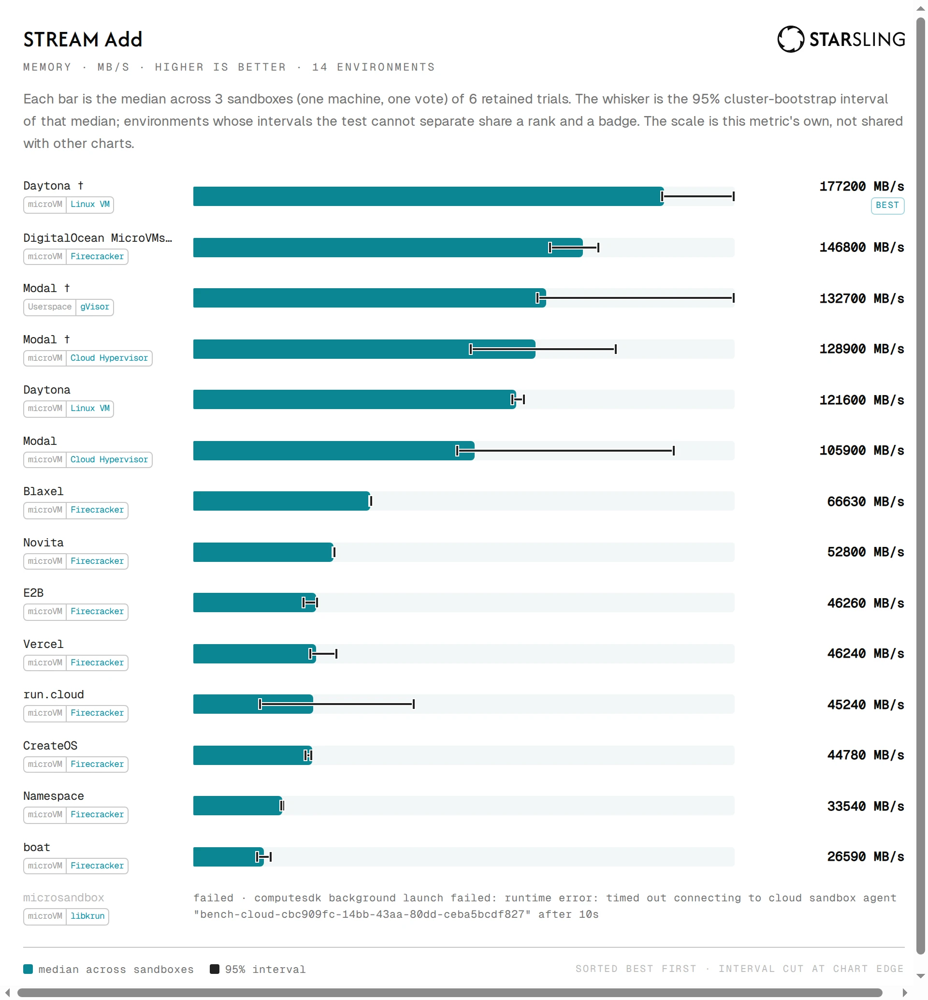

| Rank | Provider | STREAM Add (MB/s) | 95% bootstrap interval | Sandboxes | Trials | Note |
| ---: | --- | ---: | ---: | ---: | ---: | --- |
| 1 | Daytona (VM) | 176300 | 175700 – 176900 | 3 | 6 | — |
| 2 | Modal (gVisor) | 160900 | 158500 – 342600 | 3 | 6 | too few sandboxes |
| 3 | DigitalOcean MicroVMs | 160500 | 136100 – 169000 | 3 | 6 | too few sandboxes |
| 4 | Modal (VM) | 137200 | 117100 – 170100 | 3 | 6 | too few sandboxes |
| 5 | Baseten Sandboxes | 66350 | 65330 – 66970 | 3 | 6 | too few sandboxes |
| 6 | Blaxel | 66290 | 64770 – 67880 | 3 | 6 | too few sandboxes |
| 7 | Microsandbox Cloud | 56420 | 56370 – 56470 | 3 | 6 | too few sandboxes |
| 8 | Novita | 52150 | 50850 – 79490 | 3 | 6 | too few sandboxes |
| 9 | Vercel Sandbox | 50120 | 45700 – 52120 | 3 | 6 | too few sandboxes |
| 10 | E2B | 45630 | 44850 – 55310 | 3 | 6 | too few sandboxes |
| 11 | CreateOS | 44950 | 41880 – 45030 | 3 | 6 | too few sandboxes |
| 12 | Tangle Sandbox | 30150 | 29630 – 35270 | 3 | 6 | too few sandboxes |
| 13 | Namespace | 26950 | 25540 – 27920 | 3 | 6 | too few sandboxes |
| 14 | boat | 22290 | 19630 – 38410 | 3 | 6 | too few sandboxes |
| 15 | Daytona (container) | 17630 | 17370 – 18040 | 3 | 6 | too few sandboxes |

### STREAM Copy

MB/s · higher is better

_Daytona (VM) leads · ~1.1× Modal (gVisor) on median (higher is better)._

| Rank | Provider | STREAM Copy (MB/s) | 95% bootstrap interval | Sandboxes | Trials | Note |
| ---: | --- | ---: | ---: | ---: | ---: | --- |
| 1 | Daytona (VM) | 215900 | 215000 – 216400 | 3 | 6 | — |
| 2 | Modal (gVisor) | 203400 | 199900 – 425200 | 3 | 6 | too few sandboxes |
| 3 | DigitalOcean MicroVMs | 202700 | 179100 – 213000 | 3 | 6 | too few sandboxes |
| 4 | Modal (VM) | 185800 | 164100 – 216800 | 3 | 6 | too few sandboxes |
| 5 | Blaxel | 89280 | 87960 – 89900 | 3 | 6 | too few sandboxes |
| 6 | Microsandbox Cloud | 86870 | 86840 – 87060 | 3 | 6 | too few sandboxes |
| 7 | Baseten Sandboxes | 84540 | 84160 – 88300 | 3 | 6 | too few sandboxes |
| 8 | Vercel Sandbox | 80360 | 40040 – 83780 | 3 | 6 | too few sandboxes |
| 9 | E2B | 72830 | 71740 – 78260 | 3 | 6 | too few sandboxes |
| 10 | Novita | 58120 | 57640 – 89570 | 3 | 6 | too few sandboxes |
| 11 | Tangle Sandbox | 49380 | 49200 – 53960 | 3 | 6 | too few sandboxes |
| 12 | CreateOS | 47990 | 45580 – 48040 | 3 | 6 | too few sandboxes |
| 13 | Namespace | 38440 | 36750 – 39680 | 3 | 6 | too few sandboxes |
| 14 | boat | 31420 | 27240 – 43590 | 3 | 6 | too few sandboxes |
| 15 | Daytona (container) | 17000 | 12180 – 17570 | 3 | 6 | too few sandboxes |

### STREAM Scale

MB/s · higher is better

_Daytona (VM) leads · ~1.1× DigitalOcean MicroVMs on median (higher is better)._

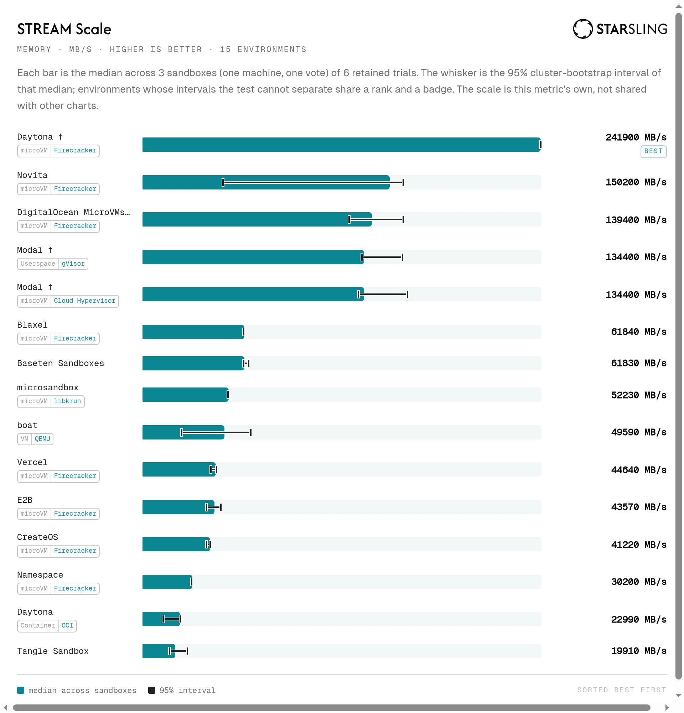

| Rank | Provider | STREAM Scale (MB/s) | 95% bootstrap interval | Sandboxes | Trials | Note |
| ---: | --- | ---: | ---: | ---: | ---: | --- |
| 1 | Daytona (VM) | 164100 | 162800 – 164200 | 3 | 6 | — |
| 2 | DigitalOcean MicroVMs | 154800 | 138200 – 163997 | 3 | 6 | too few sandboxes |
| 3 | Modal (gVisor) | 149600 | 146000 – 319000 | 3 | 6 | too few sandboxes |
| 4 | Modal (VM) | 127000 | 108100 – 156500 | 3 | 6 | too few sandboxes |
| 5 | Baseten Sandboxes | 62150 | 61470 – 62250 | 3 | 6 | too few sandboxes |
| 6 | Blaxel | 62020 | 61300 – 62500 | 3 | 6 | too few sandboxes |
| 7 | Microsandbox Cloud | 52240 | 52182 – 52260 | 3 | 6 | too few sandboxes |
| 8 | Novita | 49670 | 48230 – 77140 | 3 | 6 | too few sandboxes |
| 9 | Vercel Sandbox | 42520 | 41560 – 44640 | 3 | 6 | too few sandboxes |
| 10 | CreateOS | 41300 | 38380 – 41400 | 3 | 6 | too few sandboxes |
| 11 | E2B | 40060 | 39875 – 48600 | 3 | 6 | too few sandboxes |
| 12 | Tangle Sandbox | 28450 | 28270 – 32463 | 3 | 6 | too few sandboxes |
| 13 | Namespace | 24330 | 23390 – 25510 | 3 | 6 | too few sandboxes |
| 14 | boat | 20735 | 17810 – 34730 | 3 | 6 | too few sandboxes |
| 15 | Daytona (container) | 12400 | 12140 – 17570 | 3 | 6 | too few sandboxes |

## network

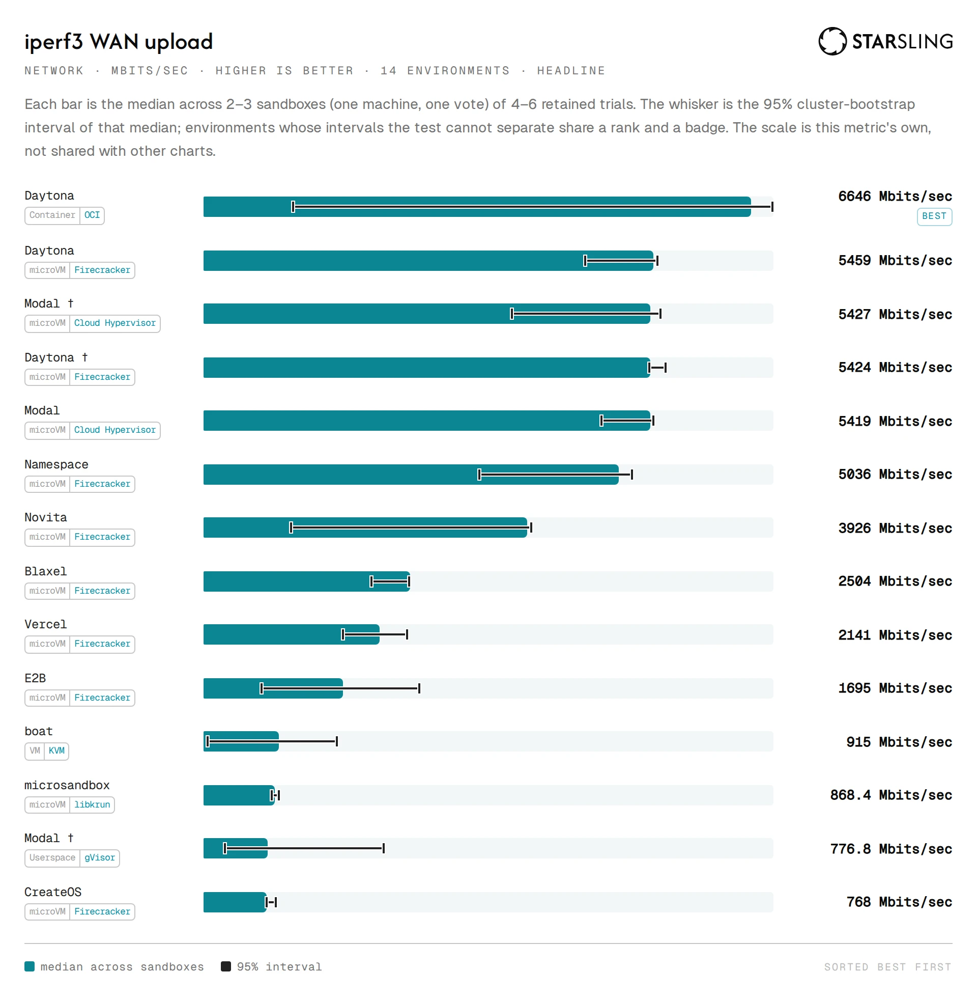

<strong>22 synthetic metrics</strong> · headlines: iperf3 WAN download · iperf3 WAN upload

### iperf3 WAN download _(headline)_

Mbits/sec · higher is better

_Daytona (VM) leads · ~1.4× Vercel Sandbox on median (higher is better)._

| Rank | Provider | iperf3 WAN download (Mbits/sec) | 95% bootstrap interval | Sandboxes | Trials | Note |
| ---: | --- | ---: | ---: | ---: | ---: | --- |
| 1 | Daytona (VM) | 12440 | 9070 – 14100 | 3 | 6 | — |
| 2 | Vercel Sandbox | 8725 | 6962 – 9905 | 3 | 6 | too few sandboxes |
| 3 | Namespace | 6961 | 6929 – 7185 | 3 | 6 | too few sandboxes |
| 4 | Novita | 4586 | 4464 – 6124 | 3 | 6 | too few sandboxes |
| 5 | DigitalOcean MicroVMs | 4421 | 4009 – 5068 | 3 | 6 | too few sandboxes |
| 6 | Blaxel | 4163 | 3161 – 5095 | 3 | 6 | too few sandboxes |
| 7 | Modal (gVisor) | 2395 | 2321 – 2973 | 3 | 6 | too few sandboxes |
| 8 | Daytona (container) | 2183 | 1978 – 2814 | 3 | 6 | too few sandboxes |
| 9 | Modal (VM) | 1852 | 1845 – 2022 | 3 | 6 | too few sandboxes |
| 10 | E2B | 1435 | 309.4 – 1955 | 3 | 6 | too few sandboxes |
| 11 | Microsandbox Cloud | 1057 | 1057 – 1057 | 3 | 6 | too few sandboxes |
| 12 | boat | 806 | 528.4 – 908 | 3 | 6 | too few sandboxes |
| 13 | CreateOS | 236.3 | 203.9 – 620.5 | 3 | 6 | too few sandboxes |

### iperf3 WAN upload _(headline)_

Mbits/sec · higher is better

_DigitalOcean MicroVMs leads · ~3.2× Daytona (container) on median (higher is better)._

| Rank | Provider | iperf3 WAN upload (Mbits/sec) | 95% bootstrap interval | Sandboxes | Trials | Note |
| ---: | --- | ---: | ---: | ---: | ---: | --- |
| 1 | DigitalOcean MicroVMs | 19380 | 18370 – 20550 | 3 | 6 | — |
| 2 | Daytona (container) | 6107 | 6088 – 6888 | 3 | 6 | too few sandboxes |
| 3 | Vercel Sandbox | 5687 | 3884 – 5957 | 3 | 6 | too few sandboxes |
| 4 | Novita | 4540 | 4308 – 4751 | 3 | 6 | too few sandboxes |
| 5 | Daytona (VM) | 4469 | 3887 – 4563 | 3 | 6 | too few sandboxes |
| 6 | Namespace | 3351 | 2092 – 5447 | 3 | 6 | too few sandboxes |
| 7 | Modal (VM) | 2856 | 2854 – 4557 | 3 | 6 | too few sandboxes |
| 8 | Blaxel | 2473 | 2284 – 2492 | 3 | 6 | too few sandboxes |
| 9 | Modal (gVisor) | 1892 | 744.7 – 2488 | 3 | 6 | too few sandboxes |
| 10 | Microsandbox Cloud | 1059 | 948.2 – 1059 | 3 | 6 | too few sandboxes |
| 11 | boat | 807.1 | 807 – 917.8 | 3 | 6 | too few sandboxes |
| 12 | CreateOS | 806.3 | 188 – 857.2 | 3 | 6 | too few sandboxes |
| 13 | E2B | 582.7 | 535 – 2080 | 3 | 6 | too few sandboxes |

### iperf3 loopback TCP, 1 stream

Mbits/sec · higher is better

_Novita leads · ~1.6× DigitalOcean MicroVMs on median (higher is better)._

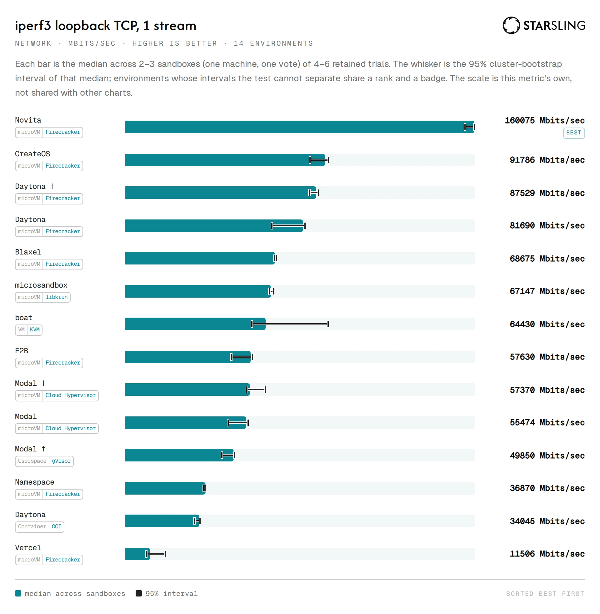

| Rank | Provider | iperf3 loopback TCP, 1 stream (Mbits/sec) | 95% bootstrap interval | Sandboxes | Trials | Note |
| ---: | --- | ---: | ---: | ---: | ---: | --- |
| 1 | Novita | 154495 | 153354 – 157435 | 3 | 6 | — |
| 2 | DigitalOcean MicroVMs | 94715 | 88650 – 110300 | 3 | 6 | too few sandboxes |
| 3 | CreateOS | 91770 | 86648 – 94410 | 3 | 6 | too few sandboxes |
| 4 | Daytona (VM) | 80610 | 60230 – 85810 | 3 | 6 | too few sandboxes |
| 5 | Microsandbox Cloud | 80532 | 53220 – 84434 | 3 | 6 | too few sandboxes |
| 6 | boat | 66250 | 55297 – 84975 | 3 | 6 | too few sandboxes |
| 7 | Vercel Sandbox | 64764 | 38470 – 68122 | 3 | 6 | too few sandboxes |
| 8 | Blaxel | 63453 | 60830 – 63561 | 3 | 6 | too few sandboxes |
| 9 | Modal (VM) | 55130 | 29287 – 56860 | 3 | 6 | too few sandboxes |
| 10 | E2B | 46192 | 38160 – 57660 | 3 | 6 | too few sandboxes |
| 11 | Modal (gVisor) | 42341 | 41352 – 44030 | 3 | 6 | too few sandboxes |
| 12 | Daytona (container) | 34940 | 32670 – 35232 | 3 | 6 | too few sandboxes |
| 13 | Namespace | 32794 | 31156 – 36060 | 3 | 6 | too few sandboxes |

### iperf3 loopback TCP, 10 streams

Mbits/sec · higher is better

_Novita leads · ~1.1× DigitalOcean MicroVMs on median (higher is better)._

| Rank | Provider | iperf3 loopback TCP, 10 streams (Mbits/sec) | 95% bootstrap interval | Sandboxes | Trials | Note |
| ---: | --- | ---: | ---: | ---: | ---: | --- |
| 1 | Novita | 153466 | 95070 – 154592 | 3 | 6 | — |
| 2 | DigitalOcean MicroVMs | 135890 | 127400 – 135946 | 3 | 6 | too few sandboxes |
| 3 | CreateOS | 135862 | 129279 – 155700 | 3 | 6 | too few sandboxes |
| 4 | Daytona (VM) | 97830 | 97340 – 98905 | 3 | 6 | too few sandboxes |
| 5 | Microsandbox Cloud | 84556 | 81825 – 92560 | 3 | 6 | too few sandboxes |
| 6 | boat | 79349 | 38930 – 91470 | 3 | 6 | too few sandboxes |
| 7 | Blaxel | 75891 | 71750 – 76990 | 3 | 6 | too few sandboxes |
| 8 | Modal (VM) | 56494 | 40330 – 57789 | 3 | 6 | too few sandboxes |
| 9 | Vercel Sandbox | 48060 | 37760 – 51446 | 3 | 6 | too few sandboxes |
| 10 | Namespace | 38377 | 35340 – 41820 | 3 | 6 | too few sandboxes |
| 11 | E2B | 37704 | 31510 – 48340 | 3 | 6 | too few sandboxes |
| 12 | Daytona (container) | 36675 | 35469 – 38320 | 3 | 6 | too few sandboxes |
| 13 | Modal (gVisor) | 35532 | 34100 – 39933 | 3 | 6 | too few sandboxes |

### iperf3 loopback UDP, 10G objective

Mbits/sec · higher is better

_Daytona (container) leads on median (higher is better); see notes for how ranks are decided._

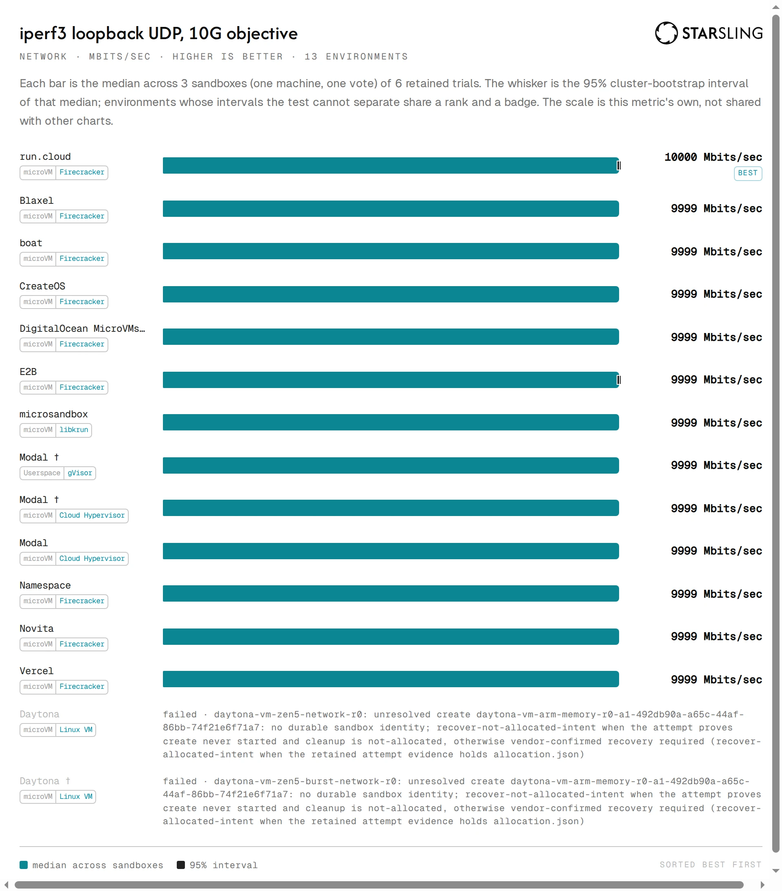

| Rank | Provider | iperf3 loopback UDP, 10G objective (Mbits/sec) | 95% bootstrap interval | Sandboxes | Trials | Note |
| ---: | --- | ---: | ---: | ---: | ---: | --- |
| 1 | Daytona (container) | 10000 | 9999 – 10000 | 3 | 6 | — |
| 2 | Blaxel | 9999 | 9999 – 9999 | 3 | 6 | too few sandboxes |
| 2 | boat | 9999 | 9999 – 9999 | 3 | 6 | too few sandboxes, equal medians |
| 2 | CreateOS | 9999 | 9999 – 9999 | 3 | 6 | too few sandboxes, equal medians |
| 2 | Daytona (VM) | 9999 | 9999 – 9999 | 3 | 6 | too few sandboxes, equal medians |
| 2 | DigitalOcean MicroVMs | 9999 | 9999 – 9999 | 3 | 6 | too few sandboxes, equal medians |
| 2 | E2B | 9999 | 9999 – 9999 | 3 | 6 | too few sandboxes, equal medians |
| 2 | Microsandbox Cloud | 9999 | 9999 – 10000 | 3 | 6 | too few sandboxes, equal medians |
| 2 | Modal (VM) | 9999 | 9999 – 9999 | 3 | 6 | too few sandboxes, equal medians |
| 2 | Namespace | 9999 | 9999 – 9999 | 3 | 6 | too few sandboxes, equal medians |
| 2 | Novita | 9999 | 9999 – 9999 | 3 | 6 | too few sandboxes, equal medians |
| 2 | Vercel Sandbox | 9999 | 9999 – 9999 | 3 | 6 | too few sandboxes, equal medians |
| 13 | Modal (gVisor) | 533 | 503 – 554.5 | 3 | 6 | too few sandboxes |

### github.com HTTPS

ms · lower is better

_Daytona (VM) leads · Namespace is ~1.1× higher (lower is better)._

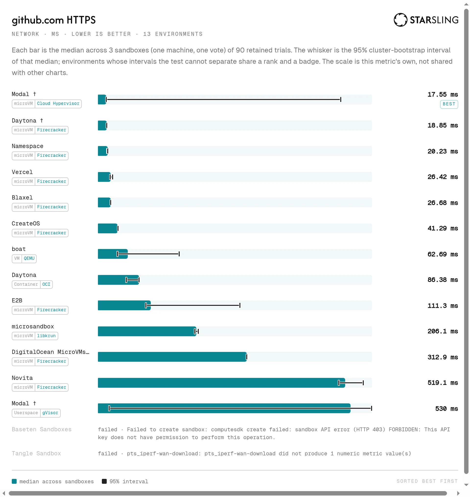

| Rank | Provider | github.com HTTPS (ms) | 95% bootstrap interval | Sandboxes | Trials | Note |
| ---: | --- | ---: | ---: | ---: | ---: | --- |
| 1 | Daytona (VM) | 18.93 | 18.26 – 19.6 | 3 | 90 | — |
| 2 | Namespace | 21.72 | 21.21 – 25.67 | 3 | 90 | too few sandboxes |
| 3 | Vercel Sandbox | 23.7 | 22.45 – 39.67 | 3 | 90 | too few sandboxes |
| 4 | Blaxel | 26.56 | 25.99 – 33.53 | 3 | 90 | too few sandboxes |
| 5 | CreateOS | 45.98 | 41.38 – 49.34 | 3 | 90 | too few sandboxes |
| 6 | Modal (gVisor) | 57.91 | 51.56 – 61.86 | 3 | 90 | too few sandboxes |
| 7 | Modal (VM) | 60.89 | 18.45 – 60.91 | 3 | 90 | too few sandboxes |
| 8 | boat | 73.75 | 72.46 – 147.5 | 3 | 90 | too few sandboxes |
| 9 | Daytona (container) | 75.33 | 71.28 – 83.31 | 3 | 90 | too few sandboxes |
| 10 | E2B | 108.5 | 100.4 – 112.2 | 3 | 90 | too few sandboxes |
| 11 | Microsandbox Cloud | 218.5 | 218.3 – 221.9 | 3 | 90 | too few sandboxes |
| 12 | DigitalOcean MicroVMs | 312.2 | 312.1 – 312.4 | 3 | 90 | too few sandboxes |
| 13 | Novita | 529.4 | 508.6 – 558.6 | 3 | 90 | too few sandboxes |

### api.github.com HTTPS

ms · lower is better

_Daytona (VM) leads on median (lower is better); see notes for how ranks are decided._

| Rank | Provider | api.github.com HTTPS (ms) | 95% bootstrap interval | Sandboxes | Trials | Note |
| ---: | --- | ---: | ---: | ---: | ---: | --- |
| 1 | Daytona (VM) | 12.64 | 11.86 – 12.94 | 3 | 90 | — |
| 2 | Namespace | 13.16 | 11.61 – 14.11 | 3 | 90 | too few sandboxes |
| 3 | Blaxel | 14.19 | 14.1 – 14.35 | 3 | 90 | too few sandboxes |
| 4 | Vercel Sandbox | 15.63 | 15.51 – 19.77 | 3 | 90 | too few sandboxes |
| 5 | CreateOS | 24.85 | 23.59 – 24.93 | 3 | 90 | too few sandboxes |
| 6 | Modal (VM) | 26.91 | 10.86 – 27.45 | 3 | 90 | too few sandboxes |
| 7 | Modal (gVisor) | 27.11 | 26.74 – 196.1 | 3 | 90 | too few sandboxes |
| 8 | boat | 34.56 | 30.59 – 35.89 | 3 | 90 | too few sandboxes |
| 9 | Daytona (container) | 40.34 | 37.83 – 40.91 | 3 | 90 | too few sandboxes |
| 10 | E2B | 45.95 | 44.94 – 51.53 | 3 | 90 | too few sandboxes |
| 11 | Microsandbox Cloud | 102.5 | 100.8 – 104 | 3 | 90 | too few sandboxes |
| 12 | DigitalOcean MicroVMs | 121.8 | 121.3 – 122 | 3 | 90 | too few sandboxes |
| 13 | Novita | 193.4 | 192.1 – 195.3 | 3 | 90 | too few sandboxes |

### raw.githubusercontent.com HTTPS

ms · lower is better

_Daytona (VM) leads on median (lower is better); see notes for how ranks are decided._

| Rank | Provider | raw.githubusercontent.com HTTPS (ms) | 95% bootstrap interval | Sandboxes | Trials | Note |
| ---: | --- | ---: | ---: | ---: | ---: | --- |
| 1 | Daytona (VM) | 10.19 | 9.931 – 10.43 | 3 | 90 | — |
| 2 | Modal (VM) | 10.52 | 8.685 – 10.81 | 3 | 90 | too few sandboxes |
| 3 | Daytona (container) | 10.74 | 10.62 – 17.79 | 3 | 90 | too few sandboxes |
| 4 | Namespace | 11.07 | 9.703 – 13.61 | 3 | 90 | too few sandboxes |
| 5 | DigitalOcean MicroVMs | 11.63 | 11.39 – 12.66 | 3 | 90 | too few sandboxes |
| 6 | Blaxel | 14.37 | 13.71 – 14.56 | 3 | 90 | too few sandboxes |
| 7 | Vercel Sandbox | 15.69 | 14.5 – 19.44 | 3 | 90 | too few sandboxes |
| 8 | Modal (gVisor) | 16.29 | 16.11 – 22.27 | 3 | 90 | too few sandboxes |
| 9 | Microsandbox Cloud | 19.26 | 19.03 – 21.14 | 3 | 90 | too few sandboxes |
| 10 | CreateOS | 25.03 | 23.07 – 25.31 | 3 | 90 | too few sandboxes |
| 11 | boat | 26.64 | 26.45 – 30.84 | 3 | 90 | too few sandboxes |
| 12 | E2B | 37.21 | 36.02 – 40.71 | 3 | 90 | too few sandboxes |
| 13 | Novita | 42.43 | 42.12 – 43.81 | 3 | 90 | too few sandboxes |

### registry.npmjs.org HTTPS

ms · lower is better

_Namespace leads · DigitalOcean MicroVMs is ~1.1× higher (lower is better)._

| Rank | Provider | registry.npmjs.org HTTPS (ms) | 95% bootstrap interval | Sandboxes | Trials | Note |
| ---: | --- | ---: | ---: | ---: | ---: | --- |
| 1 | Namespace | 17.05 | 14.75 – 19.14 | 3 | 90 | — |
| 2 | DigitalOcean MicroVMs | 18.03 | 17.38 – 18.15 | 3 | 90 | too few sandboxes |
| 3 | Modal (VM) | 19.66 | 17.91 – 20.04 | 3 | 90 | too few sandboxes |
| 4 | Blaxel | 20.72 | 20.49 – 21.06 | 3 | 90 | too few sandboxes |
| 5 | Daytona (VM) | 21.54 | 20.7 – 22.02 | 3 | 90 | too few sandboxes |
| 6 | Vercel Sandbox | 23.42 | 20.85 – 27.86 | 3 | 90 | too few sandboxes |
| 7 | Modal (gVisor) | 25.69 | 24.78 – 26.05 | 3 | 90 | too few sandboxes |
| 8 | CreateOS | 32.28 | 31.76 – 32.82 | 3 | 90 | too few sandboxes |
| 9 | Daytona (container) | 35.86 | 31.66 – 39.27 | 3 | 90 | too few sandboxes |
| 10 | boat | 41.2 | 37.07 – 44.42 | 3 | 90 | too few sandboxes |
| 11 | E2B | 49.94 | 48.77 – 54.15 | 3 | 90 | too few sandboxes |
| 12 | Microsandbox Cloud | 59.22 | 57.98 – 59.37 | 3 | 90 | too few sandboxes |
| 13 | Novita | 67.84 | 67.76 – 69.78 | 3 | 90 | too few sandboxes |

### pypi.org HTTPS

ms · lower is better

_Daytona (container) leads on median (lower is better); see notes for how ranks are decided._

| Rank | Provider | pypi.org HTTPS (ms) | 95% bootstrap interval | Sandboxes | Trials | Note |
| ---: | --- | ---: | ---: | ---: | ---: | --- |
| 1 | Daytona (container) | 11.98 | 11.84 – 18.28 | 3 | 90 | — |
| 2 | Modal (VM) | 12.17 | 11.4 – 60.8 | 3 | 90 | too few sandboxes |
| 3 | DigitalOcean MicroVMs | 14.23 | 12.7 – 14.52 | 3 | 90 | too few sandboxes |
| 4 | Modal (gVisor) | 17.44 | 17.06 – 22.84 | 3 | 90 | too few sandboxes |
| 5 | boat | 32.03 | 31.15 – 34.09 | 3 | 90 | too few sandboxes |
| 6 | E2B | 40.97 | 37.88 – 43.37 | 3 | 90 | too few sandboxes |
| 7 | Novita | 47.49 | 46.02 – 47.69 | 3 | 90 | too few sandboxes |
| 8 | Blaxel | 53.52 | 53.44 – 55.11 | 3 | 90 | too few sandboxes |
| 9 | CreateOS | 58.64 | 53.8 – 60.27 | 3 | 90 | too few sandboxes |
| 10 | Vercel Sandbox | 61.61 | 59.09 – 63.03 | 3 | 90 | too few sandboxes |
| 11 | Daytona (VM) | 62.34 | 61.93 – 64.25 | 3 | 90 | too few sandboxes |
| 12 | Namespace | 68.3 | 67.77 – 70.13 | 3 | 90 | too few sandboxes |
| 13 | Microsandbox Cloud | 202 | 200.9 – 202.4 | 3 | 90 | too few sandboxes |

### files.pythonhosted.org HTTPS

ms · lower is better

_Modal (VM) leads on median (lower is better); see notes for how ranks are decided._

| Rank | Provider | files.pythonhosted.org HTTPS (ms) | 95% bootstrap interval | Sandboxes | Trials | Note |
| ---: | --- | ---: | ---: | ---: | ---: | --- |
| 1 | Modal (VM) | 10.47 | 10.43 – 53.41 | 3 | 90 | — |
| 2 | DigitalOcean MicroVMs | 10.93 | 10.88 – 11.76 | 3 | 90 | too few sandboxes |
| 3 | Modal (gVisor) | 16.31 | 15.87 – 18.66 | 3 | 90 | too few sandboxes |
| 4 | Daytona (container) | 28.91 | 23.19 – 30.06 | 3 | 90 | too few sandboxes |
| 5 | boat | 31.6 | 28.8 – 31.86 | 3 | 90 | too few sandboxes |
| 6 | E2B | 40.88 | 35.36 – 42.02 | 3 | 90 | too few sandboxes |
| 7 | Novita | 41.93 | 41.56 – 42.38 | 3 | 90 | too few sandboxes |
| 8 | Blaxel | 47.73 | 47.02 – 48.14 | 3 | 90 | too few sandboxes |
| 9 | Vercel Sandbox | 55.89 | 52.58 – 55.89 | 3 | 90 | too few sandboxes |
| 10 | CreateOS | 56.85 | 50.62 – 57.25 | 3 | 90 | too few sandboxes |
| 11 | Daytona (VM) | 58.3 | 56.53 – 58.43 | 3 | 90 | too few sandboxes |
| 12 | Namespace | 60.67 | 60.54 – 61.48 | 3 | 90 | too few sandboxes |
| 13 | Microsandbox Cloud | 186.4 | 185.2 – 186.8 | 3 | 90 | too few sandboxes |

### ghcr.io/v2 HTTPS

ms · lower is better

_Namespace leads · Daytona (VM) is ~1.1× higher (lower is better)._

| Rank | Provider | ghcr.io/v2 HTTPS (ms) | 95% bootstrap interval | Sandboxes | Trials | Note |
| ---: | --- | ---: | ---: | ---: | ---: | --- |
| 1 | Namespace | 17.02 | 16.82 – 17.69 | 3 | 90 | — |
| 2 | Daytona (VM) | 18.91 | 18.35 – 19.17 | 3 | 90 | too few sandboxes |
| 3 | Vercel Sandbox | 19.12 | 17.4 – 22.11 | 3 | 90 | too few sandboxes |
| 4 | Blaxel | 20.7 | 18.58 – 20.94 | 3 | 90 | too few sandboxes |
| 5 | CreateOS | 26.38 | 26.15 – 27.15 | 3 | 90 | too few sandboxes |
| 6 | Modal (VM) | 32.34 | 16.81 – 33.23 | 3 | 90 | too few sandboxes |
| 7 | Modal (gVisor) | 40.78 | 33.56 – 204.3 | 3 | 90 | too few sandboxes |
| 8 | Daytona (container) | 51.12 | 50.72 – 59.2 | 3 | 90 | too few sandboxes |
| 9 | E2B | 111.3 | 109.4 – 114.8 | 3 | 90 | too few sandboxes |
| 10 | Microsandbox Cloud | 123.8 | 122.7 – 124.5 | 3 | 90 | too few sandboxes |
| 11 | DigitalOcean MicroVMs | 129.6 | 128.6 – 130.8 | 3 | 90 | too few sandboxes |
| 12 | boat | 133 | 131 – 161 | 3 | 90 | too few sandboxes |
| 13 | Novita | 199.4 | 198.1 – 200.7 | 3 | 90 | too few sandboxes |

### gcr.io/v2 HTTPS

ms · lower is better

_Namespace leads · Blaxel is ~1.1× higher (lower is better)._

| Rank | Provider | gcr.io/v2 HTTPS (ms) | 95% bootstrap interval | Sandboxes | Trials | Note |
| ---: | --- | ---: | ---: | ---: | ---: | --- |
| 1 | Namespace | 15.1 | 14.12 – 15.17 | 3 | 90 | — |
| 2 | Blaxel | 16.66 | 16.52 – 17.21 | 3 | 90 | too few sandboxes |
| 3 | Novita | 18.47 | 18.17 – 19.03 | 3 | 90 | too few sandboxes |
| 4 | Vercel Sandbox | 19.79 | 19.66 – 25.26 | 3 | 90 | too few sandboxes |
| 5 | E2B | 27.9 | 21.03 – 30.47 | 3 | 90 | too few sandboxes |
| 6 | Modal (VM) | 30.65 | 29.11 – 59.2 | 3 | 90 | too few sandboxes |
| 7 | Modal (gVisor) | 32.64 | 30.92 – 34.65 | 3 | 90 | too few sandboxes |
| 8 | Daytona (container) | 43.79 | 41.78 – 45.1 | 3 | 90 | too few sandboxes |
| 9 | Daytona (VM) | 58.06 | 53.71 – 59.05 | 3 | 90 | too few sandboxes |
| 10 | CreateOS | 61.73 | 59.96 – 61.93 | 3 | 90 | too few sandboxes |
| 11 | Microsandbox Cloud | 87.25 | 86.84 – 88 | 3 | 90 | too few sandboxes |
| 12 | DigitalOcean MicroVMs | 117.9 | 116.9 – 119.1 | 3 | 90 | too few sandboxes |
| 13 | boat | 556 | 526.8 – 557.3 | 3 | 90 | too few sandboxes |

### auth.docker.io token HTTPS

ms · lower is better

_Namespace leads · Daytona (VM) is ~1.1× higher (lower is better)._

| Rank | Provider | auth.docker.io token HTTPS (ms) | 95% bootstrap interval | Sandboxes | Trials | Note |
| ---: | --- | ---: | ---: | ---: | ---: | --- |
| 1 | Namespace | 29.93 | 28.66 – 32.25 | 3 | 90 | — |
| 2 | Daytona (VM) | 31.54 | 31.52 – 32.6 | 3 | 90 | too few sandboxes |
| 3 | Blaxel | 32.23 | 31.58 – 32.71 | 3 | 90 | too few sandboxes |
| 4 | Vercel Sandbox | 36 | 32.13 – 38.56 | 3 | 90 | too few sandboxes |
| 5 | Modal (VM) | 36.35 | 29.21 – 36.79 | 3 | 90 | too few sandboxes |
| 6 | CreateOS | 42.22 | 41.89 – 42.54 | 3 | 90 | too few sandboxes |
| 7 | Modal (gVisor) | 42.37 | 42.24 – 118.8 | 3 | 90 | too few sandboxes |
| 8 | Daytona (container) | 58.14 | 52.66 – 59.01 | 3 | 90 | too few sandboxes |
| 9 | Microsandbox Cloud | 59.43 | 57.46 – 61.39 | 3 | 90 | too few sandboxes |
| 10 | DigitalOcean MicroVMs | 63.54 | 62.41 – 67.17 | 3 | 90 | too few sandboxes |
| 11 | boat | 129 | 128.5 – 130.8 | 3 | 90 | too few sandboxes |
| 12 | Novita | 130.8 | 129.4 – 131.6 | 3 | 90 | too few sandboxes |
| 13 | E2B | 137.2 | 133.5 – 140.8 | 3 | 90 | too few sandboxes |

### crates.io HTTPS

ms · lower is better

_Modal (VM) leads · DigitalOcean MicroVMs is ~1.3× higher (lower is better)._

| Rank | Provider | crates.io HTTPS (ms) | 95% bootstrap interval | Sandboxes | Trials | Note |
| ---: | --- | ---: | ---: | ---: | ---: | --- |
| 1 | Modal (VM) | 13.86 | 13.34 – 15.52 | 3 | 90 | — |
| 2 | DigitalOcean MicroVMs | 17.48 | 16.32 – 18.55 | 3 | 90 | too few sandboxes |
| 3 | Daytona (VM) | 20.15 | 16.1 – 20.99 | 3 | 90 | too few sandboxes |
| 4 | Modal (gVisor) | 20.51 | 19.71 – 37.31 | 3 | 90 | too few sandboxes |
| 5 | Namespace | 21.27 | 20.37 – 29.09 | 3 | 90 | too few sandboxes |
| 6 | Vercel Sandbox | 23.23 | 21.84 – 26.63 | 3 | 90 | too few sandboxes |
| 7 | Blaxel | 23.89 | 22.9 – 29.86 | 3 | 90 | too few sandboxes |
| 8 | Microsandbox Cloud | 26.25 | 23.18 – 26.95 | 3 | 90 | too few sandboxes |
| 9 | Daytona (container) | 26.89 | 26.03 – 27.66 | 3 | 90 | too few sandboxes |
| 10 | boat | 30.28 | 27.24 – 36.43 | 3 | 90 | too few sandboxes |
| 11 | CreateOS | 33.01 | 29.36 – 34.86 | 3 | 90 | too few sandboxes |
| 12 | Novita | 46.91 | 46.58 – 47.57 | 3 | 90 | too few sandboxes |
| 13 | E2B | 51.49 | 47.47 – 53.08 | 3 | 90 | too few sandboxes |

### index.crates.io config HTTPS

ms · lower is better

_Namespace leads on median (lower is better); see notes for how ranks are decided._

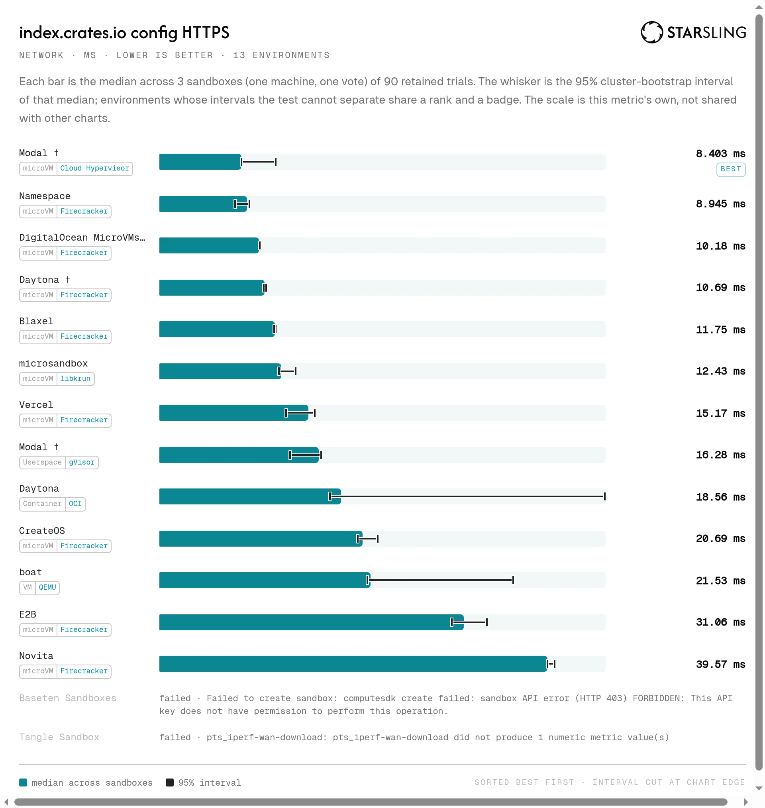

| Rank | Provider | index.crates.io config HTTPS (ms) | 95% bootstrap interval | Sandboxes | Trials | Note |
| ---: | --- | ---: | ---: | ---: | ---: | --- |
| 1 | Namespace | 9.979 | 8.98 – 10.97 | 3 | 90 | — |
| 2 | Modal (VM) | 10.12 | 8.722 – 10.8 | 3 | 90 | too few sandboxes |
| 3 | DigitalOcean MicroVMs | 10.72 | 10.55 – 11.61 | 3 | 90 | too few sandboxes |
| 4 | Daytona (VM) | 11.08 | 11.03 – 12.3 | 3 | 90 | too few sandboxes |
| 5 | Blaxel | 12.07 | 11.98 – 13.42 | 3 | 90 | too few sandboxes |
| 6 | Vercel Sandbox | 14.05 | 13.88 – 17.69 | 3 | 90 | too few sandboxes |
| 7 | Modal (gVisor) | 16.93 | 16.65 – 18.52 | 3 | 90 | too few sandboxes |
| 8 | Microsandbox Cloud | 19.67 | 14.25 – 20.49 | 3 | 90 | too few sandboxes |
| 9 | CreateOS | 22.26 | 22.23 – 23.09 | 3 | 90 | too few sandboxes |
| 10 | boat | 28.82 | 25.05 – 32.49 | 3 | 90 | too few sandboxes |
| 11 | E2B | 39.93 | 35.92 – 41.92 | 3 | 90 | too few sandboxes |
| 12 | Daytona (container) | 40.33 | 35.77 – 41.17 | 3 | 90 | too few sandboxes |
| 13 | Novita | 40.93 | 40.59 – 41.21 | 3 | 90 | too few sandboxes |

### github.com cold DNS

ms · lower is better

_Namespace leads on median (lower is better); see notes for how ranks are decided._

| Rank | Provider | github.com cold DNS (ms) | 95% bootstrap interval | Sandboxes | Trials | Note |
| ---: | --- | ---: | ---: | ---: | ---: | --- |
| 1 | Namespace | 0 | 0 – 4 | 3 | 3 | — |
| 2 | Vercel Sandbox | 3 | 0 – 4 | 3 | 3 | too few sandboxes |
| 3 | Blaxel | 4 | 4 – 4 | 3 | 3 | too few sandboxes |
| 3 | Microsandbox Cloud | 4 | 0 – 4 | 3 | 3 | too few sandboxes, equal medians |
| 5 | Daytona (VM) | 5 | 5 – 5 | 3 | 3 | too few sandboxes |
| 6 | boat | 7 | 6 – 8 | 3 | 3 | too few sandboxes |
| 7 | CreateOS | 8 | 4 – 8 | 3 | 3 | too few sandboxes |
| 7 | Modal (gVisor) | 8 | 4 – 80 | 3 | 3 | too few sandboxes, equal medians |
| 7 | Modal (VM) | 8 | 4 – 8 | 3 | 3 | too few sandboxes, equal medians |
| 10 | E2B | 12 | 8 – 12 | 3 | 3 | too few sandboxes |
| 10 | Novita | 12 | 12 – 12 | 3 | 3 | too few sandboxes, equal medians |
| 12 | Daytona (container) | 22 | 20 – 23 | 3 | 3 | too few sandboxes |
| 13 | DigitalOcean MicroVMs | 40 | 16 – 48 | 3 | 3 | too few sandboxes |

### registry.npmjs.org cold DNS

ms · lower is better

_Vercel Sandbox leads · Modal (VM) is ~1.3× higher (lower is better)._

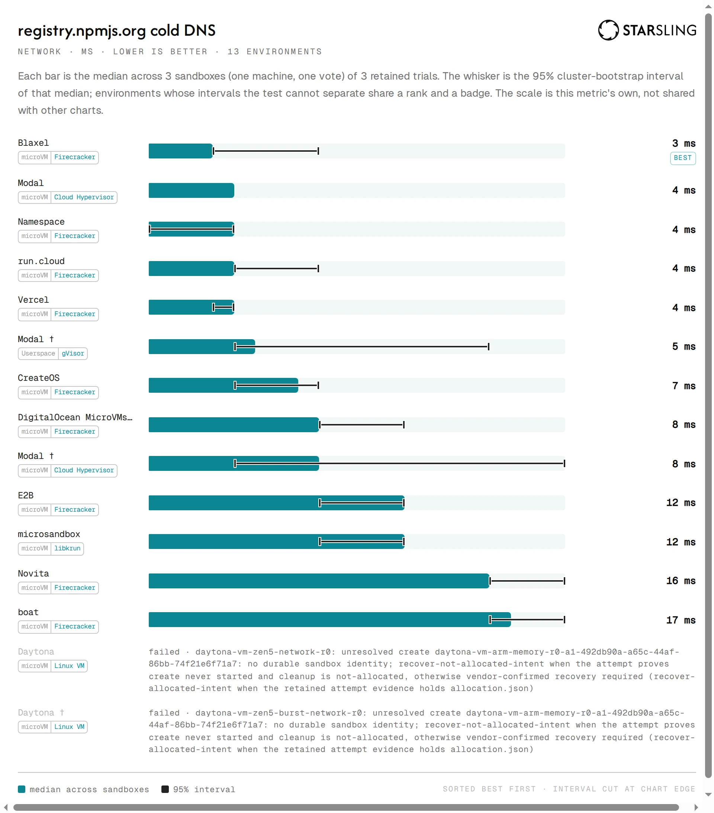

| Rank | Provider | registry.npmjs.org cold DNS (ms) | 95% bootstrap interval | Sandboxes | Trials | Note |
| ---: | --- | ---: | ---: | ---: | ---: | --- |
| 1 | Vercel Sandbox | 3 | 3 – 4 | 3 | 3 | — |
| 2 | Modal (VM) | 4 | 4 – 8 | 3 | 3 | too few sandboxes |
| 2 | Namespace | 4 | 0 – 4 | 3 | 3 | too few sandboxes, equal medians |
| 4 | Modal (gVisor) | 6 | 4 – 87 | 3 | 3 | too few sandboxes |
| 5 | Blaxel | 7 | 4 – 8 | 3 | 3 | too few sandboxes |
| 5 | Daytona (VM) | 7 | 6 – 10 | 3 | 3 | too few sandboxes, equal medians |
| 7 | CreateOS | 8 | 8 – 8 | 3 | 3 | too few sandboxes |
| 7 | DigitalOcean MicroVMs | 8 | 8 – 8 | 3 | 3 | too few sandboxes, equal medians |
| 7 | Microsandbox Cloud | 8 | 8 – 12 | 3 | 3 | too few sandboxes, equal medians |
| 10 | E2B | 12 | 12 – 76 | 3 | 3 | too few sandboxes |
| 11 | boat | 13 | 13 – 16 | 3 | 3 | too few sandboxes |
| 12 | Novita | 16 | 12 – 24 | 3 | 3 | too few sandboxes |
| 13 | Daytona (container) | 25 | 21 – 25 | 3 | 3 | too few sandboxes |

### docker.io cold DNS

ms · lower is better

_Blaxel and Microsandbox Cloud share the top on this metric (lower is better)._

| Rank | Provider | docker.io cold DNS (ms) | 95% bootstrap interval | Sandboxes | Trials | Note |
| ---: | --- | ---: | ---: | ---: | ---: | --- |
| 1 | Blaxel | 0 | 0 – 4 | 3 | 3 | — |
| 1 | Microsandbox Cloud | 0 | 0 – 4 | 3 | 3 | too few sandboxes, equal medians |
| 3 | Vercel Sandbox | 3 | 0 – 7 | 3 | 3 | too few sandboxes |
| 4 | Daytona (VM) | 4 | 4 – 5 | 3 | 3 | too few sandboxes |
| 5 | Modal (gVisor) | 5 | 4 – 38 | 3 | 3 | too few sandboxes |
| 6 | CreateOS | 8 | 4 – 8 | 3 | 3 | too few sandboxes |
| 6 | Modal (VM) | 8 | 4 – 8 | 3 | 3 | too few sandboxes, equal medians |
| 8 | boat | 16 | 16 – 17 | 3 | 3 | too few sandboxes |
| 9 | Namespace | 20 | 4 – 60 | 3 | 3 | too few sandboxes |
| 10 | Daytona (container) | 27 | 11 – 179 | 3 | 3 | too few sandboxes |
| 11 | DigitalOcean MicroVMs | 36 | 32 – 36 | 3 | 3 | too few sandboxes |
| 12 | E2B | 44 | 36 – 112 | 3 | 3 | too few sandboxes |
| 13 | Novita | 52 | 52 – 52 | 3 | 3 | too few sandboxes |

### pypi.org cold DNS

ms · lower is better

_Vercel Sandbox leads · boat is ~2.3× higher (lower is better)._

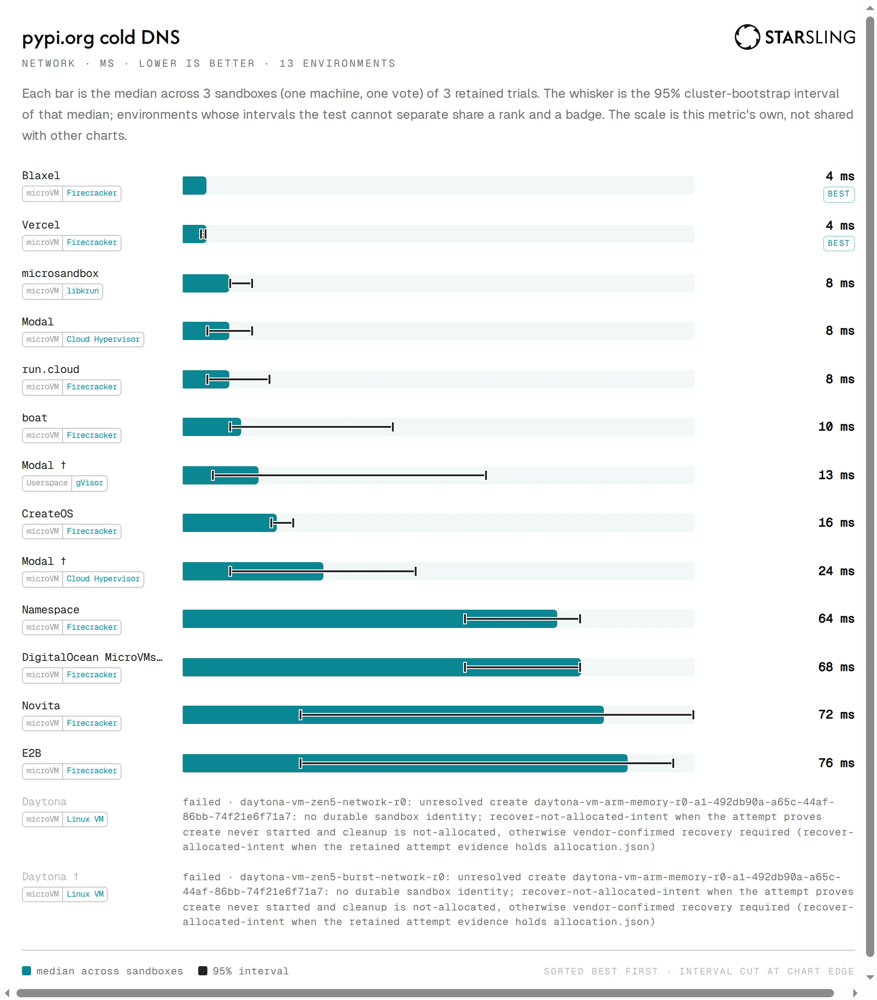

| Rank | Provider | pypi.org cold DNS (ms) | 95% bootstrap interval | Sandboxes | Trials | Note |
| ---: | --- | ---: | ---: | ---: | ---: | --- |
| 1 | Vercel Sandbox | 3 | 0 – 4 | 3 | 3 | — |
| 2 | boat | 7 | 6 – 9 | 3 | 3 | too few sandboxes |
| 3 | Blaxel | 8 | 4 – 23 | 3 | 3 | too few sandboxes |
| 4 | Modal (gVisor) | 14 | 14 – 82 | 3 | 3 | too few sandboxes |
| 5 | Daytona (VM) | 16 | 15 – 17 | 3 | 3 | too few sandboxes |
| 5 | Modal (VM) | 16 | 4 – 24 | 3 | 3 | too few sandboxes, equal medians |
| 7 | CreateOS | 20 | 19 – 20 | 3 | 3 | too few sandboxes |
| 8 | Daytona (container) | 42 | 21 – 54 | 3 | 3 | too few sandboxes |
| 9 | Novita | 56 | 52 – 140 | 3 | 3 | too few sandboxes |
| 10 | E2B | 64 | 24 – 108 | 3 | 3 | too few sandboxes |
| 10 | Microsandbox Cloud | 64 | 4 – 64 | 3 | 3 | too few sandboxes, equal medians |
| 12 | DigitalOcean MicroVMs | 88 | 64 – 92 | 3 | 3 | too few sandboxes |
| 13 | Namespace | 120 | 16 – 132 | 3 | 3 | too few sandboxes |

### rubygems.org cold DNS

ms · lower is better

_boat leads · DigitalOcean MicroVMs is ~2.2× higher (lower is better)._

| Rank | Provider | rubygems.org cold DNS (ms) | 95% bootstrap interval | Sandboxes | Trials | Note |
| ---: | --- | ---: | ---: | ---: | ---: | --- |
| 1 | boat | 20 | 18 – 20 | 3 | 3 | — |
| 2 | DigitalOcean MicroVMs | 44 | 40 – 56 | 3 | 3 | too few sandboxes |
| 3 | Namespace | 52 | 52 – 56 | 3 | 3 | too few sandboxes |
| 4 | Blaxel | 55 | 51 – 55 | 3 | 3 | too few sandboxes |
| 4 | Vercel Sandbox | 55 | 51 – 56 | 3 | 3 | too few sandboxes, equal medians |
| 6 | Daytona (VM) | 60 | 58 – 62 | 3 | 3 | too few sandboxes |
| 7 | Daytona (container) | 67 | 64 – 72 | 3 | 3 | too few sandboxes |
| 8 | CreateOS | 68 | 63 – 71 | 3 | 3 | too few sandboxes |
| 9 | Modal (VM) | 72 | 56 – 76 | 3 | 3 | too few sandboxes |
| 10 | Modal (gVisor) | 74 | 73 – 125 | 3 | 3 | too few sandboxes |
| 11 | Novita | 92 | 68 – 140 | 3 | 3 | too few sandboxes |
| 12 | E2B | 144 | 108 – 176 | 3 | 3 | too few sandboxes |
| 13 | Microsandbox Cloud | 152 | 152 – 156 | 3 | 3 | too few sandboxes |

### Node 22 download

Mbits/sec · higher is better

_Vercel Sandbox leads on median (higher is better); see notes for how ranks are decided._

| Rank | Provider | Node 22 download (Mbits/sec) | 95% bootstrap interval | Sandboxes | Trials | Note |
| ---: | --- | ---: | ---: | ---: | ---: | --- |
| 1 | Vercel Sandbox | 3022 | 2743 – 3063 | 3 | 3 | — |
| 2 | Daytona (VM) | 2887 | 2264 – 3259 | 3 | 3 | too few sandboxes |
| 3 | DigitalOcean MicroVMs | 2661 | 1907 – 2668 | 3 | 3 | too few sandboxes |
| 4 | Blaxel | 2607 | 2512 – 3002 | 3 | 3 | too few sandboxes |
| 5 | Daytona (container) | 2558 | 2469 – 3695 | 3 | 3 | too few sandboxes |
| 6 | Namespace | 2225 | 2119 – 3071 | 3 | 3 | too few sandboxes |
| 7 | Modal (VM) | 2180 | 2122 – 2332 | 3 | 3 | too few sandboxes |
| 8 | Modal (gVisor) | 1523 | 1468 – 1811 | 3 | 3 | too few sandboxes |
| 9 | E2B | 1236 | 180.2 – 1566 | 3 | 3 | too few sandboxes |
| 10 | Novita | 911.6 | 767.5 – 1178 | 3 | 3 | too few sandboxes |
| 11 | CreateOS | 865 | 844 – 868.9 | 3 | 3 | too few sandboxes |
| 12 | boat | 766.6 | 763.2 – 795.2 | 3 | 3 | too few sandboxes |
| 13 | Microsandbox Cloud | 449.8 | 446.9 – 1899 | 3 | 3 | too few sandboxes |

## system

<strong>7 synthetic metrics</strong> · headline: Git common operations

### Git common operations _(headline)_

Seconds · lower is better

_CreateOS leads on median (lower is better); see notes for how ranks are decided._

| Rank | Provider | Git common operations (Seconds) | 95% bootstrap interval | Sandboxes | Trials | Note |
| ---: | --- | ---: | ---: | ---: | ---: | --- |
| 1 | CreateOS | 37.29 | 36.9 – 37.41 | 3 | 6 | — |
| 2 | Modal (VM) | 38.86 | 38.44 – 41.05 | 3 | 6 | too few sandboxes |
| 3 | DigitalOcean MicroVMs | 40.28 | 39.96 – 40.36 | 3 | 6 | too few sandboxes |
| 4 | Namespace | 41.86 | 38.73 – 47.34 | 3 | 6 | too few sandboxes |
| 5 | Modal (gVisor) | 42.38 | 40.28 – 42.84 | 3 | 6 | too few sandboxes |
| 6 | Microsandbox Cloud | 42.65 | 42.43 – 42.84 | 3 | 6 | too few sandboxes |
| 7 | boat | 44.06 | 43.85 – 44.73 | 3 | 6 | too few sandboxes |
| 8 | Novita | 44.39 | 43.86 – 44.52 | 3 | 6 | too few sandboxes |
| 9 | Daytona (container) | 47.52 | 45.49 – 50.49 | 3 | 6 | too few sandboxes |
| 10 | Blaxel | 52.71 | 50.46 – 53.94 | 3 | 6 | too few sandboxes |
| 11 | Daytona (VM) | 60.64 | 60.61 – 61.02 | 3 | 6 | too few sandboxes |
| 12 | Vercel Sandbox | 62.16 | 61.52 – 97.33 | 3 | 6 | too few sandboxes |
| 13 | E2B | 67.47 | 56.79 – 69.28 | 3 | 6 | too few sandboxes |
| 14 | Tangle Sandbox | 78.42 | 78.14 – 78.45 | 3 | 6 | too few sandboxes |

### pgbench RO (s100, 50c)

TPS · higher is better

_Modal (VM) leads · ~1.6× Daytona (VM) on median (higher is better)._

| Rank | Provider | pgbench RO (s100, 50c) (TPS) | 95% bootstrap interval | Sandboxes | Trials | Note |
| ---: | --- | ---: | ---: | ---: | ---: | --- |
| 1 | Modal (VM) | 1092000 | 1081000 – 1123000 | 3 | 6 | — |
| 2 | Daytona (VM) | 669000 | 668600 – 674700 | 3 | 6 | too few sandboxes |
| 3 | Modal (gVisor) | 646800 | 432500 – 654200 | 3 | 6 | too few sandboxes |
| 4 | DigitalOcean MicroVMs | 635400 | 595200 – 666400 | 3 | 6 | too few sandboxes |
| 5 | Novita | 291200 | 288100 – 292300 | 3 | 6 | too few sandboxes |
| 6 | CreateOS | 281200 | 273600 – 282000 | 3 | 6 | too few sandboxes |
| 7 | E2B | 266200 | 159000 – 272900 | 3 | 6 | too few sandboxes |
| 8 | Blaxel | 236200 | 209600 – 253200 | 3 | 6 | too few sandboxes |
| 9 | boat | 232500 | 213600 – 248400 | 3 | 6 | too few sandboxes |
| 10 | Namespace | 210100 | 165300 – 214200 | 3 | 6 | too few sandboxes |
| 11 | Microsandbox Cloud | 204700 | 203500 – 211200 | 3 | 6 | too few sandboxes |
| 12 | Vercel Sandbox | 172200 | 130000 – 183900 | 3 | 6 | too few sandboxes |
| 13 | Daytona (container) | 88900 | 88280 – 99000 | 3 | 6 | too few sandboxes |

### pgbench RO latency (s100, 50c)

ms · lower is better

_Modal (VM) leads · Daytona (VM) is ~1.6× higher (lower is better)._

| Rank | Provider | pgbench RO latency (s100, 50c) (ms) | 95% bootstrap interval | Sandboxes | Trials | Note |
| ---: | --- | ---: | ---: | ---: | ---: | --- |
| 1 | Modal (VM) | 0.046 | 0.0445 – 0.0465 | 3 | 6 | — |
| 2 | Daytona (VM) | 0.0745 | 0.074 – 0.0745 | 3 | 6 | too few sandboxes |
| 3 | Modal (gVisor) | 0.0775 | 0.0765 – 0.1155 | 3 | 6 | too few sandboxes |
| 4 | DigitalOcean MicroVMs | 0.079 | 0.075 – 0.084 | 3 | 6 | too few sandboxes |
| 5 | Novita | 0.1715 | 0.1715 – 0.1735 | 3 | 6 | too few sandboxes |
| 6 | CreateOS | 0.179 | 0.178 – 0.183 | 3 | 6 | too few sandboxes |
| 7 | E2B | 0.188 | 0.183 – 0.316 | 3 | 6 | too few sandboxes |
| 8 | Blaxel | 0.2115 | 0.197 – 0.239 | 3 | 6 | too few sandboxes |
| 9 | boat | 0.215 | 0.2015 – 0.234 | 3 | 6 | too few sandboxes |
| 10 | Namespace | 0.2395 | 0.2335 – 0.3025 | 3 | 6 | too few sandboxes |
| 11 | Microsandbox Cloud | 0.2445 | 0.2375 – 0.247 | 3 | 6 | too few sandboxes |
| 12 | Vercel Sandbox | 0.2905 | 0.272 – 0.3845 | 3 | 6 | too few sandboxes |
| 13 | Daytona (container) | 0.5625 | 0.505 – 0.5665 | 3 | 6 | too few sandboxes |

### pgbench RW (s100, 50c)

TPS · higher is better

_Modal (VM) leads · ~1.5× Modal (gVisor) on median (higher is better)._

| Rank | Provider | pgbench RW (s100, 50c) (TPS) | 95% bootstrap interval | Sandboxes | Trials | Note |
| ---: | --- | ---: | ---: | ---: | ---: | --- |
| 1 | Modal (VM) | 68320 | 62590 – 71960 | 3 | 6 | — |
| 2 | Modal (gVisor) | 45810 | 29800 – 46450 | 3 | 6 | too few sandboxes |
| 3 | Daytona (VM) | 39760 | 38850 – 39820 | 3 | 6 | too few sandboxes |
| 4 | Novita | 26210 | 25380 – 28960 | 3 | 6 | too few sandboxes |
| 5 | Blaxel | 20100 | 17080 – 21240 | 3 | 6 | too few sandboxes |
| 6 | DigitalOcean MicroVMs | 19590 | 17910 – 20330 | 3 | 6 | too few sandboxes |
| 7 | Vercel Sandbox | 17690 | 13170 – 18410 | 3 | 6 | too few sandboxes |
| 8 | Namespace | 16670 | 14680 – 17160 | 3 | 6 | too few sandboxes |
| 9 | CreateOS | 16370 | 15970 – 16460 | 3 | 6 | too few sandboxes |
| 10 | boat | 15810 | 14860 – 18330 | 3 | 6 | too few sandboxes |
| 11 | Microsandbox Cloud | 15270 | 14670 – 16260 | 3 | 6 | too few sandboxes |
| 12 | E2B | 13660 | 9883 – 14600 | 3 | 6 | too few sandboxes |
| 13 | Daytona (container) | 7621 | 5686 – 9465 | 3 | 6 | too few sandboxes |

### pgbench RW latency (s100, 50c)

ms · lower is better

_Modal (VM) leads · Modal (gVisor) is ~1.5× higher (lower is better)._

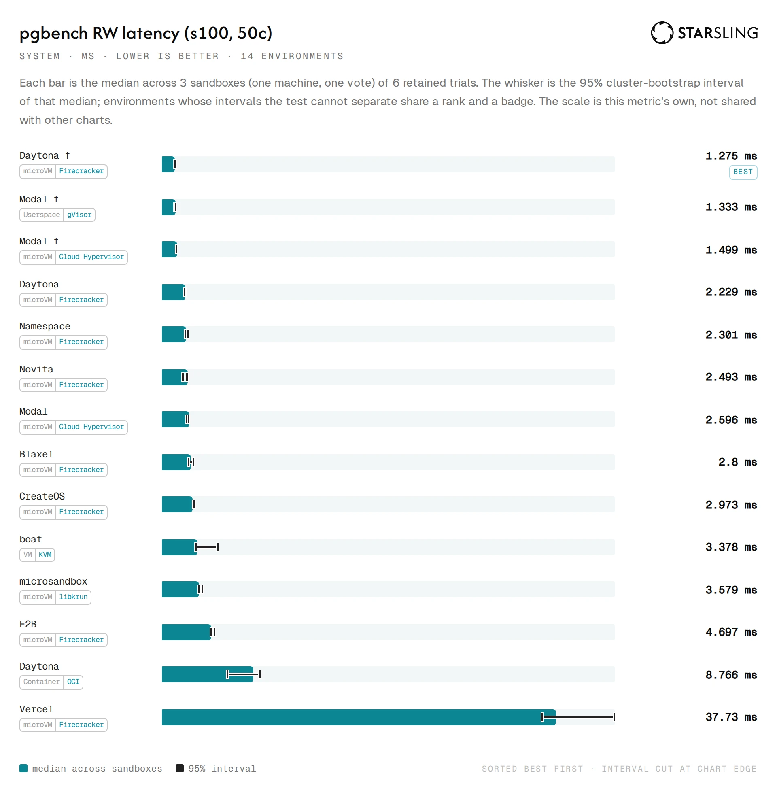

| Rank | Provider | pgbench RW latency (s100, 50c) (ms) | 95% bootstrap interval | Sandboxes | Trials | Note |
| ---: | --- | ---: | ---: | ---: | ---: | --- |
| 1 | Modal (VM) | 0.732 | 0.6955 – 0.799 | 3 | 6 | — |
| 2 | Modal (gVisor) | 1.092 | 1.077 – 1.683 | 3 | 6 | too few sandboxes |
| 3 | Daytona (VM) | 1.257 | 1.256 – 1.288 | 3 | 6 | too few sandboxes |
| 4 | Novita | 1.909 | 1.727 – 1.97 | 3 | 6 | too few sandboxes |
| 5 | Blaxel | 2.487 | 2.353 – 2.929 | 3 | 6 | too few sandboxes |
| 6 | DigitalOcean MicroVMs | 2.563 | 2.46 – 2.792 | 3 | 6 | too few sandboxes |
| 7 | Vercel Sandbox | 2.834 | 2.716 – 3.801 | 3 | 6 | too few sandboxes |
| 8 | Namespace | 3.018 | 2.939 – 3.406 | 3 | 6 | too few sandboxes |
| 9 | CreateOS | 3.075 | 3.044 – 3.137 | 3 | 6 | too few sandboxes |
| 10 | boat | 3.163 | 2.728 – 3.365 | 3 | 6 | too few sandboxes |
| 11 | Microsandbox Cloud | 3.284 | 3.079 – 3.409 | 3 | 6 | too few sandboxes |
| 12 | E2B | 3.66 | 3.428 – 5.066 | 3 | 6 | too few sandboxes |
| 13 | Daytona (container) | 6.562 | 5.288 – 8.804 | 3 | 6 | too few sandboxes |

### PyBench

Milliseconds · lower is better

_Namespace leads · Daytona (VM) is ~1.2× higher (lower is better)._

| Rank | Provider | PyBench (Milliseconds) | 95% bootstrap interval | Sandboxes | Trials | Note |
| ---: | --- | ---: | ---: | ---: | ---: | --- |
| 1 | Namespace | 376.5 | 374 – 385 | 3 | 6 | — |
| 2 | Daytona (VM) | 434 | 431.5 – 435 | 3 | 6 | too few sandboxes |
| 3 | Modal (VM) | 436.5 | 434.5 – 439 | 3 | 6 | too few sandboxes |
| 4 | Modal (gVisor) | 437 | 436 – 438.5 | 3 | 6 | too few sandboxes |
| 5 | DigitalOcean MicroVMs | 445.5 | 445 – 446 | 3 | 6 | too few sandboxes |
| 6 | Novita | 480 | 480 – 483 | 3 | 6 | too few sandboxes |
| 7 | Microsandbox Cloud | 487 | 485 – 491 | 3 | 6 | too few sandboxes |
| 8 | boat | 490.5 | 489 – 495 | 3 | 6 | too few sandboxes |
| 9 | Blaxel | 526 | 525.5 – 526 | 3 | 6 | too few sandboxes |
| 10 | CreateOS | 555.5 | 554 – 564.5 | 3 | 6 | too few sandboxes |
| 11 | Daytona (container) | 607 | 601 – 643 | 3 | 6 | too few sandboxes |
| 12 | Vercel Sandbox | 765.5 | 765.5 – 1212 | 3 | 6 | too few sandboxes |
| 13 | E2B | 807 | 544.5 – 807 | 3 | 6 | too few sandboxes |
| 14 | Tangle Sandbox | 1146 | 1143 – 1149 | 3 | 6 | too few sandboxes |

### SQLite Speedtest

Seconds · lower is better

_Daytona (VM) leads on median (lower is better); see notes for how ranks are decided._

| Rank | Provider | SQLite Speedtest (Seconds) | 95% bootstrap interval | Sandboxes | Trials | Note |
| ---: | --- | ---: | ---: | ---: | ---: | --- |
| 1 | Daytona (VM) | 35.74 | 35.52 – 35.99 | 3 | 6 | — |
| 2 | CreateOS | 36.81 | 36.01 – 37.98 | 3 | 6 | too few sandboxes |
| 3 | DigitalOcean MicroVMs | 39.3 | 39.19 – 39.32 | 3 | 6 | too few sandboxes |
| 4 | Namespace | 42.13 | 41.46 – 42.89 | 3 | 6 | too few sandboxes |
| 5 | Novita | 42.38 | 41.08 – 42.47 | 3 | 6 | too few sandboxes |
| 6 | Modal (VM) | 51.33 | 36.48 – 51.7 | 3 | 6 | too few sandboxes |
| 7 | Blaxel | 52.37 | 48.15 – 53.67 | 3 | 6 | too few sandboxes |
| 8 | Microsandbox Cloud | 57.07 | 55.23 – 57.2 | 3 | 6 | too few sandboxes |
| 9 | Vercel Sandbox | 65.72 | 64.34 – 132.4 | 3 | 6 | too few sandboxes |
| 10 | E2B | 75.54 | 54.22 – 79.26 | 3 | 6 | too few sandboxes |
| 11 | Modal (gVisor) | 78.06 | 75.65 – 92.02 | 3 | 6 | too few sandboxes |
| 12 | boat | 81.3 | 79.09 – 89.06 | 3 | 6 | too few sandboxes |
| 13 | Daytona (container) | 115.8 | 111.5 – 117.9 | 3 | 6 | too few sandboxes |
| 14 | Tangle Sandbox | 134.3 | 134.1 – 134.8 | 3 | 6 | too few sandboxes |

## economics

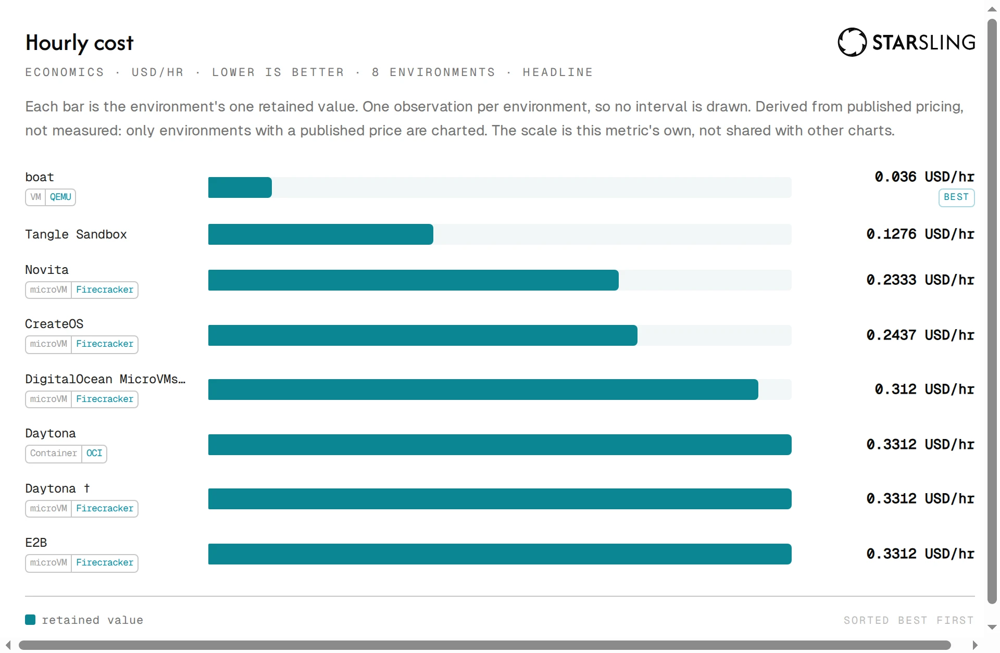

### Hourly cost _(headline)_

USD/hr · lower is better

_boat is cheapest · Tangle Sandbox is ~3.5× higher (lower is better)._

| Rank | Provider | Hourly cost (USD/hr) | 95% bootstrap interval | Sandboxes | Trials | Note |
| ---: | --- | ---: | ---: | ---: | ---: | --- |
| 1 | boat | 0.036 | — | 1 | 1 | — |
| 2 | Tangle Sandbox | 0.1276 | — | 1 | 1 | — |
| 3 | Novita | 0.2333 | — | 1 | 1 | — |
| 4 | CreateOS | 0.2437 | — | 1 | 1 | — |
| 5 | DigitalOcean MicroVMs | 0.312 | — | 1 | 1 | — |
| 6 | Daytona (container) | 0.3312 | — | 1 | 1 | — |
| 6 | Daytona (VM) | 0.3312 | — | 1 | 1 | equal values |
| 6 | E2B | 0.3312 | — | 1 | 1 | equal values |

## Measured cost

**Billed by the provider, not priced from a catalog.** Each figure is what the provider's own
billing API reported for one benchmark sandbox after teardown — every resource it billed, CPU
burst above the request included — scoped to that sandbox alone. The `economics` section prices
the requested 4 vCPU · 8 GiB reservation from published rates; these are bills for what
each sandbox actually used, so the two are never ranked together. A sandbox without an observed
record is **unmeasured**, never zero, and a total is printed only when every sandbox in its scope
was measured.

| Provider | Measured sandboxes | Total billed | Unmeasured |
| --- | ---: | ---: | --- |
| Daytona (container) | 45 of 56 | unmeasured | 11 × `provider_api_error` |
| Daytona (VM) | 0 of 56 | unmeasured | 56 × `provider_api_error` |
| Modal (gVisor) | 55 of 55 | 12.7 USD | — |
| Modal (VM) | 56 of 56 | 15.54 USD | — |

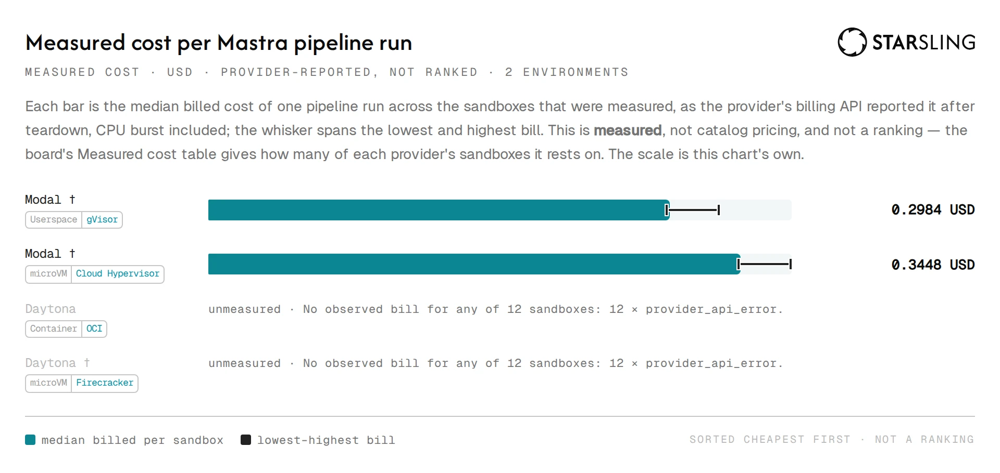

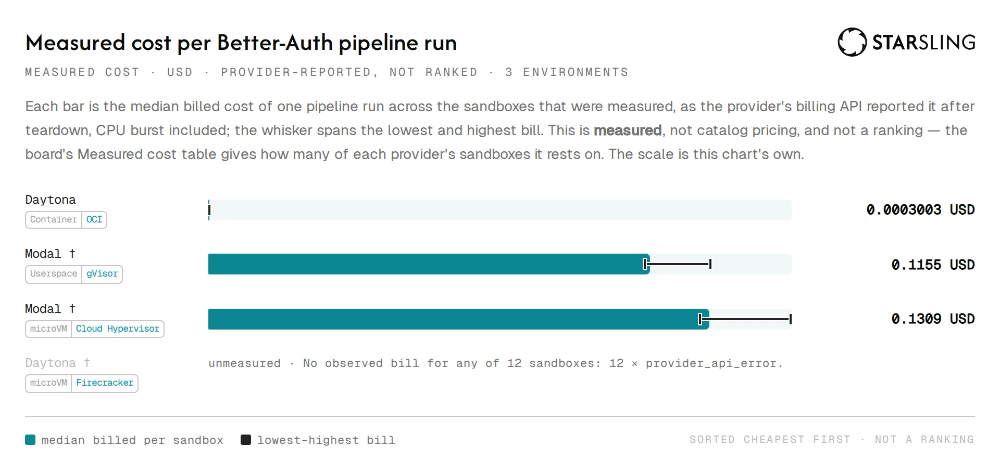

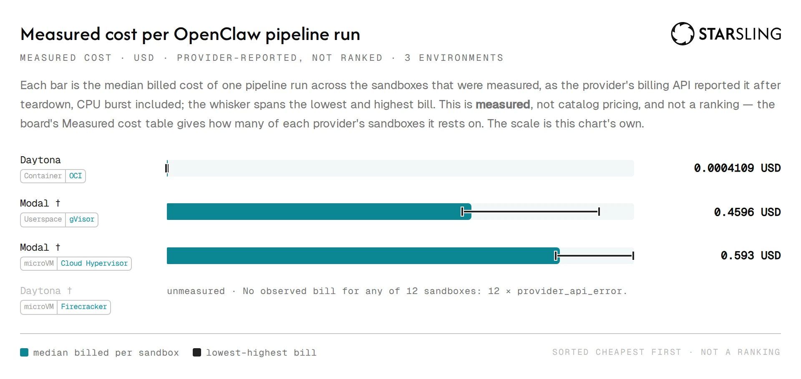

Measured cost per suite: median per sandbox (one realworld sandbox = one pipeline run)

Each value is the median across the suite's measured sandboxes, and the range is their lowest and
highest bill. A realworld sandbox runs its pipeline once, so its figure is the billed cost of one
pipeline run. Where fewer sandboxes were measured than ran, the median rests on the measured ones
only — read it beside the coverage column — and the suite total stays unmeasured.

| Provider | Suite | Median per sandbox | Range | Measured sandboxes | Suite total | Unmeasured | Source |
| --- | --- | ---: | ---: | ---: | ---: | --- | --- |
| Daytona (container) | realworld-mastra _(per pipeline run)_ | 0.0005124 USD | 0.0002167 – 0.007671 | 9 of 12 | unmeasured | 3 × `provider_api_error` | provider-reported |
| Daytona (container) | realworld-better-auth _(per pipeline run)_ | 0.0005112 USD | 0.0002703 – 0.001052 | 8 of 12 | unmeasured | 4 × `provider_api_error` | provider-reported |
| Daytona (container) | realworld-openclaw _(per pipeline run)_ | 0.0003325 USD | 0.0002196 – 0.0006534 | 12 of 12 | 0.004327 USD | — | provider-reported |
| Daytona (container) | cpu-node | 0.024 USD | 0.0234 – 0.04497 | 5 of 5 | 0.1413 USD | — | provider-reported |
| Daytona (container) | system | 0.04836 USD | 0.04758 – 0.05018 | 3 of 3 | 0.1461 USD | — | provider-reported |
| Daytona (container) | pgbench | 0.0808 USD | 0.06604 – 0.0828 | 3 of 3 | 0.2296 USD | — | provider-reported |
| Daytona (container) | memory | 0.02976 USD | — | 1 of 3 | unmeasured | 2 × `provider_api_error` | provider-reported |
| Daytona (container) | disk | 0.105 USD | — | 1 of 3 | unmeasured | 2 × `provider_api_error` | provider-reported |
| Daytona (container) | network | 0.03637 USD | 0.03547 – 0.04947 | 3 of 3 | 0.1213 USD | — | provider-reported |
| Modal (gVisor) | realworld-mastra _(per pipeline run)_ | 0.2976 USD | 0.2909 – 0.3125 | 12 of 12 | 3.584 USD | — | provider-reported |
| Modal (gVisor) | realworld-better-auth _(per pipeline run)_ | 0.1123 USD | 0.1102 – 0.122 | 12 of 12 | 1.368 USD | — | provider-reported |
| Modal (gVisor) | realworld-openclaw _(per pipeline run)_ | 0.4557 USD | 0.4369 – 0.4882 | 12 of 12 | 5.486 USD | — | provider-reported |
| Modal (gVisor) | cpu-node | 0.03804 USD | 0.03755 – 0.04018 | 5 of 5 | 0.1919 USD | — | provider-reported |
| Modal (gVisor) | system | 0.06896 USD | 0.06543 – 0.07177 | 3 of 3 | 0.2062 USD | — | provider-reported |
| Modal (gVisor) | pgbench | 0.3829 USD | 0.3635 – 0.3884 | 3 of 3 | 1.135 USD | — | provider-reported |
| Modal (gVisor) | memory | 0.02398 USD | 0.02122 – 0.02406 | 3 of 3 | 0.06927 USD | — | provider-reported |
| Modal (gVisor) | disk | 0.2306 USD | 0.2304 – 0.2308 | 2 of 2 | 0.4612 USD | — | provider-reported |
| Modal (gVisor) | network | 0.0639 USD | 0.06329 – 0.06797 | 3 of 3 | 0.1952 USD | — | provider-reported |
| Modal (VM) | realworld-mastra _(per pipeline run)_ | 0.3374 USD | 0.03248 – 0.3463 | 12 of 12 | 3.764 USD | — | provider-reported |
| Modal (VM) | realworld-better-auth _(per pipeline run)_ | 0.1261 USD | 0.1241 – 0.1308 | 12 of 12 | 1.525 USD | — | provider-reported |
| Modal (VM) | realworld-openclaw _(per pipeline run)_ | 0.6344 USD | 0.5842 – 0.6641 | 12 of 12 | 7.569 USD | — | provider-reported |
| Modal (VM) | cpu-node | 0.04715 USD | 0.04623 – 0.04763 | 5 of 5 | 0.2355 USD | — | provider-reported |
| Modal (VM) | system | 0.0742 USD | 0.07415 – 0.07897 | 3 of 3 | 0.2273 USD | — | provider-reported |
| Modal (VM) | pgbench | 0.4317 USD | 0.428 – 0.4331 | 3 of 3 | 1.293 USD | — | provider-reported |
| Modal (VM) | memory | 0.02873 USD | 0.0276 – 0.03214 | 3 of 3 | 0.08846 USD | — | provider-reported |
| Modal (VM) | disk | 0.2004 USD | 0.1973 – 0.203 | 3 of 3 | 0.6007 USD | — | provider-reported |
| Modal (VM) | network | 0.07963 USD | 0.07597 – 0.08322 | 3 of 3 | 0.2388 USD | — | provider-reported |

## Coverage gaps

203 uncovered results across 13 providers (Baseten Sandboxes 18, Blaxel 2, Brezel 56, CreateOS 2, Daytona (container) 6, Freestyle 9, Microsandbox Cloud 10, Modal (gVisor) 4, Modal (VM) 2, Novita 3, run.cloud 9, tama 65, Tangle Sandbox 17). A gap is a missing result — the provider **failing to cover** that workload — never a tie or a zero.

Full coverage table

| Provider | Benchmark | Outcome | Detail |
| --- | --- | --- | --- |
| Daytona (container) | realworld-better-auth | ❌ **disk** (skipped) | Insufficient disk: 10.0 GiB free, suite needs 10 GiB |
| Daytona (container) | realworld-mastra | ❌ **disk** (skipped) | Insufficient disk: 10.0 GiB free, suite needs 30 GiB |
| Daytona (container) | realworld-openclaw | ❌ **disk** (skipped) | Insufficient disk: 10.0 GiB free, suite needs 25 GiB |
| Tangle Sandbox | pgbench | **skipped** | pts_pgbench-read-only: could not claim the root-owned baked postgres data dir (needs sudo) |
| Tangle Sandbox | pgbench | **skipped** | pts_pgbench-read-write: could not claim the root-owned baked postgres data dir (needs sudo) |
| Tangle Sandbox | realworld-better-auth | **skipped** | pts_realworld-better-auth: PTS install of local/realworld-better-auth-1.0.0 failed (exit 0, not in list-installed-tests) |
| Tangle Sandbox | realworld-mastra | **skipped** | pts_realworld-mastra: PTS install of local/realworld-mastra-1.0.0 failed (exit 0, not in list-installed-tests) |
| Tangle Sandbox | realworld-openclaw | **skipped** | pts_realworld-openclaw: PTS install of local/realworld-openclaw-1.0.0 failed (exit 0, not in list-installed-tests) |
| Baseten Sandboxes | cpu-node | **failed** | Failed to create sandbox: computesdk create failed: sandbox API error (HTTP 403) FORBIDDEN: This API key does not have permission to perform this operation. |
| Baseten Sandboxes | cpu-node | **failed** | Partial publication withheld unverified measurements: node_web_tooling_runs_per_s |
| Baseten Sandboxes | disk | **failed** | Failed to create sandbox: computesdk create failed: sandbox API error (HTTP 403) FORBIDDEN: This API key does not have permission to perform this operation. |
| Baseten Sandboxes | disk | **failed** | Partial publication withheld unverified measurements: hardlink_bogo_ops_per_s, fio_type_sequential_read_engine_linux_aio_direct_yes_block_size_1mb_job_count_1_disk_target_default_test_directory_mb_per_s, fio_type_sequential_read_engine_linux_aio_direct_yes_block_size_1mb_job_count_1_disk_target_default_test_directory_iops, fio_type_sequential_write_engine_linux_aio_direct_yes_block_size_1mb_job_count_1_disk_target_default_test_directory_mb_per_s, fio_type_sequential_write_engine_linux_aio_direct_yes_block_size_1mb_job_count_1_disk_target_default_test_directory_iops, fio_type_random_read_engine_linux_aio_direct_yes_block_size_4kb_job_count_1_disk_target_default_test_directory_mb_per_s, fio_type_random_read_engine_linux_aio_direct_yes_block_size_4kb_job_count_1_disk_target_default_test_directory_iops, fio_type_random_write_engine_linux_aio_direct_yes_block_size_4kb_job_count_1_disk_target_default_test_directory_mb_per_s, fio_type_random_write_engine_linux_aio_direct_yes_block_size_4kb_job_count_1_disk_target_default_test_directory_iops |
| Baseten Sandboxes | network | **failed** | Failed to create sandbox: computesdk create failed: sandbox API error (HTTP 403) FORBIDDEN: This API key does not have permission to perform this operation. |
| Baseten Sandboxes | network | **failed** | Partial publication withheld unverified measurements: iperf_server_address_localhost_server_port_5201_duration_10_seconds_test_tcp_parallel_1, iperf_server_address_localhost_server_port_5201_duration_10_seconds_test_tcp_parallel_10, iperf_server_address_localhost_server_port_5201_duration_10_seconds_test_udp_10000mbit_objective_parallel_1, iperf_wan_direction_download, iperf_wan_direction_upload, network_https_github_com_total_ms, network_https_api_github_com_total_ms, network_https_raw_githubusercontent_com_total_ms, network_https_registry_npmjs_org_total_ms, network_https_pypi_org_total_ms, network_https_files_pythonhosted_org_total_ms, network_https_ghcr_io_v2_total_ms, network_https_gcr_io_v2_total_ms, network_https_auth_docker_io_registry_token_total_ms, network_https_crates_io_total_ms, network_https_index_crates_io_config_total_ms, network_dns_cold_github_com_ms, network_dns_cold_registry_npmjs_org_ms, network_dns_cold_docker_io_ms, network_dns_cold_pypi_org_ms, network_dns_cold_rubygems_org_ms, network_download_node_v22_23_1_linux_x64_mbits_per_sec |
| Baseten Sandboxes | pgbench | **failed** | Failed to create sandbox: computesdk create failed: sandbox API error (HTTP 403) FORBIDDEN: This API key does not have permission to perform this operation. |
| Baseten Sandboxes | pgbench | **failed** | Partial publication withheld unverified measurements: pgbench_scaling_factor_100_clients_50_mode_read_only, pgbench_scaling_factor_100_clients_50_mode_read_only_average_latency, pgbench_scaling_factor_100_clients_50_mode_read_write, pgbench_scaling_factor_100_clients_50_mode_read_write_average_latency |
| Baseten Sandboxes | realworld-better-auth | **failed** | Failed to create sandbox: computesdk create failed: sandbox API error (HTTP 403) FORBIDDEN: This API key does not have permission to perform this operation. |
| Baseten Sandboxes | realworld-better-auth | **failed** | Partial publication withheld unverified measurements: realworld_better_auth_task_git_clone, realworld_better_auth_task_cold_install, realworld_better_auth_task_lint_biome, realworld_better_auth_task_lint_deps_knip, realworld_better_auth_task_lint_format, realworld_better_auth_task_lint_spell, realworld_better_auth_task_lint_types, realworld_better_auth_task_lint_packages, realworld_better_auth_task_typecheck, realworld_better_auth_task_build |
| Baseten Sandboxes | realworld-better-auth | **failed** | Step "mise run benchmark:realworld:pts:better-auth" lost its sandbox: 12 consecutive detached polls failed (last: computesdk filesystem exists failed: sandbox API error (HTTP 403)) — the sandbox stopped responding, not a quiet long step |
| Baseten Sandboxes | realworld-mastra | **failed** | Step "REALWORLD_TASK_TIMEOUT_SECONDS=2400 mise run benchmark:realworld:pts:mastra" lost its sandbox: 12 consecutive detached polls failed (last: computesdk filesystem exists failed: sandbox API error (HTTP 403)) — the sandbox stopped responding, not a quiet long step |
| Baseten Sandboxes | realworld-mastra | **failed** | Partial publication withheld unverified measurements: realworld_mastra_task_git_clone, realworld_mastra_task_cold_install, realworld_mastra_task_lint_format, realworld_mastra_task_build_core, realworld_mastra_task_test_core |
| Baseten Sandboxes | realworld-mastra | **failed** | Failed to create sandbox: computesdk create failed: sandbox API error (HTTP 403) FORBIDDEN: This API key does not have permission to perform this operation. |
| Baseten Sandboxes | realworld-openclaw | **failed** | Failed to create sandbox: computesdk create failed: sandbox API error (HTTP 403) FORBIDDEN: This API key does not have permission to perform this operation. |
| Baseten Sandboxes | realworld-openclaw | **failed** | Partial publication withheld unverified measurements: realworld_openclaw_task_git_clone, realworld_openclaw_task_cold_install, realworld_openclaw_task_lint_oxlint, realworld_openclaw_task_lint_extensions_all, realworld_openclaw_task_typecheck, realworld_openclaw_task_test_types |
| Baseten Sandboxes | system | **failed** | Failed to create sandbox: computesdk create failed: sandbox API error (HTTP 403) FORBIDDEN: This API key does not have permission to perform this operation. |
| Baseten Sandboxes | system | **failed** | Partial publication withheld unverified measurements: pybench_milliseconds, sqlite_speedtest_seconds, git_seconds |
| Blaxel | realworld-mastra | **failed** | PTS ran but every trial failed for 1 of 5 declared metrics: realworld_mastra_task_test_core (realworld-mastra/pts_realworld-mastra.xml) — attempted, no value recorded |
| Blaxel | realworld-mastra | **failed** | Partial publication withheld unverified measurements: realworld_mastra_task_test_core |
| Brezel | cpu-node | **failed** | brezel-cpu-node-r0: brezel ComputeSDK inventory list callback failed |
| Brezel | cpu-node | **failed** | brezel-cpu-node-r1: brezel ComputeSDK inventory list callback failed |
| Brezel | cpu-node | **failed** | brezel-cpu-node-r2: brezel ComputeSDK inventory list callback failed |
| Brezel | cpu-node | **failed** | brezel-cpu-node-r3: brezel ComputeSDK inventory list callback failed |
| Brezel | cpu-node | **failed** | brezel-cpu-node-r4: brezel ComputeSDK inventory list callback failed |
| Brezel | disk | **failed** | brezel-disk-r0: brezel ComputeSDK inventory list callback failed |
| Brezel | disk | **failed** | brezel-disk-r1: brezel ComputeSDK inventory list callback failed |
| Brezel | disk | **failed** | brezel-disk-r2: brezel ComputeSDK inventory list callback failed |
| Brezel | memory | **failed** | brezel-memory-r0: brezel ComputeSDK inventory list callback failed |
| Brezel | memory | **failed** | brezel-memory-r1: brezel ComputeSDK inventory list callback failed |
| Brezel | memory | **failed** | brezel-memory-r2: brezel ComputeSDK inventory list callback failed |
| Brezel | network | **failed** | brezel-network-r0: brezel ComputeSDK inventory list callback failed |
| Brezel | network | **failed** | brezel-network-r1: brezel ComputeSDK inventory list callback failed |
| Brezel | network | **failed** | brezel-network-r2: brezel ComputeSDK inventory list callback failed |
| Brezel | pgbench | **failed** | brezel-pgbench-r0: brezel ComputeSDK inventory list callback failed |
| Brezel | pgbench | **failed** | brezel-pgbench-r1: brezel ComputeSDK inventory list callback failed |
| Brezel | pgbench | **failed** | brezel-pgbench-r2: brezel ComputeSDK inventory list callback failed |
| Brezel | realworld-better-auth | **failed** | brezel-realworld-better-auth-r0: brezel ComputeSDK inventory list callback failed |
| Brezel | realworld-better-auth | **failed** | brezel-realworld-better-auth-r1: brezel ComputeSDK inventory list callback failed |
| Brezel | realworld-better-auth | **failed** | brezel-realworld-better-auth-r10: brezel ComputeSDK inventory list callback failed |
| Brezel | realworld-better-auth | **failed** | brezel-realworld-better-auth-r11: brezel ComputeSDK inventory list callback failed |
| Brezel | realworld-better-auth | **failed** | brezel-realworld-better-auth-r2: brezel ComputeSDK inventory list callback failed |
| Brezel | realworld-better-auth | **failed** | brezel-realworld-better-auth-r3: brezel ComputeSDK inventory list callback failed |
| Brezel | realworld-better-auth | **failed** | brezel-realworld-better-auth-r4: brezel ComputeSDK inventory list callback failed |
| Brezel | realworld-better-auth | **failed** | brezel-realworld-better-auth-r5: brezel ComputeSDK inventory list callback failed |
| Brezel | realworld-better-auth | **failed** | brezel-realworld-better-auth-r6: brezel ComputeSDK inventory list callback failed |
| Brezel | realworld-better-auth | **failed** | brezel-realworld-better-auth-r7: brezel ComputeSDK inventory list callback failed |
| Brezel | realworld-better-auth | **failed** | brezel-realworld-better-auth-r8: brezel ComputeSDK inventory list callback failed |
| Brezel | realworld-better-auth | **failed** | brezel-realworld-better-auth-r9: brezel ComputeSDK inventory list callback failed |
| Brezel | realworld-mastra | **failed** | brezel-realworld-mastra-r0: brezel ComputeSDK inventory list callback failed |
| Brezel | realworld-mastra | **failed** | brezel-realworld-mastra-r1: brezel ComputeSDK inventory list callback failed |
| Brezel | realworld-mastra | **failed** | brezel-realworld-mastra-r10: brezel ComputeSDK inventory list callback failed |
| Brezel | realworld-mastra | **failed** | brezel-realworld-mastra-r11: brezel ComputeSDK inventory list callback failed |
| Brezel | realworld-mastra | **failed** | brezel-realworld-mastra-r2: brezel ComputeSDK inventory list callback failed |
| Brezel | realworld-mastra | **failed** | brezel-realworld-mastra-r3: brezel ComputeSDK inventory list callback failed |
| Brezel | realworld-mastra | **failed** | brezel-realworld-mastra-r4: brezel ComputeSDK inventory list callback failed |
| Brezel | realworld-mastra | **failed** | brezel-realworld-mastra-r5: brezel ComputeSDK inventory list callback failed |
| Brezel | realworld-mastra | **failed** | brezel-realworld-mastra-r6: brezel ComputeSDK inventory list callback failed |
| Brezel | realworld-mastra | **failed** | brezel-realworld-mastra-r7: brezel ComputeSDK inventory list callback failed |
| Brezel | realworld-mastra | **failed** | brezel-realworld-mastra-r8: brezel ComputeSDK inventory list callback failed |
| Brezel | realworld-mastra | **failed** | brezel-realworld-mastra-r9: brezel ComputeSDK inventory list callback failed |
| Brezel | realworld-openclaw | **failed** | brezel-realworld-openclaw-r0: brezel ComputeSDK inventory list callback failed |
| Brezel | realworld-openclaw | **failed** | brezel-realworld-openclaw-r1: brezel ComputeSDK inventory list callback failed |
| Brezel | realworld-openclaw | **failed** | brezel-realworld-openclaw-r10: brezel ComputeSDK inventory list callback failed |
| Brezel | realworld-openclaw | **failed** | brezel-realworld-openclaw-r11: brezel ComputeSDK inventory list callback failed |
| Brezel | realworld-openclaw | **failed** | brezel-realworld-openclaw-r2: brezel ComputeSDK inventory list callback failed |
| Brezel | realworld-openclaw | **failed** | brezel-realworld-openclaw-r3: brezel ComputeSDK inventory list callback failed |
| Brezel | realworld-openclaw | **failed** | brezel-realworld-openclaw-r4: brezel ComputeSDK inventory list callback failed |
| Brezel | realworld-openclaw | **failed** | brezel-realworld-openclaw-r5: brezel ComputeSDK inventory list callback failed |
| Brezel | realworld-openclaw | **failed** | brezel-realworld-openclaw-r6: brezel ComputeSDK inventory list callback failed |
| Brezel | realworld-openclaw | **failed** | brezel-realworld-openclaw-r7: brezel ComputeSDK inventory list callback failed |
| Brezel | realworld-openclaw | **failed** | brezel-realworld-openclaw-r8: brezel ComputeSDK inventory list callback failed |
| Brezel | realworld-openclaw | **failed** | brezel-realworld-openclaw-r9: brezel ComputeSDK inventory list callback failed |
| Brezel | system | **failed** | brezel-system-r0: brezel ComputeSDK inventory list callback failed |
| Brezel | system | **failed** | brezel-system-r1: brezel ComputeSDK inventory list callback failed |
| Brezel | system | **failed** | brezel-system-r2: brezel ComputeSDK inventory list callback failed |
| CreateOS | realworld-openclaw | **failed** | Failed to create sandbox: computesdk create failed: service unavailable |
| CreateOS | realworld-openclaw | **failed** | Partial publication withheld unverified measurements: realworld_openclaw_task_git_clone, realworld_openclaw_task_cold_install, realworld_openclaw_task_lint_oxlint, realworld_openclaw_task_lint_extensions_all, realworld_openclaw_task_typecheck, realworld_openclaw_task_test_types |
| Daytona (container) | realworld-better-auth | **failed** | Partial publication withheld unverified measurements: realworld_better_auth_task_git_clone, realworld_better_auth_task_cold_install, realworld_better_auth_task_lint_biome, realworld_better_auth_task_lint_deps_knip, realworld_better_auth_task_lint_format, realworld_better_auth_task_lint_spell, realworld_better_auth_task_lint_types, realworld_better_auth_task_lint_packages, realworld_better_auth_task_typecheck, realworld_better_auth_task_build |
| Daytona (container) | realworld-mastra | **failed** | Partial publication withheld unverified measurements: realworld_mastra_task_git_clone, realworld_mastra_task_cold_install, realworld_mastra_task_lint_format, realworld_mastra_task_build_core, realworld_mastra_task_test_core |
| Daytona (container) | realworld-openclaw | **failed** | Partial publication withheld unverified measurements: realworld_openclaw_task_git_clone, realworld_openclaw_task_cold_install, realworld_openclaw_task_lint_oxlint, realworld_openclaw_task_lint_extensions_all, realworld_openclaw_task_typecheck, realworld_openclaw_task_test_types |
| Freestyle | cpu-node | **failed** | Publication withheld for freestyle: unresolved cleanup: freestyle-memory-r0-a1-9cdb4aab-8254-49c2-a03d-b34e5c97fb24; unresolved cleanup: freestyle-memory-r2-a1-a3f40368-e3d6-49a2-8bfd-dd4d54e9d5eb; unresolved cleanup: freestyle-memory-r1-a1-da22f973-1374-40e2-8c7c-a7b127e8b6ac |
| Freestyle | disk | **failed** | Publication withheld for freestyle: unresolved cleanup: freestyle-memory-r0-a1-9cdb4aab-8254-49c2-a03d-b34e5c97fb24; unresolved cleanup: freestyle-memory-r2-a1-a3f40368-e3d6-49a2-8bfd-dd4d54e9d5eb; unresolved cleanup: freestyle-memory-r1-a1-da22f973-1374-40e2-8c7c-a7b127e8b6ac |
| Freestyle | memory | **failed** | Publication withheld for freestyle: unresolved cleanup: freestyle-memory-r0-a1-9cdb4aab-8254-49c2-a03d-b34e5c97fb24; unresolved cleanup: freestyle-memory-r2-a1-a3f40368-e3d6-49a2-8bfd-dd4d54e9d5eb; unresolved cleanup: freestyle-memory-r1-a1-da22f973-1374-40e2-8c7c-a7b127e8b6ac |
| Freestyle | network | **failed** | Publication withheld for freestyle: unresolved cleanup: freestyle-memory-r0-a1-9cdb4aab-8254-49c2-a03d-b34e5c97fb24; unresolved cleanup: freestyle-memory-r2-a1-a3f40368-e3d6-49a2-8bfd-dd4d54e9d5eb; unresolved cleanup: freestyle-memory-r1-a1-da22f973-1374-40e2-8c7c-a7b127e8b6ac |
| Freestyle | pgbench | **failed** | Publication withheld for freestyle: unresolved cleanup: freestyle-memory-r0-a1-9cdb4aab-8254-49c2-a03d-b34e5c97fb24; unresolved cleanup: freestyle-memory-r2-a1-a3f40368-e3d6-49a2-8bfd-dd4d54e9d5eb; unresolved cleanup: freestyle-memory-r1-a1-da22f973-1374-40e2-8c7c-a7b127e8b6ac |
| Freestyle | realworld-better-auth | **failed** | Publication withheld for freestyle: unresolved cleanup: freestyle-memory-r0-a1-9cdb4aab-8254-49c2-a03d-b34e5c97fb24; unresolved cleanup: freestyle-memory-r2-a1-a3f40368-e3d6-49a2-8bfd-dd4d54e9d5eb; unresolved cleanup: freestyle-memory-r1-a1-da22f973-1374-40e2-8c7c-a7b127e8b6ac |
| Freestyle | realworld-mastra | **failed** | Publication withheld for freestyle: unresolved cleanup: freestyle-memory-r0-a1-9cdb4aab-8254-49c2-a03d-b34e5c97fb24; unresolved cleanup: freestyle-memory-r2-a1-a3f40368-e3d6-49a2-8bfd-dd4d54e9d5eb; unresolved cleanup: freestyle-memory-r1-a1-da22f973-1374-40e2-8c7c-a7b127e8b6ac |
| Freestyle | realworld-openclaw | **failed** | Publication withheld for freestyle: unresolved cleanup: freestyle-memory-r0-a1-9cdb4aab-8254-49c2-a03d-b34e5c97fb24; unresolved cleanup: freestyle-memory-r2-a1-a3f40368-e3d6-49a2-8bfd-dd4d54e9d5eb; unresolved cleanup: freestyle-memory-r1-a1-da22f973-1374-40e2-8c7c-a7b127e8b6ac |
| Freestyle | system | **failed** | Publication withheld for freestyle: unresolved cleanup: freestyle-memory-r0-a1-9cdb4aab-8254-49c2-a03d-b34e5c97fb24; unresolved cleanup: freestyle-memory-r2-a1-a3f40368-e3d6-49a2-8bfd-dd4d54e9d5eb; unresolved cleanup: freestyle-memory-r1-a1-da22f973-1374-40e2-8c7c-a7b127e8b6ac |
| Microsandbox Cloud | realworld-openclaw | **failed** | Failed to create sandbox: computesdk create failed: runtime error: cloud sandbox "bench-cloud-44f5da8c-7ba3-4d2b-b187-8d941f5d4082" did not reach running before the readiness wait expired |
| Microsandbox Cloud | realworld-openclaw | **failed** | Partial publication withheld unverified measurements: realworld_openclaw_task_git_clone, realworld_openclaw_task_cold_install, realworld_openclaw_task_lint_oxlint, realworld_openclaw_task_lint_extensions_all, realworld_openclaw_task_typecheck, realworld_openclaw_task_test_types |
| Microsandbox Cloud | realworld-openclaw | **failed** | Failed to create sandbox: computesdk create failed: runtime error: cloud sandbox "bench-cloud-d125e48d-6da3-4161-82a4-0c21c99beb3f" did not reach running before the readiness wait expired |
| Microsandbox Cloud | realworld-openclaw | **failed** | Failed to create sandbox: computesdk create failed: runtime error: cloud sandbox "bench-cloud-31db0507-c066-4231-b2be-a76febd03184" did not reach running before the readiness wait expired |
| Microsandbox Cloud | realworld-openclaw | **failed** | Failed to create sandbox: computesdk create failed: runtime error: cloud sandbox "bench-cloud-7e314ff9-e35c-4240-a862-1189fc5767b4" did not reach running before the readiness wait expired |
| Microsandbox Cloud | realworld-openclaw | **failed** | Failed to create sandbox: computesdk create failed: runtime error: cloud sandbox "bench-cloud-b629b006-370f-4025-b26d-d4798a596006" did not reach running before the readiness wait expired |
| Microsandbox Cloud | realworld-openclaw | **failed** | Failed to create sandbox: computesdk create failed: runtime error: cloud sandbox "bench-cloud-c3dac6a2-20c1-42a2-a078-eac07417ca42" did not reach running before the readiness wait expired |
| Microsandbox Cloud | realworld-openclaw | **failed** | Failed to create sandbox: computesdk create failed: runtime error: cloud sandbox "bench-cloud-7785a963-87e8-4594-b0f6-70db6f722531" did not reach running before the readiness wait expired |
| Microsandbox Cloud | realworld-openclaw | **failed** | Failed to create sandbox: computesdk create failed: runtime error: cloud sandbox "bench-cloud-29fd8ce8-e479-4c14-bfbc-8f62ea3d9e8d" did not reach running before the readiness wait expired |
| Microsandbox Cloud | realworld-openclaw | **failed** | Failed to create sandbox: computesdk create failed: runtime error: cloud sandbox "bench-cloud-76abc0f6-8007-4e8f-ad89-3b8978d710d4" did not reach running before the readiness wait expired |
| Modal (gVisor) | disk | **failed** | Failed to create sandbox: computesdk created-request preparation and verification failed: Modal control operation exceeded 5000ms |
| Modal (gVisor) | disk | **failed** | Partial publication withheld unverified measurements: hardlink_bogo_ops_per_s, fio_type_sequential_read_engine_linux_aio_direct_yes_block_size_1mb_job_count_1_disk_target_default_test_directory_mb_per_s, fio_type_sequential_read_engine_linux_aio_direct_yes_block_size_1mb_job_count_1_disk_target_default_test_directory_iops, fio_type_sequential_write_engine_linux_aio_direct_yes_block_size_1mb_job_count_1_disk_target_default_test_directory_mb_per_s, fio_type_sequential_write_engine_linux_aio_direct_yes_block_size_1mb_job_count_1_disk_target_default_test_directory_iops, fio_type_random_read_engine_linux_aio_direct_yes_block_size_4kb_job_count_1_disk_target_default_test_directory_mb_per_s, fio_type_random_read_engine_linux_aio_direct_yes_block_size_4kb_job_count_1_disk_target_default_test_directory_iops, fio_type_random_write_engine_linux_aio_direct_yes_block_size_4kb_job_count_1_disk_target_default_test_directory_mb_per_s, fio_type_random_write_engine_linux_aio_direct_yes_block_size_4kb_job_count_1_disk_target_default_test_directory_iops |
| Modal (gVisor) | realworld-mastra | **failed** | PTS ran but every trial failed for 1 of 5 declared metrics: realworld_mastra_task_test_core (realworld-mastra/pts_realworld-mastra.xml) — attempted, no value recorded |
| Modal (gVisor) | realworld-mastra | **failed** | Partial publication withheld unverified measurements: realworld_mastra_task_test_core |
| Modal (VM) | realworld-mastra | **failed** | Step "clone repo" failed with exit code 128 |
| Modal (VM) | realworld-mastra | **failed** | Partial publication withheld unverified measurements: realworld_mastra_task_git_clone, realworld_mastra_task_cold_install, realworld_mastra_task_lint_format, realworld_mastra_task_build_core, realworld_mastra_task_test_core |
| Novita | realworld-openclaw | **failed** | pts_realworld-openclaw: PTS batch-run of local/realworld-openclaw-1.0.0 completed but every trial errored (composite carries no values) |
| Novita | realworld-openclaw | **failed** | Step "mise run benchmark:realworld:pts:openclaw" failed with exit code 1 |
| Novita | realworld-openclaw | **failed** | Partial publication withheld unverified measurements: realworld_openclaw_task_git_clone, realworld_openclaw_task_cold_install, realworld_openclaw_task_lint_oxlint, realworld_openclaw_task_lint_extensions_all, realworld_openclaw_task_typecheck, realworld_openclaw_task_test_types |
| run.cloud | cpu-node | **failed** | Publication withheld for runcloud: unresolved cleanup: runcloud-cpu-node-r1-a1-034455b4-d224-43ee-840e-6ef0b32a55fa; unresolved cleanup: runcloud-system-r0-a1-fd39aec5-fedf-46a7-8051-16020fec756f |
| run.cloud | disk | **failed** | Publication withheld for runcloud: unresolved cleanup: runcloud-cpu-node-r1-a1-034455b4-d224-43ee-840e-6ef0b32a55fa; unresolved cleanup: runcloud-system-r0-a1-fd39aec5-fedf-46a7-8051-16020fec756f |
| run.cloud | memory | **failed** | Publication withheld for runcloud: unresolved cleanup: runcloud-cpu-node-r1-a1-034455b4-d224-43ee-840e-6ef0b32a55fa; unresolved cleanup: runcloud-system-r0-a1-fd39aec5-fedf-46a7-8051-16020fec756f |
| run.cloud | network | **failed** | Publication withheld for runcloud: unresolved cleanup: runcloud-cpu-node-r1-a1-034455b4-d224-43ee-840e-6ef0b32a55fa; unresolved cleanup: runcloud-system-r0-a1-fd39aec5-fedf-46a7-8051-16020fec756f |
| run.cloud | pgbench | **failed** | Publication withheld for runcloud: unresolved cleanup: runcloud-cpu-node-r1-a1-034455b4-d224-43ee-840e-6ef0b32a55fa; unresolved cleanup: runcloud-system-r0-a1-fd39aec5-fedf-46a7-8051-16020fec756f |
| run.cloud | realworld-better-auth | **failed** | Publication withheld for runcloud: unresolved cleanup: runcloud-cpu-node-r1-a1-034455b4-d224-43ee-840e-6ef0b32a55fa; unresolved cleanup: runcloud-system-r0-a1-fd39aec5-fedf-46a7-8051-16020fec756f |
| run.cloud | realworld-mastra | **failed** | Publication withheld for runcloud: unresolved cleanup: runcloud-cpu-node-r1-a1-034455b4-d224-43ee-840e-6ef0b32a55fa; unresolved cleanup: runcloud-system-r0-a1-fd39aec5-fedf-46a7-8051-16020fec756f |
| run.cloud | realworld-openclaw | **failed** | Publication withheld for runcloud: unresolved cleanup: runcloud-cpu-node-r1-a1-034455b4-d224-43ee-840e-6ef0b32a55fa; unresolved cleanup: runcloud-system-r0-a1-fd39aec5-fedf-46a7-8051-16020fec756f |
| run.cloud | system | **failed** | Publication withheld for runcloud: unresolved cleanup: runcloud-cpu-node-r1-a1-034455b4-d224-43ee-840e-6ef0b32a55fa; unresolved cleanup: runcloud-system-r0-a1-fd39aec5-fedf-46a7-8051-16020fec756f |
| tama | cpu-node | **failed** | Failed to create sandbox: tama new bench-c3e4e3d7-f630-4b4d-99cf-948d14e927f4 --ttl 0 --json --image ghcr.io/starslingdev/sandbox-benchmarks-toolchain:v8 --cpu 4 --memory 8192: exit 1; tama: bench-c3e4e3d7-f630-4b4d-99cf-948d14e927f4 failed to provision; inspect it in the console; provisioning: status=failed; process exit 1 |
| tama | cpu-node | **failed** | Partial publication withheld unverified measurements: node_web_tooling_runs_per_s |
| tama | cpu-node | **failed** | Failed to create sandbox: tama new bench-0d90f1e2-5d47-4873-b5df-5519f5afa06e --ttl 0 --json --image ghcr.io/starslingdev/sandbox-benchmarks-toolchain:v8 --cpu 4 --memory 8192: exit 1; tama: bench-0d90f1e2-5d47-4873-b5df-5519f5afa06e failed to provision; inspect it in the console; provisioning: status=failed; process exit 1 |
| tama | cpu-node | **failed** | Failed to create sandbox: tama new bench-27582867-0f92-43a4-b1fe-974b0ce3a111 --ttl 0 --json --image ghcr.io/starslingdev/sandbox-benchmarks-toolchain:v8 --cpu 4 --memory 8192: exit 1; tama: bench-27582867-0f92-43a4-b1fe-974b0ce3a111 failed to provision; inspect it in the console; provisioning: status=failed; process exit 1 |
| tama | cpu-node | **failed** | Failed to create sandbox: tama new bench-83ff4e64-209c-4fc1-8cfb-10336907baf6 --ttl 0 --json --image ghcr.io/starslingdev/sandbox-benchmarks-toolchain:v8 --cpu 4 --memory 8192: exit 1; tama: bench-83ff4e64-209c-4fc1-8cfb-10336907baf6 failed to provision; inspect it in the console; provisioning: status=failed; process exit 1 |
| tama | cpu-node | **failed** | Failed to create sandbox: tama new bench-68a16c96-0536-4833-804e-841c825497be --ttl 0 --json --image ghcr.io/starslingdev/sandbox-benchmarks-toolchain:v8 --cpu 4 --memory 8192: exit 1; tama: bench-68a16c96-0536-4833-804e-841c825497be failed to provision; inspect it in the console; provisioning: status=failed; process exit 1 |
| tama | disk | **failed** | Failed to create sandbox: tama new bench-095fe2df-1050-4973-b3ca-3e8d5fc080f3 --ttl 0 --json --image ghcr.io/starslingdev/sandbox-benchmarks-toolchain:v8 --cpu 4 --memory 8192: exit 1; tama: bench-095fe2df-1050-4973-b3ca-3e8d5fc080f3 failed to provision; inspect it in the console; provisioning: status=failed; process exit 1 |
| tama | disk | **failed** | Partial publication withheld unverified measurements: hardlink_bogo_ops_per_s, fio_type_sequential_read_engine_linux_aio_direct_yes_block_size_1mb_job_count_1_disk_target_default_test_directory_mb_per_s, fio_type_sequential_read_engine_linux_aio_direct_yes_block_size_1mb_job_count_1_disk_target_default_test_directory_iops, fio_type_sequential_write_engine_linux_aio_direct_yes_block_size_1mb_job_count_1_disk_target_default_test_directory_mb_per_s, fio_type_sequential_write_engine_linux_aio_direct_yes_block_size_1mb_job_count_1_disk_target_default_test_directory_iops, fio_type_random_read_engine_linux_aio_direct_yes_block_size_4kb_job_count_1_disk_target_default_test_directory_mb_per_s, fio_type_random_read_engine_linux_aio_direct_yes_block_size_4kb_job_count_1_disk_target_default_test_directory_iops, fio_type_random_write_engine_linux_aio_direct_yes_block_size_4kb_job_count_1_disk_target_default_test_directory_mb_per_s, fio_type_random_write_engine_linux_aio_direct_yes_block_size_4kb_job_count_1_disk_target_default_test_directory_iops |
| tama | disk | **failed** | Failed to create sandbox: tama new bench-7088af50-c1e0-4090-a9ca-6385bbfc0d25 --ttl 0 --json --image ghcr.io/starslingdev/sandbox-benchmarks-toolchain:v8 --cpu 4 --memory 8192: exit 1; tama: bench-7088af50-c1e0-4090-a9ca-6385bbfc0d25 failed to provision; inspect it in the console; provisioning: status=failed; process exit 1 |
| tama | disk | **failed** | Failed to create sandbox: tama new bench-6f4f94fd-a088-466d-85d8-e650bfee29a4 --ttl 0 --json --image ghcr.io/starslingdev/sandbox-benchmarks-toolchain:v8 --cpu 4 --memory 8192: exit 1; tama: bench-6f4f94fd-a088-466d-85d8-e650bfee29a4 failed to provision; inspect it in the console; provisioning: status=failed; process exit 1 |
| tama | memory | **failed** | Failed to create sandbox: tama new bench-cd2b6f10-9cbd-4dc9-9985-3e8136c31481 --ttl 0 --json --image ghcr.io/starslingdev/sandbox-benchmarks-toolchain:v8 --cpu 4 --memory 8192: exit 1; tama: bench-cd2b6f10-9cbd-4dc9-9985-3e8136c31481 failed to provision; inspect it in the console; provisioning: status=failed; process exit 1 |
| tama | memory | **failed** | Partial publication withheld unverified measurements: stream_type_copy, stream_type_scale, stream_type_add, stream_type_triad |
| tama | memory | **failed** | Failed to create sandbox: tama new bench-4d8ee096-d53e-4b0b-b9da-650c474e0e9b --ttl 0 --json --image ghcr.io/starslingdev/sandbox-benchmarks-toolchain:v8 --cpu 4 --memory 8192: exit 1; tama: bench-4d8ee096-d53e-4b0b-b9da-650c474e0e9b failed to provision; inspect it in the console; provisioning: status=failed; process exit 1 |
| tama | memory | **failed** | Failed to create sandbox: tama new bench-b5460ab4-8c41-4bc3-bcae-93b68ee05404 --ttl 0 --json --image ghcr.io/starslingdev/sandbox-benchmarks-toolchain:v8 --cpu 4 --memory 8192: exit 1; tama: bench-b5460ab4-8c41-4bc3-bcae-93b68ee05404 failed to provision; inspect it in the console; provisioning: status=failed; process exit 1 |
| tama | network | **failed** | Failed to create sandbox: tama new bench-6e26915c-4d26-4ea1-b39f-e792fb9c554e --ttl 0 --json --image ghcr.io/starslingdev/sandbox-benchmarks-toolchain:v8 --cpu 4 --memory 8192: exit 1; tama: bench-6e26915c-4d26-4ea1-b39f-e792fb9c554e failed to provision; inspect it in the console; provisioning: status=failed; process exit 1 |
| tama | network | **failed** | Partial publication withheld unverified measurements: iperf_server_address_localhost_server_port_5201_duration_10_seconds_test_tcp_parallel_1, iperf_server_address_localhost_server_port_5201_duration_10_seconds_test_tcp_parallel_10, iperf_server_address_localhost_server_port_5201_duration_10_seconds_test_udp_10000mbit_objective_parallel_1, iperf_wan_direction_download, iperf_wan_direction_upload, network_https_github_com_total_ms, network_https_api_github_com_total_ms, network_https_raw_githubusercontent_com_total_ms, network_https_registry_npmjs_org_total_ms, network_https_pypi_org_total_ms, network_https_files_pythonhosted_org_total_ms, network_https_ghcr_io_v2_total_ms, network_https_gcr_io_v2_total_ms, network_https_auth_docker_io_registry_token_total_ms, network_https_crates_io_total_ms, network_https_index_crates_io_config_total_ms, network_dns_cold_github_com_ms, network_dns_cold_registry_npmjs_org_ms, network_dns_cold_docker_io_ms, network_dns_cold_pypi_org_ms, network_dns_cold_rubygems_org_ms, network_download_node_v22_23_1_linux_x64_mbits_per_sec |
| tama | network | **failed** | Failed to create sandbox: tama new bench-c9c330b2-e7ae-471d-879a-e481d0b85b74 --ttl 0 --json --image ghcr.io/starslingdev/sandbox-benchmarks-toolchain:v8 --cpu 4 --memory 8192: exit 1; tama: bench-c9c330b2-e7ae-471d-879a-e481d0b85b74 failed to provision; inspect it in the console; provisioning: status=failed; process exit 1 |
| tama | network | **failed** | Failed to create sandbox: tama new bench-f8a6f523-7ddc-447b-9d81-4cdacf7c8917 --ttl 0 --json --image ghcr.io/starslingdev/sandbox-benchmarks-toolchain:v8 --cpu 4 --memory 8192: exit 1; tama: bench-f8a6f523-7ddc-447b-9d81-4cdacf7c8917 failed to provision; inspect it in the console; provisioning: status=failed; process exit 1 |
| tama | pgbench | **failed** | Failed to create sandbox: tama new bench-91554ccc-b1be-4ab8-a86d-9806075846b8 --ttl 0 --json --image ghcr.io/starslingdev/sandbox-benchmarks-toolchain:v8 --cpu 4 --memory 8192: exit 1; tama: bench-91554ccc-b1be-4ab8-a86d-9806075846b8 failed to provision; inspect it in the console; provisioning: status=failed; process exit 1 |
| tama | pgbench | **failed** | Partial publication withheld unverified measurements: pgbench_scaling_factor_100_clients_50_mode_read_only, pgbench_scaling_factor_100_clients_50_mode_read_only_average_latency, pgbench_scaling_factor_100_clients_50_mode_read_write, pgbench_scaling_factor_100_clients_50_mode_read_write_average_latency |
| tama | pgbench | **failed** | Failed to create sandbox: tama new bench-7cc3cea2-288f-43d6-be81-d4f08fef82f2 --ttl 0 --json --image ghcr.io/starslingdev/sandbox-benchmarks-toolchain:v8 --cpu 4 --memory 8192: exit 1; tama: bench-7cc3cea2-288f-43d6-be81-d4f08fef82f2 failed to provision; inspect it in the console; provisioning: status=failed; process exit 1 |
| tama | pgbench | **failed** | Failed to create sandbox: tama new bench-915dd036-4f66-4335-b983-49bce6d5ab7c --ttl 0 --json --image ghcr.io/starslingdev/sandbox-benchmarks-toolchain:v8 --cpu 4 --memory 8192: exit 1; tama: bench-915dd036-4f66-4335-b983-49bce6d5ab7c failed to provision; inspect it in the console; provisioning: status=failed; process exit 1 |
| tama | realworld-better-auth | **failed** | Failed to create sandbox: tama new bench-bdd9af78-0890-43d6-ab9c-67a3711c999d --ttl 0 --json --image ghcr.io/starslingdev/sandbox-benchmarks-toolchain:v8 --cpu 4 --memory 8192: exit 1; tama: bench-bdd9af78-0890-43d6-ab9c-67a3711c999d failed to provision; inspect it in the console; provisioning: status=failed; process exit 1 |
| tama | realworld-better-auth | **failed** | Partial publication withheld unverified measurements: realworld_better_auth_task_git_clone, realworld_better_auth_task_cold_install, realworld_better_auth_task_lint_biome, realworld_better_auth_task_lint_deps_knip, realworld_better_auth_task_lint_format, realworld_better_auth_task_lint_spell, realworld_better_auth_task_lint_types, realworld_better_auth_task_lint_packages, realworld_better_auth_task_typecheck, realworld_better_auth_task_build |
| tama | realworld-better-auth | **failed** | Failed to create sandbox: tama new bench-e3626233-3e06-47a8-a9d4-5ce3ee62481e --ttl 0 --json --image ghcr.io/starslingdev/sandbox-benchmarks-toolchain:v8 --cpu 4 --memory 8192: exit 1; tama: bench-e3626233-3e06-47a8-a9d4-5ce3ee62481e failed to provision; inspect it in the console; provisioning: status=failed; process exit 1 |
| tama | realworld-better-auth | **failed** | Failed to create sandbox: tama new bench-c393b3e2-f179-4992-aab8-3ef966d4c424 --ttl 0 --json --image ghcr.io/starslingdev/sandbox-benchmarks-toolchain:v8 --cpu 4 --memory 8192: exit 1; tama: bench-c393b3e2-f179-4992-aab8-3ef966d4c424 failed to provision; inspect it in the console; provisioning: status=failed; process exit 1 |
| tama | realworld-better-auth | **failed** | Failed to create sandbox: tama new bench-0606844d-9e85-4534-a38f-e3305e3affbe --ttl 0 --json --image ghcr.io/starslingdev/sandbox-benchmarks-toolchain:v8 --cpu 4 --memory 8192: exit 1; tama: bench-0606844d-9e85-4534-a38f-e3305e3affbe failed to provision; inspect it in the console; provisioning: status=failed; process exit 1 |
| tama | realworld-better-auth | **failed** | Failed to create sandbox: tama new bench-80ee58b2-63a1-4478-9393-66b465acfa68 --ttl 0 --json --image ghcr.io/starslingdev/sandbox-benchmarks-toolchain:v8 --cpu 4 --memory 8192: exit 1; tama: bench-80ee58b2-63a1-4478-9393-66b465acfa68 failed to provision; inspect it in the console; provisioning: status=failed; process exit 1 |
| tama | realworld-better-auth | **failed** | Failed to create sandbox: tama new bench-401827b8-db8d-4917-a07c-54af59e50d51 --ttl 0 --json --image ghcr.io/starslingdev/sandbox-benchmarks-toolchain:v8 --cpu 4 --memory 8192: exit 1; tama: bench-401827b8-db8d-4917-a07c-54af59e50d51 failed to provision; inspect it in the console; provisioning: status=failed; process exit 1 |
| tama | realworld-better-auth | **failed** | Failed to create sandbox: tama new bench-ba1e1761-78fa-46d2-b61a-957cb4d7eb45 --ttl 0 --json --image ghcr.io/starslingdev/sandbox-benchmarks-toolchain:v8 --cpu 4 --memory 8192: exit 1; tama: bench-ba1e1761-78fa-46d2-b61a-957cb4d7eb45 failed to provision; inspect it in the console; provisioning: status=failed; process exit 1 |
| tama | realworld-better-auth | **failed** | Failed to create sandbox: tama new bench-4a8a63bb-aa01-4409-a14c-0a1b717ea866 --ttl 0 --json --image ghcr.io/starslingdev/sandbox-benchmarks-toolchain:v8 --cpu 4 --memory 8192: exit 1; tama: bench-4a8a63bb-aa01-4409-a14c-0a1b717ea866 failed to provision; inspect it in the console; provisioning: status=failed; process exit 1 |
| tama | realworld-better-auth | **failed** | Failed to create sandbox: tama new bench-d169be62-c588-40c2-9ec0-2472b7ab7c8b --ttl 0 --json --image ghcr.io/starslingdev/sandbox-benchmarks-toolchain:v8 --cpu 4 --memory 8192: exit 1; tama: bench-d169be62-c588-40c2-9ec0-2472b7ab7c8b failed to provision; inspect it in the console; provisioning: status=failed; process exit 1 |
| tama | realworld-better-auth | **failed** | Failed to create sandbox: tama new bench-271c1227-e454-415d-8175-a56f2e0a8d39 --ttl 0 --json --image ghcr.io/starslingdev/sandbox-benchmarks-toolchain:v8 --cpu 4 --memory 8192: exit 1; tama: bench-271c1227-e454-415d-8175-a56f2e0a8d39 failed to provision; inspect it in the console; provisioning: status=failed; process exit 1 |
| tama | realworld-better-auth | **failed** | Failed to create sandbox: tama new bench-0b1f422d-425a-4510-9c95-330e4aa4844e --ttl 0 --json --image ghcr.io/starslingdev/sandbox-benchmarks-toolchain:v8 --cpu 4 --memory 8192: exit 1; tama: bench-0b1f422d-425a-4510-9c95-330e4aa4844e failed to provision; inspect it in the console; provisioning: status=failed; process exit 1 |
| tama | realworld-better-auth | **failed** | Failed to create sandbox: tama new bench-bbc0069e-66b6-483a-997b-34fb45359948 --ttl 0 --json --image ghcr.io/starslingdev/sandbox-benchmarks-toolchain:v8 --cpu 4 --memory 8192: exit 1; tama: bench-bbc0069e-66b6-483a-997b-34fb45359948 failed to provision; inspect it in the console; provisioning: status=failed; process exit 1 |
| tama | realworld-mastra | **failed** | Failed to create sandbox: tama new bench-a1990970-c994-4df6-a4c4-e96f0e83f0cd --ttl 0 --json --image ghcr.io/starslingdev/sandbox-benchmarks-toolchain:v8 --cpu 4 --memory 8192: exit 1; tama: bench-a1990970-c994-4df6-a4c4-e96f0e83f0cd failed to provision; inspect it in the console; provisioning: status=failed; process exit 1 |
| tama | realworld-mastra | **failed** | Partial publication withheld unverified measurements: realworld_mastra_task_git_clone, realworld_mastra_task_cold_install, realworld_mastra_task_lint_format, realworld_mastra_task_build_core, realworld_mastra_task_test_core |
| tama | realworld-mastra | **failed** | Failed to create sandbox: tama new bench-f486a9b7-3fed-465c-9657-87df9d7ba3f8 --ttl 0 --json --image ghcr.io/starslingdev/sandbox-benchmarks-toolchain:v8 --cpu 4 --memory 8192: exit 1; tama: bench-f486a9b7-3fed-465c-9657-87df9d7ba3f8 failed to provision; inspect it in the console; provisioning: status=failed; process exit 1 |
| tama | realworld-mastra | **failed** | Failed to create sandbox: tama new bench-1457ebcf-2959-443c-96a3-5f935c52be47 --ttl 0 --json --image ghcr.io/starslingdev/sandbox-benchmarks-toolchain:v8 --cpu 4 --memory 8192: exit 1; tama: bench-1457ebcf-2959-443c-96a3-5f935c52be47 failed to provision; inspect it in the console; provisioning: status=failed; process exit 1 |
| tama | realworld-mastra | **failed** | Failed to create sandbox: tama new bench-90c23099-bec8-411e-be62-1d2c0fb0905a --ttl 0 --json --image ghcr.io/starslingdev/sandbox-benchmarks-toolchain:v8 --cpu 4 --memory 8192: exit 1; tama: bench-90c23099-bec8-411e-be62-1d2c0fb0905a failed to provision; inspect it in the console; provisioning: status=failed; process exit 1 |
| tama | realworld-mastra | **failed** | Failed to create sandbox: tama new bench-7ec9b9a8-8481-4fa1-a02a-00d3685f88f6 --ttl 0 --json --image ghcr.io/starslingdev/sandbox-benchmarks-toolchain:v8 --cpu 4 --memory 8192: exit 1; tama: bench-7ec9b9a8-8481-4fa1-a02a-00d3685f88f6 failed to provision; inspect it in the console; provisioning: status=failed; process exit 1 |
| tama | realworld-mastra | **failed** | Failed to create sandbox: tama new bench-2278d676-80f2-41e3-b294-640769a5cf51 --ttl 0 --json --image ghcr.io/starslingdev/sandbox-benchmarks-toolchain:v8 --cpu 4 --memory 8192: exit 1; tama: bench-2278d676-80f2-41e3-b294-640769a5cf51 failed to provision; inspect it in the console; provisioning: status=failed; process exit 1 |
| tama | realworld-mastra | **failed** | Failed to create sandbox: tama new bench-9d7006e3-1c42-4867-8874-a4cdbd8d8b3b --ttl 0 --json --image ghcr.io/starslingdev/sandbox-benchmarks-toolchain:v8 --cpu 4 --memory 8192: exit 1; tama: bench-9d7006e3-1c42-4867-8874-a4cdbd8d8b3b failed to provision; inspect it in the console; provisioning: status=failed; process exit 1 |
| tama | realworld-mastra | **failed** | Failed to create sandbox: tama new bench-9d4960f7-7b85-4a95-a184-e3c7da47aa41 --ttl 0 --json --image ghcr.io/starslingdev/sandbox-benchmarks-toolchain:v8 --cpu 4 --memory 8192: exit 1; tama: bench-9d4960f7-7b85-4a95-a184-e3c7da47aa41 failed to provision; inspect it in the console; provisioning: status=failed; process exit 1 |
| tama | realworld-mastra | **failed** | Failed to create sandbox: tama new bench-43a4e1c6-906a-4aa6-84a5-462f33480444 --ttl 0 --json --image ghcr.io/starslingdev/sandbox-benchmarks-toolchain:v8 --cpu 4 --memory 8192: exit 1; tama: bench-43a4e1c6-906a-4aa6-84a5-462f33480444 failed to provision; inspect it in the console; provisioning: status=failed; process exit 1 |
| tama | realworld-mastra | **failed** | Failed to create sandbox: tama new bench-f3dc6f85-d831-4f2e-adf1-8320dcb9dc56 --ttl 0 --json --image ghcr.io/starslingdev/sandbox-benchmarks-toolchain:v8 --cpu 4 --memory 8192: exit 1; tama: bench-f3dc6f85-d831-4f2e-adf1-8320dcb9dc56 failed to provision; inspect it in the console; provisioning: status=failed; process exit 1 |
| tama | realworld-mastra | **failed** | Failed to create sandbox: tama new bench-6ffb92fe-8f15-4e76-a3a2-eb3cdc3c103d --ttl 0 --json --image ghcr.io/starslingdev/sandbox-benchmarks-toolchain:v8 --cpu 4 --memory 8192: exit 1; tama: bench-6ffb92fe-8f15-4e76-a3a2-eb3cdc3c103d failed to provision; inspect it in the console; provisioning: status=failed; process exit 1 |
| tama | realworld-mastra | **failed** | Failed to create sandbox: tama new bench-8f6ef667-3763-42cc-bee7-e24c57bf2c0c --ttl 0 --json --image ghcr.io/starslingdev/sandbox-benchmarks-toolchain:v8 --cpu 4 --memory 8192: exit 1; tama: bench-8f6ef667-3763-42cc-bee7-e24c57bf2c0c failed to provision; inspect it in the console; provisioning: status=failed; process exit 1 |
| tama | realworld-openclaw | **failed** | Failed to create sandbox: tama new bench-8e9fae38-7030-4b49-aa10-52c6c7a5bcf3 --ttl 0 --json --image ghcr.io/starslingdev/sandbox-benchmarks-toolchain:v8 --cpu 4 --memory 8192: exit 1; tama: bench-8e9fae38-7030-4b49-aa10-52c6c7a5bcf3 failed to provision; inspect it in the console; provisioning: status=failed; process exit 1 |
| tama | realworld-openclaw | **failed** | Partial publication withheld unverified measurements: realworld_openclaw_task_git_clone, realworld_openclaw_task_cold_install, realworld_openclaw_task_lint_oxlint, realworld_openclaw_task_lint_extensions_all, realworld_openclaw_task_typecheck, realworld_openclaw_task_test_types |
| tama | realworld-openclaw | **failed** | Failed to create sandbox: tama new bench-63288088-44b2-457e-ac6b-c7ea13dabec0 --ttl 0 --json --image ghcr.io/starslingdev/sandbox-benchmarks-toolchain:v8 --cpu 4 --memory 8192: exit 1; tama: bench-63288088-44b2-457e-ac6b-c7ea13dabec0 failed to provision; inspect it in the console; provisioning: status=failed; process exit 1 |
| tama | realworld-openclaw | **failed** | Failed to create sandbox: tama new bench-185155bf-adda-430e-8357-f01bf8ded25c --ttl 0 --json --image ghcr.io/starslingdev/sandbox-benchmarks-toolchain:v8 --cpu 4 --memory 8192: exit 1; tama: bench-185155bf-adda-430e-8357-f01bf8ded25c failed to provision; inspect it in the console; provisioning: status=failed; process exit 1 |
| tama | realworld-openclaw | **failed** | Failed to create sandbox: tama new bench-2d5264ff-2e5f-4126-a6c4-8c3f0975313b --ttl 0 --json --image ghcr.io/starslingdev/sandbox-benchmarks-toolchain:v8 --cpu 4 --memory 8192: exit 1; tama: bench-2d5264ff-2e5f-4126-a6c4-8c3f0975313b failed to provision; inspect it in the console; provisioning: status=failed; process exit 1 |
| tama | realworld-openclaw | **failed** | Failed to create sandbox: tama new bench-bced92af-97da-4b91-8a39-ae4db64aa670 --ttl 0 --json --image ghcr.io/starslingdev/sandbox-benchmarks-toolchain:v8 --cpu 4 --memory 8192: exit 1; tama: bench-bced92af-97da-4b91-8a39-ae4db64aa670 failed to provision; inspect it in the console; provisioning: status=failed; process exit 1 |
| tama | realworld-openclaw | **failed** | Failed to create sandbox: tama new bench-e8af0d2f-ea28-46cb-ac8b-7e5168593ae9 --ttl 0 --json --image ghcr.io/starslingdev/sandbox-benchmarks-toolchain:v8 --cpu 4 --memory 8192: exit 1; tama: bench-e8af0d2f-ea28-46cb-ac8b-7e5168593ae9 failed to provision; inspect it in the console; provisioning: status=failed; process exit 1 |
| tama | realworld-openclaw | **failed** | Failed to create sandbox: tama new bench-6f4d308e-e8eb-4816-9240-d4152d4fc4a5 --ttl 0 --json --image ghcr.io/starslingdev/sandbox-benchmarks-toolchain:v8 --cpu 4 --memory 8192: exit 1; tama: bench-6f4d308e-e8eb-4816-9240-d4152d4fc4a5 failed to provision; inspect it in the console; provisioning: status=failed; process exit 1 |
| tama | realworld-openclaw | **failed** | Failed to create sandbox: tama new bench-26d10067-b729-45bf-a64b-8dc34186cd56 --ttl 0 --json --image ghcr.io/starslingdev/sandbox-benchmarks-toolchain:v8 --cpu 4 --memory 8192: exit 1; tama: bench-26d10067-b729-45bf-a64b-8dc34186cd56 failed to provision; inspect it in the console; provisioning: status=failed; process exit 1 |
| tama | realworld-openclaw | **failed** | Failed to create sandbox: tama new bench-4a122ce5-8c36-4405-9027-17173c95905a --ttl 0 --json --image ghcr.io/starslingdev/sandbox-benchmarks-toolchain:v8 --cpu 4 --memory 8192: exit 1; tama: bench-4a122ce5-8c36-4405-9027-17173c95905a failed to provision; inspect it in the console; provisioning: status=failed; process exit 1 |
| tama | realworld-openclaw | **failed** | Failed to create sandbox: tama new bench-0e85d015-180a-4ba4-964e-96af96922f4a --ttl 0 --json --image ghcr.io/starslingdev/sandbox-benchmarks-toolchain:v8 --cpu 4 --memory 8192: exit 1; tama: bench-0e85d015-180a-4ba4-964e-96af96922f4a failed to provision; inspect it in the console; provisioning: status=failed; process exit 1 |
| tama | realworld-openclaw | **failed** | Failed to create sandbox: tama new bench-bab856e3-b180-488c-8a5c-0524fea83a6f --ttl 0 --json --image ghcr.io/starslingdev/sandbox-benchmarks-toolchain:v8 --cpu 4 --memory 8192: exit 1; tama: bench-bab856e3-b180-488c-8a5c-0524fea83a6f failed to provision; inspect it in the console; provisioning: status=failed; process exit 1 |
| tama | realworld-openclaw | **failed** | Failed to create sandbox: tama new bench-ce50320e-d043-4c2e-a531-7bd05b329b67 --ttl 0 --json --image ghcr.io/starslingdev/sandbox-benchmarks-toolchain:v8 --cpu 4 --memory 8192: exit 1; tama: bench-ce50320e-d043-4c2e-a531-7bd05b329b67 failed to provision; inspect it in the console; provisioning: status=failed; process exit 1 |
| tama | system | **failed** | Failed to create sandbox: tama new bench-9ee29144-d1c7-4f67-9f7c-adcd862d3168 --ttl 0 --json --image ghcr.io/starslingdev/sandbox-benchmarks-toolchain:v8 --cpu 4 --memory 8192: exit 1; tama: bench-9ee29144-d1c7-4f67-9f7c-adcd862d3168 failed to provision; inspect it in the console; provisioning: status=failed; process exit 1 |
| tama | system | **failed** | Partial publication withheld unverified measurements: pybench_milliseconds, sqlite_speedtest_seconds, git_seconds |
| tama | system | **failed** | Failed to create sandbox: tama new bench-4b96712f-4395-4056-9af1-b82bf56bb2f7 --ttl 0 --json --image ghcr.io/starslingdev/sandbox-benchmarks-toolchain:v8 --cpu 4 --memory 8192: exit 1; tama: bench-4b96712f-4395-4056-9af1-b82bf56bb2f7 failed to provision; inspect it in the console; provisioning: status=failed; process exit 1 |
| tama | system | **failed** | Failed to create sandbox: tama new bench-68b318e5-a479-43af-8d8c-790772b88f1f --ttl 0 --json --image ghcr.io/starslingdev/sandbox-benchmarks-toolchain:v8 --cpu 4 --memory 8192: exit 1; tama: bench-68b318e5-a479-43af-8d8c-790772b88f1f failed to provision; inspect it in the console; provisioning: status=failed; process exit 1 |
| Tangle Sandbox | network | **failed** | pts_iperf-wan-download: pts_iperf-wan-download did not produce 1 numeric metric value(s) |
| Tangle Sandbox | network | **failed** | pts_iperf-wan-upload: PTS batch-run of local/iperf-wan-1.0.0 completed but every trial errored (composite carries no values) |
| Tangle Sandbox | network | **failed** | Step "mise run benchmark:network:suite" failed with exit code 1 |
| Tangle Sandbox | network | **failed** | Partial publication withheld unverified measurements: iperf_server_address_localhost_server_port_5201_duration_10_seconds_test_tcp_parallel_1, iperf_server_address_localhost_server_port_5201_duration_10_seconds_test_tcp_parallel_10, iperf_server_address_localhost_server_port_5201_duration_10_seconds_test_udp_10000mbit_objective_parallel_1, iperf_wan_direction_download, iperf_wan_direction_upload, network_https_github_com_total_ms, network_https_api_github_com_total_ms, network_https_raw_githubusercontent_com_total_ms, network_https_registry_npmjs_org_total_ms, network_https_pypi_org_total_ms, network_https_files_pythonhosted_org_total_ms, network_https_ghcr_io_v2_total_ms, network_https_gcr_io_v2_total_ms, network_https_auth_docker_io_registry_token_total_ms, network_https_crates_io_total_ms, network_https_index_crates_io_config_total_ms, network_dns_cold_github_com_ms, network_dns_cold_registry_npmjs_org_ms, network_dns_cold_docker_io_ms, network_dns_cold_pypi_org_ms, network_dns_cold_rubygems_org_ms, network_download_node_v22_23_1_linux_x64_mbits_per_sec |
| Tangle Sandbox | pgbench | **failed** | Suite "pgbench" on tangle produced no pts_*.xml — PTS likely failed silently |
| Tangle Sandbox | pgbench | **failed** | Partial publication withheld unverified measurements: pgbench_scaling_factor_100_clients_50_mode_read_only, pgbench_scaling_factor_100_clients_50_mode_read_only_average_latency, pgbench_scaling_factor_100_clients_50_mode_read_write, pgbench_scaling_factor_100_clients_50_mode_read_write_average_latency |
| Tangle Sandbox | realworld-better-auth | **failed** | Suite "realworld-better-auth" on tangle produced no pts_*.xml — PTS likely failed silently |
| Tangle Sandbox | realworld-better-auth | **failed** | Partial publication withheld unverified measurements: realworld_better_auth_task_git_clone, realworld_better_auth_task_cold_install, realworld_better_auth_task_lint_biome, realworld_better_auth_task_lint_deps_knip, realworld_better_auth_task_lint_format, realworld_better_auth_task_lint_spell, realworld_better_auth_task_lint_types, realworld_better_auth_task_lint_packages, realworld_better_auth_task_typecheck, realworld_better_auth_task_build |
| Tangle Sandbox | realworld-mastra | **failed** | Suite "realworld-mastra" on tangle produced no pts_*.xml — PTS likely failed silently |
| Tangle Sandbox | realworld-mastra | **failed** | Partial publication withheld unverified measurements: realworld_mastra_task_git_clone, realworld_mastra_task_cold_install, realworld_mastra_task_lint_format, realworld_mastra_task_build_core, realworld_mastra_task_test_core |
| Tangle Sandbox | realworld-openclaw | **failed** | Suite "realworld-openclaw" on tangle produced no pts_*.xml — PTS likely failed silently |
| Tangle Sandbox | realworld-openclaw | **failed** | Partial publication withheld unverified measurements: realworld_openclaw_task_git_clone, realworld_openclaw_task_cold_install, realworld_openclaw_task_lint_oxlint, realworld_openclaw_task_lint_extensions_all, realworld_openclaw_task_typecheck, realworld_openclaw_task_test_types |

**skipped** — a precondition said no before the benchmark was attempted. A ❌ **disk** skip is the
loud one: the provider could not supply the disk the suite needs, so the workload does not run on
its current allocation at all. That is a structural absence, not a slow result.

**failed** — the benchmark was attempted and broke: it threw, timed out, or died with the sandbox.
Unlike a skip, this is a reliability fact about the provider, not a decision made on its behalf.

How rankings are decided

The value is the median of the PER-SANDBOX medians — one machine, one vote — not the median of all
trials pooled together. Pooling would weight each machine by how many trials it ran, and the harness
chooses that count adaptively by watching the variance, so the noisiest machine would carry the most
weight in the published number. The median, not the mean, because a single stalled pass drags a mean
far more than it moves a median.

The interval is a cluster bootstrap of that same statistic (10,000 resamples, seeded from the Run id
so the table is reproducible byte-for-byte): whole sandboxes are resampled with replacement, keeping
each machine's trials intact.

**The interval is labelled 95%, and at these sandbox counts it does not achieve 95%.** Coverage is a
property of how many machines were measured, not of the estimator: simulated at ≈77% for 3 sandboxes,
≈92% at 6, and ≈95% at 20. No percentile bootstrap reaches nominal coverage at 3 clusters. Read a
3-sandbox interval as a resampling envelope over three machines, **not** as a calibrated frequentist
confidence interval. Within-sandbox trials may also be dependent on host scheduling.

Rows are separated only when Mann-Whitney U (two-sided, α = 0.05, enumerated exactly
over the permutation null rather than approximated) finds evidence of stochastic ordering — at these
sample sizes the normal approximation can report a p the exact test cannot actually produce. Where
replicate sandboxes exist that test runs on the PER-SANDBOX MEDIANS, so whole machines are the
exchangeable unit; testing pooled trials instead would treat repeated measurements of one machine as
independent evidence about the provider. KS is reported separately for distribution *shape* and does
not drive the ranking.

**A Note cell always says why a rank is shared, and the reasons are not interchangeable.**
`tied` — the test could have separated those providers and did not, so a faster median earned
inside the noise is not a faster provider. This is the only note that claims two providers are
statistically indistinguishable.
`equal medians` / `equal values` — arithmetic, not a finding: the ranking sorts on the value,
and two identical values have no order between them. It says nothing about the distributions.

Each metric is measured on several independent sandboxes (the **Sandboxes** column), and within each
sandbox the benchmark runs several trials (**Trials**). Trials capture within-machine noise —
neighbours, host contention, virtualization; sandboxes capture the machine-to-machine variation a
user actually experiences when they start a new environment. The ranking and its interval both treat
the SANDBOX as the unit, so more trials on the same machine never make a row look better-evidenced.
Under adaptive trial counts a large **Trials** figure is in fact a sign the machines were unstable
(the harness kept re-running), not that the estimate is precise.

At the sandbox counts this suite produces, a non-significant result means *not enough evidence to
separate*, never *the providers are equal*.

`too few sandboxes` is the extreme of that: the deciding test's best attainable p already exceeds α,
so it could not have separated the rows at any effect size, however far apart their values are.
The floor is a property of the design — here 2 v 3 sandboxes floors at p ≈ 0.20; 3 v 2 sandboxes floors at p ≈ 0.20; 3 v 3 sandboxes floors at p ≈ 0.10; 3 v 3 sandboxes floors at p ≈ 0.20; 3 v 3 sandboxes floors at p ≈ 0.30; 3 v 3 sandboxes floors at p ≈ 0.40; 3 v 3 sandboxes floors at p ≈ 0.60; 3 v 3 sandboxes floors at p ≈ 1.0.
At three sandboxes a side the floor is 2/C(6,3) = 0.1, which is above α, so **no** three-sandbox
comparison in this table can ever be declared separated. That is a fact about the replicate count,
not about the providers. One shape can appear more than once above with different floors: ties
among a provider's per-sandbox medians raise the floor further (to 1.0 when every median in the
comparison is equal), so the count alone does not determine it.
Such rows are ranked on their observed medians and are **not** claimed to be tied — read the gap
between the values, and treat the p-value as unable to settle them either way. Where such a row
nevertheless shares the rank above it, the note reads `equal medians`: the two values are simply
identical, which is the ranking having nothing to order them by — never a finding that the
providers are alike.

### Pairwise tests (vs. row above)

`p vs. above` is the SANDBOX-LEVEL test that decides the rank wherever replicate sandboxes exist —
Mann-Whitney U on each provider's per-sandbox medians, whole machines as the exchangeable unit.
(Only where a provider ran in a single sandbox does it fall back to Mann-Whitney on pooled trials,
which treats repeated measurements of one machine as independent and is anti-conservative.)
`p (KS)` is Kolmogorov-Smirnov on distribution
*shape* — it does not drive the ranking. A tied Mann-Whitney beside a small KS often means the
same typical speed with different behaviour (e.g. bimodal stalls).
These are unadjusted, exploratory per-comparison p-values; no family-wise or false-discovery-rate
correction is applied across providers or metrics.

| Dimension | Metric | Provider | p vs. above | p (KS) |
| --- | --- | --- | ---: | ---: |
| realworld | Mastra: cold install | Daytona (VM) | — | — |
| realworld | Mastra: cold install | Modal (VM) | <0.001 | <0.001 |
| realworld | Mastra: cold install | Namespace | 0.10 (tied) | 0.023 |
| realworld | Mastra: cold install | Modal (gVisor) | 0.71 (tied) | 0.066 |
| realworld | Mastra: cold install | Blaxel | 0.0011 | <0.001 |
| realworld | Mastra: cold install | DigitalOcean MicroVMs | 0.24 (tied) | 0.79 |
| realworld | Mastra: cold install | Novita | 0.55 (tied) | 0.79 |
| realworld | Mastra: cold install | Microsandbox Cloud | <0.001 | <0.001 |
| realworld | Mastra: cold install | Vercel Sandbox | 0.18 (tied) | 0.19 |
| realworld | Mastra: cold install | CreateOS | 0.71 (tied) | 0.43 |
| realworld | Mastra: cold install | boat | 0.35 (tied) | 0.43 |
| realworld | Mastra: cold install | E2B | 0.55 (tied) | 0.79 |
| realworld | Better-Auth: build | Modal (VM) | — | — |
| realworld | Better-Auth: build | Daytona (VM) | <0.001 | <0.001 |
| realworld | Better-Auth: build | Modal (gVisor) | <0.001 | <0.001 |
| realworld | Better-Auth: build | DigitalOcean MicroVMs | <0.001 | <0.001 |
| realworld | Better-Auth: build | boat | 0.052 (tied) | 0.066 |
| realworld | Better-Auth: build | Namespace | 0.48 (tied) | 0.79 |
| realworld | Better-Auth: build | CreateOS | 0.13 (tied) | 0.19 |
| realworld | Better-Auth: build | Novita | 0.98 (tied) | 0.79 |
| realworld | Better-Auth: build | Blaxel | 0.039 | 0.019 |
| realworld | Better-Auth: build | Microsandbox Cloud | <0.001 | <0.001 |
| realworld | Better-Auth: build | Vercel Sandbox | <0.001 | <0.001 |
| realworld | Better-Auth: build | E2B | 0.63 (tied) | 0.43 |
| realworld | Better-Auth: cold install | Daytona (VM) | — | — |
| realworld | Better-Auth: cold install | Namespace | <0.001 | <0.001 |
| realworld | Better-Auth: cold install | Modal (VM) | 0.14 (tied) | 0.019 |
| realworld | Better-Auth: cold install | Novita | <0.001 | <0.001 |
| realworld | Better-Auth: cold install | DigitalOcean MicroVMs | <0.001 | <0.001 |
| realworld | Better-Auth: cold install | Microsandbox Cloud | 0.14 (tied) | 0.066 |
| realworld | Better-Auth: cold install | boat | 0.29 (tied) | 0.066 |
| realworld | Better-Auth: cold install | Blaxel | 0.98 (tied) | 0.43 |
| realworld | Better-Auth: cold install | Vercel Sandbox | <0.001 | <0.001 |
| realworld | Better-Auth: cold install | Modal (gVisor) | 0.41 (tied) | 0.066 |
| realworld | Better-Auth: cold install | E2B | 0.0045 | <0.001 |
| realworld | Better-Auth: cold install | CreateOS | 0.32 (tied) | 0.19 |
| realworld | Better-Auth: git clone | Modal (VM) | — | — |
| realworld | Better-Auth: git clone | Daytona (VM) | 0.83 (tied) | 0.79 |
| realworld | Better-Auth: git clone | Namespace | 0.62 (tied) | 0.79 |
| realworld | Better-Auth: git clone | Blaxel | 0.13 (tied) | 0.019 |
| realworld | Better-Auth: git clone | Modal (gVisor) | 0.0029 | 0.0046 |
| realworld | Better-Auth: git clone | Vercel Sandbox | 0.068 (tied) | 0.019 |
| realworld | Better-Auth: git clone | Microsandbox Cloud | 0.017 | 0.0046 |
| realworld | Better-Auth: git clone | DigitalOcean MicroVMs | <0.001 | <0.001 |
| realworld | Better-Auth: git clone | E2B | 0.0097 | 0.019 |
| realworld | Better-Auth: git clone | Novita | 0.88 (tied) | 0.43 |
| realworld | Better-Auth: git clone | boat | 0.47 (tied) | 0.43 |
| realworld | Better-Auth: git clone | CreateOS | 0.76 (tied) | 0.19 |
| realworld | Better-Auth: lint (Biome) | Modal (VM) | — | — |
| realworld | Better-Auth: lint (Biome) | Daytona (VM) | <0.001 | <0.001 |
| realworld | Better-Auth: lint (Biome) | DigitalOcean MicroVMs | <0.001 | <0.001 |
| realworld | Better-Auth: lint (Biome) | boat | <0.001 | <0.001 |
| realworld | Better-Auth: lint (Biome) | Namespace | 0.35 (tied) | 0.43 |
| realworld | Better-Auth: lint (Biome) | Novita | 0.089 (tied) | 0.066 |
| realworld | Better-Auth: lint (Biome) | CreateOS | 0.14 (tied) | 0.066 |
| realworld | Better-Auth: lint (Biome) | Blaxel | 0.20 (tied) | 0.066 |
| realworld | Better-Auth: lint (Biome) | Microsandbox Cloud | 0.0027 | 0.0046 |
| realworld | Better-Auth: lint (Biome) | Vercel Sandbox | <0.001 | <0.001 |
| realworld | Better-Auth: lint (Biome) | E2B | 0.79 (tied) | 0.43 |
| realworld | Better-Auth: lint (Biome) | Modal (gVisor) | <0.001 | <0.001 |
| realworld | Better-Auth: lint deps (Knip) | Daytona (VM) | — | — |
| realworld | Better-Auth: lint deps (Knip) | Modal (VM) | 0.039 | 0.019 |
| realworld | Better-Auth: lint deps (Knip) | boat | 0.98 (tied) | 0.066 |
| realworld | Better-Auth: lint deps (Knip) | Namespace | 0.11 (tied) | 0.066 |
| realworld | Better-Auth: lint deps (Knip) | Novita | 0.59 (tied) | 0.19 |
| realworld | Better-Auth: lint deps (Knip) | Blaxel | 0.84 (tied) | 0.19 |
| realworld | Better-Auth: lint deps (Knip) | DigitalOcean MicroVMs | 0.93 (tied) | 0.99 |
| realworld | Better-Auth: lint deps (Knip) | Microsandbox Cloud | 0.0056 | 0.0046 |
| realworld | Better-Auth: lint deps (Knip) | Modal (gVisor) | 0.84 (tied) | 0.066 |
| realworld | Better-Auth: lint deps (Knip) | CreateOS | 0.80 (tied) | 0.43 |
| realworld | Better-Auth: lint deps (Knip) | Vercel Sandbox | 0.0036 | 0.0046 |
| realworld | Better-Auth: lint deps (Knip) | E2B | 0.29 (tied) | 0.19 |
| realworld | Better-Auth: lint format | Daytona (VM) | — | — |
| realworld | Better-Auth: lint format | boat | 0.51 (tied) | 0.019 |
| realworld | Better-Auth: lint format | Namespace | 0.63 (tied) | 0.43 |
| realworld | Better-Auth: lint format | Modal (VM) | 0.68 (tied) | 0.19 |
| realworld | Better-Auth: lint format | DigitalOcean MicroVMs | 0.014 | 0.019 |
| realworld | Better-Auth: lint format | Modal (gVisor) | <0.001 | <0.001 |
| realworld | Better-Auth: lint format | CreateOS | 0.37 (tied) | 0.43 |
| realworld | Better-Auth: lint format | Novita | 0.80 (tied) | 0.43 |
| realworld | Better-Auth: lint format | Blaxel | 0.74 (tied) | 0.79 |
| realworld | Better-Auth: lint format | Microsandbox Cloud | <0.001 | <0.001 |
| realworld | Better-Auth: lint format | Vercel Sandbox | <0.001 | <0.001 |
| realworld | Better-Auth: lint format | E2B | 0.68 (tied) | 0.79 |
| realworld | Better-Auth: lint packages | Modal (VM) | — | — |
| realworld | Better-Auth: lint packages | DigitalOcean MicroVMs | 0.0068 | 0.019 |
| realworld | Better-Auth: lint packages | Daytona (VM) | 0.0023 | 0.019 |
| realworld | Better-Auth: lint packages | Modal (gVisor) | <0.001 | <0.001 |
| realworld | Better-Auth: lint packages | Namespace | 0.0013 | <0.001 |
| realworld | Better-Auth: lint packages | boat | 0.88 (tied) | 0.43 |
| realworld | Better-Auth: lint packages | Novita | 0.40 (tied) | 0.066 |
| realworld | Better-Auth: lint packages | CreateOS | 0.58 (tied) | 0.19 |
| realworld | Better-Auth: lint packages | Blaxel | 0.22 (tied) | 0.019 |
| realworld | Better-Auth: lint packages | Microsandbox Cloud | 0.068 (tied) | 0.019 |
| realworld | Better-Auth: lint packages | Vercel Sandbox | <0.001 | <0.001 |
| realworld | Better-Auth: lint packages | E2B | 0.89 (tied) | 0.43 |
| realworld | Better-Auth: lint spell | Modal (VM) | — | — |
| realworld | Better-Auth: lint spell | Daytona (VM) | 0.044 | 0.019 |
| realworld | Better-Auth: lint spell | Namespace | 0.050 | 0.066 |
| realworld | Better-Auth: lint spell | DigitalOcean MicroVMs | 0.50 (tied) | 0.066 |
| realworld | Better-Auth: lint spell | boat | 0.66 (tied) | 0.19 |
| realworld | Better-Auth: lint spell | CreateOS | 0.18 (tied) | 0.19 |
| realworld | Better-Auth: lint spell | Modal (gVisor) | 0.51 (tied) | 0.066 |
| realworld | Better-Auth: lint spell | Novita | 0.18 (tied) | 0.19 |
| realworld | Better-Auth: lint spell | Microsandbox Cloud | <0.001 | 0.0046 |
| realworld | Better-Auth: lint spell | Blaxel | 0.76 (tied) | 0.19 |
| realworld | Better-Auth: lint spell | Vercel Sandbox | <0.001 | <0.001 |
| realworld | Better-Auth: lint spell | E2B | 0.63 (tied) | 0.19 |
| realworld | Better-Auth: lint types | Modal (VM) | — | — |
| realworld | Better-Auth: lint types | Daytona (VM) | <0.001 | <0.001 |
| realworld | Better-Auth: lint types | DigitalOcean MicroVMs | <0.001 | <0.001 |
| realworld | Better-Auth: lint types | Modal (gVisor) | <0.001 | <0.001 |
| realworld | Better-Auth: lint types | boat | <0.001 | <0.001 |
| realworld | Better-Auth: lint types | Namespace | 0.29 (tied) | 0.19 |
| realworld | Better-Auth: lint types | Novita | 0.89 (tied) | 0.43 |
| realworld | Better-Auth: lint types | Blaxel | <0.001 | <0.001 |
| realworld | Better-Auth: lint types | Microsandbox Cloud | <0.001 | 0.0046 |
| realworld | Better-Auth: lint types | CreateOS | 0.63 (tied) | 0.19 |
| realworld | Better-Auth: lint types | Vercel Sandbox | 0.045 | 0.066 |
| realworld | Better-Auth: lint types | E2B | 0.67 (tied) | 0.79 |
| realworld | Better-Auth: typecheck | Modal (VM) | — | — |
| realworld | Better-Auth: typecheck | Daytona (VM) | 0.0056 | 0.019 |
| realworld | Better-Auth: typecheck | DigitalOcean MicroVMs | <0.001 | <0.001 |
| realworld | Better-Auth: typecheck | Modal (gVisor) | <0.001 | <0.001 |
| realworld | Better-Auth: typecheck | Namespace | 0.93 (tied) | 0.19 |
| realworld | Better-Auth: typecheck | boat | 0.89 (tied) | 0.43 |
| realworld | Better-Auth: typecheck | Novita | 0.29 (tied) | 0.19 |
| realworld | Better-Auth: typecheck | CreateOS | 0.086 (tied) | 0.19 |
| realworld | Better-Auth: typecheck | Blaxel | 0.11 (tied) | 0.19 |
| realworld | Better-Auth: typecheck | Microsandbox Cloud | 0.32 (tied) | 0.79 |
| realworld | Better-Auth: typecheck | Vercel Sandbox | <0.001 | <0.001 |
| realworld | Better-Auth: typecheck | E2B | 0.55 (tied) | 0.43 |
| realworld | Mastra: build:core | Modal (VM) | — | — |
| realworld | Mastra: build:core | Daytona (VM) | <0.001 | <0.001 |
| realworld | Mastra: build:core | Modal (gVisor) | <0.001 | <0.001 |
| realworld | Mastra: build:core | DigitalOcean MicroVMs | 0.63 (tied) | 0.43 |
| realworld | Mastra: build:core | Namespace | 0.48 (tied) | 0.43 |
| realworld | Mastra: build:core | Novita | <0.001 | <0.001 |
| realworld | Mastra: build:core | CreateOS | 0.55 (tied) | 0.19 |
| realworld | Mastra: build:core | boat | 0.44 (tied) | 0.79 |
| realworld | Mastra: build:core | Blaxel | 0.29 (tied) | 0.43 |
| realworld | Mastra: build:core | Microsandbox Cloud | 0.0045 | 0.019 |
| realworld | Mastra: build:core | Vercel Sandbox | <0.001 | <0.001 |
| realworld | Mastra: build:core | E2B | 0.51 (tied) | 0.43 |
| realworld | Mastra: git clone | Modal (VM) | — | — |
| realworld | Mastra: git clone | Namespace | 0.65 (tied) | 0.49 |
| realworld | Mastra: git clone | Daytona (VM) | 0.0019 | <0.001 |
| realworld | Mastra: git clone | Blaxel | <0.001 | <0.001 |
| realworld | Mastra: git clone | Modal (gVisor) | <0.001 | <0.001 |
| realworld | Mastra: git clone | Vercel Sandbox | <0.001 | <0.001 |
| realworld | Mastra: git clone | Microsandbox Cloud | 1.0 (tied) | 0.19 |
| realworld | Mastra: git clone | Novita | <0.001 | <0.001 |
| realworld | Mastra: git clone | boat | 0.13 (tied) | 0.066 |
| realworld | Mastra: git clone | E2B | 0.20 (tied) | 0.19 |
| realworld | Mastra: git clone | DigitalOcean MicroVMs | 0.89 (tied) | 0.19 |
| realworld | Mastra: git clone | CreateOS | 0.014 | <0.001 |
| realworld | Mastra: lint:format | Daytona (VM) | — | — |
| realworld | Mastra: lint:format | Modal (VM) | 0.027 | 0.026 |
| realworld | Mastra: lint:format | DigitalOcean MicroVMs | 0.011 | 0.091 |
| realworld | Mastra: lint:format | CreateOS | <0.001 | <0.001 |
| realworld | Mastra: lint:format | Modal (gVisor) | 0.35 (tied) | 0.066 |
| realworld | Mastra: lint:format | boat | 0.84 (tied) | 0.79 |
| realworld | Mastra: lint:format | Namespace | 0.93 (tied) | 0.99 |
| realworld | Mastra: lint:format | Novita | 0.93 (tied) | 0.19 |
| realworld | Mastra: lint:format | Blaxel | 0.0036 | 0.019 |
| realworld | Mastra: lint:format | Microsandbox Cloud | <0.001 | <0.001 |
| realworld | Mastra: lint:format | Vercel Sandbox | <0.001 | <0.001 |
| realworld | Mastra: lint:format | E2B | 0.27 (tied) | 0.19 |
| realworld | Mastra: test:core | CreateOS | — | — |
| realworld | Mastra: test:core | Daytona (VM) | <0.001 | <0.001 |
| realworld | Mastra: test:core | Modal (VM) | 0.0070 | 0.0076 |
| realworld | Mastra: test:core | DigitalOcean MicroVMs | <0.001 | <0.001 |
| realworld | Mastra: test:core | Namespace | 1.0 (tied) | 0.19 |
| realworld | Mastra: test:core | Novita | 0.22 (tied) | 0.019 |
| realworld | Mastra: test:core | boat | 0.67 (tied) | 0.066 |
| realworld | Mastra: test:core | Modal (gVisor) | 0.53 (tied) | 0.075 |
| realworld | Mastra: test:core | Microsandbox Cloud | 0.83 (tied) | 0.46 |
| realworld | Mastra: test:core | Blaxel | 0.15 (tied) | 0.075 |
| realworld | Mastra: test:core | Vercel Sandbox | <0.001 | <0.001 |
| realworld | Mastra: test:core | E2B | 0.63 (tied) | 0.79 |
| realworld | OpenClaw: cold install | Daytona (VM) | — | — |
| realworld | OpenClaw: cold install | Modal (VM) | <0.001 | <0.001 |
| realworld | OpenClaw: cold install | Namespace | 0.93 (tied) | 0.43 |
| realworld | OpenClaw: cold install | Modal (gVisor) | <0.001 | <0.001 |
| realworld | OpenClaw: cold install | Blaxel | 0.0018 | 0.0046 |
| realworld | OpenClaw: cold install | Novita | 0.38 (tied) | 0.58 |
| realworld | OpenClaw: cold install | Vercel Sandbox | 0.10 (tied) | 0.35 |
| realworld | OpenClaw: cold install | Microsandbox Cloud | 0.36 (tied) | 0.14 |
| realworld | OpenClaw: cold install | boat | 0.54 (tied) | 0.25 |
| realworld | OpenClaw: cold install | CreateOS | 0.16 (tied) | 0.080 |
| realworld | OpenClaw: cold install | E2B | 0.21 (tied) | 0.19 |
| realworld | OpenClaw: cold install | DigitalOcean MicroVMs | 0.10 (tied) | 0.019 |
| realworld | OpenClaw: git clone | Daytona (VM) | — | — |
| realworld | OpenClaw: git clone | Modal (VM) | 0.70 (tied) | 0.19 |
| realworld | OpenClaw: git clone | Blaxel | 0.32 (tied) | 0.19 |
| realworld | OpenClaw: git clone | Microsandbox Cloud | 0.10 (tied) | 0.066 |
| realworld | OpenClaw: git clone | Vercel Sandbox | 0.54 (tied) | 0.67 |
| realworld | OpenClaw: git clone | Modal (gVisor) | 0.18 (tied) | 0.19 |
| realworld | OpenClaw: git clone | Novita | 0.0013 | <0.001 |
| realworld | OpenClaw: git clone | Namespace | 0.61 (tied) | 0.083 |
| realworld | OpenClaw: git clone | boat | 0.10 (tied) | 0.19 |
| realworld | OpenClaw: git clone | E2B | 0.71 (tied) | 0.43 |
| realworld | OpenClaw: git clone | DigitalOcean MicroVMs | 0.48 (tied) | 0.066 |
| realworld | OpenClaw: git clone | CreateOS | 0.018 | 0.0028 |
| realworld | OpenClaw: lint (all extensions) | Daytona (VM) | — | — |
| realworld | OpenClaw: lint (all extensions) | Modal (VM) | <0.001 | <0.001 |
| realworld | OpenClaw: lint (all extensions) | Modal (gVisor) | 0.98 (tied) | 0.79 |
| realworld | OpenClaw: lint (all extensions) | boat | 0.32 (tied) | 0.19 |
| realworld | OpenClaw: lint (all extensions) | Microsandbox Cloud | 0.36 (tied) | 0.25 |
| realworld | OpenClaw: lint (all extensions) | CreateOS | 0.90 (tied) | 0.53 |
| realworld | OpenClaw: lint (all extensions) | Namespace | 0.38 (tied) | 0.38 |
| realworld | OpenClaw: lint (all extensions) | Blaxel | 0.10 (tied) | 0.019 |
| realworld | OpenClaw: lint (all extensions) | Novita | 0.24 (tied) | 0.091 |
| realworld | OpenClaw: lint (all extensions) | DigitalOcean MicroVMs | <0.001 | <0.001 |
| realworld | OpenClaw: lint (all extensions) | Vercel Sandbox | 0.033 | 0.066 |
| realworld | OpenClaw: lint (all extensions) | E2B | 0.0014 | 0.019 |
| realworld | OpenClaw: lint (Oxlint) | Daytona (VM) | — | — |
| realworld | OpenClaw: lint (Oxlint) | Modal (gVisor) | <0.001 | <0.001 |
| realworld | OpenClaw: lint (Oxlint) | Modal (VM) | 0.089 (tied) | 0.19 |
| realworld | OpenClaw: lint (Oxlint) | boat | 0.017 | 0.0046 |
| realworld | OpenClaw: lint (Oxlint) | Microsandbox Cloud | 0.54 (tied) | 0.25 |
| realworld | OpenClaw: lint (Oxlint) | CreateOS | 1.0 (tied) | 0.93 |
| realworld | OpenClaw: lint (Oxlint) | Blaxel | <0.001 | 0.0028 |
| realworld | OpenClaw: lint (Oxlint) | Namespace | 0.67 (tied) | 0.79 |
| realworld | OpenClaw: lint (Oxlint) | Novita | 0.21 (tied) | 0.029 |
| realworld | OpenClaw: lint (Oxlint) | DigitalOcean MicroVMs | 0.29 (tied) | 0.20 |
| realworld | OpenClaw: lint (Oxlint) | Vercel Sandbox | 0.0045 | <0.001 |
| realworld | OpenClaw: lint (Oxlint) | E2B | <0.001 | <0.001 |
| realworld | OpenClaw: typecheck (test tree) | Daytona (VM) | — | — |
| realworld | OpenClaw: typecheck (test tree) | boat | 0.078 (tied) | 0.0046 |
| realworld | OpenClaw: typecheck (test tree) | Microsandbox Cloud | 0.95 (tied) | 0.44 |
| realworld | OpenClaw: typecheck (test tree) | CreateOS | 0.38 (tied) | 0.20 |
| realworld | OpenClaw: typecheck (test tree) | Novita | 0.0048 | 0.0042 |
| realworld | OpenClaw: typecheck (test tree) | Namespace | 0.65 (tied) | 0.22 |
| realworld | OpenClaw: typecheck (test tree) | Blaxel | 0.93 (tied) | 0.43 |
| realworld | OpenClaw: typecheck (test tree) | Vercel Sandbox | <0.001 | <0.001 |
| realworld | OpenClaw: typecheck (test tree) | Modal (gVisor) | 0.13 (tied) | 0.019 |
| realworld | OpenClaw: typecheck (test tree) | DigitalOcean MicroVMs | <0.001 | <0.001 |
| realworld | OpenClaw: typecheck (test tree) | Modal (VM) | 0.22 (tied) | 0.19 |
| realworld | OpenClaw: typecheck (test tree) | E2B | 0.55 (tied) | 0.066 |
| realworld | OpenClaw: typecheck (tsgo) | Daytona (VM) | — | — |
| realworld | OpenClaw: typecheck (tsgo) | Modal (gVisor) | <0.001 | <0.001 |
| realworld | OpenClaw: typecheck (tsgo) | Modal (VM) | 0.089 (tied) | 0.019 |
| realworld | OpenClaw: typecheck (tsgo) | Microsandbox Cloud | 0.0044 | 0.0047 |
| realworld | OpenClaw: typecheck (tsgo) | boat | 0.73 (tied) | 0.67 |
| realworld | OpenClaw: typecheck (tsgo) | CreateOS | 0.12 (tied) | 0.080 |
| realworld | OpenClaw: typecheck (tsgo) | Namespace | 0.49 (tied) | 0.67 |
| realworld | OpenClaw: typecheck (tsgo) | Blaxel | 0.22 (tied) | 0.43 |
| realworld | OpenClaw: typecheck (tsgo) | Novita | 0.11 (tied) | 0.22 |
| realworld | OpenClaw: typecheck (tsgo) | DigitalOcean MicroVMs | 0.57 (tied) | 0.55 |
| realworld | OpenClaw: typecheck (tsgo) | Vercel Sandbox | <0.001 | <0.001 |
| realworld | OpenClaw: typecheck (tsgo) | E2B | <0.001 | 0.0046 |
| cpu | Node.js web tooling | Modal (VM) | — | — |
| cpu | Node.js web tooling | DigitalOcean MicroVMs | 0.42 (tied) | 0.31 |
| cpu | Node.js web tooling | Daytona (VM) | 0.22 (tied) | 0.031 |
| cpu | Node.js web tooling | Baseten Sandboxes | 0.016 | <0.001 |
| cpu | Node.js web tooling | Modal (gVisor) | 0.11 (tied) | 0.11 |
| cpu | Node.js web tooling | CreateOS | 0.55 (tied) | 0.11 |
| cpu | Node.js web tooling | Novita | 0.0079 | 0.0069 |
| cpu | Node.js web tooling | Blaxel | 1.0 (tied) | 0.68 |
| cpu | Node.js web tooling | Microsandbox Cloud | 0.056 (tied) | 0.031 |
| cpu | Node.js web tooling | Daytona (container) | 0.55 (tied) | 0.68 |
| cpu | Node.js web tooling | boat | 0.84 (tied) | 0.68 |
| cpu | Node.js web tooling | Namespace | 1.0 (tied) | 0.97 |
| cpu | Node.js web tooling | Vercel Sandbox | 0.0079 | <0.001 |
| cpu | Node.js web tooling | E2B | 0.55 (tied) | 0.31 |
| cpu | Node.js web tooling | Tangle Sandbox | 0.15 (tied) | 0.0012 |
| disk | fio rand write 4KB, O_DIRECT (MB/s) | boat | — | — |
| disk | fio rand write 4KB, O_DIRECT (MB/s) | Modal (VM) | 1.0 (too few sandboxes) | 0.81 |
| disk | fio rand write 4KB, O_DIRECT (MB/s) | Tangle Sandbox | 0.70 (too few sandboxes) | 0.32 |
| disk | fio rand write 4KB, O_DIRECT (MB/s) | Vercel Sandbox | 0.70 (too few sandboxes) | 0.32 |
| disk | fio rand write 4KB, O_DIRECT (MB/s) | Daytona (VM) | 0.10 (too few sandboxes) | 0.0013 |
| disk | fio rand write 4KB, O_DIRECT (MB/s) | Blaxel | 0.10 (too few sandboxes) | 0.077 |
| disk | fio rand write 4KB, O_DIRECT (MB/s) | Modal (gVisor) | 0.40 (too few sandboxes) | 0.030 |
| disk | fio rand write 4KB, O_DIRECT (MB/s) | Namespace | 0.20 (too few sandboxes) | 0.0047 |
| disk | fio rand write 4KB, O_DIRECT (MB/s) | DigitalOcean MicroVMs | 0.20 (too few sandboxes) | 0.077 |
| disk | fio rand write 4KB, O_DIRECT (MB/s) | CreateOS | 0.70 (too few sandboxes) | 0.077 |
| disk | fio rand write 4KB, O_DIRECT (MB/s) | Novita | 0.10 (too few sandboxes) | 0.32 |
| disk | fio rand write 4KB, O_DIRECT (MB/s) | Microsandbox Cloud | 0.70 (too few sandboxes) | 0.077 |
| disk | fio rand write 4KB, O_DIRECT (MB/s) | Daytona (container) | 0.70 (too few sandboxes) | 0.077 |
| disk | fio rand write 4KB, O_DIRECT (MB/s) | E2B | 0.70 (too few sandboxes) | 0.077 |
| disk | fio rand read 4KB, O_DIRECT (IOPS) | boat | — | — |
| disk | fio rand read 4KB, O_DIRECT (IOPS) | Modal (VM) | 1.0 (too few sandboxes) | 0.81 |
| disk | fio rand read 4KB, O_DIRECT (IOPS) | Tangle Sandbox | 0.70 (too few sandboxes) | 0.32 |
| disk | fio rand read 4KB, O_DIRECT (IOPS) | Vercel Sandbox | 0.10 (too few sandboxes) | 0.0013 |
| disk | fio rand read 4KB, O_DIRECT (IOPS) | Blaxel | 0.70 (too few sandboxes) | 0.32 |
| disk | fio rand read 4KB, O_DIRECT (IOPS) | Daytona (VM) | 0.10 (too few sandboxes) | 0.077 |
| disk | fio rand read 4KB, O_DIRECT (IOPS) | Microsandbox Cloud | 0.10 (too few sandboxes) | 0.0013 |
| disk | fio rand read 4KB, O_DIRECT (IOPS) | Modal (gVisor) | 0.80 (too few sandboxes) | 0.89 |
| disk | fio rand read 4KB, O_DIRECT (IOPS) | Namespace | 0.20 (too few sandboxes) | 0.0047 |
| disk | fio rand read 4KB, O_DIRECT (IOPS) | Daytona (container) | 0.50 (too few sandboxes) | 0.32 |
| disk | fio rand read 4KB, O_DIRECT (IOPS) | DigitalOcean MicroVMs | 0.70 (too few sandboxes) | 0.012 |
| disk | fio rand read 4KB, O_DIRECT (IOPS) | Novita | 0.70 (too few sandboxes) | 0.32 |
| disk | fio rand read 4KB, O_DIRECT (IOPS) | CreateOS | 0.10 (too few sandboxes) | 0.0013 |
| disk | fio rand read 4KB, O_DIRECT (IOPS) | E2B | 0.70 (too few sandboxes) | 0.077 |
| disk | fio rand read 4KB, O_DIRECT (MB/s) | boat | — | — |
| disk | fio rand read 4KB, O_DIRECT (MB/s) | Modal (VM) | 1.0 (too few sandboxes) | 0.81 |
| disk | fio rand read 4KB, O_DIRECT (MB/s) | Tangle Sandbox | 0.70 (too few sandboxes) | 0.32 |
| disk | fio rand read 4KB, O_DIRECT (MB/s) | Vercel Sandbox | 0.10 (too few sandboxes) | 0.0013 |
| disk | fio rand read 4KB, O_DIRECT (MB/s) | Blaxel | 0.70 (too few sandboxes) | 0.32 |
| disk | fio rand read 4KB, O_DIRECT (MB/s) | Daytona (VM) | 0.10 (too few sandboxes) | 0.077 |
| disk | fio rand read 4KB, O_DIRECT (MB/s) | Microsandbox Cloud | 0.10 (too few sandboxes) | 0.0013 |
| disk | fio rand read 4KB, O_DIRECT (MB/s) | Modal (gVisor) | 0.80 (too few sandboxes) | 0.89 |
| disk | fio rand read 4KB, O_DIRECT (MB/s) | Namespace | 0.20 (too few sandboxes) | 0.0047 |
| disk | fio rand read 4KB, O_DIRECT (MB/s) | Daytona (container) | 0.70 (too few sandboxes) | 0.32 |
| disk | fio rand read 4KB, O_DIRECT (MB/s) | DigitalOcean MicroVMs | 0.70 (too few sandboxes) | 0.012 |
| disk | fio rand read 4KB, O_DIRECT (MB/s) | Novita | 0.70 (too few sandboxes) | 0.32 |
| disk | fio rand read 4KB, O_DIRECT (MB/s) | CreateOS | 0.10 (too few sandboxes) | 0.0013 |
| disk | fio rand read 4KB, O_DIRECT (MB/s) | E2B | 0.70 (too few sandboxes) | 0.077 |
| disk | fio rand write 4KB, O_DIRECT (IOPS) | boat | — | — |
| disk | fio rand write 4KB, O_DIRECT (IOPS) | Modal (VM) | 1.0 (too few sandboxes) | 0.81 |
| disk | fio rand write 4KB, O_DIRECT (IOPS) | Tangle Sandbox | 0.70 (too few sandboxes) | 0.32 |
| disk | fio rand write 4KB, O_DIRECT (IOPS) | Vercel Sandbox | 0.70 (too few sandboxes) | 0.32 |
| disk | fio rand write 4KB, O_DIRECT (IOPS) | Daytona (VM) | 0.10 (too few sandboxes) | 0.0013 |
| disk | fio rand write 4KB, O_DIRECT (IOPS) | Blaxel | 0.10 (too few sandboxes) | 0.077 |
| disk | fio rand write 4KB, O_DIRECT (IOPS) | Modal (gVisor) | 0.30 (too few sandboxes) | 0.030 |
| disk | fio rand write 4KB, O_DIRECT (IOPS) | Namespace | 0.20 (too few sandboxes) | 0.0047 |
| disk | fio rand write 4KB, O_DIRECT (IOPS) | DigitalOcean MicroVMs | 0.20 (too few sandboxes) | 0.077 |
| disk | fio rand write 4KB, O_DIRECT (IOPS) | CreateOS | 0.70 (too few sandboxes) | 0.077 |
| disk | fio rand write 4KB, O_DIRECT (IOPS) | Novita | 0.10 (too few sandboxes) | 0.32 |
| disk | fio rand write 4KB, O_DIRECT (IOPS) | Microsandbox Cloud | 0.70 (too few sandboxes) | 0.077 |
| disk | fio rand write 4KB, O_DIRECT (IOPS) | Daytona (container) | 0.70 (too few sandboxes) | 0.077 |
| disk | fio rand write 4KB, O_DIRECT (IOPS) | E2B | 0.70 (too few sandboxes) | 0.077 |
| disk | fio seq read 1MB, O_DIRECT (IOPS) | Modal (gVisor) | — | — |
| disk | fio seq read 1MB, O_DIRECT (IOPS) | Daytona (VM) | 0.20 (too few sandboxes) | 0.0047 |
| disk | fio seq read 1MB, O_DIRECT (IOPS) | Modal (VM) | 0.10 (too few sandboxes) | 0.0013 |
| disk | fio seq read 1MB, O_DIRECT (IOPS) | Novita | 0.20 (too few sandboxes) | 0.077 |
| disk | fio seq read 1MB, O_DIRECT (IOPS) | Daytona (container) | 0.10 (too few sandboxes) | 0.0013 |
| disk | fio seq read 1MB, O_DIRECT (IOPS) | Microsandbox Cloud | 0.70 (too few sandboxes) | 0.077 |
| disk | fio seq read 1MB, O_DIRECT (IOPS) | boat | 0.70 (too few sandboxes) | 0.81 |
| disk | fio seq read 1MB, O_DIRECT (IOPS) | Vercel Sandbox | 0.10 (too few sandboxes) | 0.012 |
| disk | fio seq read 1MB, O_DIRECT (IOPS) | Blaxel | 0.70 (too few sandboxes) | 0.32 |
| disk | fio seq read 1MB, O_DIRECT (IOPS) | Tangle Sandbox | 0.20 (too few sandboxes) | 0.32 |
| disk | fio seq read 1MB, O_DIRECT (IOPS) | CreateOS | 0.10 (too few sandboxes) | 0.0013 |
| disk | fio seq read 1MB, O_DIRECT (IOPS) | DigitalOcean MicroVMs | 0.10 (too few sandboxes) | 0.012 |
| disk | fio seq read 1MB, O_DIRECT (IOPS) | Namespace | 0.70 (too few sandboxes) | 0.81 |
| disk | fio seq read 1MB, O_DIRECT (IOPS) | E2B | 0.10 (too few sandboxes) | 0.0013 |
| disk | fio seq read 1MB, O_DIRECT (MB/s) | Modal (gVisor) | — | — |
| disk | fio seq read 1MB, O_DIRECT (MB/s) | Daytona (VM) | 0.20 (too few sandboxes) | 0.0047 |
| disk | fio seq read 1MB, O_DIRECT (MB/s) | Modal (VM) | 0.10 (too few sandboxes) | 0.0013 |
| disk | fio seq read 1MB, O_DIRECT (MB/s) | Novita | 0.20 (too few sandboxes) | 0.077 |
| disk | fio seq read 1MB, O_DIRECT (MB/s) | Daytona (container) | 0.10 (too few sandboxes) | 0.0013 |
| disk | fio seq read 1MB, O_DIRECT (MB/s) | Microsandbox Cloud | 0.70 (too few sandboxes) | 0.077 |
| disk | fio seq read 1MB, O_DIRECT (MB/s) | boat | 0.70 (too few sandboxes) | 0.81 |
| disk | fio seq read 1MB, O_DIRECT (MB/s) | Vercel Sandbox | 0.10 (too few sandboxes) | 0.012 |
| disk | fio seq read 1MB, O_DIRECT (MB/s) | Blaxel | 0.70 (too few sandboxes) | 0.32 |
| disk | fio seq read 1MB, O_DIRECT (MB/s) | Tangle Sandbox | 0.20 (too few sandboxes) | 0.32 |
| disk | fio seq read 1MB, O_DIRECT (MB/s) | CreateOS | 0.10 (too few sandboxes) | 0.0013 |
| disk | fio seq read 1MB, O_DIRECT (MB/s) | DigitalOcean MicroVMs | 0.10 (too few sandboxes) | 0.012 |
| disk | fio seq read 1MB, O_DIRECT (MB/s) | Namespace | 0.70 (too few sandboxes) | 0.81 |
| disk | fio seq read 1MB, O_DIRECT (MB/s) | E2B | 0.10 (too few sandboxes) | 0.0013 |
| disk | fio seq write 1MB, O_DIRECT (IOPS) | Daytona (VM) | — | — |
| disk | fio seq write 1MB, O_DIRECT (IOPS) | Modal (VM) | 0.10 (too few sandboxes) | 0.0013 |
| disk | fio seq write 1MB, O_DIRECT (IOPS) | Modal (gVisor) | 0.80 (too few sandboxes) | 0.44 |
| disk | fio seq write 1MB, O_DIRECT (IOPS) | Microsandbox Cloud | 0.80 (too few sandboxes) | 0.14 |
| disk | fio seq write 1MB, O_DIRECT (IOPS) | Novita | 0.40 (too few sandboxes) | 0.32 |
| disk | fio seq write 1MB, O_DIRECT (IOPS) | Daytona (container) | 0.10 (too few sandboxes) | 0.0013 |
| disk | fio seq write 1MB, O_DIRECT (IOPS) | Vercel Sandbox | 0.40 (too few sandboxes) | 0.077 |
| disk | fio seq write 1MB, O_DIRECT (IOPS) | Blaxel | 1.0 (too few sandboxes) | 0.81 |
| disk | fio seq write 1MB, O_DIRECT (IOPS) | Tangle Sandbox | 0.70 (too few sandboxes) | 0.32 |
| disk | fio seq write 1MB, O_DIRECT (IOPS) | DigitalOcean MicroVMs | 0.10 (too few sandboxes) | 0.0013 |
| disk | fio seq write 1MB, O_DIRECT (IOPS) | CreateOS | 1.0 (too few sandboxes) | 0.81 |
| disk | fio seq write 1MB, O_DIRECT (IOPS) | Namespace | 0.10 (too few sandboxes) | 0.012 |
| disk | fio seq write 1MB, O_DIRECT (IOPS) | boat | 0.20 (too few sandboxes) | 0.32 |
| disk | fio seq write 1MB, O_DIRECT (IOPS) | E2B | 0.10 (too few sandboxes) | 0.0013 |
| disk | fio seq write 1MB, O_DIRECT (MB/s) | Daytona (VM) | — | — |
| disk | fio seq write 1MB, O_DIRECT (MB/s) | Modal (VM) | 0.10 (too few sandboxes) | 0.0013 |
| disk | fio seq write 1MB, O_DIRECT (MB/s) | Modal (gVisor) | 0.80 (too few sandboxes) | 0.44 |
| disk | fio seq write 1MB, O_DIRECT (MB/s) | Microsandbox Cloud | 0.80 (too few sandboxes) | 0.14 |
| disk | fio seq write 1MB, O_DIRECT (MB/s) | Novita | 0.40 (too few sandboxes) | 0.32 |
| disk | fio seq write 1MB, O_DIRECT (MB/s) | Daytona (container) | 0.10 (too few sandboxes) | 0.0013 |
| disk | fio seq write 1MB, O_DIRECT (MB/s) | Vercel Sandbox | 0.40 (too few sandboxes) | 0.077 |
| disk | fio seq write 1MB, O_DIRECT (MB/s) | Blaxel | 1.0 (too few sandboxes) | 0.81 |
| disk | fio seq write 1MB, O_DIRECT (MB/s) | Tangle Sandbox | 0.70 (too few sandboxes) | 0.32 |
| disk | fio seq write 1MB, O_DIRECT (MB/s) | DigitalOcean MicroVMs | 0.10 (too few sandboxes) | 0.0013 |
| disk | fio seq write 1MB, O_DIRECT (MB/s) | CreateOS | 1.0 (too few sandboxes) | 0.81 |
| disk | fio seq write 1MB, O_DIRECT (MB/s) | Namespace | 0.10 (too few sandboxes) | 0.012 |
| disk | fio seq write 1MB, O_DIRECT (MB/s) | boat | 0.20 (too few sandboxes) | 0.32 |
| disk | fio seq write 1MB, O_DIRECT (MB/s) | E2B | 0.10 (too few sandboxes) | 0.0013 |
| disk | Hardlink throughput | Modal (VM) | — | — |
| disk | Hardlink throughput | CreateOS | 0.10 (too few sandboxes) | 0.0013 |
| disk | Hardlink throughput | Daytona (VM) | 0.10 (too few sandboxes) | 0.0013 |
| disk | Hardlink throughput | Blaxel | 0.70 (too few sandboxes) | 0.81 |
| disk | Hardlink throughput | Novita | 0.10 (too few sandboxes) | 0.0013 |
| disk | Hardlink throughput | Namespace | 1.0 (too few sandboxes) | 0.32 |
| disk | Hardlink throughput | Vercel Sandbox | 0.70 (too few sandboxes) | 0.32 |
| disk | Hardlink throughput | boat | 0.40 (too few sandboxes) | 0.077 |
| disk | Hardlink throughput | DigitalOcean MicroVMs | 0.70 (too few sandboxes) | 0.077 |
| disk | Hardlink throughput | Microsandbox Cloud | 0.10 (too few sandboxes) | 0.0013 |
| disk | Hardlink throughput | Tangle Sandbox | 0.10 (too few sandboxes) | 0.0013 |
| disk | Hardlink throughput | Modal (gVisor) | 0.20 (too few sandboxes) | 0.0047 |
| disk | Hardlink throughput | Daytona (container) | 0.20 (too few sandboxes) | 0.0047 |
| disk | Hardlink throughput | E2B | 0.40 (too few sandboxes) | 0.077 |
| memory | STREAM Triad | Daytona (VM) | — | — |
| memory | STREAM Triad | Modal (gVisor) | 0.70 (too few sandboxes) | 0.32 |
| memory | STREAM Triad | DigitalOcean MicroVMs | 0.40 (too few sandboxes) | 0.077 |
| memory | STREAM Triad | Modal (VM) | 1.0 (too few sandboxes) | 0.81 |
| memory | STREAM Triad | Baseten Sandboxes | 0.10 (too few sandboxes) | 0.0013 |
| memory | STREAM Triad | Blaxel | 1.0 (too few sandboxes) | 0.32 |
| memory | STREAM Triad | Microsandbox Cloud | 0.10 (too few sandboxes) | 0.0013 |
| memory | STREAM Triad | Novita | 0.70 (too few sandboxes) | 0.077 |
| memory | STREAM Triad | Vercel Sandbox | 0.70 (too few sandboxes) | 0.32 |
| memory | STREAM Triad | E2B | 0.70 (too few sandboxes) | 0.32 |
| memory | STREAM Triad | CreateOS | 0.10 (too few sandboxes) | 0.0013 |
| memory | STREAM Triad | Tangle Sandbox | 0.10 (too few sandboxes) | 0.0013 |
| memory | STREAM Triad | Namespace | 0.10 (too few sandboxes) | 0.077 |
| memory | STREAM Triad | boat | 0.70 (too few sandboxes) | 0.077 |
| memory | STREAM Triad | Daytona (container) | 0.10 (too few sandboxes) | 0.0013 |
| memory | STREAM Add | Daytona (VM) | — | — |
| memory | STREAM Add | Modal (gVisor) | 0.70 (too few sandboxes) | 0.32 |
| memory | STREAM Add | DigitalOcean MicroVMs | 0.70 (too few sandboxes) | 0.077 |
| memory | STREAM Add | Modal (VM) | 1.0 (too few sandboxes) | 0.32 |
| memory | STREAM Add | Baseten Sandboxes | 0.10 (too few sandboxes) | 0.0013 |
| memory | STREAM Add | Blaxel | 1.0 (too few sandboxes) | 1.0 |
| memory | STREAM Add | Microsandbox Cloud | 0.10 (too few sandboxes) | 0.0013 |
| memory | STREAM Add | Novita | 0.70 (too few sandboxes) | 0.077 |
| memory | STREAM Add | Vercel Sandbox | 0.20 (too few sandboxes) | 0.077 |
| memory | STREAM Add | E2B | 0.70 (too few sandboxes) | 0.32 |
| memory | STREAM Add | CreateOS | 0.40 (too few sandboxes) | 0.077 |
| memory | STREAM Add | Tangle Sandbox | 0.10 (too few sandboxes) | 0.0013 |
| memory | STREAM Add | Namespace | 0.10 (too few sandboxes) | 0.077 |
| memory | STREAM Add | boat | 0.70 (too few sandboxes) | 0.077 |
| memory | STREAM Add | Daytona (container) | 0.10 (too few sandboxes) | 0.0013 |
| memory | STREAM Copy | Daytona (VM) | — | — |
| memory | STREAM Copy | Modal (gVisor) | 0.70 (too few sandboxes) | 0.32 |
| memory | STREAM Copy | DigitalOcean MicroVMs | 0.70 (too few sandboxes) | 0.32 |
| memory | STREAM Copy | Modal (VM) | 1.0 (too few sandboxes) | 0.81 |
| memory | STREAM Copy | Blaxel | 0.10 (too few sandboxes) | 0.0013 |
| memory | STREAM Copy | Microsandbox Cloud | 0.10 (too few sandboxes) | 0.0013 |
| memory | STREAM Copy | Baseten Sandboxes | 0.70 (too few sandboxes) | 0.012 |
| memory | STREAM Copy | Vercel Sandbox | 0.10 (too few sandboxes) | 0.077 |
| memory | STREAM Copy | E2B | 0.70 (too few sandboxes) | 0.077 |
| memory | STREAM Copy | Novita | 0.70 (too few sandboxes) | 0.077 |
| memory | STREAM Copy | Tangle Sandbox | 0.10 (too few sandboxes) | 0.012 |
| memory | STREAM Copy | CreateOS | 0.10 (too few sandboxes) | 0.077 |
| memory | STREAM Copy | Namespace | 0.10 (too few sandboxes) | 0.0013 |
| memory | STREAM Copy | boat | 0.70 (too few sandboxes) | 0.077 |
| memory | STREAM Copy | Daytona (container) | 0.10 (too few sandboxes) | 0.0013 |
| memory | STREAM Scale | Daytona (VM) | — | — |
| memory | STREAM Scale | DigitalOcean MicroVMs | 0.20 (too few sandboxes) | 0.32 |
| memory | STREAM Scale | Modal (gVisor) | 1.0 (too few sandboxes) | 0.81 |
| memory | STREAM Scale | Modal (VM) | 0.40 (too few sandboxes) | 0.077 |
| memory | STREAM Scale | Baseten Sandboxes | 0.10 (too few sandboxes) | 0.0013 |
| memory | STREAM Scale | Blaxel | 1.0 (too few sandboxes) | 0.81 |
| memory | STREAM Scale | Microsandbox Cloud | 0.10 (too few sandboxes) | 0.0013 |
| memory | STREAM Scale | Novita | 0.70 (too few sandboxes) | 0.077 |
| memory | STREAM Scale | Vercel Sandbox | 0.10 (too few sandboxes) | 0.0013 |
| memory | STREAM Scale | CreateOS | 0.10 (too few sandboxes) | 0.0013 |
| memory | STREAM Scale | E2B | 1.0 (too few sandboxes) | 0.81 |
| memory | STREAM Scale | Tangle Sandbox | 0.10 (too few sandboxes) | 0.0013 |
| memory | STREAM Scale | Namespace | 0.10 (too few sandboxes) | 0.077 |
| memory | STREAM Scale | boat | 0.70 (too few sandboxes) | 0.077 |
| memory | STREAM Scale | Daytona (container) | 0.10 (too few sandboxes) | 0.012 |
| network | iperf3 WAN download | Daytona (VM) | — | — |
| network | iperf3 WAN download | Vercel Sandbox | 0.20 (too few sandboxes) | 0.077 |
| network | iperf3 WAN download | Namespace | 0.20 (too few sandboxes) | 0.32 |
| network | iperf3 WAN download | Novita | 0.10 (too few sandboxes) | 0.0013 |
| network | iperf3 WAN download | DigitalOcean MicroVMs | 0.40 (too few sandboxes) | 0.81 |
| network | iperf3 WAN download | Blaxel | 1.0 (too few sandboxes) | 0.32 |
| network | iperf3 WAN download | Modal (gVisor) | 0.10 (too few sandboxes) | 0.077 |
| network | iperf3 WAN download | Daytona (container) | 0.40 (too few sandboxes) | 0.81 |
| network | iperf3 WAN download | Modal (VM) | 0.20 (too few sandboxes) | 0.32 |
| network | iperf3 WAN download | E2B | 0.40 (too few sandboxes) | 0.077 |
| network | iperf3 WAN download | Microsandbox Cloud | 0.70 (too few sandboxes) | 0.32 |
| network | iperf3 WAN download | boat | 0.10 (too few sandboxes) | 0.0013 |
| network | iperf3 WAN download | CreateOS | 0.20 (too few sandboxes) | 0.077 |
| network | iperf3 WAN upload | DigitalOcean MicroVMs | — | — |
| network | iperf3 WAN upload | Daytona (container) | 0.10 (too few sandboxes) | 0.0013 |
| network | iperf3 WAN upload | Vercel Sandbox | 0.10 (too few sandboxes) | 0.077 |
| network | iperf3 WAN upload | Novita | 0.70 (too few sandboxes) | 0.077 |
| network | iperf3 WAN upload | Daytona (VM) | 0.70 (too few sandboxes) | 0.32 |
| network | iperf3 WAN upload | Namespace | 0.70 (too few sandboxes) | 0.32 |
| network | iperf3 WAN upload | Modal (VM) | 1.0 (too few sandboxes) | 0.81 |
| network | iperf3 WAN upload | Blaxel | 0.10 (too few sandboxes) | 0.0013 |
| network | iperf3 WAN upload | Modal (gVisor) | 0.40 (too few sandboxes) | 0.012 |
| network | iperf3 WAN upload | Microsandbox Cloud | 0.70 (too few sandboxes) | 0.012 |
| network | iperf3 WAN upload | boat | 0.10 (too few sandboxes) | 0.012 |
| network | iperf3 WAN upload | CreateOS | 0.40 (too few sandboxes) | 0.32 |
| network | iperf3 WAN upload | E2B | 1.0 (too few sandboxes) | 0.32 |
| network | iperf3 loopback TCP, 1 stream | Novita | — | — |
| network | iperf3 loopback TCP, 1 stream | DigitalOcean MicroVMs | 0.10 (too few sandboxes) | 0.0013 |
| network | iperf3 loopback TCP, 1 stream | CreateOS | 0.40 (too few sandboxes) | 0.32 |
| network | iperf3 loopback TCP, 1 stream | Daytona (VM) | 0.10 (too few sandboxes) | 0.012 |
| network | iperf3 loopback TCP, 1 stream | Microsandbox Cloud | 0.70 (too few sandboxes) | 1.0 |
| network | iperf3 loopback TCP, 1 stream | boat | 1.0 (too few sandboxes) | 0.81 |
| network | iperf3 loopback TCP, 1 stream | Vercel Sandbox | 0.70 (too few sandboxes) | 0.32 |
| network | iperf3 loopback TCP, 1 stream | Blaxel | 0.70 (too few sandboxes) | 0.077 |
| network | iperf3 loopback TCP, 1 stream | Modal (VM) | 0.10 (too few sandboxes) | 0.012 |
| network | iperf3 loopback TCP, 1 stream | E2B | 1.0 (too few sandboxes) | 0.81 |
| network | iperf3 loopback TCP, 1 stream | Modal (gVisor) | 0.70 (too few sandboxes) | 0.32 |
| network | iperf3 loopback TCP, 1 stream | Daytona (container) | 0.10 (too few sandboxes) | 0.0013 |
| network | iperf3 loopback TCP, 1 stream | Namespace | 1.0 (too few sandboxes) | 0.32 |
| network | iperf3 loopback TCP, 10 streams | Novita | — | — |
| network | iperf3 loopback TCP, 10 streams | DigitalOcean MicroVMs | 0.70 (too few sandboxes) | 0.81 |
| network | iperf3 loopback TCP, 10 streams | CreateOS | 1.0 (too few sandboxes) | 0.32 |
| network | iperf3 loopback TCP, 10 streams | Daytona (VM) | 0.10 (too few sandboxes) | 0.0013 |
| network | iperf3 loopback TCP, 10 streams | Microsandbox Cloud | 0.10 (too few sandboxes) | 0.0013 |
| network | iperf3 loopback TCP, 10 streams | boat | 0.40 (too few sandboxes) | 0.32 |
| network | iperf3 loopback TCP, 10 streams | Blaxel | 0.70 (too few sandboxes) | 0.32 |
| network | iperf3 loopback TCP, 10 streams | Modal (VM) | 0.10 (too few sandboxes) | 0.0013 |
| network | iperf3 loopback TCP, 10 streams | Vercel Sandbox | 0.40 (too few sandboxes) | 0.32 |
| network | iperf3 loopback TCP, 10 streams | Namespace | 0.40 (too few sandboxes) | 0.077 |
| network | iperf3 loopback TCP, 10 streams | E2B | 1.0 (too few sandboxes) | 0.81 |
| network | iperf3 loopback TCP, 10 streams | Daytona (container) | 1.0 (too few sandboxes) | 0.81 |
| network | iperf3 loopback TCP, 10 streams | Modal (gVisor) | 1.0 (too few sandboxes) | 0.32 |
| network | iperf3 loopback UDP, 10G objective | Daytona (container) | — | — |
| network | iperf3 loopback UDP, 10G objective | Blaxel | 0.40 (too few sandboxes) | 0.32 |
| network | iperf3 loopback UDP, 10G objective | boat | 1.0 (too few sandboxes, equal medians) | 1.0 |
| network | iperf3 loopback UDP, 10G objective | CreateOS | 1.0 (too few sandboxes, equal medians) | 1.0 |
| network | iperf3 loopback UDP, 10G objective | Daytona (VM) | 1.0 (too few sandboxes, equal medians) | 1.0 |
| network | iperf3 loopback UDP, 10G objective | DigitalOcean MicroVMs | 1.0 (too few sandboxes, equal medians) | 1.0 |
| network | iperf3 loopback UDP, 10G objective | E2B | 1.0 (too few sandboxes, equal medians) | 1.0 |
| network | iperf3 loopback UDP, 10G objective | Microsandbox Cloud | 0.60 (too few sandboxes, equal medians) | 1.0 |
| network | iperf3 loopback UDP, 10G objective | Modal (VM) | 1.0 (too few sandboxes, equal medians) | 1.0 |
| network | iperf3 loopback UDP, 10G objective | Namespace | 1.0 (too few sandboxes, equal medians) | 1.0 |
| network | iperf3 loopback UDP, 10G objective | Novita | 1.0 (too few sandboxes, equal medians) | 1.0 |
| network | iperf3 loopback UDP, 10G objective | Vercel Sandbox | 1.0 (too few sandboxes, equal medians) | 1.0 |
| network | iperf3 loopback UDP, 10G objective | Modal (gVisor) | 0.10 (too few sandboxes) | 0.0013 |
| network | github.com HTTPS | Daytona (VM) | — | — |
| network | github.com HTTPS | Namespace | 0.10 (too few sandboxes) | <0.001 |
| network | github.com HTTPS | Vercel Sandbox | 0.40 (too few sandboxes) | <0.001 |
| network | github.com HTTPS | Blaxel | 0.70 (too few sandboxes) | <0.001 |
| network | github.com HTTPS | CreateOS | 0.10 (too few sandboxes) | <0.001 |
| network | github.com HTTPS | Modal (gVisor) | 0.10 (too few sandboxes) | <0.001 |
| network | github.com HTTPS | Modal (VM) | 1.0 (too few sandboxes) | <0.001 |
| network | github.com HTTPS | boat | 0.10 (too few sandboxes) | <0.001 |
| network | github.com HTTPS | Daytona (container) | 1.0 (too few sandboxes) | <0.001 |
| network | github.com HTTPS | E2B | 0.10 (too few sandboxes) | <0.001 |
| network | github.com HTTPS | Microsandbox Cloud | 0.10 (too few sandboxes) | <0.001 |
| network | github.com HTTPS | DigitalOcean MicroVMs | 0.10 (too few sandboxes) | <0.001 |
| network | github.com HTTPS | Novita | 0.10 (too few sandboxes) | <0.001 |
| network | api.github.com HTTPS | Daytona (VM) | — | — |
| network | api.github.com HTTPS | Namespace | 0.70 (too few sandboxes) | 0.071 |
| network | api.github.com HTTPS | Blaxel | 0.20 (too few sandboxes) | <0.001 |
| network | api.github.com HTTPS | Vercel Sandbox | 0.10 (too few sandboxes) | <0.001 |
| network | api.github.com HTTPS | CreateOS | 0.10 (too few sandboxes) | <0.001 |
| network | api.github.com HTTPS | Modal (VM) | 0.70 (too few sandboxes) | <0.001 |
| network | api.github.com HTTPS | Modal (gVisor) | 0.70 (too few sandboxes) | <0.001 |
| network | api.github.com HTTPS | boat | 0.70 (too few sandboxes) | <0.001 |
| network | api.github.com HTTPS | Daytona (container) | 0.10 (too few sandboxes) | <0.001 |
| network | api.github.com HTTPS | E2B | 0.10 (too few sandboxes) | <0.001 |
| network | api.github.com HTTPS | Microsandbox Cloud | 0.10 (too few sandboxes) | <0.001 |
| network | api.github.com HTTPS | DigitalOcean MicroVMs | 0.10 (too few sandboxes) | <0.001 |
| network | api.github.com HTTPS | Novita | 0.10 (too few sandboxes) | <0.001 |
| network | raw.githubusercontent.com HTTPS | Daytona (VM) | — | — |
| network | raw.githubusercontent.com HTTPS | Modal (VM) | 0.70 (too few sandboxes) | 0.031 |
| network | raw.githubusercontent.com HTTPS | Daytona (container) | 0.40 (too few sandboxes) | <0.001 |
| network | raw.githubusercontent.com HTTPS | Namespace | 1.0 (too few sandboxes) | 0.0074 |
| network | raw.githubusercontent.com HTTPS | DigitalOcean MicroVMs | 0.70 (too few sandboxes) | <0.001 |
| network | raw.githubusercontent.com HTTPS | Blaxel | 0.10 (too few sandboxes) | <0.001 |
| network | raw.githubusercontent.com HTTPS | Vercel Sandbox | 0.20 (too few sandboxes) | <0.001 |
| network | raw.githubusercontent.com HTTPS | Modal (gVisor) | 0.40 (too few sandboxes) | <0.001 |
| network | raw.githubusercontent.com HTTPS | Microsandbox Cloud | 0.70 (too few sandboxes) | <0.001 |
| network | raw.githubusercontent.com HTTPS | CreateOS | 0.10 (too few sandboxes) | <0.001 |
| network | raw.githubusercontent.com HTTPS | boat | 0.10 (too few sandboxes) | <0.001 |
| network | raw.githubusercontent.com HTTPS | E2B | 0.10 (too few sandboxes) | <0.001 |
| network | raw.githubusercontent.com HTTPS | Novita | 0.10 (too few sandboxes) | <0.001 |
| network | registry.npmjs.org HTTPS | Namespace | — | — |
| network | registry.npmjs.org HTTPS | DigitalOcean MicroVMs | 0.70 (too few sandboxes) | <0.001 |
| network | registry.npmjs.org HTTPS | Modal (VM) | 0.40 (too few sandboxes) | <0.001 |
| network | registry.npmjs.org HTTPS | Blaxel | 0.10 (too few sandboxes) | <0.001 |
| network | registry.npmjs.org HTTPS | Daytona (VM) | 0.40 (too few sandboxes) | 0.21 |
| network | registry.npmjs.org HTTPS | Vercel Sandbox | 0.40 (too few sandboxes) | 0.0014 |
| network | registry.npmjs.org HTTPS | Modal (gVisor) | 0.70 (too few sandboxes) | <0.001 |
| network | registry.npmjs.org HTTPS | CreateOS | 0.10 (too few sandboxes) | <0.001 |
| network | registry.npmjs.org HTTPS | Daytona (container) | 0.70 (too few sandboxes) | <0.001 |
| network | registry.npmjs.org HTTPS | boat | 0.20 (too few sandboxes) | <0.001 |
| network | registry.npmjs.org HTTPS | E2B | 0.10 (too few sandboxes) | <0.001 |
| network | registry.npmjs.org HTTPS | Microsandbox Cloud | 0.10 (too few sandboxes) | <0.001 |
| network | registry.npmjs.org HTTPS | Novita | 0.10 (too few sandboxes) | <0.001 |
| network | pypi.org HTTPS | Daytona (container) | — | — |
| network | pypi.org HTTPS | Modal (VM) | 1.0 (too few sandboxes) | <0.001 |
| network | pypi.org HTTPS | DigitalOcean MicroVMs | 0.70 (too few sandboxes) | <0.001 |
| network | pypi.org HTTPS | Modal (gVisor) | 0.10 (too few sandboxes) | <0.001 |
| network | pypi.org HTTPS | boat | 0.10 (too few sandboxes) | <0.001 |
| network | pypi.org HTTPS | E2B | 0.10 (too few sandboxes) | <0.001 |
| network | pypi.org HTTPS | Novita | 0.10 (too few sandboxes) | <0.001 |
| network | pypi.org HTTPS | Blaxel | 0.10 (too few sandboxes) | <0.001 |
| network | pypi.org HTTPS | CreateOS | 0.20 (too few sandboxes) | <0.001 |
| network | pypi.org HTTPS | Vercel Sandbox | 0.20 (too few sandboxes) | <0.001 |
| network | pypi.org HTTPS | Daytona (VM) | 0.40 (too few sandboxes) | <0.001 |
| network | pypi.org HTTPS | Namespace | 0.10 (too few sandboxes) | <0.001 |
| network | pypi.org HTTPS | Microsandbox Cloud | 0.10 (too few sandboxes) | <0.001 |
| network | files.pythonhosted.org HTTPS | Modal (VM) | — | — |
| network | files.pythonhosted.org HTTPS | DigitalOcean MicroVMs | 0.70 (too few sandboxes) | <0.001 |
| network | files.pythonhosted.org HTTPS | Modal (gVisor) | 0.10 (too few sandboxes) | <0.001 |
| network | files.pythonhosted.org HTTPS | Daytona (container) | 0.10 (too few sandboxes) | <0.001 |
| network | files.pythonhosted.org HTTPS | boat | 0.40 (too few sandboxes) | <0.001 |
| network | files.pythonhosted.org HTTPS | E2B | 0.10 (too few sandboxes) | <0.001 |
| network | files.pythonhosted.org HTTPS | Novita | 0.40 (too few sandboxes) | <0.001 |
| network | files.pythonhosted.org HTTPS | Blaxel | 0.10 (too few sandboxes) | <0.001 |
| network | files.pythonhosted.org HTTPS | Vercel Sandbox | 0.10 (too few sandboxes) | <0.001 |
| network | files.pythonhosted.org HTTPS | CreateOS | 0.70 (too few sandboxes) | 0.012 |
| network | files.pythonhosted.org HTTPS | Daytona (VM) | 0.40 (too few sandboxes) | <0.001 |
| network | files.pythonhosted.org HTTPS | Namespace | 0.10 (too few sandboxes) | <0.001 |
| network | files.pythonhosted.org HTTPS | Microsandbox Cloud | 0.10 (too few sandboxes) | <0.001 |
| network | ghcr.io/v2 HTTPS | Namespace | — | — |
| network | ghcr.io/v2 HTTPS | Daytona (VM) | 0.10 (too few sandboxes) | <0.001 |
| network | ghcr.io/v2 HTTPS | Vercel Sandbox | 1.0 (too few sandboxes) | 0.0044 |
| network | ghcr.io/v2 HTTPS | Blaxel | 1.0 (too few sandboxes) | 0.012 |
| network | ghcr.io/v2 HTTPS | CreateOS | 0.10 (too few sandboxes) | <0.001 |
| network | ghcr.io/v2 HTTPS | Modal (VM) | 0.70 (too few sandboxes) | <0.001 |
| network | ghcr.io/v2 HTTPS | Modal (gVisor) | 0.10 (too few sandboxes) | <0.001 |
| network | ghcr.io/v2 HTTPS | Daytona (container) | 0.70 (too few sandboxes) | <0.001 |
| network | ghcr.io/v2 HTTPS | E2B | 0.10 (too few sandboxes) | <0.001 |
| network | ghcr.io/v2 HTTPS | Microsandbox Cloud | 0.10 (too few sandboxes) | <0.001 |
| network | ghcr.io/v2 HTTPS | DigitalOcean MicroVMs | 0.10 (too few sandboxes) | <0.001 |
| network | ghcr.io/v2 HTTPS | boat | 0.10 (too few sandboxes) | <0.001 |
| network | ghcr.io/v2 HTTPS | Novita | 0.10 (too few sandboxes) | <0.001 |
| network | gcr.io/v2 HTTPS | Namespace | — | — |
| network | gcr.io/v2 HTTPS | Blaxel | 0.10 (too few sandboxes) | <0.001 |
| network | gcr.io/v2 HTTPS | Novita | 0.10 (too few sandboxes) | <0.001 |
| network | gcr.io/v2 HTTPS | Vercel Sandbox | 0.10 (too few sandboxes) | <0.001 |
| network | gcr.io/v2 HTTPS | E2B | 0.20 (too few sandboxes) | <0.001 |
| network | gcr.io/v2 HTTPS | Modal (VM) | 0.20 (too few sandboxes) | <0.001 |
| network | gcr.io/v2 HTTPS | Modal (gVisor) | 0.70 (too few sandboxes) | <0.001 |
| network | gcr.io/v2 HTTPS | Daytona (container) | 0.10 (too few sandboxes) | <0.001 |
| network | gcr.io/v2 HTTPS | Daytona (VM) | 0.10 (too few sandboxes) | <0.001 |
| network | gcr.io/v2 HTTPS | CreateOS | 0.10 (too few sandboxes) | <0.001 |
| network | gcr.io/v2 HTTPS | Microsandbox Cloud | 0.10 (too few sandboxes) | <0.001 |
| network | gcr.io/v2 HTTPS | DigitalOcean MicroVMs | 0.10 (too few sandboxes) | <0.001 |
| network | gcr.io/v2 HTTPS | boat | 0.10 (too few sandboxes) | <0.001 |
| network | auth.docker.io token HTTPS | Namespace | — | — |
| network | auth.docker.io token HTTPS | Daytona (VM) | 0.40 (too few sandboxes) | <0.001 |
| network | auth.docker.io token HTTPS | Blaxel | 0.40 (too few sandboxes) | 0.61 |
| network | auth.docker.io token HTTPS | Vercel Sandbox | 0.40 (too few sandboxes) | <0.001 |
| network | auth.docker.io token HTTPS | Modal (VM) | 1.0 (too few sandboxes) | 0.15 |
| network | auth.docker.io token HTTPS | CreateOS | 0.10 (too few sandboxes) | <0.001 |
| network | auth.docker.io token HTTPS | Modal (gVisor) | 0.40 (too few sandboxes) | <0.001 |
| network | auth.docker.io token HTTPS | Daytona (container) | 0.70 (too few sandboxes) | <0.001 |
| network | auth.docker.io token HTTPS | Microsandbox Cloud | 0.40 (too few sandboxes) | <0.001 |
| network | auth.docker.io token HTTPS | DigitalOcean MicroVMs | 0.10 (too few sandboxes) | <0.001 |
| network | auth.docker.io token HTTPS | boat | 0.10 (too few sandboxes) | <0.001 |
| network | auth.docker.io token HTTPS | Novita | 0.20 (too few sandboxes) | 0.49 |
| network | auth.docker.io token HTTPS | E2B | 0.10 (too few sandboxes) | <0.001 |
| network | crates.io HTTPS | Modal (VM) | — | — |
| network | crates.io HTTPS | DigitalOcean MicroVMs | 0.10 (too few sandboxes) | <0.001 |
| network | crates.io HTTPS | Daytona (VM) | 0.70 (too few sandboxes) | 0.020 |
| network | crates.io HTTPS | Modal (gVisor) | 0.70 (too few sandboxes) | <0.001 |
| network | crates.io HTTPS | Namespace | 1.0 (too few sandboxes) | 0.0014 |
| network | crates.io HTTPS | Vercel Sandbox | 0.70 (too few sandboxes) | 0.10 |
| network | crates.io HTTPS | Blaxel | 0.70 (too few sandboxes) | 0.020 |
| network | crates.io HTTPS | Microsandbox Cloud | 1.0 (too few sandboxes) | 0.047 |
| network | crates.io HTTPS | Daytona (container) | 0.70 (too few sandboxes) | <0.001 |
| network | crates.io HTTPS | boat | 0.20 (too few sandboxes) | <0.001 |
| network | crates.io HTTPS | CreateOS | 1.0 (too few sandboxes) | 0.020 |
| network | crates.io HTTPS | Novita | 0.10 (too few sandboxes) | <0.001 |
| network | crates.io HTTPS | E2B | 0.20 (too few sandboxes) | <0.001 |
| network | index.crates.io config HTTPS | Namespace | — | — |
| network | index.crates.io config HTTPS | Modal (VM) | 1.0 (too few sandboxes) | 0.10 |
| network | index.crates.io config HTTPS | DigitalOcean MicroVMs | 0.40 (too few sandboxes) | <0.001 |
| network | index.crates.io config HTTPS | Daytona (VM) | 0.40 (too few sandboxes) | 0.047 |
| network | index.crates.io config HTTPS | Blaxel | 0.40 (too few sandboxes) | <0.001 |
| network | index.crates.io config HTTPS | Vercel Sandbox | 0.10 (too few sandboxes) | <0.001 |
| network | index.crates.io config HTTPS | Modal (gVisor) | 0.40 (too few sandboxes) | <0.001 |
| network | index.crates.io config HTTPS | Microsandbox Cloud | 0.70 (too few sandboxes) | <0.001 |
| network | index.crates.io config HTTPS | CreateOS | 0.10 (too few sandboxes) | <0.001 |
| network | index.crates.io config HTTPS | boat | 0.10 (too few sandboxes) | <0.001 |
| network | index.crates.io config HTTPS | E2B | 0.10 (too few sandboxes) | <0.001 |
| network | index.crates.io config HTTPS | Daytona (container) | 1.0 (too few sandboxes) | <0.001 |
| network | index.crates.io config HTTPS | Novita | 0.40 (too few sandboxes) | <0.001 |
| network | github.com cold DNS | Namespace | — | — |
| network | github.com cold DNS | Vercel Sandbox | 1.0 (too few sandboxes) | 0.98 |
| network | github.com cold DNS | Blaxel | 0.40 (too few sandboxes) | 0.32 |
| network | github.com cold DNS | Microsandbox Cloud | 1.0 (too few sandboxes, equal medians) | 0.98 |
| network | github.com cold DNS | Daytona (VM) | 0.10 (too few sandboxes) | 0.033 |
| network | github.com cold DNS | boat | 0.10 (too few sandboxes) | 0.033 |
| network | github.com cold DNS | CreateOS | 1.0 (too few sandboxes) | 0.98 |
| network | github.com cold DNS | Modal (gVisor) | 1.0 (too few sandboxes, equal medians) | 0.98 |
| network | github.com cold DNS | Modal (VM) | 1.0 (too few sandboxes, equal medians) | 0.98 |
| network | github.com cold DNS | E2B | 0.30 (too few sandboxes) | 0.32 |
| network | github.com cold DNS | Novita | 1.0 (too few sandboxes, equal medians) | 0.98 |
| network | github.com cold DNS | Daytona (container) | 0.10 (too few sandboxes) | 0.033 |
| network | github.com cold DNS | DigitalOcean MicroVMs | 0.70 (too few sandboxes) | 0.32 |
| network | registry.npmjs.org cold DNS | Vercel Sandbox | — | — |
| network | registry.npmjs.org cold DNS | Modal (VM) | 0.30 (too few sandboxes) | 0.32 |
| network | registry.npmjs.org cold DNS | Namespace | 0.60 (too few sandboxes, equal medians) | 0.98 |
| network | registry.npmjs.org cold DNS | Modal (gVisor) | 0.30 (too few sandboxes) | 0.32 |
| network | registry.npmjs.org cold DNS | Blaxel | 1.0 (too few sandboxes) | 0.98 |
| network | registry.npmjs.org cold DNS | Daytona (VM) | 0.80 (too few sandboxes, equal medians) | 0.98 |
| network | registry.npmjs.org cold DNS | CreateOS | 0.70 (too few sandboxes) | 0.32 |
| network | registry.npmjs.org cold DNS | DigitalOcean MicroVMs | 1.0 (too few sandboxes, equal medians) | 1.0 |
| network | registry.npmjs.org cold DNS | Microsandbox Cloud | 1.0 (too few sandboxes, equal medians) | 0.98 |
| network | registry.npmjs.org cold DNS | E2B | 0.30 (too few sandboxes) | 0.32 |
| network | registry.npmjs.org cold DNS | boat | 0.60 (too few sandboxes) | 0.32 |
| network | registry.npmjs.org cold DNS | Novita | 0.90 (too few sandboxes) | 0.98 |
| network | registry.npmjs.org cold DNS | Daytona (container) | 0.20 (too few sandboxes) | 0.32 |
| network | docker.io cold DNS | Blaxel | — | — |
| network | docker.io cold DNS | Microsandbox Cloud | 1.0 (too few sandboxes, equal medians) | 1.0 |
| network | docker.io cold DNS | Vercel Sandbox | 0.70 (too few sandboxes) | 0.98 |
| network | docker.io cold DNS | Daytona (VM) | 0.60 (too few sandboxes) | 0.32 |
| network | docker.io cold DNS | Modal (gVisor) | 0.70 (too few sandboxes) | 0.98 |
| network | docker.io cold DNS | CreateOS | 1.0 (too few sandboxes) | 0.98 |
| network | docker.io cold DNS | Modal (VM) | 1.0 (too few sandboxes, equal medians) | 1.0 |
| network | docker.io cold DNS | boat | 0.10 (too few sandboxes) | 0.033 |
| network | docker.io cold DNS | Namespace | 0.60 (too few sandboxes) | 0.32 |
| network | docker.io cold DNS | Daytona (container) | 0.70 (too few sandboxes) | 0.98 |
| network | docker.io cold DNS | DigitalOcean MicroVMs | 0.60 (too few sandboxes) | 0.32 |
| network | docker.io cold DNS | E2B | 0.30 (too few sandboxes) | 0.32 |
| network | docker.io cold DNS | Novita | 0.70 (too few sandboxes) | 0.32 |
| network | pypi.org cold DNS | Vercel Sandbox | — | — |
| network | pypi.org cold DNS | boat | 0.10 (too few sandboxes) | 0.033 |
| network | pypi.org cold DNS | Blaxel | 1.0 (too few sandboxes) | 0.98 |
| network | pypi.org cold DNS | Modal (gVisor) | 0.40 (too few sandboxes) | 0.32 |
| network | pypi.org cold DNS | Daytona (VM) | 0.60 (too few sandboxes) | 0.32 |
| network | pypi.org cold DNS | Modal (VM) | 1.0 (too few sandboxes, equal medians) | 0.98 |
| network | pypi.org cold DNS | CreateOS | 0.60 (too few sandboxes) | 0.32 |
| network | pypi.org cold DNS | Daytona (container) | 0.10 (too few sandboxes) | 0.033 |
| network | pypi.org cold DNS | Novita | 0.20 (too few sandboxes) | 0.32 |
| network | pypi.org cold DNS | E2B | 1.0 (too few sandboxes) | 0.98 |
| network | pypi.org cold DNS | Microsandbox Cloud | 0.70 (too few sandboxes, equal medians) | 0.98 |
| network | pypi.org cold DNS | DigitalOcean MicroVMs | 0.30 (too few sandboxes) | 0.32 |
| network | pypi.org cold DNS | Namespace | 0.70 (too few sandboxes) | 0.32 |
| network | rubygems.org cold DNS | boat | — | — |
| network | rubygems.org cold DNS | DigitalOcean MicroVMs | 0.10 (too few sandboxes) | 0.033 |
| network | rubygems.org cold DNS | Namespace | 0.50 (too few sandboxes) | 0.32 |
| network | rubygems.org cold DNS | Blaxel | 1.0 (too few sandboxes) | 0.98 |
| network | rubygems.org cold DNS | Vercel Sandbox | 1.0 (too few sandboxes, equal medians) | 0.98 |
| network | rubygems.org cold DNS | Daytona (VM) | 0.10 (too few sandboxes) | 0.033 |
| network | rubygems.org cold DNS | Daytona (container) | 0.10 (too few sandboxes) | 0.033 |
| network | rubygems.org cold DNS | CreateOS | 1.0 (too few sandboxes) | 0.98 |
| network | rubygems.org cold DNS | Modal (VM) | 0.70 (too few sandboxes) | 0.32 |
| network | rubygems.org cold DNS | Modal (gVisor) | 0.40 (too few sandboxes) | 0.32 |
| network | rubygems.org cold DNS | Novita | 1.0 (too few sandboxes) | 0.98 |
| network | rubygems.org cold DNS | E2B | 0.20 (too few sandboxes) | 0.32 |
| network | rubygems.org cold DNS | Microsandbox Cloud | 0.60 (too few sandboxes) | 0.32 |
| network | Node 22 download | Vercel Sandbox | — | — |
| network | Node 22 download | Daytona (VM) | 1.0 (too few sandboxes) | 0.98 |
| network | Node 22 download | DigitalOcean MicroVMs | 0.40 (too few sandboxes) | 0.32 |
| network | Node 22 download | Blaxel | 1.0 (too few sandboxes) | 0.98 |
| network | Node 22 download | Daytona (container) | 1.0 (too few sandboxes) | 0.98 |
| network | Node 22 download | Namespace | 0.40 (too few sandboxes) | 0.32 |
| network | Node 22 download | Modal (VM) | 1.0 (too few sandboxes) | 0.98 |
| network | Node 22 download | Modal (gVisor) | 0.10 (too few sandboxes) | 0.033 |
| network | Node 22 download | E2B | 0.40 (too few sandboxes) | 0.32 |
| network | Node 22 download | Novita | 0.70 (too few sandboxes) | 0.32 |
| network | Node 22 download | CreateOS | 0.70 (too few sandboxes) | 0.32 |
| network | Node 22 download | boat | 0.10 (too few sandboxes) | 0.033 |
| network | Node 22 download | Microsandbox Cloud | 0.70 (too few sandboxes) | 0.32 |
| system | Git common operations | CreateOS | — | — |
| system | Git common operations | Modal (VM) | 0.10 (too few sandboxes) | 0.0013 |
| system | Git common operations | DigitalOcean MicroVMs | 0.70 (too few sandboxes) | 0.077 |
| system | Git common operations | Namespace | 0.70 (too few sandboxes) | 0.32 |
| system | Git common operations | Modal (gVisor) | 1.0 (too few sandboxes) | 0.81 |
| system | Git common operations | Microsandbox Cloud | 0.70 (too few sandboxes) | 0.077 |
| system | Git common operations | boat | 0.10 (too few sandboxes) | 0.0013 |
| system | Git common operations | Novita | 1.0 (too few sandboxes) | 1.0 |
| system | Git common operations | Daytona (container) | 0.10 (too few sandboxes) | 0.0013 |
| system | Git common operations | Blaxel | 0.20 (too few sandboxes) | 0.012 |
| system | Git common operations | Daytona (VM) | 0.10 (too few sandboxes) | 0.0013 |
| system | Git common operations | Vercel Sandbox | 0.10 (too few sandboxes) | 0.012 |
| system | Git common operations | E2B | 1.0 (too few sandboxes) | 0.81 |
| system | Git common operations | Tangle Sandbox | 0.10 (too few sandboxes) | 0.0013 |
| system | pgbench RO (s100, 50c) | Modal (VM) | — | — |
| system | pgbench RO (s100, 50c) | Daytona (VM) | 0.10 (too few sandboxes) | 0.0013 |
| system | pgbench RO (s100, 50c) | Modal (gVisor) | 0.10 (too few sandboxes) | 0.0013 |
| system | pgbench RO (s100, 50c) | DigitalOcean MicroVMs | 1.0 (too few sandboxes) | 0.81 |
| system | pgbench RO (s100, 50c) | Novita | 0.10 (too few sandboxes) | 0.0013 |
| system | pgbench RO (s100, 50c) | CreateOS | 0.10 (too few sandboxes) | 0.32 |
| system | pgbench RO (s100, 50c) | E2B | 0.10 (too few sandboxes) | 0.32 |
| system | pgbench RO (s100, 50c) | Blaxel | 0.70 (too few sandboxes) | 0.077 |
| system | pgbench RO (s100, 50c) | boat | 1.0 (too few sandboxes) | 0.81 |
| system | pgbench RO (s100, 50c) | Namespace | 0.20 (too few sandboxes) | 0.077 |
| system | pgbench RO (s100, 50c) | Microsandbox Cloud | 1.0 (too few sandboxes) | 0.81 |
| system | pgbench RO (s100, 50c) | Vercel Sandbox | 0.10 (too few sandboxes) | 0.0013 |
| system | pgbench RO (s100, 50c) | Daytona (container) | 0.10 (too few sandboxes) | 0.0013 |
| system | pgbench RO latency (s100, 50c) | Modal (VM) | — | — |
| system | pgbench RO latency (s100, 50c) | Daytona (VM) | 0.10 (too few sandboxes) | 0.0013 |
| system | pgbench RO latency (s100, 50c) | Modal (gVisor) | 0.10 (too few sandboxes) | 0.0013 |
| system | pgbench RO latency (s100, 50c) | DigitalOcean MicroVMs | 1.0 (too few sandboxes) | 0.81 |
| system | pgbench RO latency (s100, 50c) | Novita | 0.10 (too few sandboxes) | 0.0013 |
| system | pgbench RO latency (s100, 50c) | CreateOS | 0.10 (too few sandboxes) | 0.32 |
| system | pgbench RO latency (s100, 50c) | E2B | 0.20 (too few sandboxes) | 0.32 |
| system | pgbench RO latency (s100, 50c) | Blaxel | 0.70 (too few sandboxes) | 0.077 |
| system | pgbench RO latency (s100, 50c) | boat | 1.0 (too few sandboxes) | 0.81 |
| system | pgbench RO latency (s100, 50c) | Namespace | 0.20 (too few sandboxes) | 0.077 |
| system | pgbench RO latency (s100, 50c) | Microsandbox Cloud | 1.0 (too few sandboxes) | 0.81 |
| system | pgbench RO latency (s100, 50c) | Vercel Sandbox | 0.10 (too few sandboxes) | 0.0013 |
| system | pgbench RO latency (s100, 50c) | Daytona (container) | 0.10 (too few sandboxes) | 0.0013 |
| system | pgbench RW (s100, 50c) | Modal (VM) | — | — |
| system | pgbench RW (s100, 50c) | Modal (gVisor) | 0.10 (too few sandboxes) | 0.0013 |
| system | pgbench RW (s100, 50c) | Daytona (VM) | 0.70 (too few sandboxes) | 0.077 |
| system | pgbench RW (s100, 50c) | Novita | 0.10 (too few sandboxes) | 0.0013 |
| system | pgbench RW (s100, 50c) | Blaxel | 0.10 (too few sandboxes) | 0.0013 |
| system | pgbench RW (s100, 50c) | DigitalOcean MicroVMs | 1.0 (too few sandboxes) | 0.81 |
| system | pgbench RW (s100, 50c) | Vercel Sandbox | 0.20 (too few sandboxes) | 0.32 |
| system | pgbench RW (s100, 50c) | Namespace | 0.70 (too few sandboxes) | 0.81 |
| system | pgbench RW (s100, 50c) | CreateOS | 0.70 (too few sandboxes) | 0.81 |
| system | pgbench RW (s100, 50c) | boat | 0.70 (too few sandboxes) | 0.81 |
| system | pgbench RW (s100, 50c) | Microsandbox Cloud | 0.70 (too few sandboxes) | 0.81 |
| system | pgbench RW (s100, 50c) | E2B | 0.10 (too few sandboxes) | 0.012 |
| system | pgbench RW (s100, 50c) | Daytona (container) | 0.10 (too few sandboxes) | 0.012 |
| system | pgbench RW latency (s100, 50c) | Modal (VM) | — | — |
| system | pgbench RW latency (s100, 50c) | Modal (gVisor) | 0.10 (too few sandboxes) | 0.0013 |
| system | pgbench RW latency (s100, 50c) | Daytona (VM) | 0.70 (too few sandboxes) | 0.077 |
| system | pgbench RW latency (s100, 50c) | Novita | 0.10 (too few sandboxes) | 0.0013 |
| system | pgbench RW latency (s100, 50c) | Blaxel | 0.10 (too few sandboxes) | 0.0013 |
| system | pgbench RW latency (s100, 50c) | DigitalOcean MicroVMs | 1.0 (too few sandboxes) | 0.81 |
| system | pgbench RW latency (s100, 50c) | Vercel Sandbox | 0.20 (too few sandboxes) | 0.32 |
| system | pgbench RW latency (s100, 50c) | Namespace | 0.70 (too few sandboxes) | 0.81 |
| system | pgbench RW latency (s100, 50c) | CreateOS | 0.70 (too few sandboxes) | 0.81 |
| system | pgbench RW latency (s100, 50c) | boat | 0.70 (too few sandboxes) | 0.81 |
| system | pgbench RW latency (s100, 50c) | Microsandbox Cloud | 0.70 (too few sandboxes) | 0.81 |
| system | pgbench RW latency (s100, 50c) | E2B | 0.10 (too few sandboxes) | 0.012 |
| system | pgbench RW latency (s100, 50c) | Daytona (container) | 0.10 (too few sandboxes) | 0.012 |
| system | PyBench | Namespace | — | — |
| system | PyBench | Daytona (VM) | 0.10 (too few sandboxes) | 0.0013 |
| system | PyBench | Modal (VM) | 0.20 (too few sandboxes) | 0.077 |
| system | PyBench | Modal (gVisor) | 1.0 (too few sandboxes) | 1.0 |
| system | PyBench | DigitalOcean MicroVMs | 0.10 (too few sandboxes) | 0.012 |
| system | PyBench | Novita | 0.10 (too few sandboxes) | 0.0013 |
| system | PyBench | Microsandbox Cloud | 0.10 (too few sandboxes) | 0.0013 |
| system | PyBench | boat | 0.40 (too few sandboxes) | 0.81 |
| system | PyBench | Blaxel | 0.10 (too few sandboxes) | 0.0013 |
| system | PyBench | CreateOS | 0.10 (too few sandboxes) | 0.0013 |
| system | PyBench | Daytona (container) | 0.10 (too few sandboxes) | 0.0013 |
| system | PyBench | Vercel Sandbox | 0.10 (too few sandboxes) | 0.0013 |
| system | PyBench | E2B | 1.0 (too few sandboxes) | 0.81 |
| system | PyBench | Tangle Sandbox | 0.10 (too few sandboxes) | 0.0013 |
| system | SQLite Speedtest | Daytona (VM) | — | — |
| system | SQLite Speedtest | CreateOS | 0.10 (too few sandboxes) | 0.077 |
| system | SQLite Speedtest | DigitalOcean MicroVMs | 0.10 (too few sandboxes) | 0.012 |
| system | SQLite Speedtest | Namespace | 0.10 (too few sandboxes) | 0.012 |
| system | SQLite Speedtest | Novita | 1.0 (too few sandboxes) | 0.32 |
| system | SQLite Speedtest | Modal (VM) | 0.70 (too few sandboxes) | 0.077 |
| system | SQLite Speedtest | Blaxel | 0.40 (too few sandboxes) | 0.32 |
| system | SQLite Speedtest | Microsandbox Cloud | 0.10 (too few sandboxes) | 0.32 |
| system | SQLite Speedtest | Vercel Sandbox | 0.10 (too few sandboxes) | 0.0013 |
| system | SQLite Speedtest | E2B | 1.0 (too few sandboxes) | 0.81 |
| system | SQLite Speedtest | Modal (gVisor) | 0.40 (too few sandboxes) | 0.32 |
| system | SQLite Speedtest | boat | 0.70 (too few sandboxes) | 0.077 |
| system | SQLite Speedtest | Daytona (container) | 0.10 (too few sandboxes) | 0.0013 |
| system | SQLite Speedtest | Tangle Sandbox | 0.10 (too few sandboxes) | 0.0013 |
| economics | Hourly cost | boat | — | — |
| economics | Hourly cost | Tangle Sandbox | — | — |
| economics | Hourly cost | Novita | — | — |
| economics | Hourly cost | CreateOS | — | — |
| economics | Hourly cost | DigitalOcean MicroVMs | — | — |
| economics | Hourly cost | Daytona (container) | — | — |
| economics | Hourly cost | Daytona (VM) | — (equal values) | — |
| economics | Hourly cost | E2B | — (equal values) | — |

