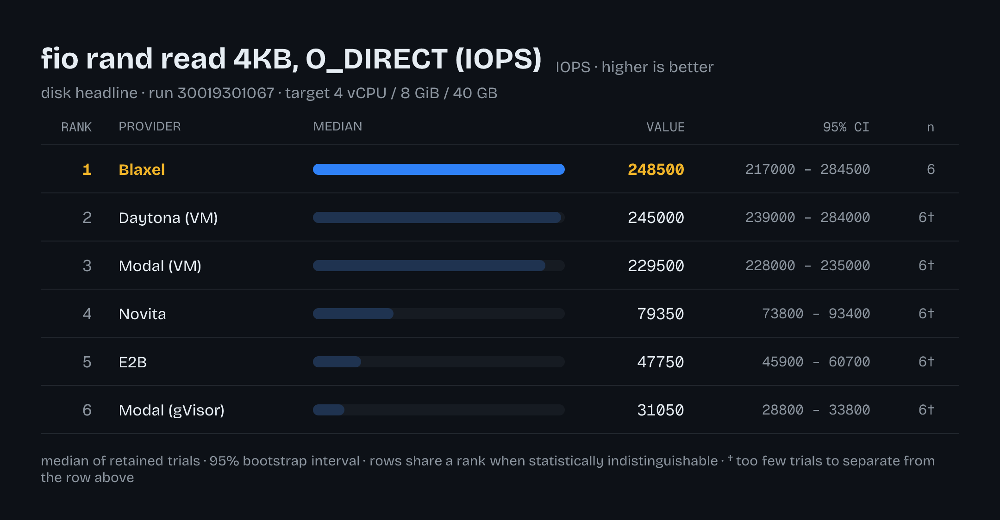

# Design Doc: Rich leaderboard rendering (Satori + JSX table components)

Status: **Proposal** — research + a working spike; nothing is wired into the repo yet.
Audience: repo owner
Scope: turn the published comparison surface from pure Markdown tables into a **report bundle** —
Markdown that embeds generated images, plus the image files themselves — rendered from the same
`Leaderboard` model the Markdown already uses.

---

## 1. Goal

`LEADERBOARD.md` is 57 KB of hand-unreadable pipe tables: 44 metrics × 6 providers, plus coverage
gaps, p-values and KS columns. It is *complete* and *correct*, and it is the only surface a reader
gets. "Rich file with images" reads two ways, and this design serves both:

- **(a) The document becomes rich** — `LEADERBOARD.md` keeps its tables (they are the machine- and
  screen-reader-friendly truth) and gains generated figures at the top of each dimension.
- **(b) Each table becomes a file** — an image per metric, usable in the README, in a GitHub release,
  in the job summary, as an OG/social card, or pasted into a deck.

Non-goal: replacing the Markdown. The Markdown is diffable, greppable, accessible, and gated
(`tooling/repo-checks/src/leaderboard-artifact-sync.test.ts`). Images are an **additive** surface.

The renderer is [Satori](https://github.com/vercel/satori) (HTML/CSS → SVG, Yoga layout), with
[resvg](https://github.com/yisibl/resvg-js) for SVG → PNG. Table components are authored as `.tsx`.

---

## 2. Current state — where the seams already are

| Thing | Location | Note |
|---|---|---|
| Derivation (`Run` → ranked model) | `packages/results/src/lib/leaderboard.ts:518` (`buildLeaderboard`) | Pure, deterministic, seeded bootstrap |
| Presentation (model → Markdown) | `packages/results/src/lib/leaderboard.ts:752` (`renderLeaderboardMarkdown`) | Same 981-line file as the derivation |
| Private formatters | same file: `formatValue:614`, `formatPValue:621`, `rowNote:627`, `formatInterval:647`, `metricTakeaway:654` | Not exported — an image renderer cannot reuse them today |
| CLI entry | `apps/cli/src/bin/leaderboard.ts` | `leaderboard <run.json> [outFile.md]`; bare stdout is a contract |
| Artifact gate | `tooling/repo-checks/src/leaderboard-artifact-sync.test.ts` | Re-renders from `data/dataset/runs/<id>.json` and byte-diffs `LEADERBOARD.md` |
| Publish path | `.github/workflows/update-leaderboard.yml` | Dispatch-only, `privileged` environment, opens a PR |

The model → presentation seam is already clean: `Leaderboard`, `LeaderboardDimension`,
`LeaderboardMetric`, `LeaderboardRow`, `CoverageGap`, `ProviderRosterEntry` are all exported from
`@sandbox-benchmarks/results`. **A new renderer needs no change to the derivation layer.**

Constraints any new package inherits:

- **ADR-0002** — strict acyclic DAG, uniform package shape (`private: true`, `type: module`, `exports`
  → `./src/index.ts`, `test` + `typecheck` scripts, `@repo/tsconfig`), no cross-package `lib/` reach.
  Enforced by `tooling/repo-checks/src/{boundary,package-meta}.test.ts`.
- **Source-first, no build step.** `exports` points at `.ts`; `bun install → typecheck → test → lint`
  must be green with zero compilation.
- **No third-party lifecycle scripts** (`bunfig.toml`: empty `trustedDependencies`, CI installs with
  `--ignore-scripts`). Any dependency that *needs* a postinstall is disqualified.
- **Externals are cataloged** — `package-meta.test.ts` requires `catalog:<name>` for anything in a
  root catalog, so new deps go into a new `catalogs.render` group.
- **`Buffer` is banned in `packages/**/src`** (biome `noRestrictedTypes`/`noRestrictedGlobals`) — font
  bytes must be read as `ArrayBuffer`/`Uint8Array` (`await Bun.file(p).arrayBuffer()`).

---

## 3. Spike results (measured on this branch)

A throwaway spike rendered the **real** committed dataset (`data/dataset/runs/30019301067.json`)
through `buildLeaderboard` → `.tsx` components → Satori → resvg. Versions: `satori@0.29.0`,
`@resvg/resvg-js@2.6.2`, `@resvg/resvg-wasm@2.6.2`, Bun 1.3.11.



*(disk headline, run `30019301067`, rendered at 1080 CSS px → 2160 px PNG. Values, intervals, ranks
and the underpowered marker all come from `buildLeaderboard` — nothing in the image is mocked.)*

| Question | Answer |
|---|---|
| Install shape | `satori` + `@resvg/resvg-wasm` = **26 packages, no lifecycle scripts**, installs clean under `--ignore-scripts` |
| Layout engine | **Flexbox only.** `display: table` and `display: grid` are *not supported* — only `flex`, `contents`, `none`. No `z-index`, no `calc()`. |
| Fonts | Must be supplied as `ArrayBuffer`. TTF/OTF/WOFF (**not WOFF2**). At least one font is mandatory. |
| Images inside the render | `` works; remote URLs also work (**rejected** — network at render time is non-hermetic) |
| Throughput, all 44 metrics | **6.3 s** total (satori ≈ 120 ms/table, resvg ≈ 25–740 ms depending on size) |
| Output size, all 44 metrics | SVG **5.83 MB** with `embedFont: true`; **0.99 MB** with `embedFont: false`; PNG **3.36 MB** at 2× |
| Determinism | Same input → **byte-identical SVG**, and byte-identical PNG in-process. No clock, no RNG in the render path. |
| Pure-WASM rasterizer | `@resvg/resvg-wasm` works under Bun (25 ms for a small card) — **no native binaries needed** |

Two findings drive the design:

1. **A "React table" is not a `<table>`.** Satori has no table layout. Every table is a column of
   flex rows with fixed-width cells. Column widths must therefore be *computed*, not inferred — which
   is a reason to keep a pure "view model" layer (§4) that decides widths before any JSX exists.
2. **`embedFont` is a fork in the road.** `true` (default) converts text to `<path>` and inlines the
   glyphs: self-contained, renders identically anywhere, ~132 KB/table. `false` emits `<text>` at
   ~22 KB/table but the viewer supplies the font — and since Yoga laid the text out using the *pinned*
   font's metrics, a fallback font overflows the fixed-width cells. **Recommendation: `embedFont: true`
   for any committed SVG; `false` only for a throwaway SVG that is immediately rasterized.**

---

## 4. Proposed structure: a new `@sandbox-benchmarks/report` package

### 4.1 Placement in the DAG

```
schema  ──▶  results  ──▶  report  ──▶  cli
   │            │            ▲
   └────────────┴────────────┘   (report imports schema types + the Leaderboard model)
```

`report` is a **leaf above `results`**: it consumes the model, produces bytes, and nothing depends on
it except `apps/cli`. Acyclic; no existing package changes its dependency set.

Name rationale: the surface is a *report* (Markdown + images + manifest), not just "images" — the
package should still be the right home when a self-contained HTML page or an OG card is added.
`packages/render` is the alternative if the scope is deliberately kept to "bytes from a model".

### 4.2 Folder structure

```
packages/report/
├── package.json                     # exports ".", "./jsx-runtime", "./jsx-dev-runtime", "./theme"
├── tsconfig.json                    # extends @repo/tsconfig/react.json (new preset, §5)
├── README.md                        # what this renders, and the flexbox-only rule
├── assets/
│   ├── fonts/                       # committed OFL TTFs + their licence files (§7.2)
│   │   ├── <Sans>-Regular.ttf
│   │   ├── <Sans>-Bold.ttf
│   │   ├── <Mono>-Regular.ttf
│   │   ├── <Mono>-Bold.ttf
│   │   └── OFL.txt
│   └── logos/                       # optional provider marks, PNG/SVG, with provenance notes
└── src/
    ├── index.ts                     # PUBLIC: renderMetricSvg / renderMetricPng / renderReport / types
    ├── jsx-runtime.ts               # PUBLIC (re-export of lib/jsx/runtime.ts) — tsconfig points here
    ├── jsx-dev-runtime.ts           # PUBLIC (ditto)
    ├── theme.ts                     # PUBLIC design tokens: colors, spacing, type scale, light/dark
    └── lib/                         # PRIVATE (boundary check forbids cross-package reach)
        ├── jsx/
        │   ├── runtime.ts           # jsx / jsxs / Fragment → Satori element trees (no React)
        │   ├── types.ts             # SatoriNode + the flexbox-only Style type
        │   └── runtime.test.ts
        ├── view/                    # pure model → view model. NO JSX, NO satori import.
        │   ├── metric-table.ts      # LeaderboardMetric → TableView { columns[], rows[], footnotes[] }
        │   ├── columns.ts           # width solving from the longest formatted cell + font metrics
        │   ├── board.ts             # Leaderboard → ReportPlan (which figures exist, their filenames)
        │   └── *.test.ts            # the bulk of the tests live here — plain data assertions
        ├── components/              # .tsx, presentational only, props = view model
        │   ├── MetricTable.tsx      # header row + body rows + footer
        │   ├── Row.tsx
        │   ├── Cell.tsx
        │   ├── ValueBar.tsx         # value relative to the leader — the "rich" affordance
        │   ├── Badge.tsx            # tie / underpowered / coverage-gap markers
        │   ├── Header.tsx           # title, unit, direction, takeaway, run id + sha
        │   ├── Footer.tsx           # methodology one-liner
        │   └── Cover.tsx            # the run-level summary card (README hero / OG image)
        ├── layout/
        │   ├── presets.ts           # named canvases: "table" | "cover" | "og" (width, padding, scale)
        │   └── measure.ts           # deterministic height = chrome + rows × rowHeight
        ├── assets/
        │   ├── fonts.ts             # loads ../../assets/fonts/*.ttf → Satori FontOptions (ArrayBuffer)
        │   └── logos.ts             # providerId → data-URI, or null
        └── render/                  # the ONLY files allowed to import a rendering dependency
            ├── svg.ts               # `import satori from "satori"` lives here and nowhere else
            ├── png.ts               # `@resvg/resvg-wasm` lives here and nowhere else
            ├── markdown.ts          # figure-embedding Markdown wrapper around the results renderer
            ├── html.ts              # (optional, later) one self-contained HTML page
            └── bundle.ts            # writes files + manifest.json (path, bytes, sha256, metric id)
```

**The rules that make this structure worth having:**

1. **`view/` is pure data and holds the tests.** Asserting `columns[2].width === 130` or
   `rows[0].badge === "underpowered"` is a normal unit test. Asserting on an SVG string is not.
   Everything decidable without a rasterizer is decided in `view/`.
2. **`components/` is dumb.** Props in, elements out; no formatting, no model types, no `Leaderboard`
   import. This is what keeps the flexbox-only constraint survivable — a component never has to know
   why a width is 130.
3. **One import site per rendering dependency.** `satori` appears only in `render/svg.ts`; the
   rasterizer only in `render/png.ts`. Swapping resvg for something else, or adding a browser-side
   renderer, touches one file. (Worth adding as an invariant — see §10.)
4. **`assets/` is committed, not fetched.** No network at render time, so CI and a laptop produce the
   same bytes.

### 4.3 Public surface (`src/index.ts`)

```ts
export interface RenderOptions { theme?: "dark" | "light"; preset?: "table" | "cover" | "og"; scale?: number }

export function renderMetricSvg(metric: LeaderboardMetric, ctx: BoardContext, o?: RenderOptions): string
export function renderCoverSvg(board: Leaderboard, o?: RenderOptions): string
export function toPng(svg: string, o?: { width?: number }): Promise<Uint8Array>
export function planReport(board: Leaderboard, o?: ReportOptions): ReportPlan      // pure, testable
export function renderReport(board: Leaderboard, o?: ReportOptions): Promise<ReportBundle>
export { theme } from "./theme.ts"
```

`planReport` being separate from `renderReport` matters: the plan (which files, what names, what
alt text) is assertable without rasterizing anything, and it is what the CI gate diffs.

---

## 5. JSX components without React

The ask is "React table components". Satori consumes `{ type, props }` element trees — React is one
producer of those, not a requirement. The spike used a **~20-line local JSX runtime** and authored
ordinary `.tsx` components; it works under Bun and under `tsc --noEmit`.

**Recommendation: local runtime, not React.** Reasons:

- Satori calls each component **once** to build a tree. There is no reconciler, no state, no effects,
  no context — every React feature beyond "a function returning elements" is inert here.
- `react` + `react-dom` + `@types/react` is a large, versioned surface added to a repo whose entire
  external dependency set is arktype, an XML parser, and the provider SDKs.
- The authoring experience is identical: `.tsx` files, props, composition, `map`, typed `style`.
- The runtime can type `style` as the **flexbox-only subset Satori actually supports**, so
  `display: "grid"` is a *compile error* rather than a silently wrong image. React's `CSSProperties`
  cannot do that — it accepts everything.

Wiring (verified in the spike — this is the part that is easy to get wrong):

```jsonc
// packages/report/package.json
"exports": {
  ".": "./src/index.ts",
  "./theme": "./src/theme.ts",
  "./jsx-runtime": "./src/jsx-runtime.ts",
  "./jsx-dev-runtime": "./src/jsx-dev-runtime.ts"
}
```

```jsonc
// tooling/tsconfig/react.json  (new preset, extends library.json)
{ "compilerOptions": { "jsx": "react-jsx", "jsxImportSource": "@sandbox-benchmarks/report" } }
```

`jsxImportSource` must be a **package specifier**, not a relative path — TypeScript and Bun both
append `/jsx-runtime` and resolve through the exports map. A relative `jsxImportSource` resolves
relative to each importing file and breaks in subdirectories (this cost the spike one iteration).
Bun's hoisted linker symlinks workspace members into `node_modules`, so the package self-referencing
its own name resolves on disk.

**Escape hatch:** if React is wanted later (a browser playground, an existing component library),
it is a one-line change to `jsxImportSource: "react"` — `components/` needs no edits.

---

## 6. Shared formatting moves down, not sideways

The image renderer must print `18.51 – 20.56` exactly as the Markdown does, or the two surfaces
disagree about the same run. The formatters are currently private to
`packages/results/src/lib/leaderboard.ts`.

ADR-0002: *"a helper two packages need moves **down** toward `schema`."* Applied here, the pure
numeric presentation helpers — `formatValue` (`toPrecision(4)` + trailing-zero strip), `formatPValue`,
`formatInterval` — belong in **`packages/schema/src/format.ts`**. They are dependency-free functions
over a Metric's numbers, `schema` already owns `MetricDef.unit`/`.direction`, and both renderers then
import the same implementation.

The *prose* helpers (`rowNote`, `metricTakeaway`, `coverageSummary`) are editorial, Markdown-shaped
today, and heavily asserted by `packages/results/src/lib/leaderboard.test.ts` (~100 assertions). Leave
them where they are for now; if the image renderer needs the takeaway sentence, export
`metricTakeaway` from the `results` public surface rather than duplicating it.

**Explicitly not recommended (yet):** moving `renderLeaderboardMarkdown` into `report`. It is the
cleaner end state — `results` derives, `report` presents — but it relocates ~1000 lines of tests and
touches the artifact gate for zero user-visible gain. Revisit once `report` has earned its keep.

---

## 7. Determinism and the artifact gate

The committed leaderboard is gated by re-derivation and byte-diff, which only works because the
render is deterministic. Images must hold the same line.

### 7.1 Gate the SVG, record the PNG

- **SVG is the gated artifact.** It is text, deterministic (proven), and diffs legibly enough to
  review — a changed number shows as a changed path in a changed row.
- **PNG is derived, and gated by hash, on one platform.** Rasterizer output is byte-stable
  in-process, but there is no cross-arch guarantee. Using **`@resvg/resvg-wasm`** (one wasm blob, no
  per-platform native binaries) removes the largest source of drift and matches the repo's
  no-lifecycle-scripts posture. Record `sha256` per file in a `manifest.json` next to the images and
  check it in CI on `ubuntu-24.04`, the same runner that publishes.
- **No clock, no RNG.** `generatedAt` comes from the Run document (as the Markdown already does);
  nothing in `render/` may call `Date.now()` — biome's `useDateNow` rule already flags the shape.

### 7.2 Pin the fonts

Fonts are an input to the layout: a different font version reflows every table. Two options, matching
existing repo patterns:

- **Commit the TTFs** under `packages/report/assets/fonts/` with their OFL licence. Hermetic, no
  network, no pin to drift. ~200–400 KB per face; 4 faces ≈ 1 MB, committed once. **Recommended.**
- Pin URL + `sha256` in the style of `packages/templates/src/lib/pins.ts` and fetch at render time.
  Keeps the repo smaller; adds network to a step that currently has none. Not recommended.

Either way the font identity (family + version) belongs in `manifest.json`, so a reflow is
attributable.

---

## 8. Output policy — what gets committed

This is the decision with the longest tail, because images are binary and git keeps every version.
Measured cost per full regeneration:

| Policy | Files | Bytes per update | 20 updates |
|---|---|---|---|
| Every metric, PNG @2× | 44 | 3.36 MB | ~67 MB |
| Every metric, SVG (`embedFont`) | 44 | 5.83 MB | ~117 MB |
| **Dimension headlines + cover, SVG, single theme** | **7** | **~0.9 MB** | **~18 MB** |
| Dimension headlines + cover, SVG, dual theme | 14 | ~1.8 MB | ~36 MB |

**Recommendation:**

- **Commit** the cover card plus one figure per dimension headline (6 dimensions today) as SVG with
  embedded fonts, under a stable path (`docs/leaderboard/` — overwritten each update, never keyed by
  run id, so the tree does not grow file-count-wise).
- **Do not commit** the other 38 metric images. Emit them as a CI artifact on the update-leaderboard
  run and into the GitHub job summary, where they cost nothing permanent.
- `LEADERBOARD.md` embeds the committed figures above each dimension's tables and keeps every table.
- Use `<picture>` with `prefers-color-scheme` only if dual-theme is wanted later; GitHub Markdown
  supports it, at 2× the committed bytes.
- Add `docs/leaderboard/` to the artifact gate's scope so a stale figure fails CI the same way a
  stale table does.

---

## 9. CLI + CI wiring

Keep `leaderboard`'s contract intact — its bare stdout is Markdown, and something may already pipe it.
Add a sibling bin rather than overloading it:

```
report — render a published Run into the rich comparison bundle (Markdown + figures).

usage: report <run.json> <outDir> [--surfaces all|headlines] [--format svg,png] [--theme dark|light]
       report [--help] [--list-providers] [--list-suites] [--json]
```

- New bin `apps/cli/src/bin/report.ts`, registered in `apps/cli/package.json` `bin`, following the
  existing `HELP` const + `handleDiscovery` + `@actions/core` job-summary pattern from
  `apps/cli/src/bin/leaderboard.ts`.
- `.github/workflows/update-leaderboard.yml` gains one step after the Markdown render: run `report`
  into `docs/leaderboard/`, and include the figures in the existing PR. The workflow's
  `privileged` gating, concurrency group and PR flow are unchanged.
- The job summary gets the cover image inline — free, and it makes a dispatch reviewable at a glance.

---

## 10. Repo invariants that must change

Found while checking whether a `.tsx` package would even be policed:

1. **`tooling/repo-checks/src/lib/workspace.ts:86` globs `**/*.ts` only.** Every `.tsx` file in the
   new package would be **invisible to the boundary check** — a component could import another
   package's private `lib/`, or an undeclared dependency, and CI would stay green. Widen to
   `**/*.{ts,tsx}`. This is a latent hole the moment any `.tsx` lands, and it is a one-line fix.
2. `package-meta.test.ts` requires cataloged externals → add a `catalogs.render` group to the root
   `package.json` with `satori` and `@resvg/resvg-wasm`, and reference them as `catalog:render`.
3. Add a boundary invariant for §4.2 rule 3: no file outside `packages/report/src/lib/render/` may
   import `satori` or a rasterizer. Cheap to express in the existing boundary test's style.
4. `bun run lint:shell` / `lint:docker` are unaffected; biome already handles `.tsx`.
5. `typos.toml` may need the font family names allowlisted if they trip the spell gate.

---

## 11. Build sequence

Each step is independently reviewable and leaves the repo green.

| Phase | Change | Gate it lands with |
|---|---|---|
| 0 | Widen the repo-checks glob to `.tsx`; add `catalogs.render` | boundary test still green |
| 1 | `packages/report` skeleton: package.json, tsconfig, jsx runtime, theme, empty index | package-meta + boundary |
| 2 | `view/` — `metric-table.ts`, `columns.ts`, `board.ts` + tests. **No rendering yet.** | unit tests on view models |
| 3 | `components/` + `render/svg.ts`; `renderMetricSvg` produces the first figure | snapshot of one SVG for one fixture Run |
| 4 | `render/png.ts` (resvg-wasm) + `bundle.ts` + `manifest.json` | manifest hash test |
| 5 | `apps/cli/src/bin/report.ts` | CLI discovery test, matching the other bins |
| 6 | Markdown figure embedding + `docs/leaderboard/` committed figures | extend `leaderboard-artifact-sync` to figures |
| 7 | Wire into `update-leaderboard.yml` | workflow-hardening test |
| 8 | *(optional)* `Cover.tsx` OG card, self-contained HTML page, dual theme | — |

Phases 0–3 are the load-bearing ones; everything after is additive.

---

## 12. Risks and open questions

- **Flexbox-only is a permanent tax.** Column widths are hand-solved. Long provider names or a 7th
  provider reflow every table. Mitigation: `view/columns.ts` computes widths from the longest
  formatted cell, and a test asserts no cell overflows its column at the widest fixture.
- **Binary churn in git history.** §8's policy caps it at ~0.9 MB/update; if the leaderboard starts
  updating weekly, revisit and move figures to a release asset instead.
- **Accessibility.** An image is not readable by a screen reader. The Markdown tables must stay, and
  every embedded figure needs real alt text (generated from the same takeaway sentence).
- **A second surface can disagree with the first.** §6's shared formatters are the structural answer;
  a test that renders both surfaces from one fixture and asserts the same value strings appear in
  both is the belt-and-braces one.
- **Open: does the cover card belong in the README?** A hero image on the repo front page is the
  highest-leverage single figure, but it makes `README.md` move on every leaderboard update.
- **Open: light theme.** Everything above assumes dark. Dual-theme doubles committed bytes and
  doubles render time; worth it only if the README hero lands.

---

## Appendix: reproducing the spike

The spike lives outside the repo (scratch dir, not committed). To reproduce:

```sh
mkdir satori-spike && cd satori-spike
bun init -y && bun add satori @resvg/resvg-js @resvg/resvg-wasm --ignore-scripts
# tsconfig: "jsx": "react-jsx", "jsxImportSource": "<a package exposing ./jsx-runtime>"
# then: parseRun(...) → buildLeaderboard(...) → <MetricTable/> → satori(...) → Resvg(...).render().asPng()
```

Sources: [vercel/satori](https://github.com/vercel/satori) ·
[satori on npm](https://www.npmjs.com/package/satori) ·
[resvg-js](https://github.com/yisibl/resvg-js)
